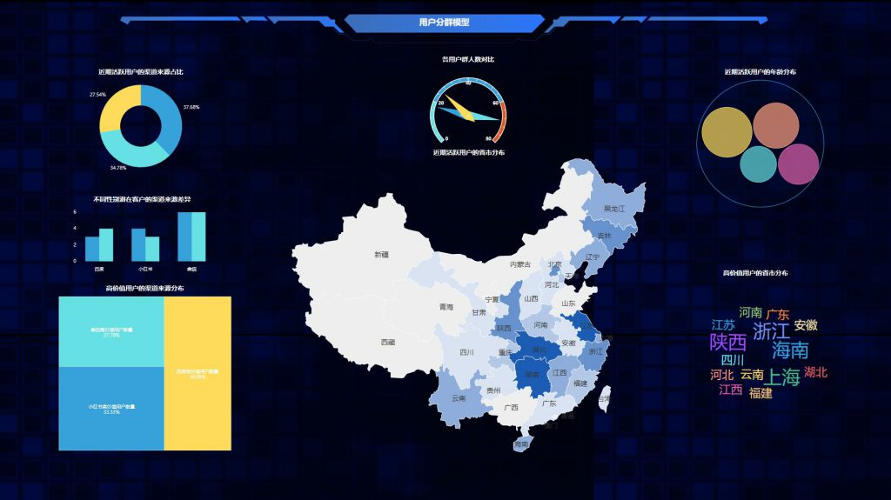

在这个大数据时代，很多行业都开始挖掘企业自身的大数据价值，而在数字化竞争越来越白热化、同质化的今天，对于企业的客户尤其是C端客户，如何让辛辛苦苦引进来的新客变成老客，老客不流失成了一大难题，尤其是电商行业。不仅如此，在数字化交易的背景下，越来越多的商家开始使用诸如DataFocus、集客CRM等做数据分析，以想要做数据化营销。但无论工具怎么先进，分析还是得靠数据分析师的人脑和思维，以思维驱动工具。而大家非常关心的就是客户的趋势如何，应如何利用现有数据进行分析，本篇就为大家分享相关思路。

其实还是类似我们以前讲过的个性化推荐，万变不离其宗，需要对客户数据进行标签化细分，但又略有不同。先介绍最基本的概念问题，我们以一家DataFocus的男性美妆客户为例，可以按购买者角色进行筛选，为什么呢，店铺卖男性用品，但必然有女性用户，那就存在决策者和使用者，女性更偏向送人，男性更偏向自用，性别特性也不一样。再者就是新客和老客的类型属性分析，这个有什么含义呢，就是老客户已经在你店购买过一次，有品牌认知度，这时候你的页面更应该展现会员权益，套装优惠展现，促进回购多买；至于新客户，建议用单品爆款进行页面引导转化。

理顺了关键的概念，我们就可以来看数据的呈现和分析了，还是那句话，数据本身没有价值，数据的应用和对于决策者的启发才有价值。这家店的男性会员占79%，客单价61元，而女性客户占比21%，客单价103.84元。这个数据虽然很简单，但和我们上文说的概念是重合的，男性主要起到使用者的作用，对于男性，我们可以页面主推洁面，面霜，凝露，洗发水等爆款单品，满足功效性诉求为主，关键词突出-控油选它，祛痘选它等。女性起到的角色一般是决策者，那么页面主推主推套装，一步到位见件套，以优惠赠品+情感诉求等点切入。如：为你的他做些什么等......。这是男女，对于新老客也是一样的，当新老客客单价差不多并且数量相差很大，比如店铺新老客比例呈9：1，但是客单价新老客差不多，证明新老客的销售受活动影响很明显。所以对于新客户我们应该页面主推店铺TOP10产品，着重口碑，好评产品优先展现，结合优惠力度展现。对于老客户我们页面主推套装，凑单产品，优惠券展现，捉住客户互补心态，凑单心态。
