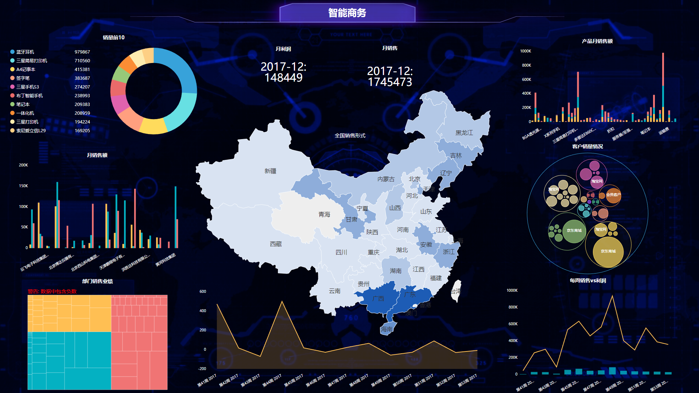

在这个大数据时代，很多企业已经进入了数字化转型阶段，开始让企业大数据发挥它的价值。而很多企业为此成立了专门的部门或是项目组，以应对企业大数据分析需求，并匹配上业务。而说到业务，就是很多数据项目组成员困扰的问题了。因为很多企业的数据项目组成员并不是或不包含一线业务人员，和业务人员的沟通经常有断层，甚至对企业的主营业务也不了解只知道自己数据的一亩三分地。而业务人员也并不清楚图表有时候代表的真正含义，互相懵逼。

所以问题就在于项目组缺乏对图表的统一认知。很多企业都是项目式”和“矩阵式”运营模式，这种运营模式更是绝大多数电商公司所推崇的良策。而对于每一个项目来说，每一个人员都应清楚地知晓每一个策略的效果如何，并且每个人都有自己的想法去衡量这场活动的效果。而目前对于一个小组每个人来说，知晓数据哪里来，怎么分析出来的，代表什么，是否这个数据图表是最合适的，都成为了断层。比如数据分析员觉得他的可视化图表反映了历年销售趋势，可以清楚地指导销售，但是业务人员是希望看到不同销售途径的盈利占比等。

而DataFocus是基于智能搜索的数据分析，不仅可以让小组所有人将自己的“想法”进行搜索，搜索本身也是一种透明的数据分析过程，可以让全组人员的信息对称化，并能协作出最合适的数据图表类型和方式。以最大程度激发每个人的运营思路和创意，大大减少“解释”的过程。以前打通认知断层唯一的方法是让专家或是项目经理“解释”数据的结果和由来，并用来干什么。不仅抹杀了项目组其他成员的其他数据可能性，并且当数据量大起来时，将浪费更多的“解释”时间。
