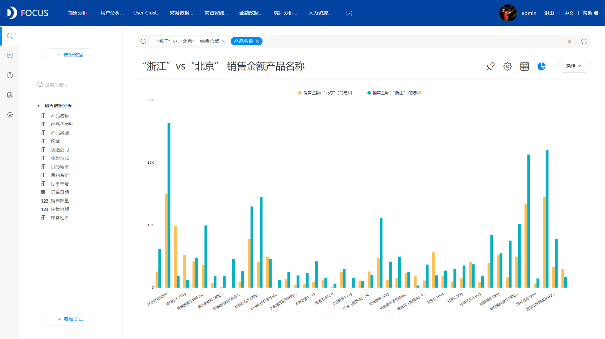
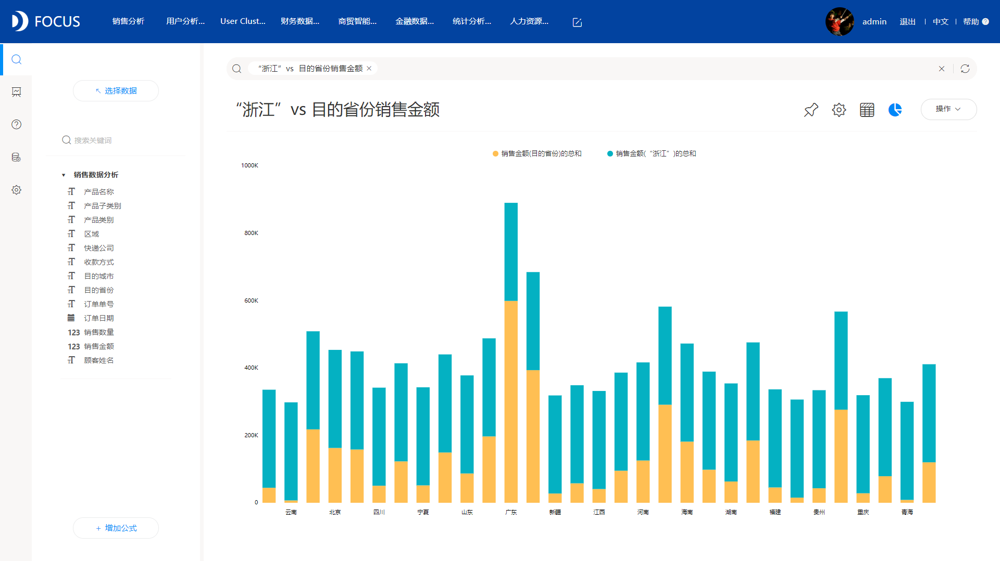

很多人看到这个标题，脑子可能是蒙的，第一反应是vs是什么？别急，且听我慢慢道来。

今天我们主要分享的是DataFocus中vs这个功能，虽然只有两个字母vs，但是其背后附带的功能非常强大，在分析中用处非常多。下面一起来看下DataFocus中的vs如何使用，以及什么情况下可以使用vs。

场景一：直接对比不同时间段数据

例如2017年 9月和10月的产品销售数据对比，怎么操作呢。直接在DataFocus的搜索框内输入：2017 9月vs10月销售金额 产品名称；系统自动搜索分析并以图表的形式展示分析结果，效果如下：

场景二：某一个列中不同的列中值进行对比

例如 所有省份中直接对比浙江和北京的产品销售数据。同样地，我们直接在搜索框内输入：“浙江”vs“北京” 销售金额 产品名称；系统自动搜索分析并以图表的形式展示分析结果，效果如下：

场景三：某一个列的其中一个列中值和整列数据进行对比

例如 浙江省的销售数据与全国各省份的销售数据进行对比，我们直接在搜索框内输入：“浙江”vs 目的省份 销售金额；系统自动搜索分析并以图表的形式展示分析结果，效果如下：

最常用的就是上述三个场景，这三种场景在数据分析中经常会遇到，而且一般的数据分析工具遇到这种需求，处理起来较为麻烦，而DataFocus中利用vs这一个功能，就可以解决此类的所有问题，非常简便高效，使得数据分析的难度大大降低，也减轻了很多数据分析工作。

DataFocus中的vs功能，现在知道怎么用了吗？
