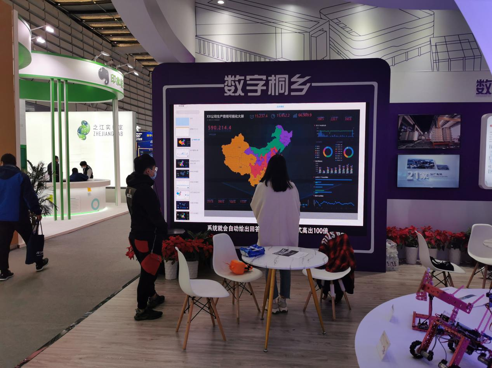

由国家互联网信息办公室、科学技术部、工业和信息化部、浙江省人民政府共同主办的2020年世界互联网大会“互联网之光”博览会于2020年11月22日至24日在浙江乌镇举行。 

作为世界互联网大会“1+3”架构的重要功能板块，本届“互联网之光”博览会坚持以习近平新时代中国特色社会主义思想为指导，以“数字赋能 共创未来——携手构建网络空间命运共同体”为主题，聚焦互联网最新发展趋势和前沿技术动态，**着力展示人工智能、云计算、大数据、区块链、5G等领域的数字新技术、新产品、新应用、新成果，**展现互联网发展的文明之光、未来之光和业界之光，努力打造数字经济产业合作交流的重要窗口。

2020年世界互联网大会“互联网之光”博览会设置了发展理念区、主题展区，130家知名企业和机构展示了一系列重磅黑科技。很荣幸，DataFocus也在其中，与更多互联网企业共同探讨数字经济产业的未来发展。

观众在DataFocus展位观看视频

DataFocus是一款以自然语言搜索引擎为驱动，在商业智能领域(BI)为企业提供以人工智能（AI）驱动的大数据分析产品。**DataFocus不仅是全球首个中文自然语言大数据分析系统，更是中国商业智能领域大数据挖掘与运用的佼佼者。**目前，DataFocus帮助来自不同行业的企业管理着超百亿的数据，专注成为人工智能与商业智能领域创新的“探路者”。

DataFocus作为全球首个中文类自然语言数据搜索分析系统，可以让不懂代码、不会SQL语句的业务人员在3秒内完成图表制作，10分钟创建出美观的可视化大屏，真正为企业人员节省时间、节省成本、节省精力，让企业进入数字化管理新模式，成为推动企业数字化转型的重要力量。

未来，DataFocus团队会持续专注于人工智能技术的积累，将DataFocus打造成一款具有革命性的数据分析产品，一起推动大数据技术的普及，让大数据真正成为释放企业数据价值的生产力。

**和DataFocus一起让数据分析像搜索一样简单，让数据赋能未来吧！**
