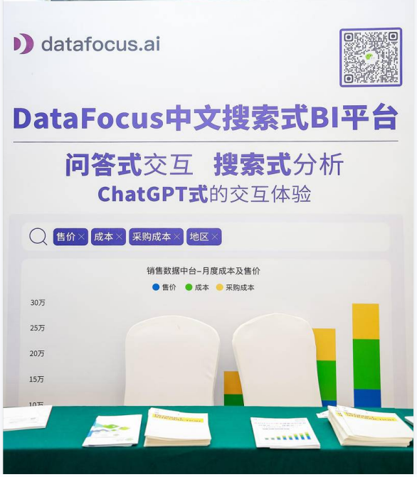

2023年5月19日，数字经济产业峰会在宁波盛大开幕，吸引了众多业界精英和专家学者的关注。作为该峰会的一部分，海纳汇软件产业联盟的全国巡展活动也在此次盛会中展开，吸引了众多行业专业人士和企业代表的关注。

宁波数字经济产业峰会-签到台

作为本次峰会的焦点之一，DataFocus携创新中文搜索式BI平台亮相，引起了广泛的瞩目。DataFocus是一家领先的数据分析和商业智能解决方案提供商，致力于帮助企业高效利用数据资源，实现商业增长和创新。该公司在本次数字经济产业峰会上展示了其创新的中文搜索式BI平台，为与会者们呈现了一种全新的数据分析体验。

DataFocus展位

## **一、更加便捷、智能的新型BI**

该平台以搜索为核心，利用先进的自然语言处理和机器学习技术，能够快速、准确地解析和理解大规模数据。与传统式BI（如Oracle、SAP等）和自助式BI（如Tableau、Power BI）相比，像DataFocus这样的新型BI平台具有独特的特点和优势，注重用户体验和简化操作。

不同BI区别

传统式BI通常需要用户具备一定的技术知识和培训，而自助式BI虽然降低了门槛，但仍需要用户学习使用特定的工具和查询语言。相比之下，DataFocus采用自然语言交互的方式，让用户可以像与ChatGPT进行对话一样进行数据分析，无需编写复杂的查询语句或使用特定的工具，大大降低了使用的学习成本和操作的复杂性。

DataFocus代表在展会发言

在展会现场，DataFocus展示了平台的强大功能和灵活性。通过简单的中文搜索，与会者们可以快速获得关键指标、趋势分析和业务洞察。与此同时，平台支持多维度数据交互和可视化展示，使用户能够自由地探索数据，并进行自定义报表和图表的生成。

\[video width="1920" height="1080" mp4="https://www.datafocus.ai/wp-content/uploads/2023/05/1684722261-DataFocus-搜索式BI.mp4"\]\[/video\]

DataFocus--搜索式BI

## **二、为数据分析行业注入新活力**

创新中文搜索式BI平台不仅适用于企业内部的数据分析和决策支持，还可以广泛应用于市场调研、竞争情报和行业趋势分析等领域。无论是企业高管、市场营销人员还是数据分析师，都可以通过DataFocus的平台轻松地进行中文数据的挖掘和分析，帮助他们更好地了解市场和业务动态。

作为一家致力于创新和技术进步的企业，DataFocus的亮相引起了宁波数字经济产业峰会的广泛关注。与会者们纷纷驻足该展台，与DataFocus的专业团队进行了深入交流，并对该创新中文搜索式BI平台给予了高度赞赏。

 DataFocus和参会者交流

DataFocus的亮相使得宁波数字经济产业峰会更加精彩，为与会者们展示了中文数据分析领域的创新成果和应用前景。相信这一创新中文搜索式BI平台将在未来的商业领域发挥重要的作用，推动企业数据智能化发展。

## **三、寻合作、创共赢**

同时，为了进一步扩大市场影响力和提供更优质的服务，DataFocus也开放了渠道代理以及行业伙伴的合作，共同实现业务增长和客户满意度的提升。

无论是渠道代理合作还是行业合作，DataFocus都秉承着合作共赢的原则，希望能够与更多优秀的合作伙伴携手合作，共同实现业务增长、利润提升以及客户满意度的目标。

**关于DataFocus：**

DataFocus是一家领先的数据分析和商业智能解决方案提供商，致力于帮助企业高效利用数据资源，实现商业增长和创新。该公司提供的创新中文搜索式BI平台通过中文搜索、自然语言处理和机器学习等先进技术，为用户提供便捷、准确的数据分析和决策支持。无论是企业内部数据分析，还是市场调研和竞争情报分析，DataFocus都能为用户提供强大的数据挖掘和分析工具，助力他们实现商业成功。了解更多信息，请访问www.datafocus.ai。
