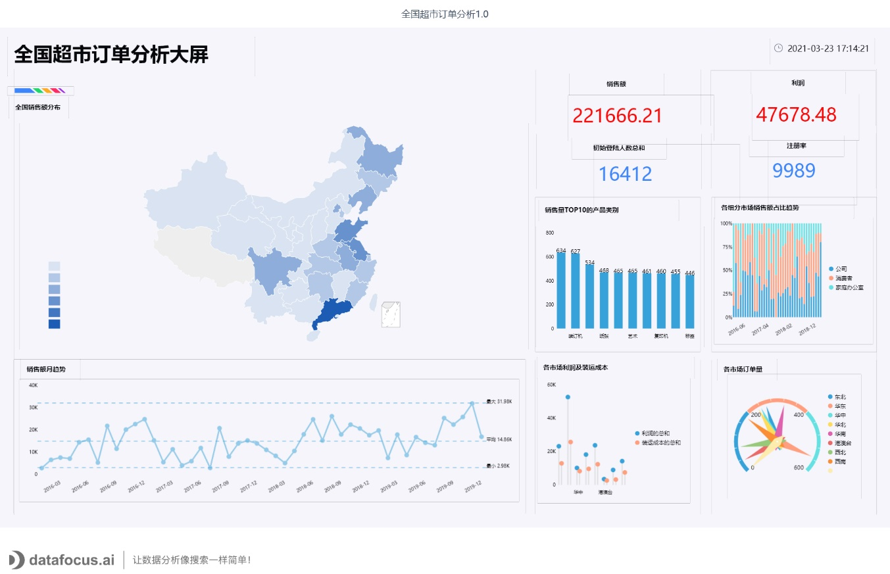

**问：我记得DataFocus第一个商用版本是2018年发布的。大家很好奇，这两年都发生了些什么，有没有什么新的进步？**

答：当然。两年以来，我们潜心打磨NLP技术，将我们的数据搜索功能做到最好。尤其是今年，疫情的一年，埋头练了一年的内功。我们协助华为技术有限公司和清华大学上线和实施了DataFocus全部功能，尤其在与华为公司的合作中，充分感受到一种时不我待、奋起直追和精益求精的精神，这对我们整个团队都是一种鞭策和激励。DataFocus的研发团队与华为的数据团队团结一心，以目标为导向。产品也在这一时期有了突飞猛进的质量和性能提升。

今年，我们也看到一些追随者，包括一些BAT巨头也都参与其中，这更加坚定了我们要打造AI智能数据分析的信念，毕竟路上也有了一些同行者。

**问：说到互联网巨头，我想起了曾经的3Q大战，以及腾讯之下寸草不生的往事。那时候都是**ToC**领域的激烈竞争，您提到的这个事情，倒是让我想到了，这两年腾讯、阿里甚至头条都开始深度布局**ToB**业务，会不会又重现十几年前那种局面，只要是创业公司有好的创意，互联网巨头们就一拥而上，饕餮之后，杯盘狼藉？**

答： 呵呵。创业公司永远都要面对巨头们的竞争，这是个不争的事实。抄袭这种事情，也不是没有的。我们就曾经发现，痛斥“当铺思维”的互联网巨头，有些产品，甚至连白皮书都仿照我们的内容。

换个角度来讲，财大气粗的互联网巨头们，都来热衷于投资高新技术，进行科技竞争，总好过惦记着菜场大妈的几捆白菜要好得多吧。

回到我们的产品上来。DataFocus诞生的初衷，是想把数据分析这项有一定技术门槛的工作平民化，通过工具的赋能，极大地提高各行各业数据分析人员的生产力，从而提高整个社会的生产效率。独乐乐不如众乐乐，如果大家都来参与一起做，从软件层面，我们就可以快速颠覆由Tableau公司开创的拖拽式BI时代，直接进入到智能分析时代。

当然，如今我们展现出来的东西还只是一小部分，我们还有更多黑科技正在开发中，为整个数据分析领域赋能，我们还有太多工作要做呢。

**问：介绍一下DataFocus Cloud的功能特色吧。**

答： 好的。DataFocus Cloud一共规划了3个版本。我们首先会推出商业分析师版，主要是面向个人分析师或微型企业。后续我们会逐步推出企业共享版和企业专享版，分别面向中小企业和大型企业。

Cloud版本采用了云原生的设计方式，完全隔离的租户可防止数据泄漏并提供针对未经授权访问的保护，让用户开箱即用的同时，还能充分保障其数据的隐私。除了原本就有的敏捷快速的搜索特性之外，针对高级用户，还提供了云数仓和多终端兼容等特性。

此外，Cloud版本最大的功能特色就是云计算能力引入的各种特性了。比如，一开始用户可能数据采用深度一般，可以先以非常低的价格购买企业共享版，随着组织数据化的深入，可以逐步扩展使用规模，甚至数据迁移到企业专享版。从而真正实现SnowFlake的CEO Frank Slootman所提到的那种，对于用户来说，完全公平的SaaS服务。

简单来讲，DataFocus Cloud功能强大，价格实惠，大中小企业皆宜！

**问：讲一讲DataFocus的设计思路？从一个产品经理的角度，你有哪些考虑？**

答：很多做产品的人都知道一个道理，就是大道至简。这个世界已经越来越复杂了。如果你回到100年前，你会发现一个人一天接触的物品比我们这个时代少得多，如果你穿越到1000年前，可能一个人一年也不会接触超过100种物件。人类天生是懒惰的，不愿意储存和加工太多的信息。因此我们的产品设计必须尽可能简单，降低一切学习成本，缩短一切采用周期。一个产品，既要功能更强大，又要求使用更简单，这本身是件矛盾的事情，这就要求我们把复杂性隐藏起来。大家看智能手机、4K电视，操作起来都很简单，打开看背后都是极其复杂的电路板，甚至还有更复杂的芯片集成电路。软件也一样，我们要封装一切复杂性，仅仅暴露简单的交互功能即可。

讲起来是一个很简单的道理，其实大部分产品都很难做到。我们看到有些ERP软件、供应链软件，简直就是灾难性的设计，上线之后，还需要专门培训使用人员，比如SAP的BO、IBM的Congnos等，这其实都是违反人性的。

**问：国外数据分析业务普及度还是很高的，包括BI（商业智能）这些概念也是国外的软件公司提出来的。我们注意到国内企业的数据分析工具采用度还是不高，原因是什么？**

答： 中外文化本质不同。欧美更注重逻辑推理，所以他们发展出了微积分、概率论这些基本的数学框架原理。中国人自古以来都是一个更偏向对自然界感性认知的民族。我们讲阴阳平衡，执两用中，这些用来进行战略思考是不错的，但是具体的战术动作执行，用科学的方法指导会更好。一个典型的例子，三国演义中脍炙人口的诸葛亮借东风的桥段，就是这种思维的体现。把整个大战役执行要点，赌在冬天会有东风这种小概率事件上，是拿几万官兵的性命开玩笑。

当然，我们也看到，随着整个社会经济的发展，受过良好教育的年轻一代，已经普遍开始注重逻辑和证据，用数据说话，用数据指导实践，比如A/B测试越来越被广泛采纳，用数据指导的增长实践被越来越广泛地落地应用。我们相信，假以时日，DataFocus一定会被广泛使用！

_图片来源：DataFocus Cloud_

**问：中国本身是一个发展极不平衡的经济体，一方面是落后的农业作业模式，一方面互联网开始对菜场大妈进行革命了。和很多其他领域一样，中国的软件行业还处于多期叠加的时代。信息化和数字化交织，智能化若隐若现。2018年你们推出DataFocus的时候，很多企业可能还没有数据分析部门，现在你们又推出云端的版本，会不会太早了？**

答： 我不知道国外的情况怎么样，但是国内的确如你所说，存在这种多期叠加、发展不平衡的问题。你会看到有些企业连无纸化办公都没有做到，也会看到一座座无人工厂比邻而立。回到数据分析这个领域，大量企业还在用Excel或其他的电子表格软件处理数据分析业务，有部分企业在用报表软件，部分企业开始采用拖拽式的BI产品，也有企业已经开始接受智能分析的概念。

凡事都有个过程，这种渐变式的进步，让市场上五花八门的供应商都可以生存得很好，他们各自面向不同的客户群体，而我们要更多地面向未来，引领云BI的未来发展趋势。

**问：为什么要推出DataFocus Cloud，云端BI的接受程度并不高，尤其是大量企业对数据放在云上并不放心？**

答：任何新事物的出现到普及都会经历一个周期。我们已经看到非常多的这类发展曲线。举个例子，2012年，我参加阿里云的第二次云栖大会，是在转塘一个尘土飞扬的场地举办的。当时大部分人对云还是看热闹的心态，我们接触到一些企业，他们表示肯定不会考虑上云，毕竟服务器还是自己管理比较好，放到云上感觉被扒光了衣服。其实，大多数情况下，这只是一种思维惯性，一种行为定式。所有商业行为的驱动因素最终都是成本和收益。随着上云成本的逐渐降低，以及软件工程师人力成本的上升，把业务系统放到云上已经被越来越多的企业所接受，可以为企业节省一大笔运维费用和硬件成本。如果云BI能够极大地降低成本，能够有可观的收益比，我相信，这样的理性商业行为，大家都会慢慢接受。

_图片来源：网络_

**问：Snowflake 的上市应该是今年科技行业最大的IPO了，甚至连一向都不待见科技股的股神巴菲特，都参与了打新，你怎么看待今年ToB投资领域的火爆？**

答：ToB这个市场是客观存在的，无论投资人是否关注，它就在那里。这是经济社会发展到一定阶段的产物。中国的人均生产力水平相比欧美还有7-10倍的差距。软件吞噬世界（注：Netscape创始人、硅谷著名投资人马克·安德森的名言，英语原文是：Software is Eating the World），它的原意并不是说软件要取代很多其他的事务，而是指软件将为各种场景赋能。

有些人说是由于C端的流量红利接近枯竭，互联网巨头们转而去开垦ToB领域，这种说法只看到了表面现象。你从更深的层次去理解，这个趋势是生产力发展的必然结果。以前面向C端的各种应用，其实也是在提升整个社会的生产力水平。无非是C端的变革来得更容易，更快速，现在人人都能以极快的速度传递信息，交换物质，这本身就是极大的进步，衍生在这些便利之上的各种外卖、拼团、电商等平台，进行了生产关系的重组。这都是社会生产力进步的具体表现。

虽然近期阿里、京东、美团、拼多多这些巨型公司忽然要掀起社区团购革命，引起了不少议论，甚至连央媒都来喊话，提醒他们不要惦记大妈们的菜篮子，不要忘记星辰大海的誓约。这其实是C端进步太快，整个社会生产关系还没有那么快适应的表现。

水往低处流。技术革命对于社会的改造必然是从容易的地方开始，也就是从C端开始，未来必然延伸到B端。这就好像磁化现象一样，磁场必然是首先对能量较低的颗粒进行磁化，因为它要求的能级较低；更大一些的磁畴，需要更高能级才能完全磁化。B端作为社会组织，其变革的阻力和周期相对要长得多，我们可以预计，这种发生在B端的革命，其周期要远长于C端。

_数据来源：State of the Cloud 2020_

**问：投资人每年都会追逐一些风口，你觉得今年软件行业的风口在哪里？**

**答：** 我觉得风口论，都是唯心主义，一些事物是客观存在的，只是大部分人没那么敏感，不能很早就感受到。后知后觉者的感觉就是风口来了。

不过一定要说一个，那就是无代码平台的兴起。当然你看到，DataFocus也可以算是BI或数据分析领域的一种无代码平台。但是你认真研究会发现，无代码平台的发展绝对不是这几年才开始的。早在20年前，就有大批先行者开始做这方面的工作了，国外如Outsystem、Mendix。这些平台发展之所以缓慢，我觉得和整个生产力发展水平是直接相关的。下面这张图是我国软件工程师的月薪增长趋势。你会发现这个增长曲线，对照无代码平台的发展节点，你会发现有非常大的关联性。这个发展主要还是成本驱动的，随着可以预见的工资持续增长的趋势，无代码平台也会越来越普及。

_数据来源：网络 图片来源：DataFocus Cloud_

**问： 2020年很特别，疫情的冲击是谁也没有想到的，这次疫情对你们影响有多大？**

答：疫情加速了社会的数字化进程，长期来看，疫情总会过去，但是人们再也回不到过去了。前不久，美国微软公司创始人比尔盖茨(Bill Gates)说，新冠病毒疾病大流行将从根本上改变人们的商业及工作方式。他预测有超过50%的商务旅行和超过30%的办公室将会消失。从今年股价疯涨的Zoom和Snowflake可以看出，伴随着社会数字化采用的进一步深入，数据分析服务将会是个宽广无比的大海，对于我们来说，万里长征，才迈出了第一步。

**问：今年很多创业者都很艰难，您有什么话想对他们说吗？**

答： 我们也一样，很艰难。说到寄语，我觉得是：坚持信念，坚持初心。创业者应该更长远地考虑问题。现在再来思考，大家会开始觉得乔布斯忽悠斯卡利的那句话“一起改变世界”很好。我是由衷地相信，乔布斯，以及更多的创业者，都是抱有这种家国天下的情怀的。多阅读历史，你就会发现，放在历史长河中去看，融资也好，破产也好，上市也好，终究不会激起半点浪花。但是，你回过身再去看50年，100年前，值得人类铭记的事迹，一定是能改变世界的事情。

所以，创业者如果拥有这样的心态，他会有足够的耐心、虚心、恒心去从事创造性工作，因为总有一天，你的发明创造会改变社会。
