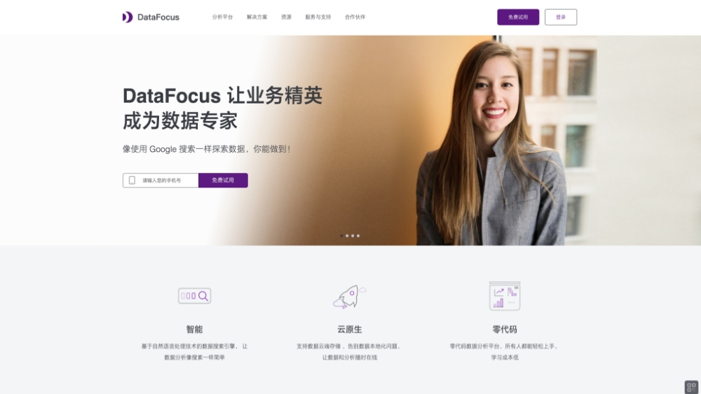
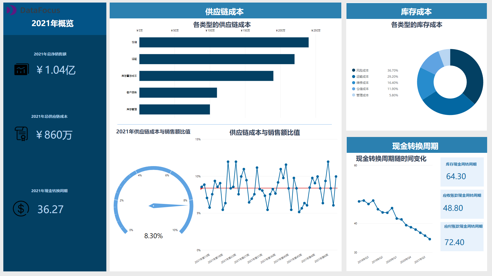
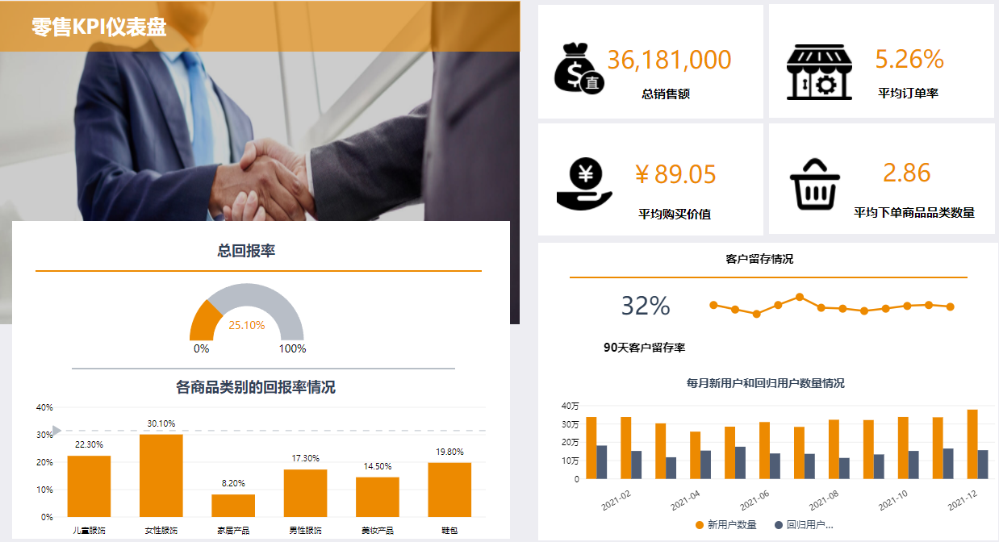
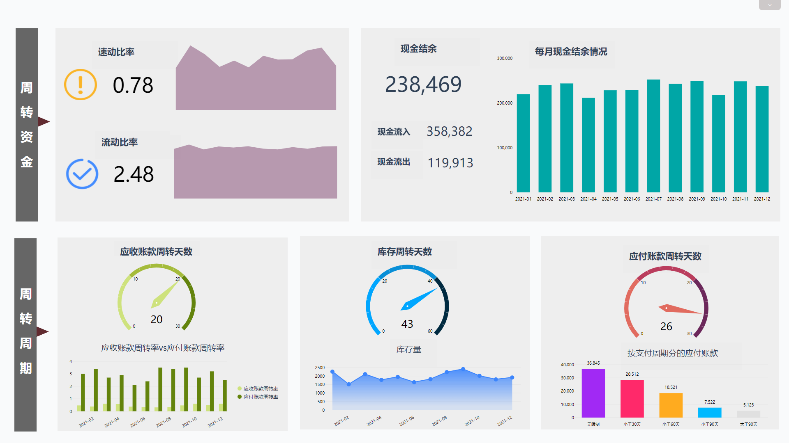

就像霍乱时期的爱情一样，新冠疫情时期的SaaS也是充满了荡气回肠的故事。做为这个宏大背景下的一个小小的样本，三年以来发生了什么呢？2022年4月初，我们再次采访了DataFocus创始人Jet，和他聊了聊产品、公司、行业及其他。以下是访谈整理，看看能不能给您带来什么启发？

问：**简单介绍一下DataFocus最近有什么进展。**

Jet wang：最近两年对于DataFocus来说，是进步非凡的两年。我们**与华为等客户共同成长，让产品性能稳步提升，运行更加稳定，功能更趋完备**；其次，在与广大中小微客户和用户打交道的过程中，我们发现了很多有意思的东西，尤其是随着2021年初 DataFocus Cloud的推出，越来越多的中小企业使用并信任我们的**云端分析能力**。最后，当然也是最重要的，企业经营的终极目的是产生价值，我们为用户创造价值的同时，也完全实现自给自足，逐步开始盈利。这一切成绩首先都应该归功于团队的兄弟们，感谢用户的信任，我们一定会继续努力，提供更好的产品。

**问：疫情持续快3年了，对你们有多大的影响？**

Jet wang：疫情对中国最大的影响，就是杀死了大量的小微企业，特别是那些需要线下经营的企业。利好的可能会是一些规上的生产制造企业，毕竟这几年由于欧美的疫情，出口实现了前所未有的高增长。当然，从另一个方面来说，疫情只是杀死了这些企业，并没有干掉需求。比如餐饮，人们吃饭的需求总是存在的，只是以不同的方式去吃罢了，美团能赚得盆满钵满，一些专营外卖的餐饮活得也不错。衣食住行，这是人类不可磨灭的需求，跳舞唱歌，这也是人性的需要，只是被短暂压制而已。疫情过后，会像度过旱季的塞伦加蒂大草原，充沛的雨水一定又会让大地生机勃勃。

当然，我们作为生态体系的一粒尘埃也不例外，疫情对我们的影响是客观存在的，由于我们的工作完全可以线上进行，所以，总体来讲我们的实际影响比其他行业更小，从整个社会加速线上化的趋势来看，今后我们或多或少是时代的受益者。

**问：你们的客户还是中小企业为主吗？**

Jet wang：现在，有一个比较明显的趋势就是，市场上的买家正在集中化，大型国有企业成长为一极积极的购买力量。国有企业由于其经营的持续性，目标的明确性和稳定的投入，多年以来，与广大民营企业的信息化、数字化水平正在拉开。随着最近几年国企改革的成果落地，国企的职业经理人体制反而更加类似海外企业，他们有可能会成为IT支出最稳定的一环，这可能和大部分人的感受不同。民营企业近几年总体来说还是比较艰难的，面临着转型升级压力、资金压力、市场压力，以及经营管理的压力，尤其是部分老一代企业创始人需要交棒给下一代，总体来讲，在民营企业这个群体中，除了上市公司以外，尚未形成职业经理人治理的主流模式，这对于企业的IT支出有一定影响，存在不确定性。我们的客户中大型企业集团和中小企业都有，DataFocus Cloud就是面向广大中小企业的产品线。

**问：过去3年了，你还认为搜索式分析会是未来BI的主流交互方式吗？**

Jet wang：智能手机从经典的黑莓QWETRY键盘操作，变革为触屏操作之后，才最终深入生活的方方面面，成为人人必备的掌上工作台、娱乐宝。再往前，也正是由于鼠标的出现，极大的解放了人类的双手，才使得个人电脑风靡全球。其原因都是因为交互方式的改变，降低了产品的操作难度，效率的提升会从量变到质变，最终改变工作方式。

同样的道理，BI产品的演进也不例外。从手写SQL查询到拖拽操作就可以做出图表，这就是一个很大的进步，这使得数据可视化，数据看板成为工作的必备。但是这还不够，拖拽式操作依然没有最大化的解决数据分析的问题。因为他们都是以绘制图表为目标，还是报表思维。所谓报表思维，就是先选定需要绘制的图表，比如柱状图、饼状图，然后通过拖拽X轴和Y轴配置数据，调整布局，得到优雅的图表呈现，从这一点来看Tableau确实开创了一个时代，但这种作业模式只是为了满足报表的需求，根本上还是IT报表工程师响应业务需求而高效开发报表这样一种场景。我以前说过，这种以IT为中心的作业模式，存在诸多局限，需求传递周期长，报表开发周期长等等。这在企业的经营模式比较固定，业务相对稳定的情况下，无可厚非，可以较好的满足需求。但是，现在的社会环境，企业的经营大环境变化越来越快，商业模式不再那么一成不变，及时的响应环境的变化变成一种必须，这就要求哪怕是较为传统的企业也应该像Google等互联网企业一样，拥有扁平的决策架构，可以快速应对变化。这样，以业务为中心的分布式作业模式，必然成为最敏捷的工作方式。DataFocus的搜索式分析正是应对这种局面的创新。

当然，我可能错误的估计了搜索交互方式的开发难度。我本来认为当我们在2018年第一次产品发布会之后，顶多再过两年就会有大量的企业开始开发同类产品，并且过渡到这条技术路线上来，事实证明，我低估了这个难度。尽管从2019年以来，就一直有不少公司的产品经理注册试用DataFocus，甚至BAT这些企业、以及融到数亿资金的B、C轮以后的公司的技术、产品都曾经研究过我们的产品，但是，一直到2021年，才陆续有一些创业公司开始同类产品的开发。也有一些互联网大厂一直宣传有类似的功能，但是直到现在，我也没有观察到市面上出现和DataFocus或ThoughtSpot一样成熟的产品，这就从很大的层面限制了搜索这种交互方式对广大用户的影响，需要更多的用户去适应，进而养成搜索的习惯。

我们为搜索的普及正在准备一个核弹级的应用，就是Focus Search，目前的设想是只需要简单的API集成，就可以将DataFocus的智能搜索能力集成到任何软件系统中。再经过一段时间的封闭测试，我们就会放开让大家使用，有兴趣的用户可以去DataFocus 官网联系客服申请进入试用列表，获得优先体验的机会。

**问：你一直强调搜索式BI，搜索式交互的优越性，能不能解释一下它的价值到底在哪里？**

Jet wang：所有的软件，最根本目标都是提升生产力，这应该是个共识。我们聚焦到数据分析领域，你会发现最近10年来，技术提升导致的生产力提升是乏善可陈的。数据分析整个技术栈，从最底层的存储硬件开始，硬盘、内存、IO几乎没有数量级的变化，已经不怎么遵循摩尔定律好长时间了。CPU的计算能力，众所周知intel从i5到i7，挤牙膏式的性能提升多少年了。所以10年以来，数据分析技术栈唯一的进步就是大家一直在中间件、计算层不停的折腾，从Mapreduce，到内存计算，再到最近几年的向量计算，出现了各种大数据相关的技术组件，导致了一个小繁荣，但是总体效率提升是有限的。

从最终用户的角度来说，用户对于数据分析效率提升的体验是很有限的，他们仍然恼火于IT经理要花费数天甚至数周才能给出想要的数据分析结果。数据从存储到计算再到最后的结果呈现到最终用户手中，哪个环节的效率最低呢？是存储慢吗？是IO慢吗？是计算慢吗？都有，但并不是真正原因。最低效的环节存在于用户与系统的交互中，存在于应用层。前面讲到过，传统以IT为中心的作业模式，存在着需求确认、数据开发等诸多人为拉长的环节，导致了作业的低效。如果由提出最终需求的业务人员自主探索数据，并且可以即时得到反馈结果，效率就会有百倍的提升。从这个角度来说，搜索式BI几乎是性价比最高的效率提升工具，你可以不用最新的硬件，依然可以获得可观的分析效率。

**问：SaaS这几年大起大落，从2019年的寒冬，项目无人问津，到2021年的小阳春，几乎每个月都有融资消息，2022年开年，又有人开始唱衰SaaS，觉得中国这个市场就没法长起来像样的SaaS公司，你怎么看？**

Jet wang：资本市场本来如此，如果你在资本市场完整的经历10年，你就会发现潮起潮落是再自然不过的事情。至于SaaS行业，我觉得大可不必一惊一乍。2022年开年就又有人开始发一些唱衰SaaS的文章，总体来看，他们看衰中国SaaS行业的主要原因是国内付费意愿低，盐碱地上长不出好庄稼。确实如此。但是中国的国情自古以来就与众不同，你搞城市暴动是不能成功的，农村包围城市才是正确道路。SaaS行业也是如此啊，与其纠结于各种定义、模式，何不静下心来好好研究客户的需求，为客户创造了价值，才会是持久的生意，这才是普适的道理。

春江水暖鸭先知，也许在一个你不知道的角落，在大众视线之外，有些SaaS企业正在愉快的成长着。

**问：你对低代码行业怎么看？最近低代码行业明星黑帕云停止服务了，低代码也是个伪命题吗？**

Jet wang：低代码也好，无代码也好，这只是投资人或者热衷于炒作的人贴上的高大上的标签。这个提法源于Mendix、Outsystem等欧美几个较大的低代码平台开发公司的宣传。抛开概念不说，低代码的追求始终是开发效率提升，它基于这样一个主要矛盾：软件正在吞噬一切，各行各业的运行都离不开软件，日益增加的软件系统开发的需求和短缺的程序员之间的矛盾。怎么办？那么低代码寄希望于把软件开发这种需要掌握特殊技巧的脑力劳动进一步普及到让业务人员也能参与开发。这个设想当然很好，而且从这种战略角度考虑，低代码必然成为一种趋势。微软公司也推出了相应的低代码产品，阿里巴巴推出了宜搭，腾讯内部居然有3个团队在做低代码产品，这些互联网巨头不会对10亿美金的市场感兴趣，所以这也是一个很好的侧证。

但是，事情就是这么奇怪，有时候不是你知道终点，就一定能抵达终点的。往往通往终点的道路并不是距离最短的那条路。你去看一看，地球上的河流的长度往往都是其起点到终点直线距离的接近2倍，看似很神奇，其实背后都藏有规律。

同样的，一家低代码公司不是融到最多的钱，也不是发力最猛就可以马上实现目标的，在这个领域，任何希望毕其功于一役的思路，注定都是要失败的。这不像打车、共享单车、外卖送餐那样，靠快速的规模覆盖的策略是难以取胜的。创业公司生生死死，这应该也是常态，2021年，简道云不是宣称ARR做到了1个亿了嘛？只见新人笑，不见旧人哭，只是大家都善于遗忘，还有多少人记得OFO曾经的辉煌呢？

**问：有不少人说BI这个赛道不是好赛道，几乎每10年都有一个昙花一现的热潮，最终都归于沉寂，你怎么看？**

Jet wang：在中国的IT圈里面，BI并不陌生，其实在15-20年前，就有过一波BI的产品推广潮。那时候还是BO、Congnos等产品教育市场的时候。成就了一代报表企业，帆软、润乾等公司就是那个时代崛起的。5-10年前，又有过一波BI产品的推广潮，那时候则是Tableau、PowerBI、Qlik等产品教育市场，数据可视化和可视化大屏则成为那个时期的宣传重点，成就了像帆软BI、永洪、SmartBI等国产化BI产品，润乾就慢慢掉队了。Tableau和PowerBI由于良好的策略和过硬的产品品质，至今仍然拥有很高的市场美誉度和占有率。这与他们的免费策略不无关系，尤其是PowerBI，其免费的desktop版本一直被很多人使用，这也是微软CEO纳德拉的经营之道，和他的前任史蒂夫鲍尔默比起来，纳德拉显然是一个更加擅长太极的现实主义者，他将微软全系列产品都推出了免费版本，进入苹果、谷歌的生态体系，正是因为微软这种开放的态度，使得其全系列产品的市场占有率得到进一步的提升，为其更多的toB类产品的市场切入带来了巨大的势能。Tableau也是个受人尊敬的公司，其产品功能巨细无遗，我认为在拖拽和可视化的道路上它是做到了极致。国内值得一提的产品型公司就是帆软，他们是一家脚踏实地总是在进步的团队，产品也是一版一版的优化。但是，PowerBI也好，Tableau也好，他们在拖拽式的道路上越走越远，成也萧何败也萧何，交互方式注定了这两款产品将成为面向IT的BI时代的绝唱。帆软这家公司起家于其FineReport报表，然而他们的FineBI从一开始就是模仿Tableau的拖拽分析方式，可惜模仿得再好，也只能是即将过去的那个时代曾经多彩的注脚。

BI行业即将来到搜索时代，新的交互方式将从使用习惯上解锁大量的用户，构建以业务为中心的分布式BI作业模式，只能靠搜索式分析才能做到，目前，最成熟的搜索式BI产品非DataFocus和Thoughtspot莫属。我们衷心期待更多的企业加入到搜索式BI的创新中来，大家一起让搜索式分析进入寻常百姓家。

**问：聊一聊数据中台吧。我记得好几年前阿里巴巴提出大中台小前台的概念之后，数据中台的概念就不胫而走，涌现出一批从事数据中台创业的企业，可是经过几年的实践之后，行业里面开始有不同的声音，质疑数据中台的真实效益，数据中台过时了吗？或者说数据中台赛道压根儿就是错误的？**

Jet wang：数据中台这种提法也是中国特色的标签体系，欧美软件企业好像很少有提到数据中台这种概念的。他们可能是归类到Infra这个体系里面，一提到数据堆栈，就是一系列的产品，贯穿从数据库到数据应用类产品的方方面面。他们很少有一家企业会说把数据类的产品全部干掉，而是互相依存，联合，逐渐形成一个大的生态圈，比如snowflake是依存于几大IaaS厂商而成长的，又有众多的数据处理类企业是依附在snowflake的架构之上的，生存得很不错，国外的创业团队一般是找到一个很小的没有满足的需求点开始构建产品，而这些产品正是对整个生态的完善和补充，所以生态中的其他企业也非常欢迎这些雨后春笋一般涌现的新产品、新功能，正因为这种取长补短使得他们产品之间的通用性、互操作性、连接性都很好，从而给最终用户提供了一个非常好的使用体验。

反观我国，大部分数据中台创业团队是从阿里这类大公司里面出来的技术团队，比如数澜科技、袋鼠云、奇点云等等。他们技术基础好，有相应的开发和建设经验。但是当他们按照原来的思路把产品搞出来以后，拿到市场上一看，发现并不完全是那么回事，这就像你好不容易造好了一把很不错的桌椅，搬到客户家里的客厅一放，发现摇摇欲坠，这地都不是平的，原来客户对桌椅的要求并不像大的互联网公司一样，腿一样长是齐的。你得把它接长锯短。甚至还有一部分客户，你即使解决了上面的问题，他们还要提出桌子偶尔要用来摆放电视，椅子偶尔还需要用来垫脚，这就很头疼了。

说到这里，可能有人要抱怨国内的市场，客户不成熟，没有欧美那么好的客户基础，信息化基础。存在即合理。国外就没有这种情况吗？也不见得。我刚才说了，两种体系和模式下，服务提供商的成长路径完全不一样，北美客户可能也有上面的奇怪需求，那么他们是不是就可以通过构建自己不一样的技术堆栈去解决问题呢？而我们的数据中台厂商既要承担市场教育者的角色，还得承担市场引领者的角色，在一片荒原上建筑起高楼大厦，这本来就是非常有挑战的事情，有能力的中台企业就不得不从头做到尾，尽可能的将所有场景都考虑到，这就像你一个家居企业，不仅仅得把家居做好，还得从挖地基盖楼开始，甚至从三通一平开始，很困难。

这么说来，数据中台是不是就错了呢？其实并没有错，我的理解是阿里巴巴的有些理念甚至比北美还要领先一段时间，这反映在中国的软件领域，就是贫富差距太大，有的企业已经开始用区块链、元宇宙提升效率了，有些企业甚至还在考虑要不要无纸化，这也是中国特色的。所以，中台企业不应该尝试解决所有问题，如果他们能聚焦在特定的领域去做，仍然会有很好的结果。

最后说一句，数据中台也好，业务中台也好，理念本身没有错，企业应该明白的是，这不是万能的解决方案，也不能包治百病，你给刚学会走路的孩子配辆汽车是没用的，合适的时机引入才是正确的选择。

**问：最后来说说去年比较火的概念PLG，你觉得这在中国的SaaS企业中行得通吗？你们会去做吗？**

Jet wang：产品驱动增长这种做法，一点儿也不新鲜。中国的互联网公司不仅做得最好，甚至都快把这种模式玩坏了。你看看手机上的app，有几款是要找你收费的？当然，我们说这是指toC的产品通用逻辑，如今被移植到toB领域是否也行得通呢？这个答案挺复杂的。7、8年前，第一波SaaS热潮在中国兴起的时候，其实已经有公司这样做过，比如做CRM的纷享销客。如今，这种玩法最彻底的几款产品是什么呢？企业微信、钉钉。你周围肯定有很多企业用过这两款产品，但是你见过有多少企业给这两款产品付费的？

PLG看起来应该适用于使用场景广泛，功能标准度高的toB产品中。这一点国内国外并无二致，Slack、Zoom，这些明星产品都或多或少的具备一点儿toC的特质。并且能很好的形成网络效应和病毒传播。也有一种说法认为开源也是一种PLG的增长方式，开源产品的用户群体是谁？是不是面向工程师个人呢？说到底，还是具备toC的属性。反观有些产品，比如ERP、CRM，这类需要企业较大范围参与的产品，PLG很难说是不是会有很好的效果。

当然，万事万物都在变化，我们应该有一颗拥抱变化的心。SaaS产品生于云端的特点，就使得它的使用体验和toC产品有一定的相似性，这时候，如果企业的软件产品只是作为效率工具引入的话，也许从业务人员入手，是具备PLG的条件的。DataFocus正在进行相关的尝试，能不能成功，可能得2年后再来看结果了。

**问：钉钉最近宣布PaaS化，对此你有什么看法？**

Jet wang：钉钉从最初发布到现在已经迭代了很多个版本了，它的目标是在企业应用市场再造一个淘宝，占有最广泛的用户群体，因此很长一段时间钉钉的目标就是扩展用户。当大量的用户进来之后，它从最早的类似slack的定位，到开始扩展各种功能，如OA，打卡，最后发现以一己之力并不能满足所有客户的需求。然后开始发展生态，但那时候的应用以集成为主，当碰到爆红的应用时，它总是抑制不住自己的冲动要去copy一个。到如今它提出PaaS化，希望大量的应用由它生长出来。

从产品的演化角度来看，这也是必然规律，就像生物的进化一样，从简单到复杂。我们人类是从简单的古细菌进化而来，你可能很惊讶于这个结论。但的确如此。所有系统进化的最终目标就是最大化自身的基因，换成容易懂的概念，就是扩张永远都是一个物种进化的终极目标。古细菌现在依然存在，他们的简单结构可以很好的适应海底火山环境，但也只能在那种环境下很好的生存，我们都知道地球上那样的环境并不多。而人类则可以适应各种不同的环境，遍布整个地球。

产品的演化也一样，钉钉出自阿里，他们的目标一定是用户最大化，因此为了广泛适应用户需求，他必须进一步复杂化，发展出庞杂的生态体系才能获得最强的适应性。从人类的进化历史来看，你当然知道这是极小概率事件，也就是说，即使强如钉钉，背靠阿里的支持，向这个方向演化的失败概率还是存在的。

引申一下。现在很多SaaS创业企业，最容易成功的模式就是类似细菌这种进化方式，选择一种特定的环境（垂直垂直再垂直），然后将产品特异化到足够的程度，可以短期获得爆发性增长。这种模式也有致命缺陷，那就是对环境的依赖度是极高的，一旦环境发生改变，比如禁止课外培训后的教培行业，立即就会死掉。

当然，也有很多SaaS创业企业信奉所谓的第n曲线，先采用上述方式演化出特定环境下的垄断优势，然后跨领域企图打造新的增长极。这其实是个伪命题。如果他们企图从第一曲线的产品上演化出新的功能模块，以期占领新的市场的话，它必然面临盖尔定律的困扰。当然，如果它另起一个产品去打造所谓第二曲线的话，这和再做一家公司有什么区别呢？

**问：曾经流行过这么一句话：2019年是互联网有史以来最差的一年，但却是未来10年最好的一年。2022年开年以来各种黑天鹅事件层出不穷，俄乌战争、奥密克戎2.0，现在很多toB领域的从业人员对未来都充满了悲观，你能谈谈你的想法吗？SaaS到底是不是又遇到了寒冬？**

Jet wang：我们学习中国革命史，接收到的一个观点就是革命的前途永远都是光明的，但是道路永远都是曲折的。这不是魔幻，而是现实。中国的大革命到现在100多年了，你如果研究过这段历史，会发现100年前伟人们面临的现状和现在何其相似，到处都是水深火热，但似乎又到处都是铜墙铁壁，以至于鲁迅先生都觉得在这种铁屋子里呐喊，也未必有人能听得到。各种保守的、封建的、黑暗的势力空前强大，连陈独秀这样无所畏惧的天才人物也感到沮丧。

革命的乐观主义精神是要有的。倘若你把眼光放长远，你觉得20年以后这个行业会变成什么样子？企业会存在吗？那他们的形态是怎样的，他们是否已经具备全球竞争的生产效率？他们是怎么做到的？他们是不是用优秀的软件进化成那样的呢？这样思考，你会得到一个笃定的结论，那就是软件工业不是走向消亡，而是会成长为企业不可或缺的组成部分。

不妨把这个问题展开一下。目前你能看到的各种暗流涌动，云化、开源潮流、低代码等等，暗示了一个若隐若现的未来，那就是软件将极大的丰富，一方面这是对爆发式需求的被动市场响应，另一方面，我们也应该看到供给侧会被市场无情的筛选，谁能深入企业的业务场景，满足用户的需求，谁就能笑到最后。

最后，祝所有在这个领域挥洒青春，书写未来的朋友们：不要气馁，只要抓住市场，未来就是你们的！
