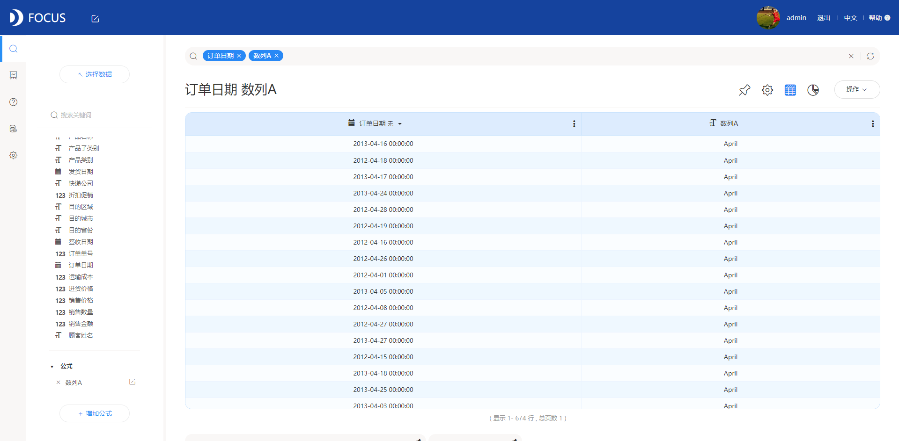
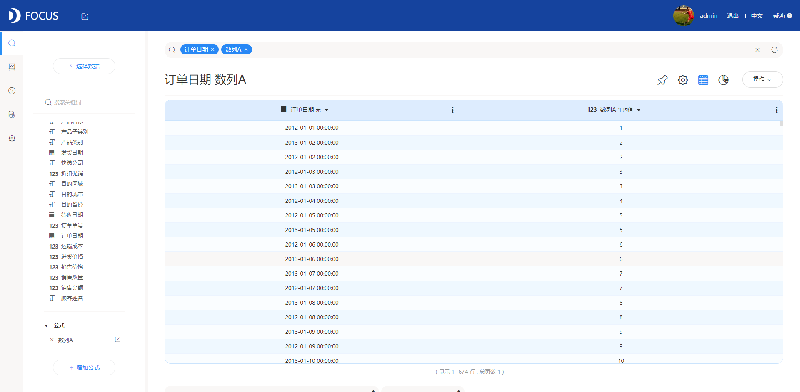
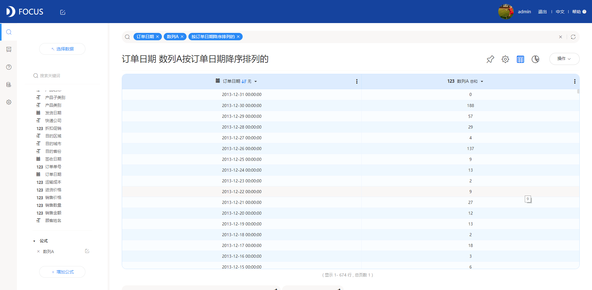

本文笔者来讲讲关于我们在数据分析中常用到的日期公式。在DataFocus中我们导入的时间列一般格式为”year-month-day hh:mm:ss”。

1. 修改日期

在原有日期上推进几天：add\_days

例如：添加公式列add\_days( 订单日期 , 20)，查询出来的数据列的值为订单日期列的时间加上20天的时间。

1. 提取日期列部分

（1）提取日期：date（year-month-day）

（2）提取日期列的年份：year (year)

（3）提取出月份：month (month)

（4）提取出小时：hour\_of\_day (hh)

（5）提取日期时间部分：time (hh:mm:ss)

以提取出月份为例：month(订单日期)

查询出来的数据列的值为订单日期列中的月份。

1. 日期是当年/月/周的第几天/周几/第几月

（1）日期是所在年的第几天：day\_number\_of\_year

（2）日期是在所在月的第几天：day

（3）日期是所在周的第几天：day\_number\_of\_week

（4）日期是所在周的周几：day\_of\_week

（5）日期是当年的第几月：month\_number

以所在年的第几天为例：day\_number\_of\_year(订单日期)

查询出来的数据列的值为订单日期列的日期是所在年的第几天。

4.计算日期差

（1）日期和日期之间的天数差：diff\_days

1. 日期和日期之间的秒数差：diff\_time

以天数差为例：diff\_days(签收日期 , 发货日期)

查询出来的数据列的值为签收日期列的日期和发货日期的日期的时间差，天数为单位。

5.日期列的日期是当年/季度/月/周的第一天的日期

（1）日期列的日期当月的第一天的日期：start\_of\_month

（2）日期列的日期当季度的第一天的日期：start\_of\_quarter

（3）日期当周的第一天的日期：start\_of\_week

（4）日期当年的第一天的日期：start\_of\_year

以当年的第一天的日期为例：start\_of\_year(订单日期）

查询出来的数据列的值为订单日期列的日期当年的第一天的日期。

6.判断是否为周末

判断日期列的日期是否为周末：is\_weekend

例如：is\_weekend( 订单日期 )

查询出来的数据列的值，其中如果订单日期列的日期是周末，x为true，否则为false。

这么全的日期公式攻略，还在等什么，赶紧收藏起来吧!
