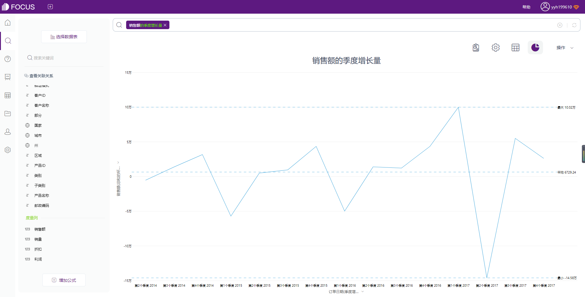
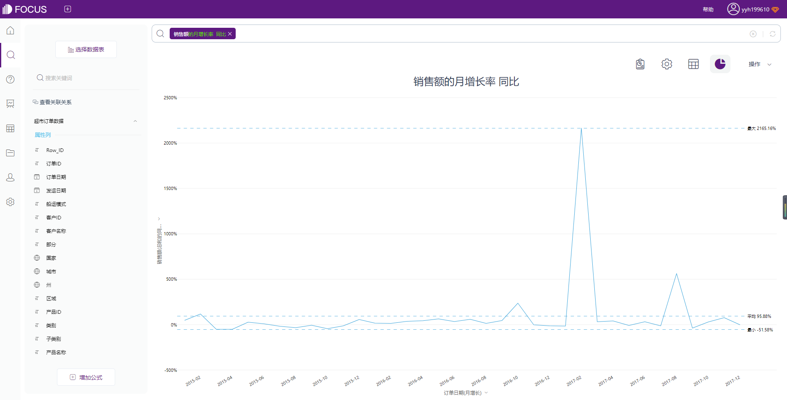
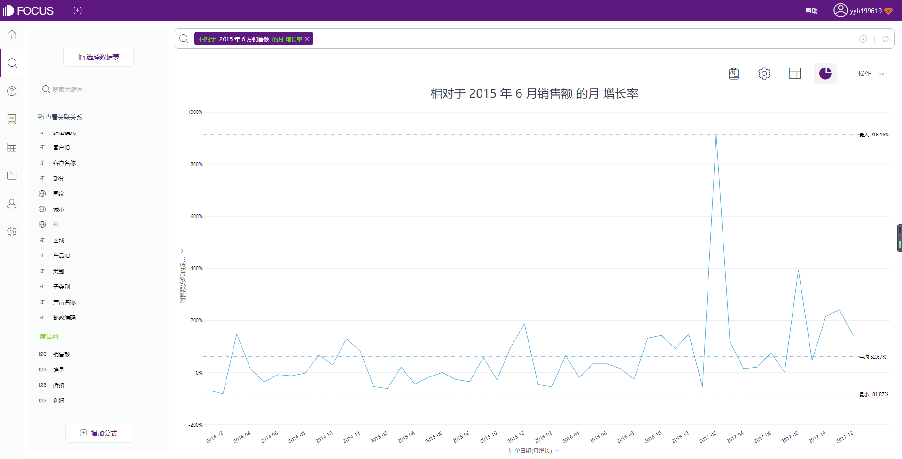

今天主要和大家分享一组DataFocus增长关键词的经典用法。增长率是指**一定时期内某个数据指标的增长量与基期数据的比值**。所以使用增长关键词，需要有**日期列和数值列**的数据。

常见的增长计算方法，有同比增长、环比增长、定基增长等。

由于DataFocus的关键词体系，就不必自己写公式，只需要在搜索框中搜索关键词即可。

**1、环比增长**

环比增长，一般是**和上期相比**的增长情况。

搜索关键词“销售额的日/周/月/季度/年 增长量/增长率”

**2、同比增长**

同比增长，一般是指和去年同期相比的增长率。

搜索关键词“销售额的日/周/月/季度/年 增长率/量 同比”

**3、同环比增长**

可以利用关键词同时看到同环比增长情况，无需分两次搜索。

搜索关键词“销售额的日/周/月/季度/年 增长率/量 同环比”

**4、定基增长**

定基增长是将每个时期的数据与同一个基期数据进行对比，比如将其它月份的销售额与2015年6月的销售额进行比较，所获得的比例，就被称作定基增长率。

可以搜索关键词“相对于2015 年 6 月销售额的月增长率/量”

当然，如果需要按年、日定基比较，可以搜索关键词“相对于2015年销售额的年增长率/量”、“相对于2015年6月1日销售的日增长率/量”

好了，以上就是增长关键词的全部用法了，希望对你有帮助！
