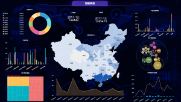

目前，我们国家随着移动互联网和智能应用的普及，数据爆炸式增长，很早的时候就进入已进入，传统的数据呈现浏览、分析评估、价值挖掘及应用输出等形式已经无法适应，并且以datafocus代表的各行各业的海量数据集合。

1、集联与组网级联

datafocus平台针对各行业大规模组网应用，目前技术团队可组建全国范围内的分控平台和总部与各级平台之间的组网级联。并且通过datafocus平台权限设置，这样算是实现每个子系统的本地可视化控制与反向交互控制。

2、数据源云接入

各行业的数据库中的原生数据，目前该领域的企业都在通过千兆网络及高性能GPU处理能力，并且在很大程度上将存与云端的信息数据点对点传输至显示设备上；这样也是将信号格式无限制。

3、反向交互

datafocus平台具有各级管理员权限，可控制多点多地的平台信息，并且能够将数据友好的操作界面可反向控制任意移动智能设备，便于数据分析与协作。

4、IE开窗显示

行业大数据软件、组态软件、GIS与GPS系统等，并且很多时候，大家将大屏画面点对点分割显示，并支持3D场景矢量输出。

以上，就是关于datafocus平台体现出来的可视化显控制平台，并且大家该怎么样去阐述该类型文件的发展，可以咨询datafocus官方网站，最后希望此文能够帮助到大家！
