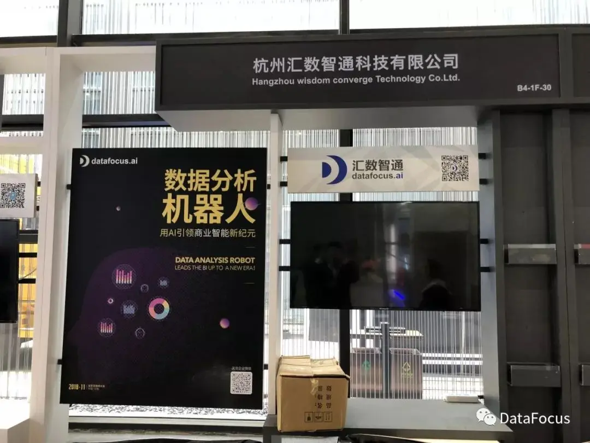

**DataFocus将在第五届世界互联网大会以“搜索驱动数据分析，构建企业的数字化大脑”为主题，发布智能分析机器人**

 

十一月的乌镇，正是秋高气爽的好天气。满街的黄叶和着空气中秋天的味道，一年一度的世界互联网大会正在这里举办，这里没有一点儿互联网寒冬的痕迹。除了BAT之外，每年都有许多新兴的科技公司在这里展示他们的新发明，发布新产品，向世界昭示着中国创造的新力量。

DataFocus的展位位于B4-1F-30号，进入4号展馆，很容易就可以看到“数据分析机器人”几个大字。DataFocus是一个以搜索的方式驱动的，类似人机对话的数据分析系统，该系统可以理解人类关于数据的问题，并以丰富的图表和数据回答相关问题。从展台现场播放的视频来看，这种搜索式的数据方式比传统分析方式高效很多，几分钟的时间就可以创建一块数据可视化大屏。

DataFocus展位

从展台的小妹妹的讲解来看，DataFocus属于一款商业智能产品，但是不同于传统BI的是，他几乎完全革新了传统商业智能的业务方式，尤其是交互体验上，几乎和谷歌、百度搜索一模一样，只需要在搜索框中输入相应的关键字，即可快速呈现图表。这对于重度的数据分析人士来说，是个好消息——不需要写代码，普通人员，比如我们记者，也可以轻松操作。也没有复杂的控件，用起来不费吹灰之力甚至比excel都简单。

DataFocus既可以处理大数据也可以处理小数据。其官网显示DataFocus Mini是针对数据规模不大的小微企业用户的，重度数据分析人士也可以使用，可以在window10系统上安装，普通8G内存的笔记本也可以运行。它也有支持大数据分析的高级版本，主要针对中大型企业组织的。

