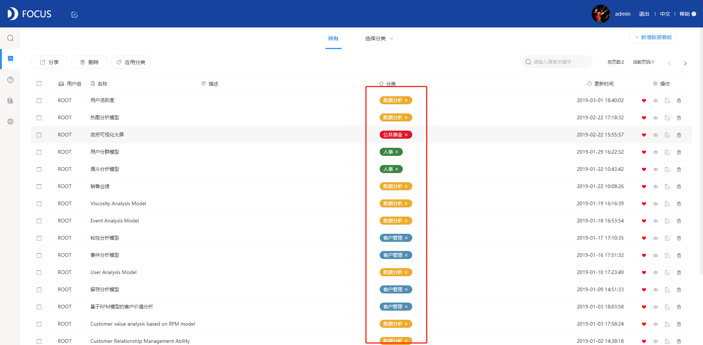
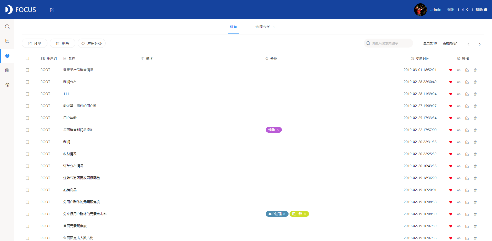
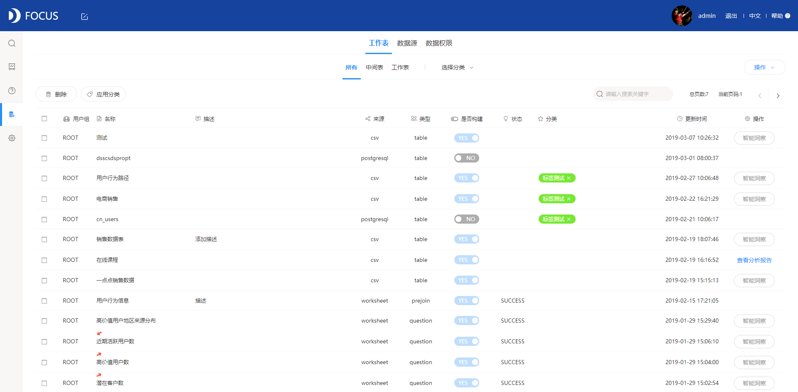

小功能点设置的成功能帮助使用者运用工具顺畅且更自助。今天笔者就来讲讲在DataFocus中的个隐藏小功能点：应用标签。

首先我们来看看应用标签是什么？在DataFocus怎么操作进行实现呢？我们以在数据看板中设置应用标签为例。

第一步：进入数据看板页面，点击“应用标签——增加”，设置标签颜色（黄色）及名称（数据分析），点击增加；

第二步：在和“数据分析”相关的数据看板前单击选中，然后点击“应用标签——数据分析”，添加应用标签成功。

第三步：选择页面上方的“选择标签——图集”，就可以将“图集”标签的数据看板筛选出来；

应用标签在数据看板、历史问答、数据管理页面均可以进行设置，且在历史问答页面和数据管理页面的操作流程和上述相同。

是不是很简单？那么应用标签有什么作用呢？

1.数据看板、历史问答、数据源的分类归置

应用标签的设置能够帮助将杂乱的列表进行归类放置，经过选择标签可以迅速寻找到自己想要的看板、历史问答、数据源类列表。特别在数据看板、历史问答、数据源已经积累到一定数量时，应用标签的存在就会为使用者提供便利。

2.用户群分类

客户管理中的用户分群分析时，创建中间表将用户进行分类，这时候可以添加应用标签进行标记，将其与其他数据表区别开来。

你Get这个小功能了吗？赶紧使用DataFocus体验一下吧！
