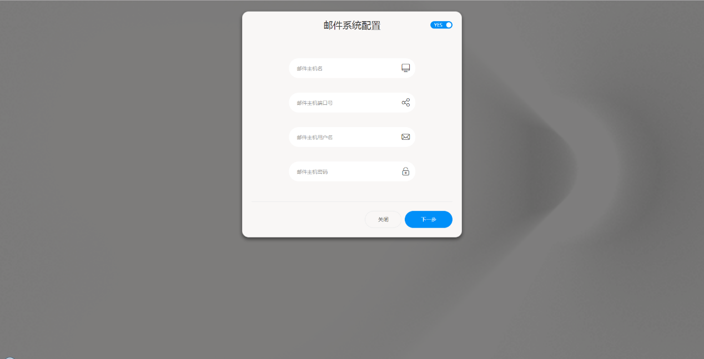

**邮件系统配置**

**邮件配置的作用:**

1. Datafocus中的当用户分享给另一个用户answer，pinboard等资源时被分享用户将会接收到提示邮件。发件人为此处配置的邮件地址
2. 若datafocus中有用户需要执行修改密码等需要接受验证码的操作时(如找回密码等)，datafocus将使用此处配置的邮箱地址发送验证码到用户信箱中
3. 用户点击 ‘关注’的pinboard或者answer发生变化时 会收到提示邮件

**那么怎样配置邮件系统:**

1. 首次登陆的邮箱服务器配置
    1. 首次进入datafocus页面，输入默认系统管理员账户密码 admin/admin 并点击‘登录’ （**因初始密码安全性极低，建议用户初次登陆后立即修改admin用户密码**）

- 1. 弹出‘邮件系统配置’窗口，用户需自行填写自己邮件服务器相应的邮件配置；若暂不需要，可先点击右上角‘YES’切换为’NO’后跳过此步即可。当跳过邮件配置后，因为datafocus缺少邮件系统配置信息，故涉及到系统发送邮件的业务都无法正常执行，即包含上文所描述的功能。

1. 再次开启的邮箱服务器配置
    1. 使用系统管理员账号进入系统的系统管理-全局配置页面。

- 1. 找到邮件系统配置，打开启用按钮，填写自己邮件服务器相应的邮件配置，与初次登陆配置信息相同。

**Tips：根据用户所使用的邮件服务器供应商不同，具体参数上会有些许不同，**我们以163邮箱为例。

1. 进入用户自己的网易邮箱。

1. 点击设置-POP3/SMTP/IMAP进入邮箱服务器的设置页面，开启服务并配置授权码，以用于此后在DataFocus系统中的配置。

1. 在DataFocus中填写所需的配置信息。

