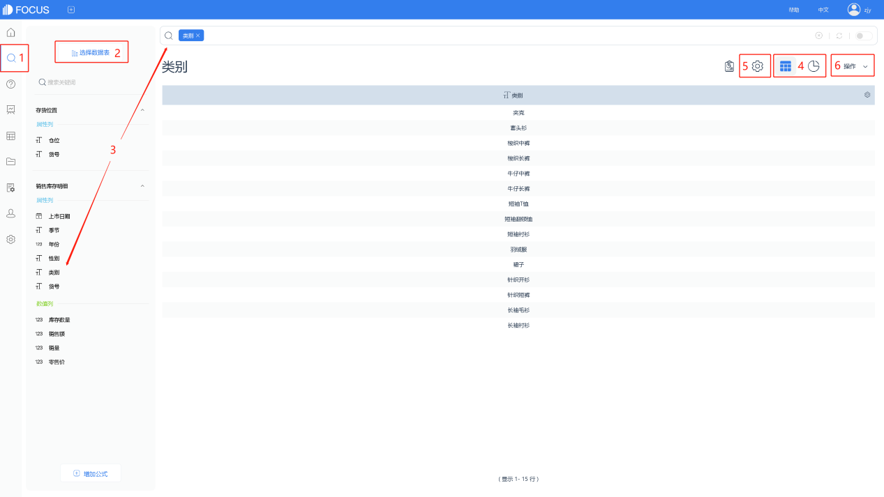
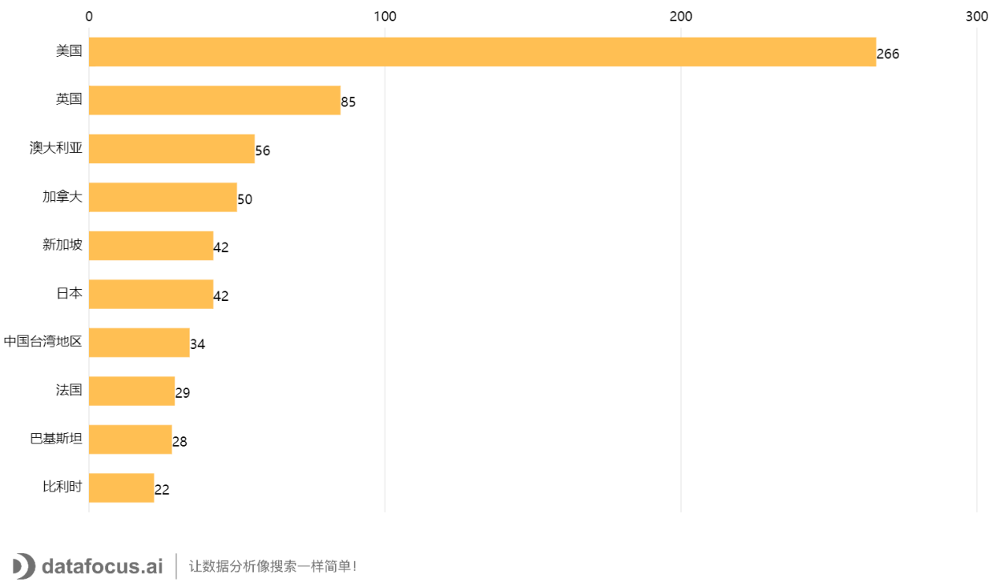
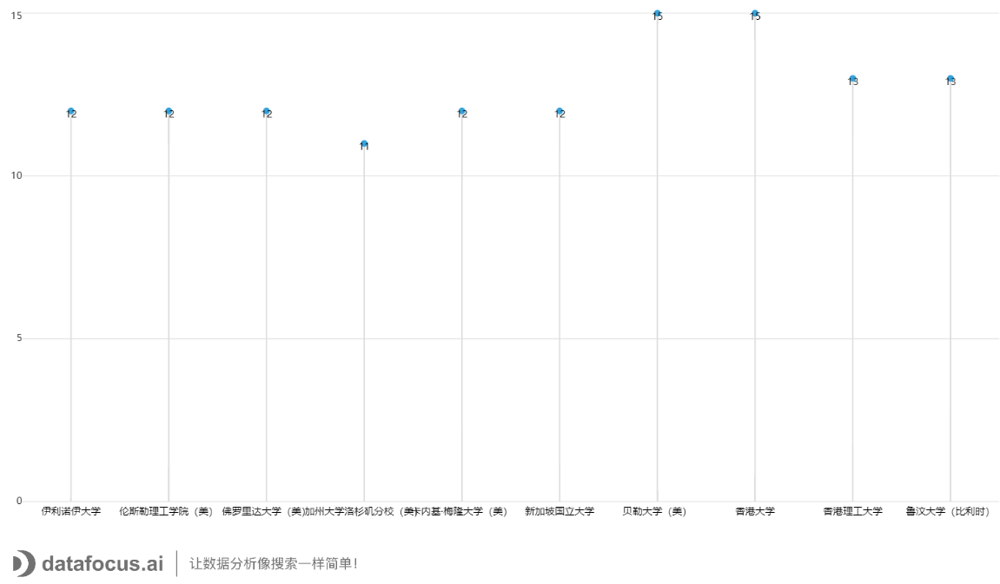
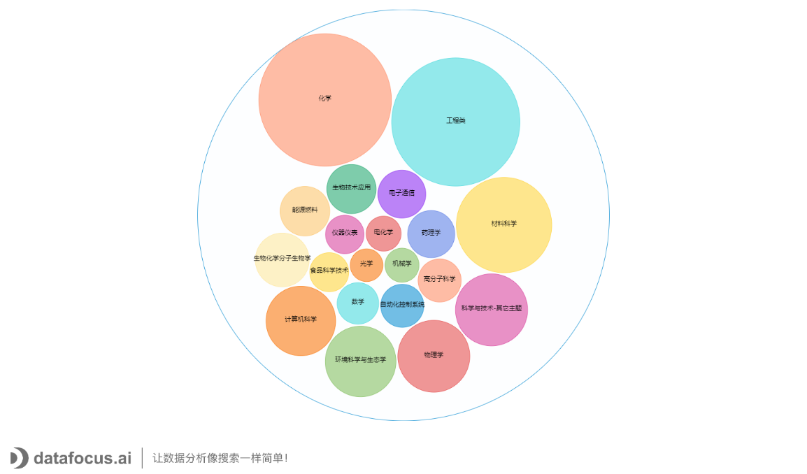
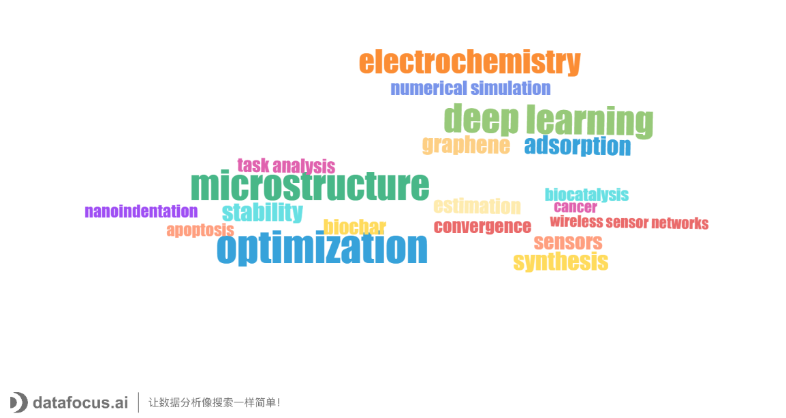

2020年疯狂的疫情，并没有阻挡莘莘学子学术研究的步伐。本期，DataFocus将以2020年清华大学发表的期刊论文为研究对象，从发文数量年增长（2010-2020年）、合作关系、研究方向、关键词等多维度展示浙江工业大学2020年度学术成果。

**数据来源**

**数据来源**

Web of Science核心合集

Science Citation Index Expanded（SCI-EXPANDED）

Social Sciences Citation Index (SSCI)

在上述两个数据库中，检索发文单位包含浙江工业大学，文献类型为article和review，且出版年为2020年的文献（检索时间为2021年1月7日）。

**2020年浙江工业大学学术论文成果展示**

1. **发文增长情况**

**浙江工业大学发文趋势图**

****

**截至2021年1月7日，浙江工业大学2020年共发表论文2703篇（注：因WOS具有时滞性，2020年发文未收录完全）。如图，2010-2020年发文量呈现明显的逐年上升趋势，且涨幅较大。**

1. **合作关系分布**

2020年浙江工业大学发文Top10合作国家/地区

****

（发文量降序排列）

2020年浙江工业大学发表国际合作论文923篇，涉及58个国家和地区，国际合作比达34.15%。如图展示了国际合作论文的国家及地区前10名，其中美国合作篇目最多。

2020年浙江工业大学发文Top10合作机构（除中国大陆）

如图展示了2020年浙江工业大学合作发文量前10位的机构分布，发文基本在13篇左右。

2020年浙江工业大学发文Top10合作机构(中国大陆）

如图展示了2020年浙江工业大学发文前10位中国大陆的合作机构，其中合作次数最多的是浙江大学，其次是中国科学院。

1. 研究方向分布

2020年浙江工业大学发文Top20研究方向

浙江工业大学2020年发表的2703篇论文共涉及98个研究方向，其中化学类和工程类发文量最多，占比也最高。

1. 关键词分布

2020年浙江工业大学发文Top20作者关键词

如词云图显示，词频最高的前5个作者关键词分别为：optimization（25次）、microstructure（23次）、deep learning（22次）、electrochemistry（18次）以及adsorption（13次）。
