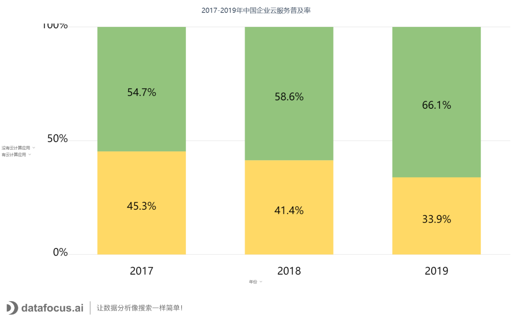
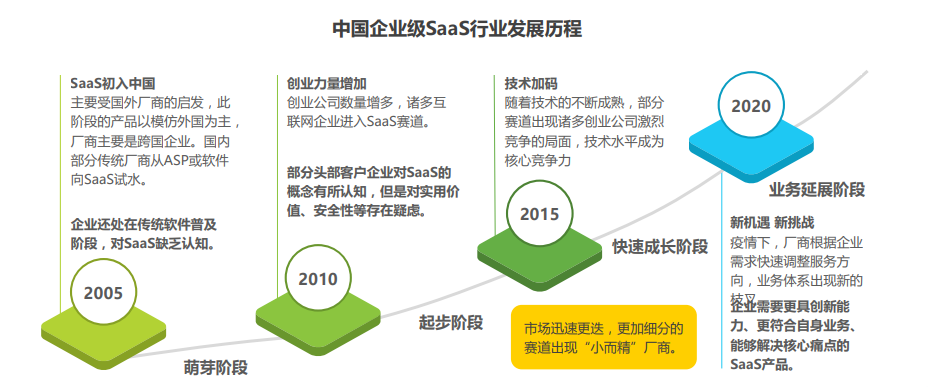
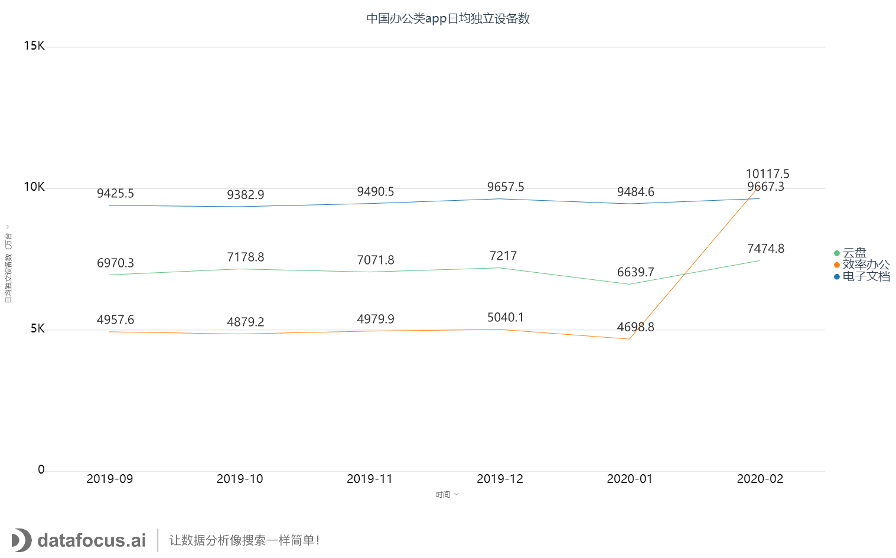
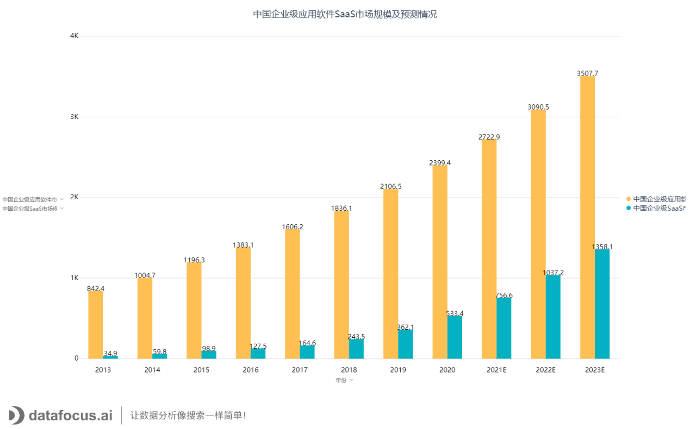

2020年是一个动荡之年，新冠疫情、美股熔断、长租公寓爆雷...虽说2020年是经济寒冬年，可是市场也同样出现了经济火热的一面。疫情期间，每个行业都受到了波及，不少传统线下行业的企业遭到重创面临倒闭，然而对于SaaS行业而言，又是一个新的机遇和挑战。

本文，DataFocus将带你看2020年中国企业级SaaS行业研究报告，通过对SaaS行业的发展状况展开分析，帮助您加深行业了解。（本文数据来源：艾瑞咨询，文末附赠研究报告电子书）

企业级SaaS行业发展的基本要素

首先，企业级SaaS行业的发展离不开这三大基本要素：信息化、云服务、政策。

**基础要素1:企业信息化程度**

信息化程度是SaaS行业发展的土壤。信息化程度越高，通过计算机技术提高经营水平的能力就越强，互联网企业用户的数量也会越多，软件普及率也会更高。

目前而言，中国的信息化程度还和美国有较大差距，原因是美国早在20世纪60年代就基本进入信息化社会，随后的40年中，IT技术不断提升，互联网应用也得到普及。而中国在20实际末才开始发展计算机技术，发展历程较短。国内IT贡献的GDP仍不足。

**基础要素2:云服务发展水平**

云服务是SaaS行业的驱动力。这一要素既决定了SaaS产品的服务能力，也影响了用户对云服务的使用意愿。现在SaaS有公有云、私有云、混合云等多种部署形式，但公有云是目前使用最普遍、广泛的方式，尽管仍有企业对其安全性保有存疑。

云服务模式在中国的普及率已从2017年的54.7%上升至2019年的66.1%，随着中国基础云厂商技术提升，市场教育逐步见效。

**基础要素3:政策法规推动**

政策法规对企业级SaaS发展的推动力来自几个不同的角度。

1. 针对部分企业用户担心的云端软件网络安全性问题，中美均出台了关于保障用户隐私、电子通信隐私和信息安全的法律法规，对云服务的服务质量作出规范。
2. 政府出台《推动企业上云的实施指南（2018-2020年）》等，使一部分企业新增了对SaaS软件的需求。
3. 一些政策法规虽与云服务并无直接相关，但是促成了企业对深耕行业的垂直型工具型SaaS产品的需求，如美国企业在员工管理上需要遵循各人种无歧视雇佣等原则，高昂的罚款促使企业需要HRSaaS管理软件帮助其实现合规管理。

整体而言，政策的推动力来自于帮助企业增强使用信心、激活企业使用需求。

中国市场的发展状况

**发展历程**

企业级SaaS厂商从萌芽阶段，发展到快速成长阶段，直到现在的业务拓展阶段。

**行业痛点**

企业级SaaS在中国处于市场繁育期，需求端和供给端的一些不足成为行业发展的掣肘。

**从供给端的角度**，虽拥有软件功能，但是产品对业务的理解缺乏深度，无法为客户提供能解决核心业务难题的解决方案，而缺乏服务能力的SaaS产品是不完整的，所以企业也并不愿意为与需求割裂的SaaS付费。

**从需求端的角度**，企业使用SaaS软件的意愿和付费意愿均不够强，需求端驱动力不足使得SaaS厂商难获新客、难增营收。

**新冠疫情的影响**

**疫情使得许多企业比如餐饮零售、协同办公、教育等运作管理受到影响，企业开始寻求新的经营模式，因此滋生企业新需求。一些SaaS厂商的快速响应，及时匹配新需求，业务出现成倍增长。**

**疫情让企业级SaaS带来一大波流量，尤其是2月份复工以来，无论大型企业还是中小型企业，都加入了协同办公的行列。协同办公SaaS获得大量试用客户，所以接下来流量转化和用户留存成为企业关键。相较管理流程类软件，工具类软件用户粘性高，流量转化率高，用户更能体会到价值。**

****

****市场规模****

**2019年中国企业级SaaS市场规模为362.1亿元，相较2018年增长了48.7%。疫情使得企业对SaaS的接受度和需求增加，市场仍将保持较快增速，预计2022年中国企业级SaaS市场的规模将突破千亿元。**

**中国企业级SaaS厂商发展策略**

****SaaS厂商现状****

**目前中国SaaS行业还处于腰部厂商探索成长、头部厂商逐步扩张的阶段，暂未出现像美国市值千亿的SaaS巨头。**

**企业级SaaS厂商目前有三类，创业型、传统型、互联网。**

**创业型厂商具有先发优势和更落地的行业洞察力，可以和其它类型厂商合作和竞争。**

**传统型厂商的基因是软件，基于IT技术和客户优势发展高定制化产品，在云服务的模式上积累尚浅，竞争集中在传统软件渗透率高的赛道，如ERP、CRM，大型企业会对传统型厂商有较高的信任。**

**互联网厂商走的是发展云计算和教育市场的道路，具备流量优势。同时，头部跨界的互联网厂商的公有云能力使其在发展aPaaS平台上具有一定优势。**

**创业型SaaS厂商成长阶段示意图**

**创业型SaaS厂商将经历4个阶段，雏形、初创期、成长期、扩张期。**

****

**各发展阶段厂商策略**

对于**初创期**的SaaS厂商，首先应该考虑的是如何做出一款还不错的产品。选择好有发展前景的**增量市场**后，产品需具备一定**创新性**能直击企业痛点，**具备较高的产品和市场匹配度**。

针对市场可以**定义一个容易被记住的品牌发声方式**，**通过客户证明产品价值**。

此阶段，**销售**是营收来源。

对于**成长期**的SaaS厂商，需**重点关注市场策略**，即把产品卖给更多的人。此阶段产品应**加强做行业解决方案的能力**，**具备较强的差异性**。

针对市场可采用**差异化定价**，为潜在用户提供**试用**，再通过**品牌建设**带来流量。

基于软件收费，可推出**增值服务**提高营收。

对于**扩张期**的SaaS厂商，可以进一步**丰富产品矩阵**，扩展产品适用面，以满足客户**多样化需求**。此阶段的市场策略重点在于如何让客户**快速感知**产品价值，营销方式主要是**口碑营销**。

商业模式还可以推出新类型，比如交易佣金抽成，**利用存量用户辐射增量用户**。

**发展ａｐａａｓ平台**也是扩张期SaaS厂商一个技术策略，它可以帮助厂商解决企业强定制化需求和研发成本上升效率下降的问题，又为企业用户提供自主迭代产品开发空间，创造更大的价值链。

行业发展趋势展望

****中国企业级SaaS整体市场趋势****

**SaaS在传统软件中的渗透率不断增加，潜在市场规模较大。2019年中国企业级SaaS的市场规模是362.1亿元，占应用软件的比例为17.2%，相比于2014年的6.0%已有了成倍增长，此后随着SaaS市场的迅速扩张，这一占比将在2023年达到38.7%，企业级SaaS具有广大的潜在市场空间。**

****

**中国企业级SaaS行业发展趋势**

随着C端流量红利见底，国内互联网巨头逐渐有更大的动力探索B端增长，以阿里、腾讯为代表的头部互联网厂商从公有云入场B端，为进一步提升公有云覆盖力，扩大其在B端的市场份额，厂商们开始逐渐向上构建SaaS生态。如果说C端的竞争是流量的竞争，那么B端市场将会是生态的竞争。

跨界而来的互联网厂商利用IaaS层技术沉淀，构建aPaaS应用市场，使得SaaS产品具有更强的扩展性和定制能力，而后从自主研发、投资并购和生态合作三个层级围绕优势产品建立SaaS生态，**一方面作为被集成方为创业型SaaS厂商提供技术支持，另一方面也发挥流量和资金优势，现阶段以免费或低价的SaaS产品激活小微企业的使用意愿。**

在历经技术驱动的洗礼和业务体系趋于完整后，市场端的规模扩张逐渐成为发展趋势，**产业内并购加剧**。对于头部的创业型SaaS厂商而言，有两个主要的并购方向，第一是纵向并购，向产业链上游并购PaaS层厂商，加强SaaS厂商aPaaS平台的构建，以及IaaS层技术能力，自建公有云；第二是横向并购通过并购专注于创新业务、细分业务的厂商，保证自身的技术创新能力并增强垄断力，通过对企业已有业务体系的调整和补充，构建企业级SaaS产品生态，达到最佳经济规模。

**发展策略建议**

SaaS产品的服务能力通常可分为四类，分别是“合规”、“提效”、“节流”和“开源”。“看得见的”成本降低和收入增加更易获得价值认同，而“提效”型产品，中国市场的付费意愿仍需要进一步激活。因此可以尝试向“可视化”发展，为企业提供“看得见”的“节流”和“开源”，将更快迎来市场繁荣。

DataFocus总结

目前SaaS行业仍有较大的市场发展前景，或许会有更多互联网企业跻身SaaS行列中。但不管企业如何竞争与合作，用户都将会是最大受益者。随着IT技术水平的提升，云服务水平提高，用户能享受到的服务体验只会越来越好。

这也是DataFocus一直以来所希望看见的。

DataFocus不断打磨产品，基于对企业痛点的洞察，除了能提供企业业务解决方案外，也一直将用户体验放置首位，助力人人都能成为数据分析精英。

如今DataFocus新推出的产品DataFocus　Cloud，是DataFocus向用户心里迈进的重要一步。数据分析效率低成本高，没关系，现在，您1分钟登录便可即刻享受分析服务，您的体验只有更快更便捷。

**想了解更多信息，您不要错过**

2021年1月19日

19:00-20:00

DataFocusCloud新品直播发布会重磅来袭

AI驱动，SaaS部署，引领数据分析云时代。

DataFocus与您相约，我们不见不散！
