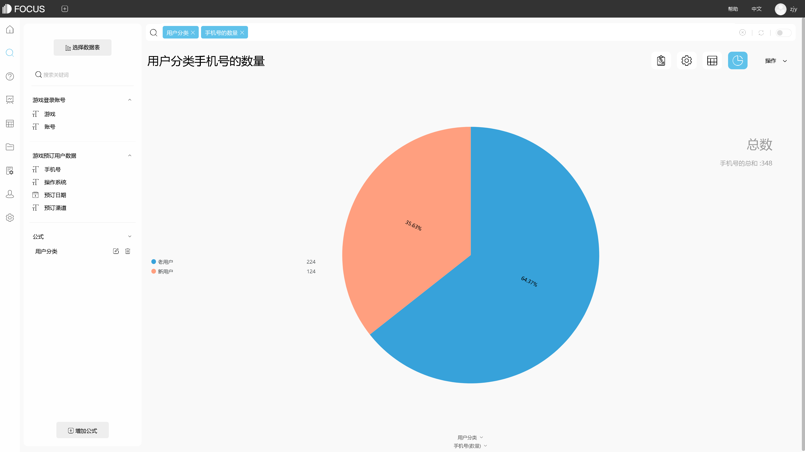

数据分析师针对不同业务问题可以制作各种具体的数据模型去分析问题，运用各种分析方法去探索数据，这里介绍最常用的三种分析方法，希望可以对您的工作有一定的的帮助

文中可视化图表均使用DataFocus数据分析工具制作。

1.相关分析

相关分析显示变量如何与另一个变量相关。例如，它显示了计件工资是否会带来更高的生产率。

2.回归分析

回归分析是对一个变量值与另一个变量值之间差异的定量预测。回归模拟依赖变量和解释变量之间的关系，这些变量通常绘制在散点图上。您还可以使用回归线来显示这些关系是强还是弱。

另请注意，散点图上的异常值非常重要。例如，外围数据点可能代表公司最关键供应商或畅销产品的输入。但是，回归线的性质通常会让您忽略这些异常值。

3.假设检验

假设检验是基于某些假设并从样本到人口的数理统计中的统计分析方法。主要是为了解决问题的需要，对整体研究提出一些假设。通常，比较两个统计数据集，或者将通过采样获得的数据集与来自理想化模型的合成数据集进行比较。提出了两个数据集之间统计关系的假设，并将其用作理想化零假设的替代方案。建议两个数据集之间没有关系。

在掌握了数据分析的基本图形和分析方法之后，数据分析师认为有一点需要注意：“在没有确认如何表达你想要解决的问题之前，不要开始进行数据分析。”简而言之，如果您无法解释您试图用数据分析解决的业务问题，那么没有数据分析可以解决问题。
