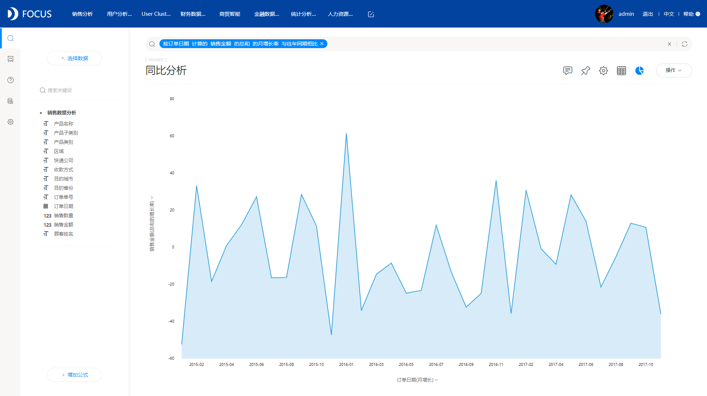
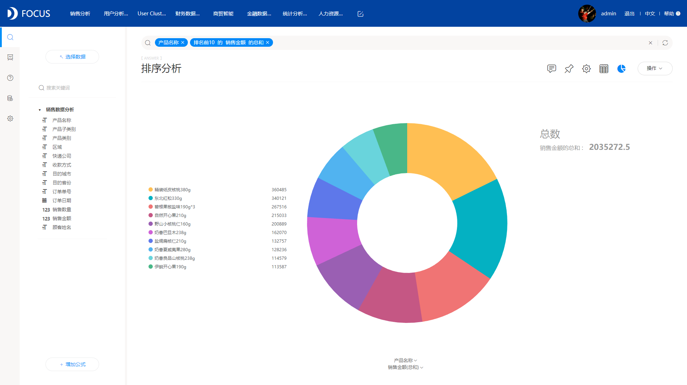
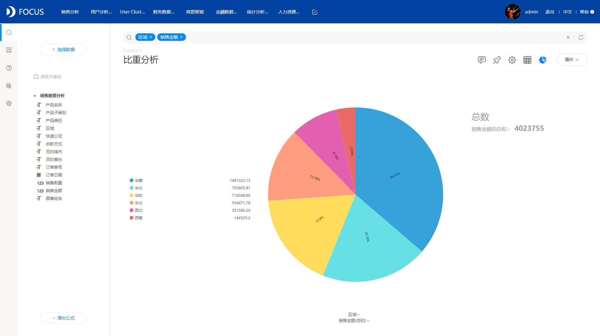
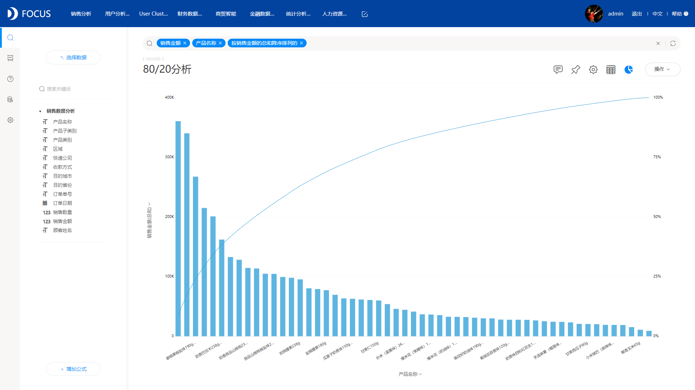
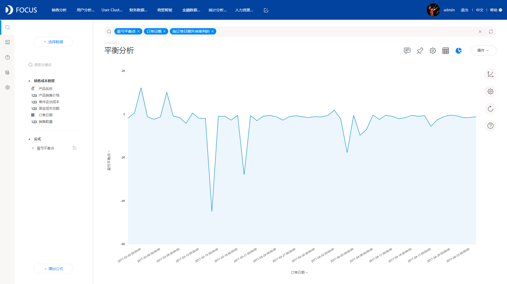

今天我们主要利用DataFocus这款数据分析工具，来重现几个经典的统计分析方法。

1、环比分析

环比分析主要是用某一期的数据和上期的数据进行比较，计算趋势百分比，以此来观察每年或者每月每季度的增减变化情况。

DataFocus中直接在搜索框内输入：按订单日期 计算的 销售金额 的总和 的月增长率，即可求出每月的环比增长率；

2、同比分析

同比分析主要是今年第n月与去年第n月对比。同比发展速度主要是为了消除季节变动的影响，用以说明本期发展水平与去年同期发展水平对比而达到的相对发展速度。

DataFocus中直接在搜索框内输入：按订单日期 计算的 销售金额 的总和 的月增长率 与往年同期相比；

3、排序分析

排序分析主要是将一组“无序”的记录序列调整为“有序”的记录序列。

DataFocus中在搜索框内直接输入：产品名称 排名前10 的 销售金额 的总和；

4、比重分析

比重分析也就是“结构分析”。其主要是计算各项组成部分占总体的比重，分析其内容构成的变化。

DataFocus中，直接在搜索框内输入相应的列名，并将图表以饼图显示；

5、80/20定律

80/20定律也叫帕累托法则，主要讲述的是80%的收获，来自于20%的付出，80%的结果，归结于20%的原因。

DataFocus中，直接在搜索框内输入相应的列名，然后选择以帕累托图的形式展现即可；

6、异常值分析

异常值主要是指在一组测定值中与平均值的偏差超过两倍标准差的测定值，最常用的异常值分析就是箱型图分析。

DataFocus中可直接将数据展示为箱型图，操作如前面一样，搜索框输入相关内容，选择箱型图展示；

7、盈亏平衡点

盈亏平衡点又称零利润点、保本点、盈亏临界点、损益分歧点、收益转折点。通常是指全部销售收入 等于全部成本时（销售收入线与总成本线的交点）的产量。

DataFocus中计算盈亏平衡点，需要借助于公式，公式为：sum (固定成本总额 )/sum (产品销售价格- 单件变动成本 )，然后将公式加入到搜索框内，并且在搜索框内添加日期信息即可；

这次，我们利用DataFocus重现了7个经典的统计分析方法，大家学会了吗？
