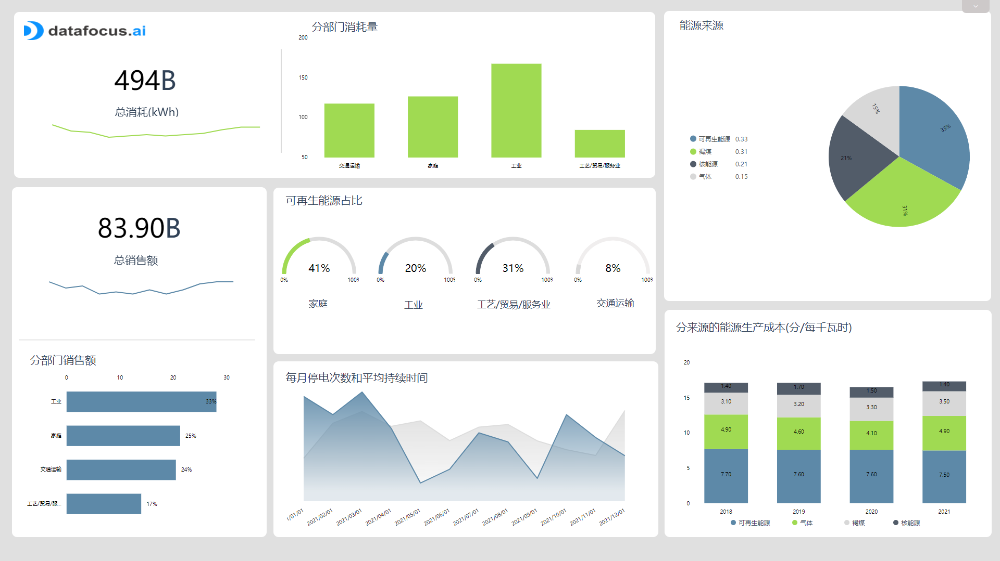
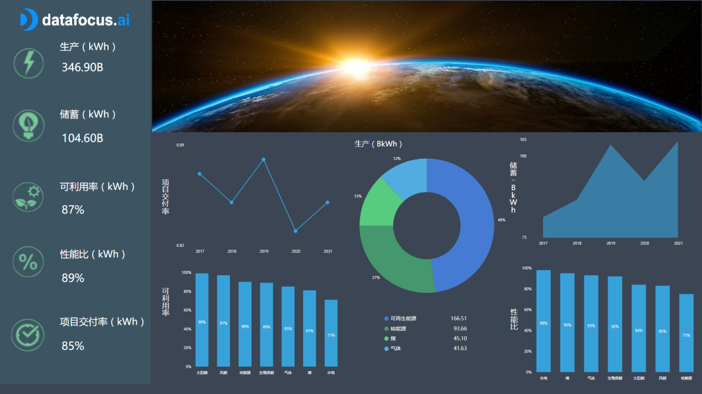

能源大屏是一种最先进的报告工具，可借助数据分析工具实现交互式界面实时监控能源 KPI，它可以帮助能源供应商满足快速变化的市场需求，分析和优化生产成本，以及提高长期的整体盈利能力。DataFocus 作为一款零代码数据分析工具，可以大大减少学习成本与运营负担，无需学习复杂的代码，人人都能学会数据分析。其独具特色的搜索式分析不仅能更符合人类习惯的交互方式，也是最高效的信息获取方式，可以处理复杂数据集和分析逻辑，同时也更加适用于探索数据的场景。

接下来，我们将借助数据分析工具——DataFocus实现3个能源大屏案例，能源管理大屏，能源财务大屏，能源运营大屏。

## **能源管理大屏**

一般大型能源企业都有数百个站点从不同类型的资源生产能源，作为总经理，你需要对所有站点的产出有一个全面的了解，以此正确的监督整体。因此，第一个能源管理大屏主要提供数据的概览，从总销售额到按行业划分的消耗，再到每种来源类型的生产成本，您可以全面了解不同工厂的绩效。

该能源管理大屏的顶端侧重于不同部门实现的总消耗量。毫不奇怪，工业部门消耗的电力最多，家庭和交通部门紧随其后。重要的是要了解消费在您供应的部门之间的分配方式及其演变方式，以了解您的主要消费者是谁并满足他们的需求。与简单的农村家庭相比，大型工厂确实需要更多不同类型的能源。此外，它不会以相同的方式运输。按部门划分总消耗量可以让您知道哪个区域用掉了多少电力，这是一个让您可以相应地调整生产和交付的指标。这些见解将极大地帮助您规划生产。

在消费下方，您还可以看到按行业细分的销售额，与消费趋势一致；还有每个部门的可再生能源消耗。随着消费者对可再生能源的需求越来越多，可再生能源也越来越发达，他们已经意识到人类对其环境的影响，以及并非都是无限的自然资源。随着全球变暖，人们更偏向于寻找产生二氧化碳排放量更少的替代能源，并有助于使一般消费走上可持续发展的道路。到目前为止，家庭是最大的探索者；但是，由于企业和大型行业的巨大影响，以及它们消耗的巨大能源，它们被越来越多地要求走向绿色。

在更具操作性的层面上，底部指标通过计算停电次数及其总持续时间来监控设施的停机时间。设施主管经常担心停电，但这并不是一件坏事，可以帮助您的工厂更好地运行。安排和计划停机时间后，您就有时间进行系统的维护工作，并确保长期有效的活动。然而，停电可能会让人感到意外——在这种情况下，必须采取措施让您快速面对停电，并有效响应以恢复正常运行的状态。过于频繁的停电也可能表明可能需要更换旧设备。

最后，生产成本根据能源进行测量，并在堆叠条形图中，显示一年内的演变，评估长期成本有助于选择更具财务可持续性的能源。

## **能源金融大屏**

第二个能源财务大屏示例旨在关注各种与财务相关的KPI指标。对于任何企业，您的设施都需要跟踪其财务状况以保持健康的资本，以便运营能够继续进行。

在仪表板的左侧，我们汇总了一年中的整体KPI统计数据，每个数据都有一个平均数字和一条趋势线。股东总回报率为 49%，并且最近还在增加，而经营现金流约为 4.5亿欧元，并且总体趋势波动较大。净收益是具有明显增长趋势的指标，而生产成本和总销售额基本持平，有增有减。

这些指标中的每一个都在仪表板的右侧进行了详细说明。

其中第一个，经营现金流，年增长率为23.65%，我们可以通过水平条形图看到它在过去5年的演变。经营现金流有助于评估一家公司是否能够创造足够的现金来维持并发展其业务。

第二个显示的是生产成本按其产生的能源分类。我们看到可再生能源的生产成本最高，为每千瓦时 7.35分，而核能源的生产成本最低。如第一个能源管理仪表板所述，需要随着时间的推移评估成本，以了解哪个在财务上最为可持续。要计算生产成本，通常称为“平准化电力成本”的“LCOE”，您需要将总成本（设施在其生命周期内的建设、运营和维护）除以该生命周期内估计的总产量。然后，您将获得必须出售电力的平均最低价格，以平衡成本与利润。请记住，太阳能、风能和其他可再生能源等资产可能需要更高的前期建设成本，

第三个股东总回报 (TSR) 在大屏最右侧显示了5年的演变，以百分比表示，代表年初与年末股价之差，衡量公司股票的进展和表现。将TSR与竞争对手的TSR进行比较会告诉您是否走在正确的轨道上，其理念是通过为股东创造财务利益，为他们提供长期价值。它是市场在一定时期内评估公司业绩的一种方式。净收入是指公司在扣除所有经营成本(利息、税收、折旧和其他费用)后的利润。它是衡量公司盈利能力的重要指标。在这个能源财务仪表盘上，净收入在4年的时间里得到了上升，这是一个非常好的结果。

## **能源运营大屏**

最后一个能源运营大屏有一个操作重点，工厂经理需要了解所以触手可及的指标，以此评估一个设施的良好运作。考虑到一个大型工厂的能源生产和消耗是很复杂的，此类仪表盘将给你一个概述，你需要了解它的运作，效率，节能能力等等。这对于作出重要的决定或立即采取能源使用和优化行动来说，是至关重要的。

从工厂可利用率开始：该指标不应与衡量工厂产量的产能因素相混淆。可用性使您可以监控工厂能够运行的时间百分比。比较几家工厂的可用性有助于您识别设备中的潜在问题和弱点；但是这些电厂的类型必须相似（煤与煤对比，风与风等）。如果要比较不同的类别，应该考虑到其他因素:最终输出、维护成本等。通过确定您的工厂不可用的原因，您就知道如何修复以增加运行时间。

您的设施生产和分配的能源的生产分布是更好地了解消费者的重要指标。无论是用于家庭还是工业用途，了解不同类型能源的供应量，您可以洞察消费者的需求，从而更好地预测需求——并相应地调整您的报价和供应。

我们的最后一个能源大屏示例还通过将实际产量与理论预期产量进行比较来查看工厂的性能比。比较这两个值可以让您深入了解设施的效率。这两个数字之间的差异来自多种原因造成的能量损失：太阳能输入、水系统、传导性降低等。借助该指标，您可以发现生产中的问题并采取行动。您还可以使用它来比较不同的资产，看看哪些资产能产生更好的回报。

通过为您的工厂设施或配电网络公司使用能源大屏，您可以利用数据分析的力量创造巨大的变化。管理电力存储和运输，以可承受的价格确保高可用性将比以往更容易。

从环境效益到财务和消费节约，能源分析的潜力是巨大的。它们可以帮助您挖掘可操作且有价值的见解，从而做出更明智的决策。快来试用DataFocus，做出属于你自己的能源大屏案例吧，现在申请，可获14天免费试用机会~
