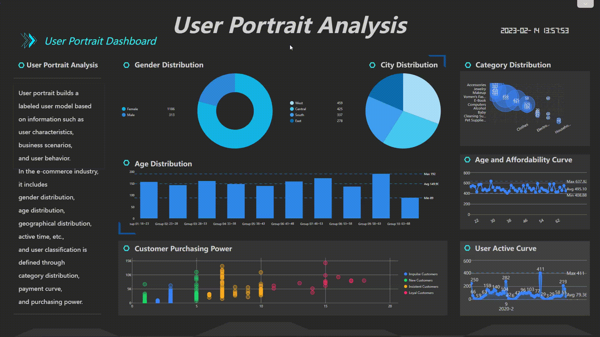

当今时代,企业面临着数字化、数据化的巨大变革。如何在复杂多变的商业环境中保持竞争优势,商业智能成为企业亟待解决的难题。datafocus凭借其独特的AI技术实力,正在成为企业商业智能转型的重要助力。

正文:

1. 商业智能转型背景

数字化浪潮席卷全球,企业数据呈爆炸式增长。如何从海量数据中提取价值,实现商业智能,是企业面临的重大挑战。许多企业急需商业智能转型,实现数据驱动决策。但是,传统BI工具操作复杂,用户友好度差,难以被业务用户广泛使用,无法满足企业需求。这需要一款新型的、智能的BI工具来实现突破。

2. 搜索式BI的优势

与传统BI不同,搜索式BI采用自然语言搜索交互,用户无需学习复杂的操作,只需输入问题,就可以得到所需分析结果。搜索式BI具有操作简单、分析快速、易于上手的优点,非常适合业务用户使用,可以推动企业商业智能转型。

3. datafocus产品特点

datafocus正是一个智能的搜索式BI工具。它具有三大特点:

(1)自然语言搜索

datafocus支持用户通过自然语言提问的方式与数据进行交互。无需编写SQL语句,用户像在搜索引擎上提问一样,输入问题即可得到答案,大大降低了使用门槛。

(2)多维数据视图

datafocus支持多表关联,提供多维数据视图。用户可以从多个维度审视业务,洞察数据之间的关联性。

(3)实时数据更新

datafocus实现了数据的实时更新,支持业务监控。用户可以实时查看业务运行情况,快速响应。

4. 自然语言搜索技术原理

datafocus的自然语言搜索是基于人工智能技术实现的。它通过自然语言处理算法,解析用户的问题,转换为数据库查询语句,从数据库中检索出匹配的分析结果,再通过数据可视化模块呈现给用户。

整个过程无需人工参与,全部由算法自动完成, thus实现了真正意义上的自然语言交互。用户无需学习数据库语言,就可以和数据进行对话,取得分析结果。

5. 多维视图交互

datafocus的多维数据视图,可以将不同业务维度进行组合,构建多维数据立方体。用户可以选择查看不同切面的数据,进行多维交叉分析。

例如,可以查看不同区域不同时间的销售数据,分析时间和区域两个维度对销售的影响;可以查看不同产品不同客户的销售数据,分析产品和客户两个维度的组合对销售的影响。

多维视图提供了更全面、更深入理解业务的能力,是实现商业智能的重要手段。

6. 实时数据实时更新

datafocus通过实时数据连接,实现了数据的实时更新。用户可以实时查看关键业务指标,发现问题并快速响应。

例如,可以实时查看网站访问流量变化,分析流量峰值;可以实时查看仓库库存数据,发现库存短缺情况。

实时数据支持业务监控,对实现商业智能起到至关重要的作用。

7. 安全管理和授权机制

datafocus实现了细粒度的权限管理,保障了数据安全。企业可以按部门、岗位设置权限,避免敏感数据泄露。

单点登录与企业身份管理系统集成,确保只有授权用户可以登录使用。这种安全可靠的权限机制,使企业管理层放心将其推广使用。

8. datafocus助力企业商业智能

凭借其独特的AI技术和产品优势,datafocus正在成为企业商业智能转型的重要助力。

简单、快速、智能的交互,使更多业务用户也可以自主获取数据价值,实现了商业智能的普及和推广。

实时和多维的分析视图,提供了深入的商业洞察,助力企业在数字化时代占得先机。

相信datafocus这类新型智能BI工具的出现,必将推动更多企业完成商业智能转型,在数字化浪潮中开拓更广阔的发展空间。
