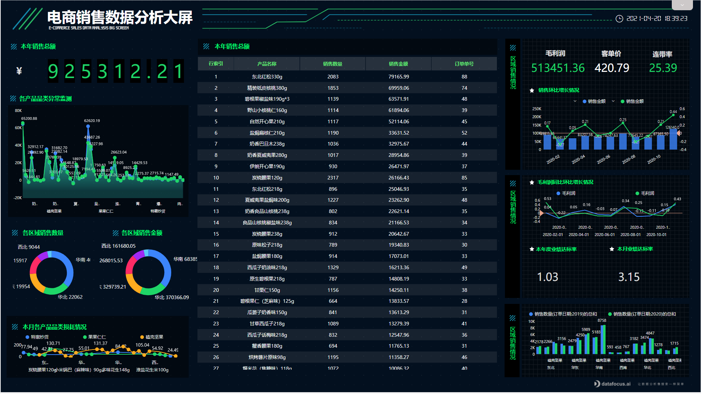
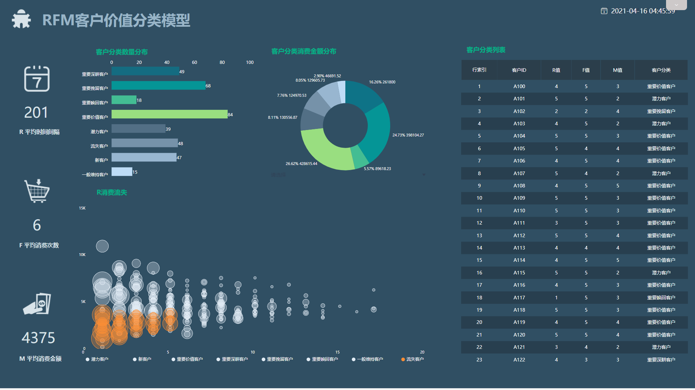
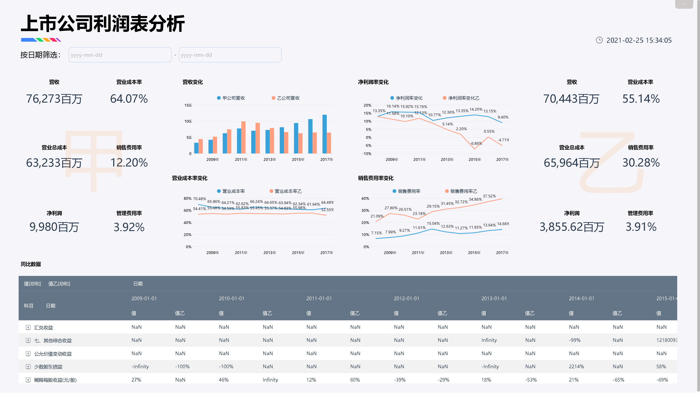

讲了这么多关于DataFocus可视化大屏的特点，包括自定义组件、全局样式、数据表达形式等等，怎么能不介绍一下最基础的历史问答的图表配置。因此本文想要和大家分享的是，在DataFocus的数据看板中，可以对历史问答进行哪些操作。

1、删除

将鼠标移至某个历史问答上，该历史问答右上角就会出现三个小角标，点击第一个角标“删除”，就可以将这个历史问答在该看板中删去。

2、配置

将鼠标移至第二个角标，显示的是配置，点击“配置”，就会在页面左侧弹出一个“组件样式”的对话框，在这里，可以单独修改该历史问答的组件样式，包括组件背景、标题栏背景、组件文字的颜色、标题文字以及是否隐藏标题、副标题和提示。

从下图可以看出“每周销售利润总览01”表的组件文字和标题文字的颜色有了变化，组件背景也透明了。

3、编辑

点击第三个角标，选择“编辑”。页面会从该数据看板跳转到搜索界面，并且打开该历史问答，可供大家进行编辑操作，记得操作完毕一定要点保存，变动才会同步到看板上。

4、分享

点击第三个角标，选择“分享”，可以在弹出的“分享”对话框中，添加用户或者组，代表将该历史问答分享给了该用户或该组。

5、数据明细

点击第三个角标，选择“数据明细”，会弹出制作该历史问答所用到的列及其数据。

6、链接调用

点击第三个角标，选择“连接调用”，在弹出的对话框中可以配置是否勾选显示标题、允许过滤数据、允许向下钻取、允许切换图形和允许表格视图，以及可以在最下方复制该历史问答的链接。

7、大小调整

点击第三个角标，在最下方有三个矩形方块，这三个矩形方块只在网格布局下出现

分别代表该历史问答的大小，选择不同的方块，该历史问答就会对应出现不同的大小，如下图所示：

看了这篇文章，相信你对DataFocus可视化大屏中的历史问答的配置应该已经有了一定的了解。是不是感觉有点跃跃欲试了，还不行动起来去DataFocus官网免费申请一个，试着学习一下吧。

# DataFocus的可视化大屏配置

讲了这么多关于DataFocus可视化大屏的特点，包括自定义组件、全局样式、数据表达形式等等，怎么能不介绍一下最基础的历史问答的图表配置。因此本文想要和大家分享的是，在DataFocus的数据看板中，可以对历史问答进行哪些操作。

1、删除

将鼠标移至某个历史问答上，该历史问答右上角就会出现三个小角标，点击第一个角标“删除”，就可以将这个历史问答在该看板中删去。

2、配置

将鼠标移至第二个角标，显示的是配置，点击“配置”，就会在页面左侧弹出一个“组件样式”的对话框，在这里，可以单独修改该历史问答的组件样式，包括组件背景、标题栏背景、组件文字的颜色、标题文字以及是否隐藏标题、副标题和提示。

从下图可以看出“每周销售利润总览01”表的组件文字和标题文字的颜色有了变化，组件背景也透明了。

3、编辑

点击第三个角标，选择“编辑”。页面会从该数据看板跳转到搜索界面，并且打开该历史问答，可供大家进行编辑操作，记得操作完毕一定要点保存，变动才会同步到看板上。

4、分享

点击第三个角标，选择“分享”，可以在弹出的“分享”对话框中，添加用户或者组，代表将该历史问答分享给了该用户或该组。

5、数据明细

点击第三个角标，选择“数据明细”，会弹出制作该历史问答所用到的列及其数据。

6、链接调用

点击第三个角标，选择“连接调用”，在弹出的对话框中可以配置是否勾选显示标题、允许过滤数据、允许向下钻取、允许切换图形和允许表格视图，以及可以在最下方复制该历史问答的链接。

7、大小调整

点击第三个角标，在最下方有三个矩形方块，这三个矩形方块只在网格布局下出现

分别代表该历史问答的大小，选择不同的方块，该历史问答就会对应出现不同的大小，如下图所示：

看了这篇文章，相信你对DataFocus可视化大屏中的历史问答的配置应该已经有了一定的了解。是不是感觉有点跃跃欲试了，还不行动起来去DataFocus官网免费申请一个，试着学习一下吧。
