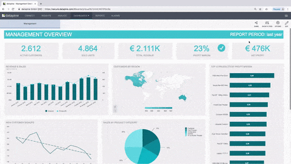
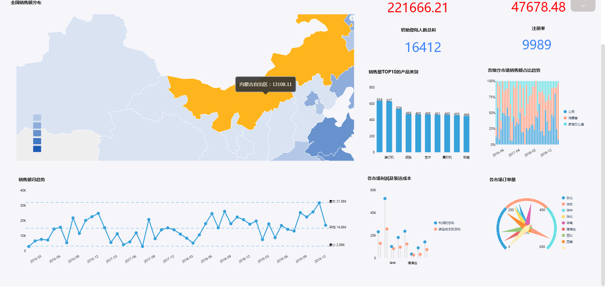
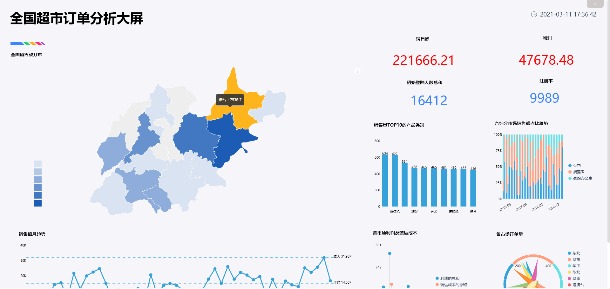

**目的：**对咸阳市的经济情况进行分析，对比陕西省的发展速度，并提出针对性的意见。

**摘要：**随着现代社会的大数据的普及，越来越多的行业会接触并利用到数据，大数据成为推动经济转型发展的新动力和重塑国家竞争优势的新机遇。通过此次案例可知，咸阳市2015、2016年的累计增长率比陕西省的累计增长率略高，但2017年陕西省的累计增长率有明显的上升率；咸阳市和陕西省的规模以上工业增加值分月同比增长速度正在不断拉近，差距在不断缩小；咸阳市的固定资产投资的分月同比增长速度有下降的趋势，陕西省则有上升的趋势；咸阳市的限额以上企业（单位）消费品零售额分月同比增长速度仍领先于陕西省，但陕西省的增长速度有明显的上升趋势，咸阳市应努力保持领先的优势。

**关键词：**咸阳市,累计增长率,同比增长速度

一、案例背景

此次报告聚焦于咸阳市2015年第一季度值2017年第三季度的地区生产总值数据，以及2015年9月至2017年9月规模以上工业增加值、固定资产投资、限额以上企业（单位）消费品零售额的月度数据，希望能帮助业界较全面的了解地方政府大数据发展政策，以协助推动我国大数据产业健康快速发展。

二、案例问题

对政府经济情况进行分析，可以迅速找出导致经济变化的原因并及时调整方案，因此对政府数据进行分析监测显得极为重要。但政府数据表格繁多，内容冗杂，数据随时间变化频繁，用EXCEL来进行操作会略显麻烦，使用Datafocus产品就可以快速处理大量数据，还可以建立表格之间的关联关系，同时分析几张表格，分析的准确性也高。

三、案例分析

1.地区生产总值

图 1地区生产总值季度累计增长率

首先统计咸阳市和陕西省的地区生产总值并进行对比，图中的纵坐标代表的是地区生产总值的季度累计增长率，横坐标代表的是季度。例如，折线图中的8.609即代表截止到2015年第二季度为止，咸阳市地区生产的累计增长率为8.609%。

从图中可以看出咸阳市2015年的地区生产总值的累计增长率较高，至2016年第一季度，增长率达到顶峰，但后面三季度的累计增长率不太理想，增长率出现明显的下降，至2017年才略有回升。同样的，陕西省的地区生产总值也有类似的趋势，但陕西省季度累计增长率较咸阳市略低。

 图 2 咸阳市与国内GDP的季度累计增长率

同样的，把咸阳市的地区生产总值的累计增长率与国内GDP的累计增长率进行对比，从图中可以看出咸阳市的经济增长率与国内GDP的增长率仍存在一定的差距，且咸阳市的地区生产总值的累计增长率较平稳，国内GDP的增长率则有不断上升的趋势。

2.规模以上工业增加值

图 3 规模以上工业增加值分月同比增长速度

上图具体对比咸阳市和陕西省的规模以上工业增加值分月同比增长速度。从图中可以看出咸阳市和陕西省的规模以上工业增加值分月同比增长速度基本处于一个较稳定的状态，但2017年2月的增长速度却出现了较大的异常。不管是咸阳市还是陕西省，其同比增长速度都大大降低，即虽然仍有上升，但上升幅度下降，特别是咸阳市，因2017年2月正值春节，故很大因素是受春节影响。

3.固定资产投资

图 4 固定资产投资分月同比增长速度

上图对比咸阳市和陕西省的固定资产投资分月同比增长速度。从图中可以看出咸阳市的固定资产投资分月同比增长速度在2017年2月有了明显的下降，其余时间基本稳定且整体高于陕西省的固定资产投资分月同比增长速度。

4.限额以上企业（单位）消费品零售额

图 5 限额以上企业（单位）消费品零售额分月同比增长速度

上图对比咸阳市和陕西省的限额以上企业（单位）消费品零售额分月同比增长速度。从图中可以看出咸阳市的限额以上企业（单位）消费品零售额分月同比增长速度整体高于陕西省的限额以上企业（单位）消费品零售额分月同比增长速度。陕西省的增长速度有明显的上升趋势，而咸阳市的则较平稳，但前者与后者相比还是具有一定的差距。

5.数据看板

为了便于观察，将所有的历史问答放入数据看板中。

图 6 数据看板

四、结论

综上所述，咸阳市2015年，2016年的累计增长率比陕西省的累计增长率略高，但2017年陕西省的累计增长率有明显的上升，已接近咸阳市的累计增长率。

咸阳市的经济增长率与国内GDP的增长率也存在较大的差距。

接下来具体对比咸阳市和陕西省的规模以上工业增加值分月同比增长速度，可以发现咸阳市和陕西省的规模以上工业增加值分月同比增长速度正在不断拉近，差距在不断缩小。

对比咸阳市和陕西省的固定资产投资分月同比增长速度，可以发现咸阳市的固定资产投资的分月同比增长速度有下降的趋势，陕西省则有上升的趋势。

最后对比咸阳市和陕西省的限额以上企业（单位）消费品零售额分月同比增长速度，可以观察到咸阳市的限额以上企业（单位）消费品零售额分月同比增长速度仍领先于陕西省，但陕西省的增长速度有明显的上升趋势，咸阳市应努力保持领先的优势。

五、对策建议

1、深化咸阳市政府体制改革。通过精简政府机构、提高政府运作效率，减少政府对经济活动的干预，完善司法体系，鼓励市场中介组织发育等一整套措施来提高本地市场经济运行的法制化程度，降低经济活动的交易成本。

2、适当调整公共政策，为持续保持本地区对外部经济资源的吸引力，咸阳市政府应更加注重提高本地公共物品供给的水平和质量。

3、咸阳市政府在限额以上企业（单位）消费品零售额这一部分上，仍要继续保持领先的优势，在保持不下降的情况下争取不断上升。
