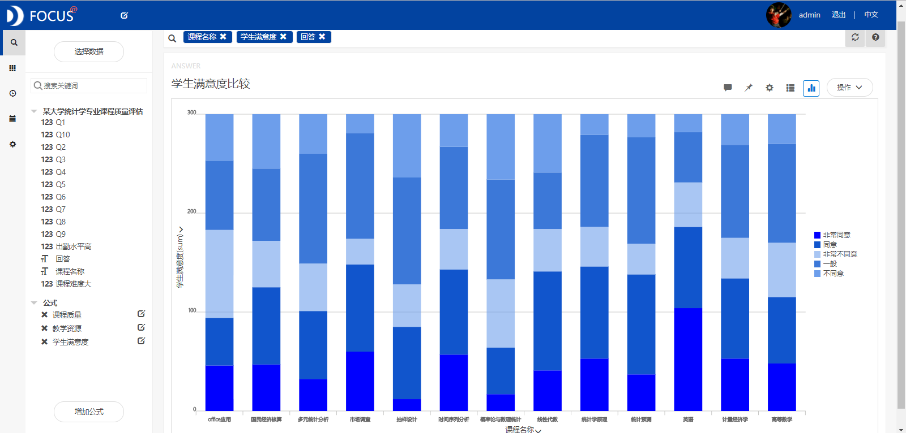
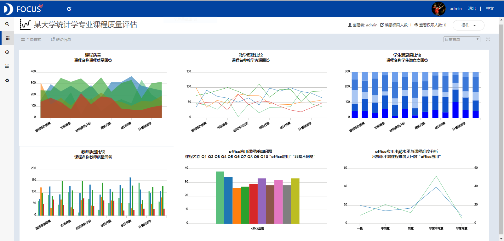

目的：基于国内某大学统计学专业100个学生的问卷调查数据，来评估该校统计学专业13门课程的质量。

摘要 ：课程质量评估是各个学校教学工作的基本建设，是实现培养目标、提高人才质量的重要环节。本文对某大学统计学专业的13门课程的质量进行了研究。得出的结论主要有：office应用的课程质量最差，是该专业的弱势学科。Office应用课程回答为"非常不满意"的学生人数超过30的问题有Q1、Q2、Q6、Q8和Q10。从学生满意度方面看，该课程对学生的专业发展没有什么帮助。从教师质量来看，教师没有给学生提供相关的家庭作业，也没有帮助或指导学生。

关键词：Datafocus；课程质量评估

一、案例背景

课程建设是各个学校教学工作的基本建设，是实现培养目标、提高人才质量的重要环节。为了促使学校各个专业课程建设以及评估验收工作规范化、制度化和科学化，提高教学质量，需要对不同专业的所有课程进行质量评估。

二、案例问题

本次课程评估的对象为某大学统计学专业开设的必修课程（共13门）。课程评估的结论应为优秀、良好、一般、不合格或很差。设计的问卷包含课程难度、出勤水平以及10个与课程质量相关的问题。10个问题的具体内容如表1所示：

表1 某大学统计学专业课程质量评估体系

<table style="border-collapse: collapse;" border="0"><colgroup><col style="width: 109px;"> <col style="width: 436px;"></colgroup><tbody valign="top"><tr><td style="padding-left: 7px; padding-right: 7px; border: solid 0.5pt;" valign="middle">评价项目</td><td style="padding-left: 7px; padding-right: 7px; border-top: solid 0.5pt; border-left: none; border-bottom: solid 0.5pt; border-right: solid 0.5pt;" valign="middle">评价标准</td></tr><tr><td style="padding-left: 7px; padding-right: 7px; border-top: none; border-left: solid 0.5pt; border-bottom: solid 0.5pt; border-right: solid 0.5pt;" rowspan="3" valign="middle">教学资源</td><td style="padding-left: 7px; padding-right: 7px; border-top: none; border-left: none; border-bottom: solid 0.5pt; border-right: solid 0.5pt;">Q1：开始时提供了学期课程内容，教学方法和评估系统。</td></tr><tr><td style="padding-left: 7px; padding-right: 7px; border-top: none; border-left: solid 0.5pt; border-bottom: solid 0.5pt; border-right: solid 0.5pt;">Q2：课程目标在课程开始时已清楚陈述。</td></tr><tr><td style="padding-left: 7px; padding-right: 7px; border-top: none; border-left: solid 0.5pt; border-bottom: solid 0.5pt; border-right: solid 0.5pt;">Q3：课程值得分配给它的学分。</td></tr><tr><td style="padding-left: 7px; padding-right: 7px; border-top: none; border-left: solid 0.5pt; border-bottom: solid 0.5pt; border-right: solid 0.5pt;" rowspan="3" valign="middle">学生满意度</td><td style="padding-left: 7px; padding-right: 7px; border-top: none; border-left: none; border-bottom: solid 0.5pt; border-right: solid 0.5pt;">Q4：我非常喜欢课堂，并渴望在课堂上积极参与。&nbsp;</td></tr><tr><td style="padding-left: 7px; padding-right: 7px; border-top: none; border-left: solid 0.5pt; border-bottom: solid 0.5pt; border-right: solid 0.5pt;">Q5：我对该课程的最初期望在期末或年度结束时得到满足。</td></tr><tr><td style="padding-left: 7px; padding-right: 7px; border-top: none; border-left: solid 0.5pt; border-bottom: solid 0.5pt; border-right: solid 0.5pt;">Q6：课程对我的专业发展有帮助和有益的。&nbsp;</td></tr><tr><td style="padding-left: 7px; padding-right: 7px; border-top: none; border-left: solid 0.5pt; border-bottom: solid 0.5pt; border-right: solid 0.5pt;" rowspan="4" valign="middle">教师质量</td><td style="padding-left: 7px; padding-right: 7px; border-top: none; border-left: none; border-bottom: solid 0.5pt; border-right: solid 0.5pt;">Q7：教师的知识是相关的并且是最新的。</td></tr><tr><td style="padding-left: 7px; padding-right: 7px; border-top: none; border-left: solid 0.5pt; border-bottom: solid 0.5pt; border-right: solid 0.5pt;">Q8：教师致力于课程并且可以理解。</td></tr><tr><td style="padding-left: 7px; padding-right: 7px; border-top: none; border-left: solid 0.5pt; border-bottom: solid 0.5pt; border-right: solid 0.5pt;">Q9：教师讲解课程，并渴望对学生有所帮助。</td></tr><tr><td style="padding-left: 7px; padding-right: 7px; border-top: none; border-left: solid 0.5pt; border-bottom: solid 0.5pt; border-right: solid 0.5pt;">Q10：教师提供了相关的家庭作业/项目，并帮助/指导学生。</td></tr></tbody></table>

三、案例分析

将分析的"某大学统计学专业课程质量评估"CSV文件导入到Focus系统中。

（一）课程质量分析

对13门课程的课程质量进行评估，统计每门课程在Q1-Q10上的不同回答的学生总数，绘制面积图（见图1），从图中发现英语的回答为"非常同意"的人数最多，该课程的评估结果应为优秀。国民经济核算、时间序列分析等的回答为"满意"的人数最多，评估结果应为良好。多元统计分析、市场调查等课程的回答为"一般"的人数最多，评估结果为一般。office应用的回答为"非常不满意"的人数最多，该课程的评估结果为很差。

图1 不同课程的质量分析

分别从教学资源、学生满意度和教师质量三个方面对该专业的各门课程质量进行研究。

1.教学资源

统计各门课程在反映教学资源的几个问题(Q1、Q2和Q3)上不同回答的学生人数，绘制成折线图，如图2所示。从图2中可以看出office应用这门课程回答为"非常不同意"的人数最多，说明该课程的教学资源很差。  图2 不同课程的教学资源比较

2.学生满意度

统计反映学生满意度的问题（Q4、Q5和Q6）不同回答的学生人数，绘制出堆积柱状图（见图3）。从该图中，我们可以看到，office应用回答为"非常不满意"的人数最多，说明该课程的学生满意度也很低。英语回答为"满意"的人数最多，该课程的学生满意度很高。 

图3 不同课程的学生满意度比较

3.教师质量

统计包含教师质量信息的问题（Q7-Q10）不同回答的学生总数（见图4），从该条形图中可以看出office应用回答为"非常不满意"的人数最多，说明该课程的教师质量很差。英语回答为"非常同意"的人数最多，该课程的教师很优秀。

图4 不同课程的教师质量比较

综合来看，office应用这门课程在教师质量、教学资源和学生满意度这三个方面都是最差的，可以认为office应用的课程质量很差，是该专业的弱势学科。

（二）office应用课程质量分析

1.Q1-Q10具体分析

将Q1-Q10的不同回答的学生人数进行汇总，研究office应用的课程质量问题。从图5中我们可以发现，Office应用课程回答为"非常不满意"的学生人数超过30的问题有Q1、Q2、Q6、Q8和Q10。 

图5 office应用课程质量问题

Q1、Q2、Q6、Q8和Q10的具体内容如表2所示。从该表中了解到office应用这门课程在提供学期课程内容、教学方法和评估系统以及课程目标的陈述方面是很差的。从学生满意度方面看，该课程对学生的专业发展没有什么帮助。从教师质量方面看，教师没有给学生提供相关的家庭作业或者其他项目，也没有帮助或指导学生。这说明该课程的教学内容较浅，使得学生没能掌握实用的操作技能，该课程也没有体现出office软件的真正应用价值。

表2 office应用回答为"非常不满意"人数大于30的问题汇总

<table style="border-collapse: collapse;" border="0"><colgroup><col style="width: 118px;"> <col style="width: 450px;"></colgroup><tbody valign="top"><tr><td style="padding-left: 7px; padding-right: 7px; border: solid 0.5pt;" valign="middle">评价项目</td><td style="padding-left: 7px; padding-right: 7px; border-top: solid 0.5pt; border-left: none; border-bottom: solid 0.5pt; border-right: solid 0.5pt;" valign="middle">评价标准</td></tr><tr><td style="padding-left: 7px; padding-right: 7px; border-top: none; border-left: solid 0.5pt; border-bottom: solid 0.5pt; border-right: solid 0.5pt;" rowspan="2" valign="middle">教学资源</td><td style="padding-left: 7px; padding-right: 7px; border-top: none; border-left: none; border-bottom: solid 0.5pt; border-right: solid 0.5pt;">Q1：开始时提供了学期课程内容，教学方法和评估系统。</td></tr><tr><td style="padding-left: 7px; padding-right: 7px; border-top: none; border-left: solid 0.5pt; border-bottom: solid 0.5pt; border-right: solid 0.5pt;">Q2：课程目标在课程开始时已清楚陈述。</td></tr><tr><td style="padding-left: 7px; padding-right: 7px; border-top: none; border-left: solid 0.5pt; border-bottom: solid 0.5pt; border-right: solid 0.5pt;" valign="middle">学生满意度</td><td style="padding-left: 7px; padding-right: 7px; border-top: none; border-left: none; border-bottom: solid 0.5pt; border-right: solid 0.5pt;">Q6：课程对我的专业发展有帮助和有益的。&nbsp;</td></tr><tr><td style="padding-left: 7px; padding-right: 7px; border-top: none; border-left: solid 0.5pt; border-bottom: solid 0.5pt; border-right: solid 0.5pt;" rowspan="2" valign="middle">教师质量</td><td style="padding-left: 7px; padding-right: 7px; border-top: none; border-left: none; border-bottom: solid 0.5pt; border-right: solid 0.5pt;">Q8：教师致力于课程并且可以理解。</td></tr><tr><td style="padding-left: 7px; padding-right: 7px; border-top: none; border-left: solid 0.5pt; border-bottom: solid 0.5pt; border-right: solid 0.5pt;">Q10：教师提供了相关的家庭作业/项目，并帮助/指导学生。</td></tr></tbody></table>

2.课程难度与出勤水平分析

从图6中可以看出，office应用这门课程的出勤水平高和课程难度大的回答为"非常不同意"的人数都是最多的，表明该课程的学生出勤水平很低以及课程难度很低。因此我们可以认为，如果一门课程的出勤水平很低并且课程难度很低的话，该课程的综合质量应该较差。

图6 课程难度与出勤水平分析

（二）数据看板

最后将这6个结果图导入"某大学统计学专业课程质量评估"数据看板中，操作结果如下：

图7 数据看板

四、结论

office应用这门课程的综合课程质量最差，并且该课程的教学资源、学生满意度和教师质量都是最差的。所以，office应用的课程质量很差，是该专业的弱势学科。该课程回答为"非常不满意"的学生人数超过30的问题有Q1、Q2、Q6、Q8和Q10。从这些问题中我们了解到office应用这门课程在提供学期课程内容、教学方法和评估系统以及课程目标的陈述方面是很差的。这说明该课程的教学内容较浅，使得学生没能掌握实用的操作技能，该课程也没有体现出office软件的真正应用价值。

五、对策建议

该校在进行学科建设工作时，首先应努力提高office应用的课程质量。可以通过增加学期课程内容和课程难度、完善教学方法等来实现。在提高学生满意度方面，学校应该培养对学生的专业发展有帮助的课程。在提高教师质量方面，可以通过给学生布置相关的家庭作业等来帮助和指导学生。其次，要将质量较高的课程作为专业特色课，着重培养使其成为该专业的优势学科。
