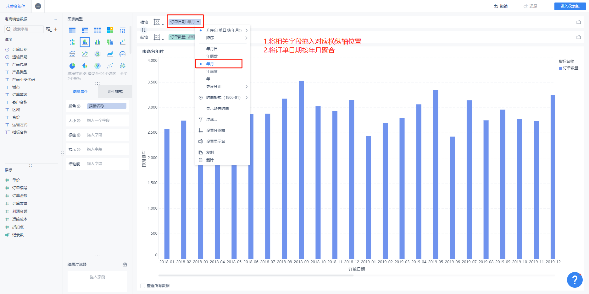
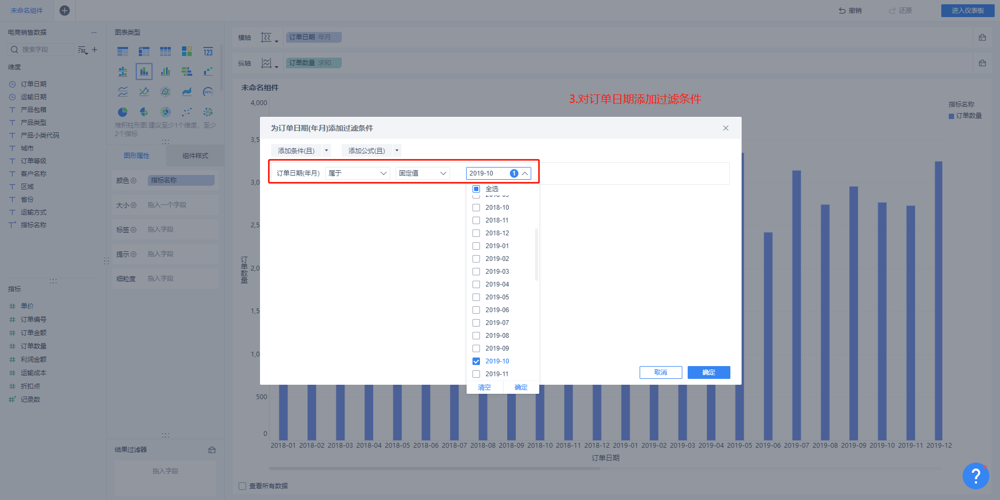
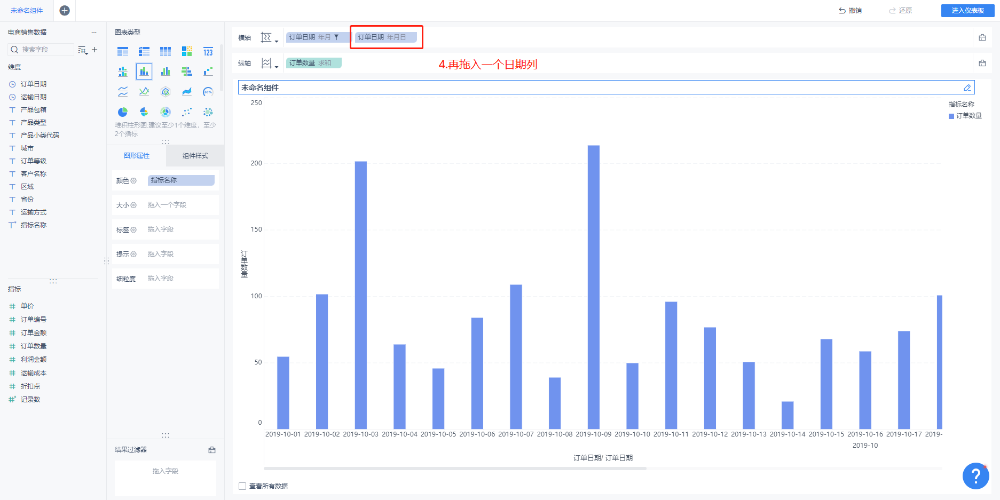
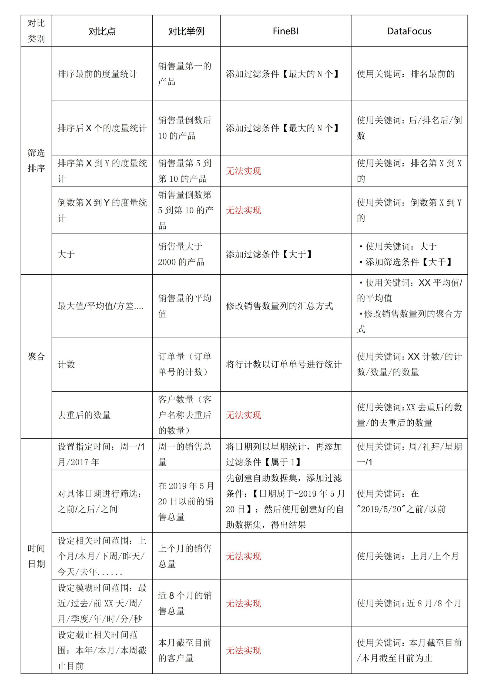
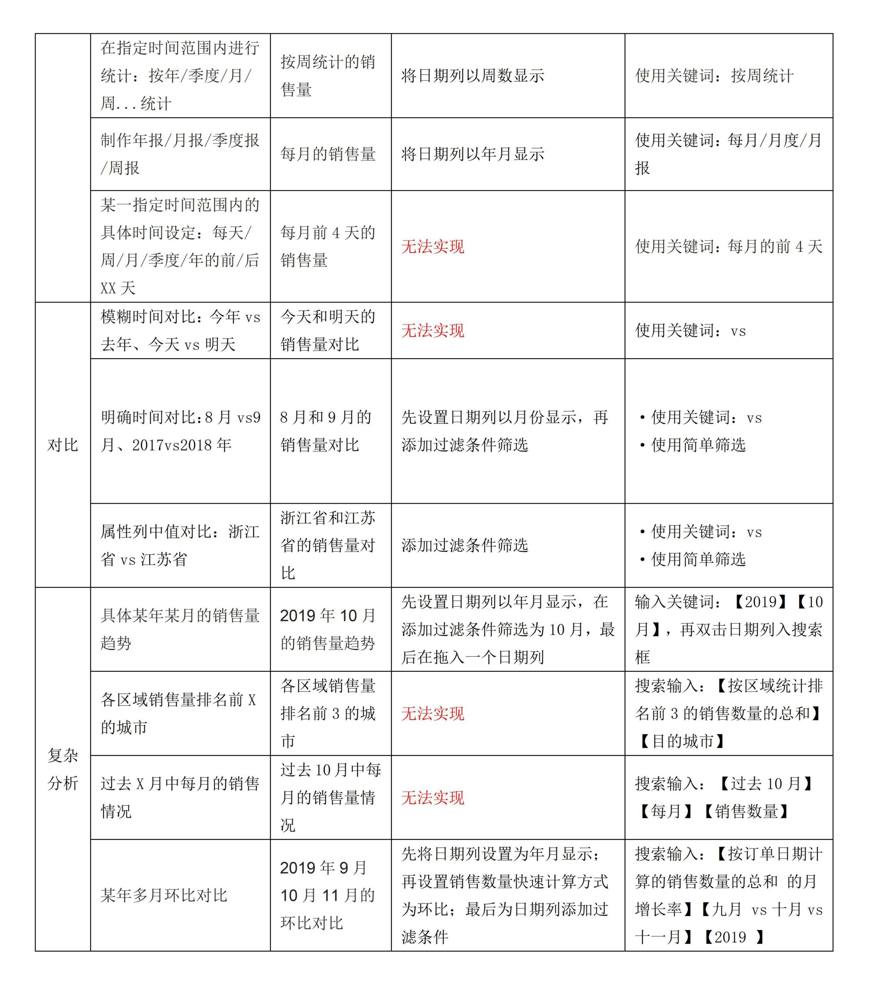
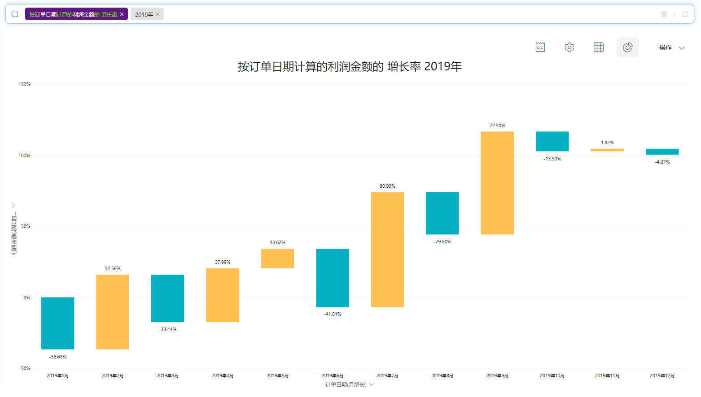
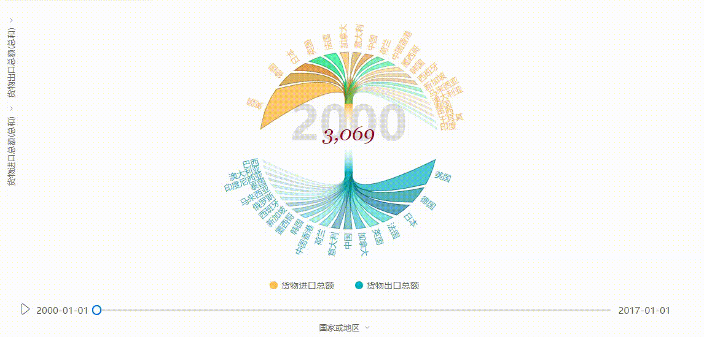
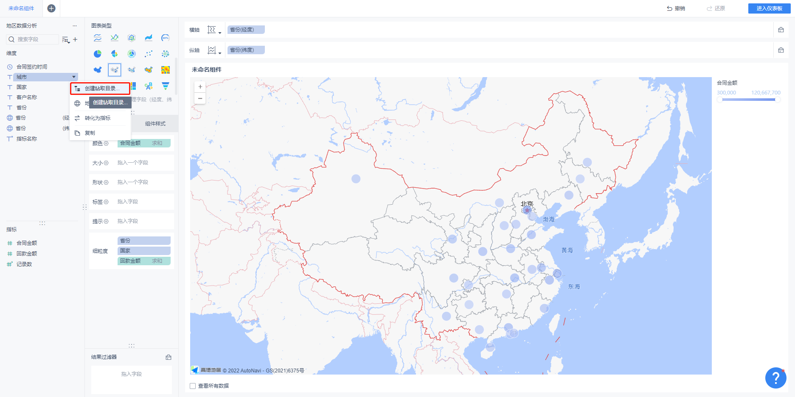
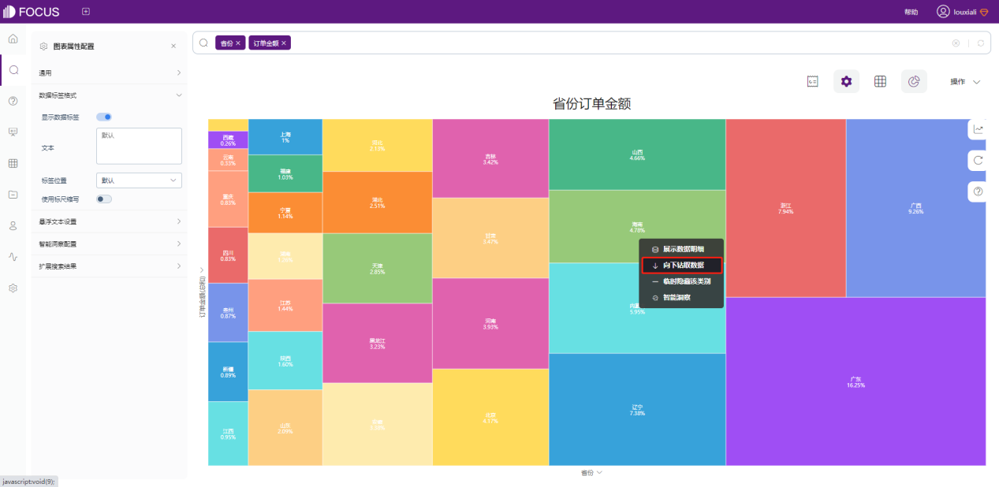

## **一、产品简介**

FineBI 是帆软软件有限公司推出的一款商业智能（Business Intelligence）产品。FineBI 是定位于自助大数据分析的BI工具，能够帮助企业的业务人员和数据分析师，开展以问题导向的探索式分析。

DataFocus Cloud（以下简称DFC）是一个基于搜索式分析的Saas数据分析平台，提供一站式云数据分析服务。DFC旨在利用创新的问答式交互方式，帮助业务人员在没有技术背景的基础上也能完成高效、专业、快速的数据分析。

## **二、交互方式**

同样都是BI数据分析工具，差别在哪里呢？我们先从改变最大的交互方式来对比。

FineBI利用传统的拖拽式操作来创建图表和仪表板。从Tableau起，拖拽式就是数据分析工具的主流交互方式，然而拖拽式操作会花费大量时间，尤其是在创建复杂的可视化的情况下。

DFC应用简单易上手的搜索式操作，就像使用Google或百度搜索引擎一样。你可以随时根据思路输入内容，清空，再输入，直到发现你需要的分析结果。

这两个交互模式有不同的侧重点。拖拽专注于创建图形，因此用户会专注于实现可视化。而基于搜索的交互旨在进行数据分析，因此用户可以搜索和评估他们脑海中出现的任何内容。

在交互方式上做出的革新，从以下三个方面提高了数据分析效率。

### a.字段输入

搜索式分析带来最直观的变化是字段输入方式。FineBI的拖拽式操作是分别把字段拖入横轴和纵轴的位置。如果需要使用数据表中没有的字段，则需要先新增计算字段，再参与计算。

DFC可以直接在搜索框中输入字段和计算条件，系统会自动返回结果，之后可以更改图形类型。

DFC还支持直接在搜索框中输入公式参与计算，如原数据表中有单价和运输成本，输入“订单日期 单价-运输成本 每月 产品类型”就可以获取每种产品每月的利润情况了。

图2-1 搜索式输入

此外，DFC还支持关键词智能提示功能。

图2-2 关键词智能提示

### b.条件过滤

DataFocus的搜索框，还能简化繁琐的过滤条件设置。数据分析离不开对条件的定义，比如销售时间段的选择（年/年月/季度等），销售额标准的界定（大于/小于/不等于/前N个等），客户地域的过滤等，这样才能从多角度了解原始数据的情况。

在拖拽式操作中，每一次条件过滤都需要好几个步骤来设置，而在DataFocus中却只需要直接输入。

得益于强大的内置关键词库，DFC可以把需要筛选操作的步骤都直接转化成关键词输入，比如X月、X季度、周一、具体日期之前/之后等。

如计算2019年10月的销售量趋势，在DFC中只需要一步到位，而在FineBI中处理则需要4个步骤。

图2-3 DFC条件过滤一步到位

图2-4 FineBI条件过滤的多步操作

更有一些筛选条件在FineBI 的拖拽式操作下无法实现，但是在DataFocus中仍然只需要一步，比如销售量第5到第10的产品、本月截止目前的销售数量等。

图2-5 销售量第5到10个的产品

以下表格整理了一些常用的过滤条件以及两者的实现方式。可以看到，DFC的搜索框可以帮助用户轻松实现一些高级条件筛选。

### c.自适应的图表可视化

FineBI的图表可视化基于图形语法(The Grammar Of Graphics)设计，提供了30种可以直接使用的图表类型。还支持用户将字段绑定到图表的颜色、大小、形状、标签等属性上。

而DFC带来的是自适应的图表可视化。DFC 的可视化逻辑是让图形适配数据，而不是用数据适配图表。你只需要在搜索框中正确输入条件，系统系统呈现图表，不需要选择（支持自由更换）。

当然，为了得到更好的展示效果，DFC 支持的图表类型超过 50 种。除了柱状图、饼状图等常用图形外，还支持这些图表的变体，如火柴图、瀑布图、帕累托图、极坐标柱状图等。因此，您可以在系统内直接构建各种图形，而无需导入外部资源。DFC还提供了很多高级的图像，如平行坐标图、打包图、词云图、桑基图、关系网络图等。

图2.6 瀑布图 

图2.7 矩形树图

DFC还支持多种地图类型，包括3D地球散点图、轨迹图、位置经纬图、GIS位置图等。此外，用户还可以将自己的地图或地理数据导入到系统。

图2.8 地图可视化

除了静态图表，DFC还支持动态图表，如动态条形图、时间序列散点图、3D地球飞线图等。

图2.9 动态花瓣图（要改成GIf）

或许有很多用户已经习惯了先选择图表，再拖拽字段的操作方式。但仔细想想看，这个是不符合我们的思维逻辑的。你想在大量的数据中发现有效的规律，首先必须基于数据和条件去做分析，而图表只是你分析思路的呈现手段而已。在没有思路的前提下，你怎么能够选中合适的图表呢？传统的操作方式只适合做固定维度、固定思路的分析，比如周报、月报、年报，而要想真正从数据中发现问题，思路应该是灵活多变的，只有搜索式操作才能匹配这样的思维方式。

## **三、OLAP计算分析**

OLAP多维分析是以多维的形式组织数据，并采用切片、切块、钻取、旋转等多种分析方式探查数据，使分析人员或者管理人员能够从多方面、多角度去查询数据，从而得到有价值的信息。所以针对多维数据模型包含的操作有：下钻、上卷、切片、切块、旋转。

从OLAP多维能力角度来看，两个工具都支持用户进行钻取、联动、切片、切块等分析操作。

在FineBI中，钻取需要先创建钻取目录，然后进行字段配置，不是非常智能，且操作较为繁琐。

图2.10 FineBI创建钻取目录

DFC中钻取不需要另外配置，系统自动识别有包含关系的字段，非常智能。只需直接在图表上点击右键，即可进行向下钻取或者向上钻取。

 图2.11 DFC直接实现钻取

## **四、数据大屏**

FineBI遵循数据加工——图表制作——大屏制作的流程，图表创建后只能添加到仪表板中，不能单独保存或导出。如果需要临时制作某张图表，也需要创建可视化大屏，操作繁琐且浪费时间。

而DFC的图表（历史问答）和数据大屏相互独立，制作好的图表可以用来组合成大屏，也可以单独操作，实现保存、保存为中间表、以Csv或图片格式导出，方便复用或单独分析。

图2.12 DFC历史问答操作项

还支持将制作好的图表添加到数据简报中实时发送给邮箱用户进行查看，操作灵活，时效性高。

图2.13 DFC加入数据简报

另外大屏和图表都可以通过创建外部链接的方式进行访问，访问用户不需要注册与登录。通过这个功能，可以让非系统内的用户临时查看，适用于项目对接、方案介绍、工作汇报等场景。

图2.14 创建外部访问链接

DFC还提供高度自由化的大屏布局，存在两种布局模式：网格布局，可以使用网格来帮助定位问答（图表）；自由布局，可以自由放置问答，可自由设置看板和组件背景，可自由添加文本组件和图片组件，可自定义标题、和组件文本内容的颜色和大小字体，可以删除复制图表，也可以添加小图标、时间器等装饰素材。

图2.15 DFC可视化大屏编辑页面

## 五、嵌入分析

FineBI适用于传统的数据仓企业向更有效的数据驱动转型，业务能力很强，展示能力较强，还可以整合公司的报表管理门户，辅助决策。

DFC适用于各种需要数据驱动的企业，产品界面非常简洁，功能点齐全，用户可以在DFC中实现一站式分析。全程没有复杂的操作也没有复杂的配置。

而且DFC还有和第三方平台高度集成的案例，对于有类似需求的企业，可以快速集成融入公司业务系统。

## 六、安全性能

FineBI的安全管理措施主要有以下几个方面：

- 安全防护：包括 Cookie 增强、文件上传校验、Security Headers。
- 访问控制： 分为访问频率限制和当前拦截名单两部分。其中访问频率限制开启后可设置具体限制频率，对仪表板的访问请求进行频率限制，超出限制频率则拉入拦截名单。

- SQL 防注入：SQL 防注入通过禁用特殊关键字与转义字符两种方式来防止恶意的参数输入。

而为了保证企业数据应用的安全，DataFocus着重在安全性上发力，经过过去1年多多轮严格测试，从安全防护、隐私防护、租户隔离等方面做了多层提升，除了与 FineBI 类似的基本 Web 安全措施外，还在以下几个方面得到加强：

- 安全防护：使用更严格的安全协议和加密套件、64位 CSRF\_TOKEN 认证、证书私钥密码均密文存储、微服务间使用安全连接通讯
- 隐私防护：接口信息、服务器日志不显示或密文显示用户敏感信息，防止个人信息泄露
- 租户隔离：严格校验用户权限信息，防止跨前端越权操作
- 攻击预防：对用户输入规则严格校验，防止注入型和存储型 XSS攻击，防止Redos攻击；上传文件和导出文件校验，防止恶意文件、DDE 脚本注入；API接口防暴力破解 AKSK 机制；优化策略防止 Dos 攻击

**七、结论**

总体来看，FineBI仍然是一款传统的拖拽式数据分析BI工具，主要目的是制作可视化大屏。尽管做得细致，但无法改变拖拽式固有的繁琐操作。

DFC革新了交互方式， 适用于各种需要数据驱动的企业，产品界面非常简洁，核心功能点齐全，使得数据分析变得像搜索一样简单，普通的业务人员也可以非常流畅地实现整个搜索式分析的过程。

 

如果您准备提升自己的数据分析效率，创造出实时更新的可视化大屏。或者帮助你的企业选购一款高性能、高性价比、低学习成本的一站式数据分析工具，那么可以试用我们的[30天免费试用版](https://www.datafocus.ai/)，并从今天开始从高质量的数据可视化中受益！

