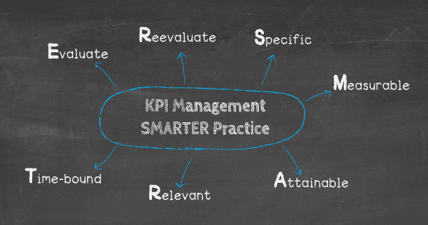
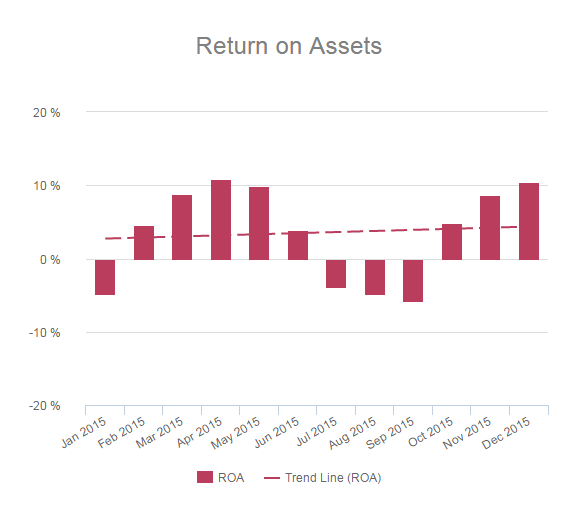

_“如果你唯一的工具是锤子，那么每个问题看起来都像钉子。” - 亚伯拉罕·马斯洛_

**事实：** 100%置于博客文章顶部的统计数据都是人们研究关键绩效指标或 KPI 动态的直接结果。

**一个更有趣的事实：**我们经常阅读的博客不仅受到 KPI 管理的影响，而且在内容、风格和流程方面，它们通常受到这些目标驱动指标的影响。

引人注目的标题、相关影响因素内容的反向链接、编号或项目符号列表的合理放置——视觉效果是成功数字内容的关键驱动因素。但这些策略和元素并不是凭空捏造的，也不是硅谷高级委员会所歌颂的；它们是由我们、读者创造的。我们的客户需求通过[KPI 示例](https://www.datafocus.ai/infos/kpi-examples-and-templates)传达给企业，决定了品牌或企业如何制作和开发他们发布的内容。

我们将解释 KPI 管理的基础知识，它们如何在实际业务环境中使用，以及可以在各个行业中实施的特定 KPI。但首先，让我们从一个简单的定义开始。

## 什么是KPI管理？

KPI 管理是一个术语，用于描述设置、执行、监控和分析特定行业关键绩效指标（或 KPI）的过程，它帮助公司和组织衡量实现其业务目标的成功程度。

衡量绩效指标的基本原理与公认的科学评估方法并没有太大的不同：_提出问题，设定目标，找到实现该目标的可量化方法，测试这些方法，然后测试一致性。_

现在，将这种方法应用于企业如何与客户互动，这就是 KPI 管理的全部内容。

A 公司问自己，吸引客户的最佳资源是什么。然后，A 公司制作广告、发布博客、提升其社交媒体影响力并优化其网站以提高搜索引擎排名。这一努力取得了成功，更多的客户开始涌入。

_接下来会发生什么？_A 公司如何衡量每个人的努力是否成功，以便能够区分优势和劣势？

答案是：通过基于专业[KPI软件](https://www.datafocus.ai/infos/kpi-dashboard-software)的KPI管理系统。如果没有绩效指标，大部分 B2B 博客仍可能主要基于经典的故事讲述来吸引更多读者，同时落后于它们的直接竞争对手。

那么，为什么对一些高管来说，看似入门级的东西往往如此难以理解呢?因为在实践中，处理绩效指标比单独进行无害的实验要复杂得多，成本也高得多。所有企业都有支出限制；与 KPI 管理对增长至关重要一样，不正确的追求或不准确的行动可能会导致收入大量流失。

在这里，我们将讨论 KPI 最佳实践以及如何为您的业务找到和利用最有效的 KPI。

但首先，我们将根据 Bernard Marr 先生的研究来解决一个非常重要的 KPI 相关问题。

## 为什么 KPI 很重要？

为了回答这个最关键的问题，这里有一位著名作家和行业专家的一点帮助：

Bernard Marr是几本书的作者，包括_《傻瓜的_关键绩效指标》和_《关键绩效指标：每个经理都需要知道的 75 +指标》_。Marr认为有效的kpi管理是对这种必要性的答案:

Marr 解释说：“比以往任何时候都更重要的是，企业领导者和高级管理人员能够做出更明智的决策，提高绩效，并寻找新的、与众不同的方法来获得竞争优势。”

在这一点上，值得注意的是，有无数的企业在实践中甚至没有考虑绩效指标就取得了成功。对于没有扩建计划的企业来说，这没关系。但对于那些想要发展业务并有效跟踪进度的人来说，KPI 是首选的衡量单位。

关键绩效指标使企业能够衡量自己设定和实现目标的能力。它们通常用于衡量客户满意度、员工绩效，以及公司特定目标受众的总体参与度，并通过 KPI 管理工具进行处理。例如，[客户满意度指标](https://www.datafocus.ai/infos/customer-satisfaction-metrics-effort-score-nps-csat)用于推动更好的客户体验。从本质上讲，kpi通过分离出具有复杂性的指示动作，将数字转换为行为反应。这些指标提供了企业能够获得的最宝贵的信息，提供了一个能够进行有针对性努力并行之有效的洞察窗口。

再强调一次，如果处理不当，获取此信息的努力可能会造成损害。对 KPI 的无效管理意味着很少有可操作的数据和糟糕的投资回报。反过来，这将导致诸如浪费注意力、难以捉摸的策略和收入损失等问题。深入和集体地思考管理 KPI 的最佳实践很重要，但也有通用的指导方针可以帮助引导企业朝着正确的方向前进。

## 什么是 KPI 最佳实践？

KPI 最佳实践包括：

1. 设置与您的业务目标一致的 KPI
2. 通过缩小列表来定义要跟踪的内容以避免数据过载
3. 确保关键绩效指标可实现
4. 使用SMARTER标准或 6 A

我们曾经问过一个问题：_什么是 KPI 管理？_我们还了解了为什么绩效指标如此重要。现在是时候为您的业务更详细地寻找完美的 KPI了。

许多行业已经使用 KPI 最佳实践和 KPI 管理解决方案来隔离他们最强的指标，例如在[零售分析](https://www.datafocus.ai/infos/retail-analytics)领域。这并不是说这些指标是零售企业的唯一选择，但它们确实是一个可靠的起点。“适合您的 KPI 或 KPI 管理解决方案可能不适合其他组织。KPI 应该与您的特定战略和目标相匹配，而不仅仅是您的行业，”ClearPoint Strategy 的 Ted Jackson 说。

在遵循行业标准或采用独特指标之间进行选择是每个经理都必须面对的最后通牒。对于那些想要尝试探索较少、不受欢迎的 KPI 的人来说，有两种标准的评估实践可以帮助企业确定这些特定的绩效指标是否有效：“SMARTER”标准和“6A”。

### 有效的 KPI 管理：SMARTER 实践

- **具体：**从一个可以孤立的具体目标开始。把它拆开——请记住，客户满意度、销售额、保留率等都可以用不同的 KPI 来衡量。
- **可衡量的：**找到一种确定的方法来衡量需要记录的数据。再一次强调，简化是关键。应该只有一种有效的衡量方法，这是KPI 管理的一个重要方面。
- **可实现的：**确保目标是可以轻松实现的。测试这一点的一种方法是确保企业之前完成过此目标。
- **相关：**询问这些目标是否与目标群体相关。实现这一目标会影响您尝试参与的群体吗？以何种方式？
- **有时限：**创建时间框架和截止日期，以准确地衡量 KPI。如果初步试验产生了预期的结果，则延长下一轮的时间范围。
- **评估：**查看 KPI 是否提供了实现既定目标所需的可操作数据。与团队进行头脑风暴，看看是否应该检查其他角度。
- **重新评估：**在定期实施前反复测试以确保一致性。有效的业务战略是围绕 KPI 构建的，因此请确保数据提供准确和具体的答案。

### KPI 最佳实践：6 A

- **一致（Aligned）：** KPI 与其特定目标的活动一致。只要业务正常进行，收集数据就应该毫不费力。
- **可达到的（Attainable）：**指标易于达到，因此可以测量。如果试验开始后数据没有开始定期流动，则可能有问题。
- **敏锐（Acute）：** KPI 使其他人充分或敏锐的了解目标及其衡量标准。如果 KPI 的目的完全不明确，这可能是要尝试不同指标的迹象。
- **准确（Accurate）：**从 KPI 中提取的数据将用于完成未来的目标；它必须可靠和准确，以免导致任何误解。
- **可操作（Actionable）：** KPI 结果产生影响行动计划的数据。KPI 应该推动新流程。如果没有后续行动，那么该指标就失去了价值。
- **活跃（Alive）：**数据可以在公司的整个生命周期中发挥作用。在不断发展的业务中，它应该成为一个常量。

营销可能都是关于投资回报率的，但这并不能否定正确连接点的必要性。为此，企业需要通过 KPI 最佳实践实现可操作的结果。

_“作为商业领袖，我们需要明白，缺乏数据不是问题所在。大多数企业都有足够的数据来建设性地使用；我们只是不知道如何使用它。现实情况是，大多数企业已经拥有丰富的数据，但缺乏洞察力。” ——伯纳德·马尔_

## 避免这些 KPI 错误

错误，尤其是在管理 KPI 时，不仅代价高昂；它们可能会对您的收入和资源造成破坏性影响。为帮助您避免此类错误，以下是供您参考的关键注意事项。

如前所述，选择 KPI 可能会变成一场代价高昂的打击，使营销部门陷入无意义数据的深渊。具有讽刺意味的是，许多注重成本的专业人士更喜欢看起来较直接的 KPI，例如财务目标。然而，把你的精力都集中在即时满足上可能是一个巨大的错误。

BSC Designer 的 Levi Newman在一项研究中解释说：

“许多管理者设定的目标是基于错误的绩效衡量标准，这意味着他们没有准确地描述主要目标。这就像说你的目标是飞镖而不是靶心。”

在设置 KPI 时，尽量关注未来的标准，而不是过去的表现。但是，请记住，您想要达到的这些未来标准必须是现实的；否则，您的努力只会导致绩效评估为“差”，沮丧的经理和心怀不满的员工会感到不那么投入，因此也没有动力。

最后，一旦你知道要衡量什么以及如何衡量它，你应该与整个组织的其他关键利益相关者就行动计划达成一致。定义谁做什么，并在此过程中设定里程碑，同时保持沟通透明和开放。很多时候，在制定了 KPI 驱动的战略后，没有明确的行动计划，这会导致误解和混淆了优先级，从而影响团队合作、氛围，并最终影响业务的增长。

## 如何选择合适的 KPI 管理解决方案？

正确的 KPI 管理软件解决方案将具有以下主要功能和优势：

1. 易于使用，组织内的每个人都可以访问。
2. 提供清晰、简洁的数据可视化，让您的数据能够讲述故事。
3. 让您可以在一个中心空间中访问成功所需的所有数据和见解 - 无需电子表格和复杂的文件。
4. 通过以简洁明了的方式组织数据，使您能够使用和自定义最有利于您的业务的 KPI。
5. 为您提供在线和移动设备中有效管理 KPI 的选项。
6. 提供一流的用户支持。
7. 帮助您在可持续的基础上达到并超越您的组织目标。
8. 为您提供 KPI 报告的系统方法。
9. 通过自动化流程减少收集和分析 KPI 数据所需的时间。
10. 使您能够集成 [自定义数据连接器](https://www.datafocus.ai/infos/data-connectors)，以便将所有业务信息集中在一个位置。

为了从 KPI 数据管理活动中获得最大价值，必须使用正确的[在线数据分析](https://www.datafocus.ai/infos/data-analysis-tools)工具来完成这项工作。

要跟踪、监控和从您的绩效指标中获得有价值的见解，选择正确的 KPI 管理软件将帮助您取得成功并在竞争中获得最重要的优势。

在管理 KPI 时，您使用的工具应该提供上述提到的所有这些关键属性。通过 KPI 数据管理软件，您可以轻松地对自己的绩效进行基准测试、衡量和跟踪，以可视化的方式进行洞察，使您能够做出快速、准确和明智的决定，从而帮助您推动业务向前发展。

有了强大的可定制 KPI 组合可供选择，就有了一个涵盖了管理和发展业务的每个关键方面的绩效指标，而不受行业或部门的影响。在 KPI 数据管理和持续保持 KPI 最佳实践方面，我们的软件和解决方案可以发挥作用。此外，随着获得根据您的特定目标和需求构建自己的[KPI 报告](https://www.datafocus.ai/infos/what-are-kpi-reports-examples)的能力，您将能够以可持续的方式塑造您的成功并提高您的绩效，即使在最具挑战性的环境中也能茁壮成长。

## 在实践中发现 KPI 管理解决方案

一个可靠的起点是查看您所在行业中使用的标准 KPI。正如我们解释现实生活中的示例一样，现在我们将重点关注可用作模板的特定 KPI。让我们从零售示例开始。

**1\. 零售：我的客户什么时候会花更多的钱？**

在这些业务中，某些标准[零售 KPI](https://www.datafocus.ai/infos/kpi-examples-and-templates-retail)包括：平均交易规模、销售总量、延期交货率、客户保留率、按地区订单状态划分的总销售额、完美订单率和退货原因等。这些指标中的每一个都与零售业务紧密结合。

要围绕 KPI 制定有效的策略，您必须明确地定义目标。您想创建一个对话还是吸引个人参与？您想向他们推销一次性产品，还是能使他们不断回购？您是通过销售数字还是更抽象的方式来衡量员工的产出？

这些都是值得问的问题，每一个问题都有一个匹配的 KPI。在上面的示例中，我们描述了平均交易规模(Average Transaction Size)，这是零售行业的一个重要 KPI，因为它可以评估您的客户何时更有可能花钱。我们的目标是随着时间的推移增加此 KPI，但将此指标与前面提到的其他指标结合起来会更有意义的，以使您的见解更加清晰。如果您想进一步完善您的报告技术，您可以查看我们针对公司不同职能的一些最佳实践——[管理报告](https://www.datafocus.ai/infos/management-reporting-best-practices-and-examples)、[销售报告](https://www.datafocus.ai/infos/sales-report-kpi-examples-for-daily-reports)或[营销报告](https://www.datafocus.ai/infos/daily-weekly-monthly-marketing-report-examples)——选择权在您手中。

**2\. 销售管理：我们如何看待我们的目标？**

我们可以说明的另一个示例来自管理业务收入，这是任何业务最重要的[销售 KPI](https://www.datafocus.ai/infos/kpi-examples-and-templates-sales) 之一。在计划和预测销售目标后，您需要检查自己的立场。目标是超越，但当然，如果绩效出现问题，评估您的策略是明智的。

**3、财务：我们如何处理公司的资产？**

这个例子来自金融行业。[财务分析](https://www.datafocus.ai/infos/finance-analytics)是每个财务部门、企业和员工的核心。为了产生适当的价值和提高绩效，有各种[财务 KPI](https://www.datafocus.ai/infos/kpi-examples-and-templates-finance)可以促进对大量数据的收集、监控和分析。我们的示例描述了资产回报率，该回报率需要尽可能高，因为可以显示公司资产的管理方式。

所有这些[业务分析示例](https://www.datafocus.ai/infos/analytics-and-business-intelligence-examples)都展示了正确的KPI管理如何通过使用正确的解决方案和软件带来积极的业务结果。

在 DataFine，我们努力利用技术创新，为管理者提供缩小目标所需的答案，并将其业务推向新的繁荣高度——而 KPI 分析只是集成到我们的[自助式 BI 工具](https://www.datafocus.ai/infos/self-service-bi-tools)中的众多职责之一。

要详细了解如何通过正确的 KPI 帮助您发展业务，请立即注册[30 天试用](https://www.datafocus.ai/console)！而且它是完全免费的！
