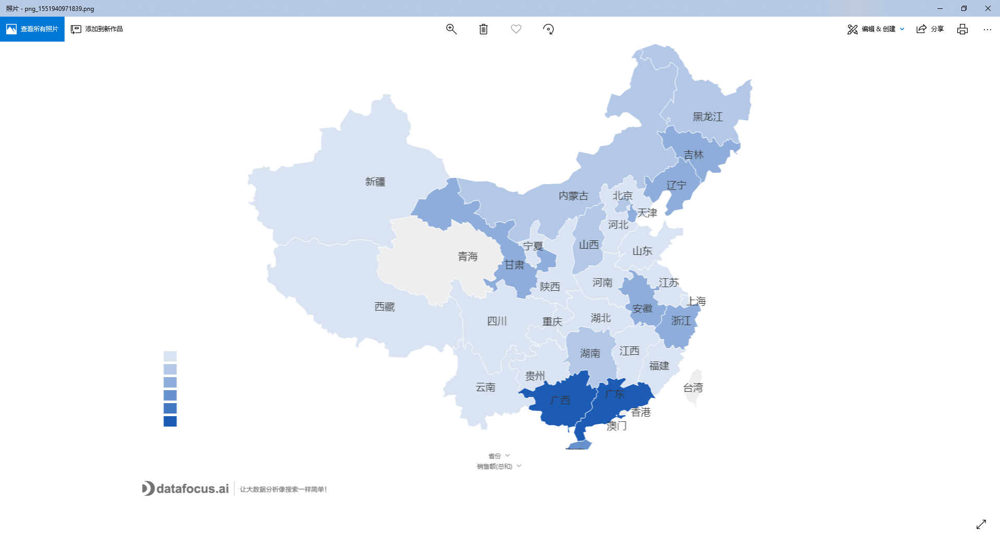
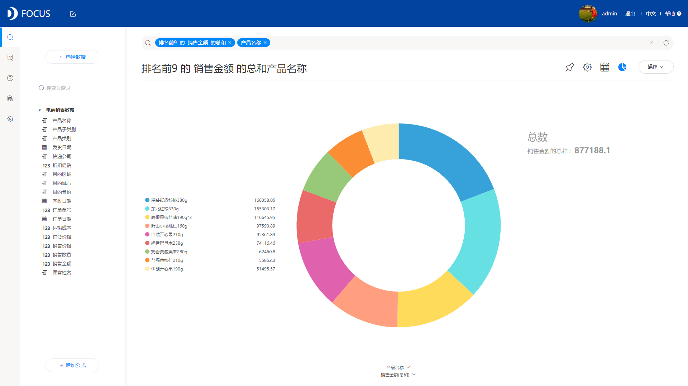

使用DataFocus中文自然语言数据分析系统时，可以经由用户的查询问题自动生成适合数据结构的可视化图表类型，但用户也可以将图表转化成自己需要的类型，我们整理了常用的一些数据图表对应的数据场景，帮助您在探索数据和展示数据时更加的直观丰满。

图表用来显示比较结果的方式大致为高度、大小、角度等。

1 柱状图

适用于一个属性列和一个（或数个，数个时通过图例选中不同的显示效果）数据列的二维数据结构，属性列作为进行类别比较的x轴，数据列作为显示比较高度的y轴。利用图形高度反应数据的差异，效果直观。

优势：高度差异效果较为直观。

2 折线图

同样适用于一个属性列和一个（或数个，数个时通过图例选中不同的显示效果）数据列的二维数据结构，属性列作为进行类别比较的x轴（多用在属性列为日期时展示趋势变化），数据列作为显示比较高度的y轴。一般用来表示趋势的变化，属性列类别较多时尤其适用。

优势：可以清晰地反映和表达数据的变化趋势。

3 饼图

适用于一个属性列和一个（或数个，有多个数据列时生成多环饼图）数据列的二维数据结构，属性列作为进行类别比较的x轴，数据列作为显示比较占比的y轴。饼图多用来展示不同类别的占比情况和比例，显示各项的大小与占总体的比例。

优势：明确直观地显示比例情况，多适用于用户群体倾向和渠道来源等场景。

4 散点图

适用于一个属性列和一个（或数个，数个时通过图例选中不同的显示效果）数据列的二维数据结构，属性列作为进行类别比较的x轴，数据列作为显示比较高度的y轴。多用来观察各个数据点之间的关系以及分析变量之间的联系，还可以直观的看出数据的分布情况以及特殊的离群值。

优势：对于处理数据分布和分簇来说结果较为理想。

5 漏斗图

适用于一个属性列和一个数据列的二维数据结构，属性列作为进行类别比较的x轴，数据列作为显示比较程度的y轴。漏斗图适用于一个连续的流程的完成情况分析，显示各个阶段的转化率，尤其是在网站分析的用户转化的场景下很理想，能够完整的展示用户从进入到实现购买的最终转化之间的每个流程，直观的显示出问题所在。多个

优势：在转化关系中可以直观地显示出整体流程的转化率情况。

6 气泡图

适用于一个属性列和两个数据列的三维数据结构，属性列作为进行类别比较的x轴，一个数据列作为显示比较高度的y轴，一个数据列作为气泡的大小的显示。气泡图与散点图类似，不同之处在于在图表中额外加入一个表示气泡大小的变量进行两组数据的对比，多适用于反映销售场景需要同时比较两个数值的情况。

优势：比较角度多维，效果直观美观。

