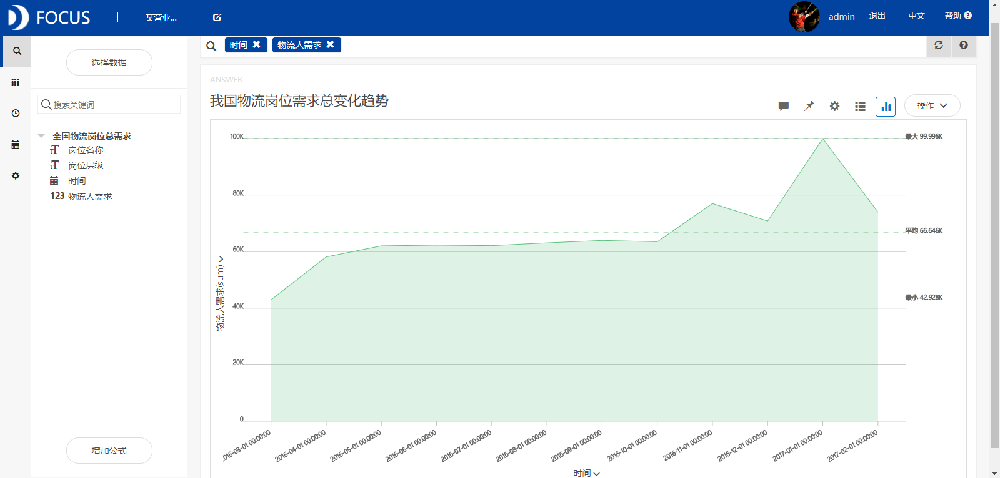
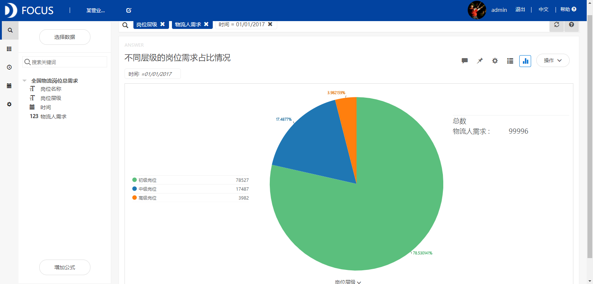
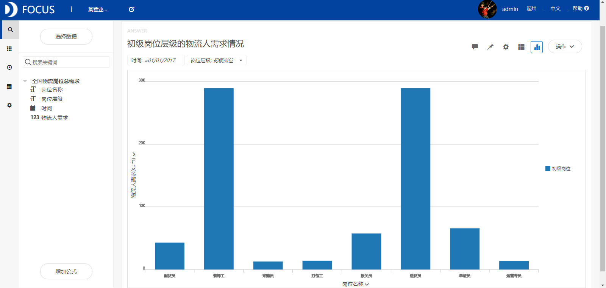
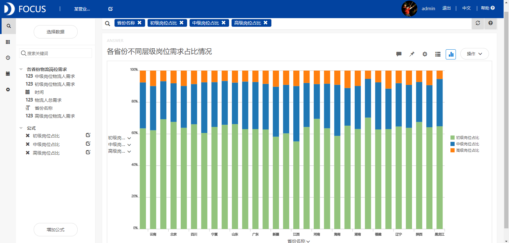
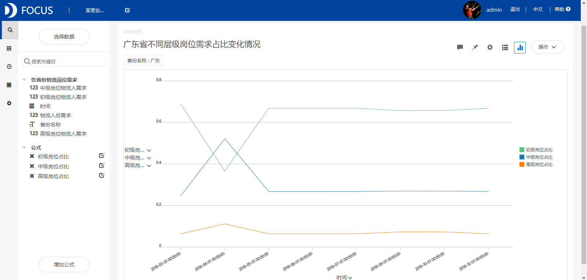
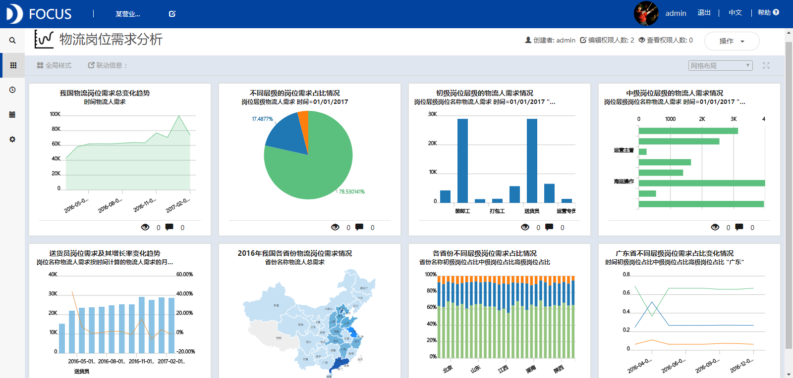

**目的：**分析我国物流人才需求的总体发展趋势，研究不同物流岗位、省份的物流人需求变化情况。

**摘要：**随着物流业的迅速发展，企业对物流人才数量的需求越来越大，同时也对物流人才的能力提出了更高的要求。本文通过对我国物流岗位的需求分析得出了以下结论： 2017年1月之前我国物流岗位总需求总体上呈现出缓慢增长的趋势。初级岗位的需求最大，占到物流岗位总需求的75%以上，中级岗位的需求次之，占比为17%，而高级岗位的需求最少。初级岗位中需求最大的是送货员和装卸工。中级岗位中海运操作、物流助理等岗位的需求相对较大。2016年我国物流岗位需求最大的省份是广东省。甘肃省的初级岗位占比最大，江西省的中级岗位占比最大，贵州省的高级岗位占比最大。

**关键词：**Datafocus,物流业,岗位需求

**一、案例背景**

随着物流业的迅速发展，企业对物流人才数量的需求越来越大，同时也对物流人才的能力提出了更高的要求。准确划分物流行业的岗位，并对岗位需求进行分析，对指导物流专业毕业生的就业和高职物流人才培养的指导具有重要的现实意义。

**二、案例问题**

本文通过分析我国物流人才需求的总体发展趋势，研究不同物流岗位、省份的物流人需求变化情况，以帮助和指导物流专业的毕业生更多的了解我国物流岗位的需求现状和发展趋势，从而达到更好地就业。

**三、案例分析**

将分析的“全国物流岗位总需求”、“各省份物流岗位需求”CSV文件导入到Focus系统中。

**（一）我国物流岗位需求总体发展情况**

**1．物流岗位需求变化趋势**

从图1中我们可以看出2017年1月之前我国物流岗位总需求总体上呈现出缓慢增长的趋势，并且2017年1月物流岗位总需求达到这一年来的最大值，即99996个。 

图1 我国物流岗位需求变化趋势

**2.不同层级的岗位需求占比情况**

从图2中我们看到初级岗位的需求最大，占到物流岗位总需求的75%以上，中级岗位的需求次之，占比为17%，而高级岗位的需求最少。 

图2 不同层级的岗位需求占比情况

**3.初级岗位层级的物流人需求情况**

从图3中可以看到初级岗位中物流人需求最高的是送货员和装卸工。这两种岗位的需求量显著地大于其他初级岗位。 

图3 初级岗位层级的物流人需求情况

**4.中级岗位层级的物流人需求情况**

从图4中我们可以清楚地看到中级岗位中海运操作、物流助理等岗位的需求相对较大，其他岗位的需求较小。 

图4 中级岗位层级的物流人需求情况

**5.送货员岗位需求及其增长率**

筛选出初级岗位为送货员的数据，分析送货员的岗位需求随时间变化的趋势。从图5中可以看到2016年9月之前送货员的岗位需求是缓慢正向增长的，而在2016年10月之后增长方向不确定。 

图5 送货员岗位需求及其增长率变化趋势

**（二）各省份物流岗位需求情况**

**1.各省份物流岗位需求统计**

2016年我国物流岗位需求最大的省份是广东省，该省的岗位总需求为78826人。物流岗位需求较大的是北京、山东、上海、天津、河北等，岗位需求最小的省份有宁夏、新疆、海南、青海等。 

图6 2016年我国各省份物流岗位需求情况

**2.各省份不同层级岗位需求占比情况**

从图7中可以看到各省份的初级岗位需求大于中级岗位、高级岗位。其中，甘肃省的初级岗位占比最大，江西省的中级岗位占比最大，贵州省的高级岗位占比最大。  图7 各省份不同层级岗位需求占比情况

**3.广东省不同层级岗位需求占比变化情况**

筛选出广东省的物流岗位需求数据，分析该省不同层级的岗位占比变化情况。从图8中可以看到除2016年4月中级岗位占比大于初级岗位之外，在其他月份广东省的不同层级岗位占比没有显著变化，其初级岗位占比最大，中级岗位次之。高级岗位占比最小。 

图8 广东省不同层级岗位需求占比变化情况

**（三）数据看板**

最后将这8个结果图导入“物流岗位需求分析”数据看板中，操作结果如下： 

图9 数据看板

**四、结论**

2017年1月之前我国物流岗位总需求总体上呈现出缓慢增长的趋势，并且2017年1月物流岗位总需求达到最大值。初级岗位的需求最大，占到物流岗位总需求的75%以上，中级岗位的需求次之，占比为17%，而高级岗位的需求最少。初级岗位中物流人需求最高的是送货员和装卸工。中级岗位中海运操作、物流助理等岗位的需求相对较大，其他岗位的需求较小。我国物流岗位需求最大的省份是广东省，该省的岗位总需求为78826人。各省份的初级岗位需求大于中级岗位、高级岗位。其中，甘肃省的初级岗位占比最大，江西省的中级岗位占比最大，贵州省的高级岗位占比最大。

**五、对策建议**

学历较高的物流专业毕业生要想在中级岗位工作，就可以选择海运操作、物流助理等需求量比较大的岗位。而学历比较低的毕业生可以轻松找一份送货员或者装卸工的工作。广东省的物流岗位需求最大，并且广东省有一些较发达的城市，因此选择在广东省就业也是一个不错的选择。
