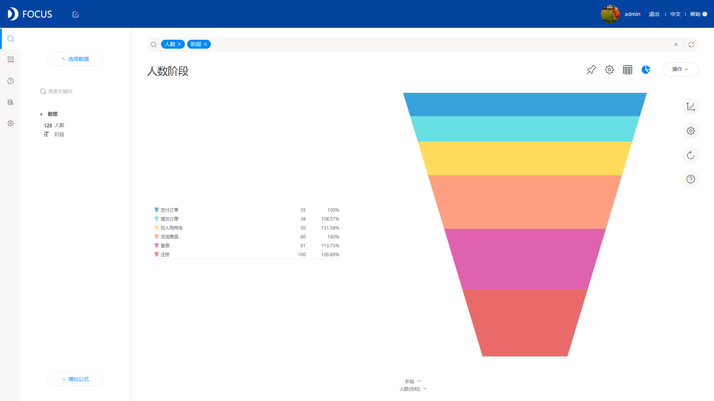
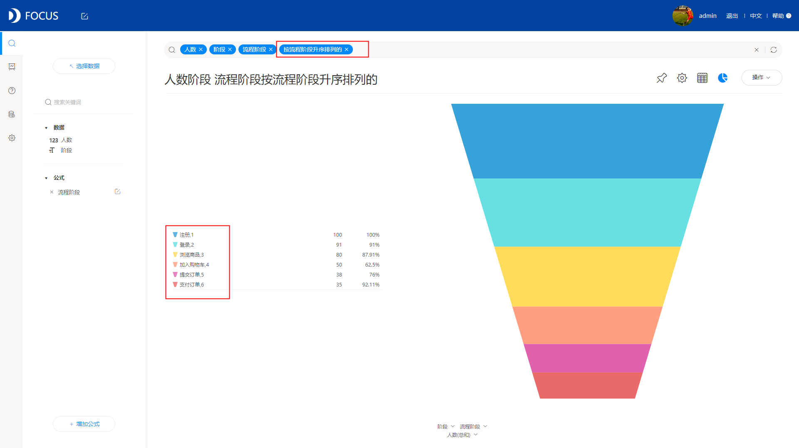

**目的：**通过对患者基本情况的研究，发现可能影响患者是否失约的因素，并适当提出建议，降低失约率。

**摘要：**现如今，预约挂号工作已成为公立医院服务领域的一项重要工作。在此次案例分析中，预约患者的失约率高达20.18%。通过此次案例分析，还可以发现，与男性相比，女性去医院的次数更多，更注重健康；在失约患者中，存在较大部分患者未收到信息；年纪大的患者身体上的毛病较多，更加注意身体健康，不容易失约；患者的预约时间大部分在20天及20天内；观察失约患者的身体状况，大部分的失约患者是身体状况较好的，无高血压且无糖尿病的类型；观察其家庭情况和酗酒恶习情况，大部分的失约患者都是没有家庭补助金且不酗酒的类型，即家庭情况较好且身体较健康，无酗酒恶习。

**关键词：**预约,失约率,身体状况,影响因素

一、案例背景

预约诊疗服务的开展有利于减少患者等候诊治的时间，由在院侯诊逐步向居家侯诊转变，减少了患者在院停留时间，有利于减少院内感染，有利于医院提升管理水平，提高工作效率和医院质量，降低医疗安全风险，但爽约将极大地影响医院的正常诊疗秩序。在医疗资源配置相对紧张的情况下，最大限度地降低爽约率成为医院的重要工作之一。

此次案例分析的数据是巴西地区的所有预约患者的基本情况，包括年龄、性别、是否失约、信息接收、预约时间、就诊时间等，通过对患者基本情况的研究，发现可能影响患者是否失约的因素，并适当提出建议，降低失约率。

二、案例问题

就诊迟到或者因故过号不是一个新现象，但随着电话、互联网等预约方式的出现，尤其是微信、支付宝等移动端预约挂号的推广，“医生等患者”的现象更加普遍。本文将着重讨论影响患者是否失约的因素的患者基本情况的因素。但由于患者预约的数据量大，更新较快，用EXCEL来进行操作会略显麻烦，使用Datafocus产品就可以快速处理大量数据，分析的准确性也高。

三、案例分析

（一）综合分析

1.失约率

首先计算此次案例的所有预约患者中的失约率，即到底有多少患者进行了预约，最终却爽约了。

图1 患者是否失约

从图中可以观察到，在所有预约的患者中，失约率高达20.18%。

2.不同性别的失约情况

通过图1可以看到预约的失约率高达20.18%，那么什么因素可能会导致这些患者爽约呢？

首先观察男女性别对失约情况可能会造成的影响。

图2 不同性别的失约情况

从上图可以明显的看出，在预约的患者中女性比例较大；同样的，在失约的患者中，也是女性占有较大比例。因此可以推断，与男性相比，女性去医院的次数更多，更注重健康。

3.患者的信息接收

接着对比患者信息接收对失约情况有何影响。

图3 患者信息接收情况

从上图可以观察到，人数最多的部分是未收到消息却未失约的患者，其次是收到消息且未失约的；在失约患者中，则存在较大部分患者未收到信息。

（二）失约患者的情况分析

1.年龄情况

接下来重点对失约患者的情况进行分析。首先将失约患者的按年龄进行分组，统计分到各组的患者数。

图4 失约患者年龄分层

从图中可以观察到，失约患者的各个年龄组中人数最多的是10岁以下的孩子，其次是20-30岁的青年、10-20岁的青少年、30-40岁的中年人，且发现了一个规律，年级越大的患者越不容易失约。由此可以猜测，年纪大的患者身体上的毛病较多，更加注意身体健康，不容易失约。

2.预约时间间隔

对失约患者的预约时间间隔进行计算，可以发现预约间隔之间的规律。

图5 失约患者预约的时间间隔

从图中可以看到，患者的预约时间基本分布在50天内，20天的时间间隔更是占据较大部分。

3.身体状况

对失约患者的身体状况进行画图研究。

图6 患者身体状况

从图中可以观察到，失约患者中人数占最大比例的是无高血压且无糖尿病的患者，其次是患有高血压但是无糖尿病的患者，占比例最小的是无高血压但患有糖尿病的患者。据此可以推断，大部分的失约患者是身体情况较好的，无高血压且无糖尿病的类型。

4.补助金及酗酒情况

最后研究失约患者的家庭状况以及是否存在酗酒的情况。

图7 失约患者的家庭补助金及酗酒情况

从图中可以观察到，失约患者中人数最多的是无补助金且不酗酒的患者，其次是家庭有补助金但不酗酒的患者，占比例最小的是家庭有补助金且酗酒的患者。据此可以推断，大部分的失约患者都是没有家庭补助金且不酗酒的类型，即家庭情况较好且身体较健康，无酗酒恶习。

（三）数据看板

最后将这7个结果图导入“患者失约情况”数据看板中，为了使数据看板更为美观，在全局样式中选择第三个预设样本，选择“网格布局”。操作结果如下：

图9 数据看板

四、结论

综上所述，在此次案例分析中，预约患者的失约率高达20.18%。

在预约的患者中女性比例较大，但因基数较大，在失约的患者中，也存在更高的比例。因此可以推断，与男性相比，女性去医院的次数更多，更注重健康。

人数最多的部分是未收到消息却未失约的患者，其次是收到消息且未失约的；在失约患者中，则存在较大部分患者未收到信息。

将失约患者的年龄进行分组，可以发现，年级越大的患者越不容易失约。由此可以猜测，年纪大的患者身体上的毛病较多，更加注意身体健康，不容易失约。患者的预约时间大部分在20天及20天内。

观察失约患者的身体状况，可以推断，大部分的失约患者是身体情况较好的，无高血压且无糖尿病的类型；观察其家庭情况和酗酒恶习情况，则发现，大部分的失约患者都是没有家庭补助金且不酗酒的类型，即家庭情况较好且身体较健康，无酗酒恶习。

五、对策建议

失约会对医院的正常诊疗程序在成非常严重地影响。因此，在医疗资源配置相对紧张的情况下，最大限度地降低失约率成为医院的重要工作之一。

1、通过多渠道的方式，加大宣传力度，培养患者的诚信意识，同时加强对医生诚信度的建设。

2、适度放开专家允许预约挂号量，最大限度地满足患者对专家门诊的需求。

3、更为人性化的预约挂号管理，在就诊前，能够多用信息提醒患者及时就诊，并适时延长取号时间，保证预约患者的就诊利益。
