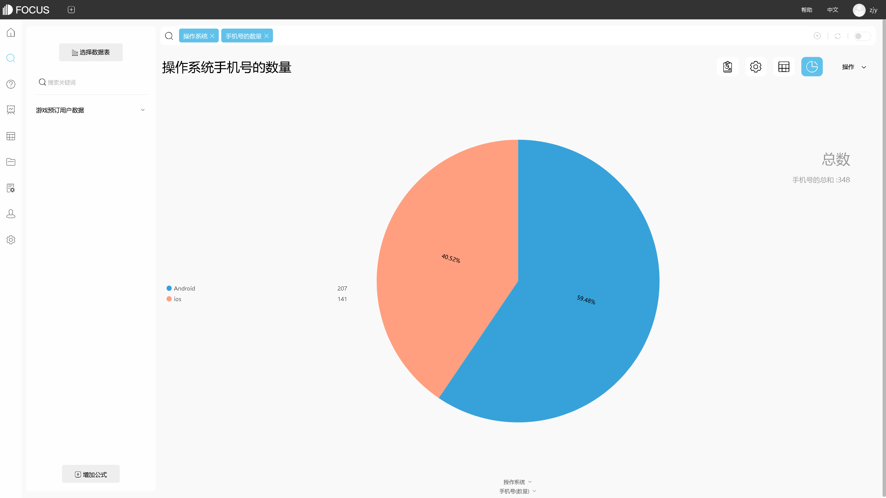

**目的：**分析用户流失原因和留存意向倾向，以制定相应用户的保留计划方案。

**摘要 ：** 本报告使用DataFocus系统，数据记录了来自某营业点两年来的用户信息和留存情况，案例主要从用户各项服务与资费和用户特征等角度进行分析，比较各类因素，分析用户留存与否的考虑因素。分析结果可帮助制定相应用户的保留计划方案。最终分析可得，使用时间越长的用户留存可能性越稳定，而刚办理业务留存期在半年以内的用户留存波动很大。1至3个月的短期用户总数最多，但流失率很大，而1年与2年的长期用户流失率很低，且2年的用户留存率明显大于1年的用户。电子支付用户的流失率明显远高于其他支付方式的用户，对分析电子支付用户的特征进行分析，我们发现这部分用户中最多的是单身的年轻男女，其次是单身的老年男女，接着流失率较低的是非单身的年轻男女，而非单身老年男女的流失率非常低。且从每月金额来看单身的年轻男女中男性女性的每月电话费消费水平几乎持平，单身的老年男女中男性消费略高于女性，非单身的年轻男女中女性消费明显高于男性，非单身老年男女中男性消费远高于女性且为各种特征组合中最高的一种。我们可以得到非单身的用户留存较高；随着年龄推移，用户留存中心从女性用户过渡到男性用户群体。

不需求开通上网服务的用户流失量很小，开通DSL上网服务的用户流失量较小，而开通了Fiber的用户流失量几乎达到50%，说明用户对Fiber的不满意度很大。基于上网服务的增值业务中，在线安全服务、在线备份服务、设备保护服务未开通情况下用户流失量较大，流媒体电视和流失传输电影对用户留存作用不大，而无纸化结算服务开通对用户留存起到了反作用。

 

**关键词：DataFocus,**通信行业,用户,留存

一、案例背景

数据集包括有关下列信息：

在上个月离开的客户 - 该专栏称为“流失。”

每个客户已注册的服务 - 电话，多线路，互联网，在线安全，在线备份，设备保护，技术支持以及流媒体电视和电影。

客户帐户信息 - 客户，合同，付款方式，无纸化结算，每月费用和总费用的时间长度。

有关客户的人口统计信息 - 性别，年龄范围，以及他们是否有合作伙伴和家属。

二、案例问题

通信行业与国民日常生活休戚相关，电信在通讯行业占有大量份额分布在全国各个区域，本数据集收录了某营业点两年来的用户信息和留存情况，案例主要从用户各项服务与资费和用户特征等角度进行分析，比较各类因素，分析用户留存与否的考虑因素。分析结果可帮助制定相应用户的保留计划方案。

三、案例分析

## 进入DataFocus系统，从数据管理页面中导入数据源“电信用户流失”，并在数据看板页面创建新的数据看板，命名为“电信营业点用户流失分析”。

## 1.留存时间推移的流失比较

## 由图可得，使用时间越长的用户留存可能性越稳定，而刚办理业务留存期在半年以内的用户留存波动很大，尤其是仅一个月的。

2.不同合同期限下的流失比较

1至3个月的短期用户总数最多，但流失率很大，而1年与2年的长期用户流失率很低，且2年的用户留存率明显大于1年的用户。

 

3付款方式及月租对用户流失的影响

电子支付用户的流失率明显远高于其他支付方式的用户，接下来深入分析电子支付用户的特征以找到流失原因。

 

4.电子支付话费的流失用户群体特征分布

对分析电子支付用户的特征进行分析，我们发现这部分用户中最多的是单身的年轻男女，其次是单身的老年男女，接着流失率较低的是非单身的年轻男女，而非单身老年男女的流失率非常低。且从每月金额来看单身的年轻男女中男性女性的每月电话费消费水平几乎持平，单身的老年男女中男性消费略高于女性，非单身的年轻男女中女性消费明显高于男性，非单身老年男女中男性消费远高于女性且为各种特征组合中最高的一种。我们可以得到非单身的用户留存较高；随着年龄推移，用户留存中心从女性用户过渡到男性用户群体。

 

5.各项服务对用户流失的影响

分析各项增值服务对用户流失的影响，以便找到最能留存用户的服务套餐搭配。案例中分析的大部分增值服务是基于开通了上网服务的前提下的。

①上网服务

不需求开通上网服务的用户流失量很小，开通DSL上网服务的用户流失量较小，而开通了Fiber的用户流失量几乎达到50%，说明用户对Fiber的不满意度很大。接下来的分析以用户开通了上网服务为前提。

②在线安全服务

没有在线安全服务的用户流失量较大且影响较大。

③在线备份

没有在线备份服务的用户流失量较大且影响较大。

④设备保护

没有开通设备保护的用户流失量较大且影响较大。

⑤技术支持

没有开通技术支持的用户流失量较大且影响较大。

⑥流式传输电影

流式传输电影服务开通与否对用户流失的影响较小且有无差异较小，不是主要因素。

⑦流媒体电视

流媒体电视服务开通与否对用户流失的影响较小且有无差异较小，不是主要因素。

⑧无纸化结算

开通了无纸化结算的用户流失量较大影响虽相对小一些，但可以看出这项服务对用户留存有明显的反作用，应针对这项服务对用户进行调研找到原因所在。

将12个结果图导入“**电信营业点用户流失分析**”的数据看板。

排版如下：

四、结论

使用时间越长的用户留存可能性越稳定，而刚办理业务留存期在半年以内的用户留存波动很大。1至3个月的短期用户总数最多，但流失率很大，而1年与2年的长期用户流失率很低，且2年的用户留存率明显大于1年的用户。电子支付用户的流失率明显远高于其他支付方式的用户，对分析电子支付用户的特征进行分析，我们发现这部分用户中最多的是单身的年轻男女，其次是单身的老年男女，接着流失率较低的是非单身的年轻男女，而非单身老年男女的流失率非常低。且从每月金额来看单身的年轻男女中男性女性的每月电话费消费水平几乎持平，单身的老年男女中男性消费略高于女性，非单身的年轻男女中女性消费明显高于男性，非单身老年男女中男性消费远高于女性且为各种特征组合中最高的一种。我们可以得到非单身的用户留存较高；随着年龄推移，用户留存中心从女性用户过渡到男性用户群体。

不需求开通上网服务的用户流失量很小，开通DSL上网服务的用户流失量较小，而开通了Fiber的用户流失量几乎达到50%，说明用户对Fiber的不满意度很大。基于上网服务的增值业务中，在线安全服务、在线备份服务、设备保护服务未开通情况下用户流失量较大，流媒体电视和流失传输电影对用户留存作用不大，而无纸化结算服务开通对用户留存起到了反作用。

五、对策建议

在为用户推荐话费套餐服务的时候，应尽量确认用户的使用期限意向并推荐用户办理半年以上的话费套餐以增加用户留存的可能性，针对用户的年龄和家庭状况推荐合适的套餐来满足不同的用户群体，比如分析单身男女可能对通讯服务的需求不是很大，所以相对的将在上网服务方面较为优惠全面的套餐推荐给用户以迎合用户的娱乐需要，而对于大龄的用户对通讯服务的要求主要集中在与儿女和亲友的交流中，我们可以重点对这类用户推出类似亲情电话的优惠绑定套餐以满足他们的需求增加用户粘度。开通上网服务的用户普遍对在线安全服务、在线备份服务、设备保护服务比较重视，套餐中就将此类服务作为基本项加入，而流媒体电视和流失传输电影可以在问询过用户需求后再行安排，针对比较特殊的无纸化结算服务，应进一步通过用户调研确认问题所在，然后进行改进或整体取消。
