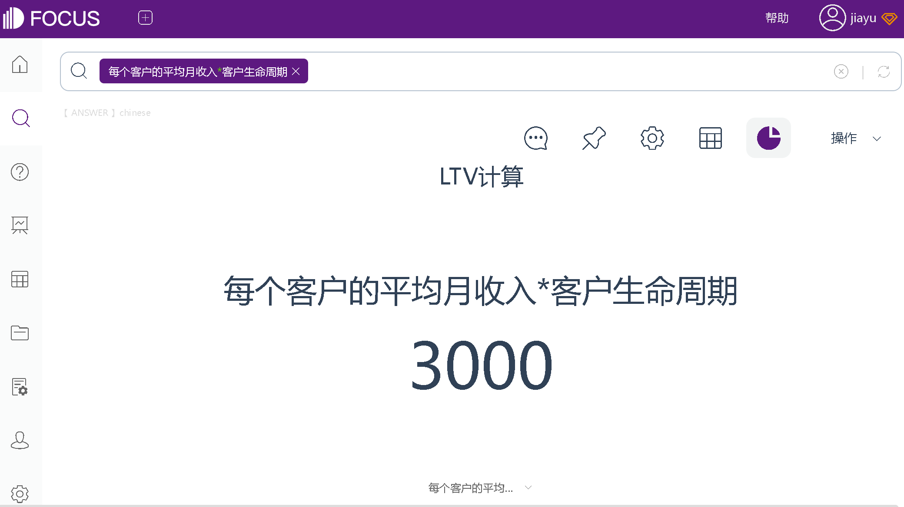
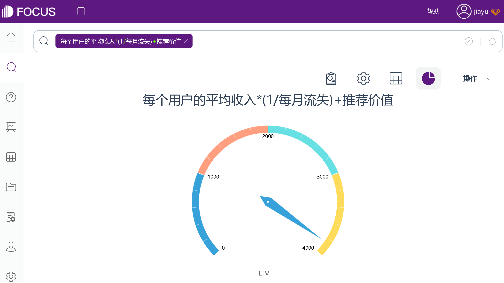

前文，我们介绍了营销绩效的黄金指标LTV:CAC比率，该比率通过分别计算LTV和CAC，再将LTV和CAC相除后得到。

LTV值，除了用于LTV:CAC比率，还可以协助优化渠道投放策略、判断项目的商业价值、预测回本周期以优化经营策略等等。

那么，你是否了解什么LTV？你是否知道，对于不同业务的客户终身价值 (LTV)，可以有不同的计算方式？

接下来，我们来简单了解一下LTV以及该指标的几种计算方式。

## 什么是客户终身价值 (LTV)

LTV，客户终身价值，也被称为客户生命周期价值。LTV用于衡量你的业务从任何特定客户那里获得的收入。它是对客户在流失之前将产生的平均总收入的估计。

## 如何计算客户终身价值 (LTV)

根据不同的需求，可以选择不同的方式计算LTV：

1、对于 SaaS 公司，可以用：

公式1：每个客户的平均月收入 \* 客户生命周期(月) = LTV

公式2：每个客户的平均月收入 / 月客户流失率 = LTV

分析工具：DataFocus

2、对于电子商务公司，可以用：

平均订单价值\*重复销售\*平均保留时间(月) = LTV

3、对于移动应用程序（注：推荐价值可选择是否添加）：

每个用户平均收入 \* (1/每月流失) + 推荐价值 = LTV

分析工具：DataFocus

4、如果想精确地计算 LTV，可以选择一个包含毛利率的公式：

公式1：每个账户的平均 MRR \* (1/每月流失) \* 毛利率 (%) = LTV

公式2：每个账户的平均年度经常性收入 \* (1/年流失) \* 毛利率 (%) = LTV

公式3：平均订单价值 \*重复销售 \*平均保留时间(月) \* 毛利率(%) = LTV

## 指标优点：

客户终身价值可帮助你做出有关销售、营销、产品开发和客户支持的重要业务决策。例如，跟踪你的 LTV 与获取客户成本 (CAC) 的比率、测量每个营销渠道的 LTV 以确定那些获得最有价值用户的渠道 或通过培养具有最高 LTV 的客户来最大限度地减少客户流失以最大化MRR 增长。

## 指标缺点：

LTV 是规划未来增长的重要指标，但它也可能会波动。对于客户数量较少的企业，由于样本量小，估计值可能会每月发生变化。客户流失率上升或新功能的实施也会影响其价值。

客户终身价值 (LTV)的计算，在不同的业务场景需求下，可以使用不同的公式进行计算，但万变不离其中，都是为了估计客户在流失之前能给你带来的平均总收入。你可以根据自己的需求，选择适合自己的公式，求得LTV值。
