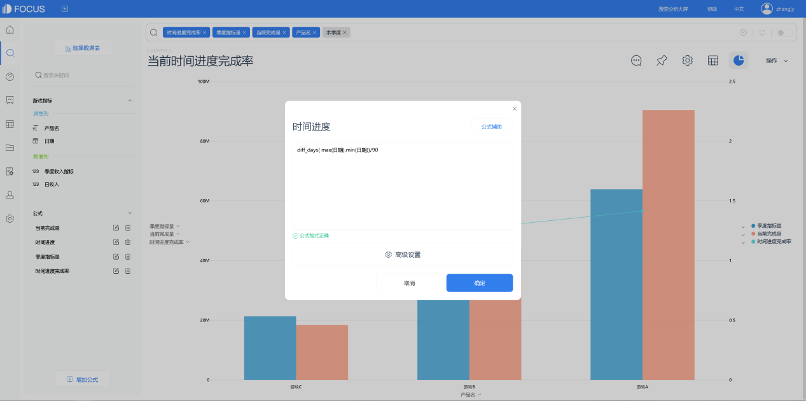
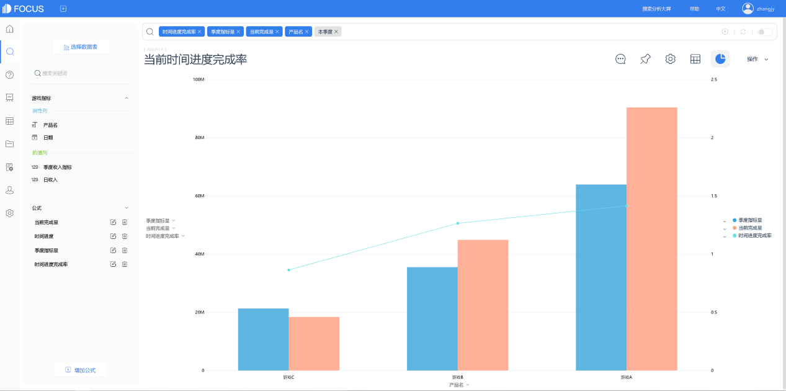

**目的：**辅助工厂分析工人事故多发的场景，以针对性地加强预防此类事件发生。

**摘要 ：** 本报告使用DataFocus系统，数据记录了来自3个不同国家的12个不同地区工厂的事故相关信息，案例主要从地区、关键风险、时间和当事人特征的角度进行分析，比较事故发生的各类因素，针对性地分析事故发生的原因。分析结果可帮助工厂进一步准确的定位安全事故的产生因素，实质性地帮助决策，从而减少同类事件发生的概率，保障工人的人身安全。最终分析可得，country\_01为事故多发国家，各地区的事故发生率与其他国家相比普遍较高，而Country\_02的Local\_05的事故发生率也相对较高；造成事故的风险中，Pressed、Manual Tools、Chemical substance分布较多；选取三个高风险的事故分析其中的人员身份分布，发现Chemical substance风险中，工厂雇员分布大大多于三方人员，分析可能是化工职业的工人长期受环境影响，事故发生率大大增高，针对性地工厂应该改良下工作环境以减少同类事件发生；从事故发生的月份变化来看，事故发生数在每年的2到6月份有明显的周期性提升，我们分析在这个时间段的工人较容易产生事故，工厂应加强监督与警示；从周日期分布变化来看，周五的事故发生率最高而周一最低，且从周一到周五有逐渐上升的趋势，可以尝试分析出，周五将近工作日结束，工人可能会有等懈怠心理，较容易出现生产事故，工厂应在工作日将近结束的几日加强安全警示工作；从年龄分布来看，男性为事故高发群体，但不排除制造业工厂职工男性总体分布普遍比女性高的因素，故此信息不具备完整性，有待进一步的数据分析。

**关键词：**制造业,发生频率,生产安全

一、案例背景

二、案例问题

制造业生产安全问题不仅关系到工厂产值，同时与工厂工人的人权道义休戚相关，引发社会各界关注，数据记录了来自3个不同国家的12个不同地区工厂的事故相关信息，包括了日期、事故发生地、事故等级、当事人信息以及后期调查确认的事故涉及风险等，以供寻找生产安全事故发生的根源和预防措施。

三、案例分析

## 进入DataFocus系统，从数据管理页面中导入数据源“工业劳动安全事故数据”，并在数据看板页面创建新的数据看板，命名为“工业劳动安全事故分析”。

## 1.各国发生事故数量对比

添加公式对ID进行计数命名为“事故记录数”，添加“国家”数据列。

由图可得，Country\_01是事故发生最多的国家。

2.不同城市发生事故数量的对比

添加“城市”数据列。

结合上一个answer可见，country\_01为事故多发国家，它的各地区的事故发生率与其他国家相比普遍较高，而Country\_02的Local\_05的事故发生率也相对较高。

3.造成事故最主要风险

将“事故记录数”“关键风险”添加到搜索框，并排除关键风险列中的无信息值“Others”

我们可以看出造成事故的风险中，Pressed、Manual Tools、Chemical substance、Venomous Animals、Cut依次分布较多。这几类风险多为操作不当或工作环境不利于人体健康而引发的安全事故，对其中最多的三种进行进一步分析。

4.高风险事故中人员雇佣关系分布

限定关键风险为“Pressed、Manual Tools、Chemical substance”，添加“雇佣关系”列。

可以看出Chemical substance风险中，工厂雇员分布大大多于三方人员，分析可能是化工职业的工人长期受环境影响，事故发生率大大增高，针对性地工厂应该改良下工作环境以减少同类事件发生。Pressed风险下，本工厂雇员的事故发生率高于三方雇员，应加强本工厂工人的操作规范，减少事故发生。而Manual Tools 风险下，三种身份的工人事故发生数量差不多持平，没有较大区别。

5.事故发生数量的月份变化

将“事故记录数”和“日期”加入搜索框，并限定日期以月份聚合。

我们看到事故发生数在每年的2到6月份有明显的周期性提升，我们分析在这个时间段的工人较容易产生事故，工厂应加强监督与警示。

6.一周内事故发生数量的变化

将“事故记录数”和“日期”加入搜索框，并限定日期按周日期聚合。

我们看到周五的事故发生率最高而周一最低，且从周一到周五有逐渐上升的趋势，可以尝试分析出，周五将近工作日结束，工人可能会有等懈怠心理，较容易出现生产事故，工厂应在工作日将近结束的几日加强安全警示工作。

7.事故多发人群性别特征

将“事故记录数”和“性别”加入搜索框。

从年龄分布来看，男性为事故高发群体，但不排除制造业工厂职工男性总体分布普遍比女性高的因素，故此信息不具备完整性，有待进一步的数据分析。

将7个结果图导入“**工业劳动安全事故分析**”的数据看板。排版如下：

四、结论

country\_01为事故多发国家，各地区的事故发生率与其他国家相比普遍较高，而Country\_02的Local\_05的事故发生率也相对较高；造成事故的风险中，Pressed、Manual Tools、Chemical substance分布较多；选取三个高风险的事故分析其中的人员身份分布，发现Chemical substance风险中，工厂雇员分布大大多于三方人员，分析可能是化工职业的工人长期受环境影响，事故发生率大大增高，针对性地工厂应该改良下工作环境以减少同类事件发生；从事故发生的月份变化来看，事故发生数在每年的2到6月份有明显的周期性提升，我们分析在这个时间段的工人较容易产生事故，工厂应加强监督与警示；从周日期分布变化来看，周五的事故发生率最高而周一最低，且从周一到周五有逐渐上升的趋势，可以尝试分析出，周五将近工作日结束，工人可能会有等懈怠心理，较容易出现生产事故，工厂应在工作日将近结束的几日加强安全警示工作；从年龄分布来看，男性为事故高发群体，但不排除制造业工厂职工男性总体分布普遍比女性高的因素，故此信息不具备完整性，有待进一步的数据分析。

五、对策建议

加强Country01的工业安全监管；Chemical substance风险的工厂要改良厂房环境和工作设施装备以减少对工人健康的损害，依赖工人人工操作并且操作不当会对工人产生较大损害的工厂，应定时定期加强对工人安全意识的培养和技术规范的培训；从时间来看，在每年的2到6月份的时间，工厂应加强安全巡查，并在每个工作日周期的最后几天同样小心警示工人注意生产安全，避免受到伤害。
