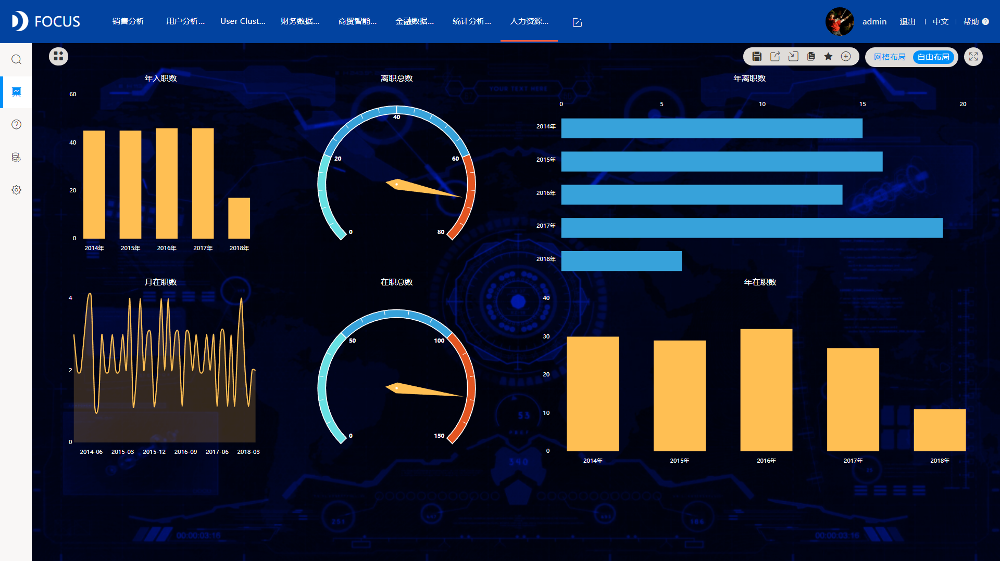
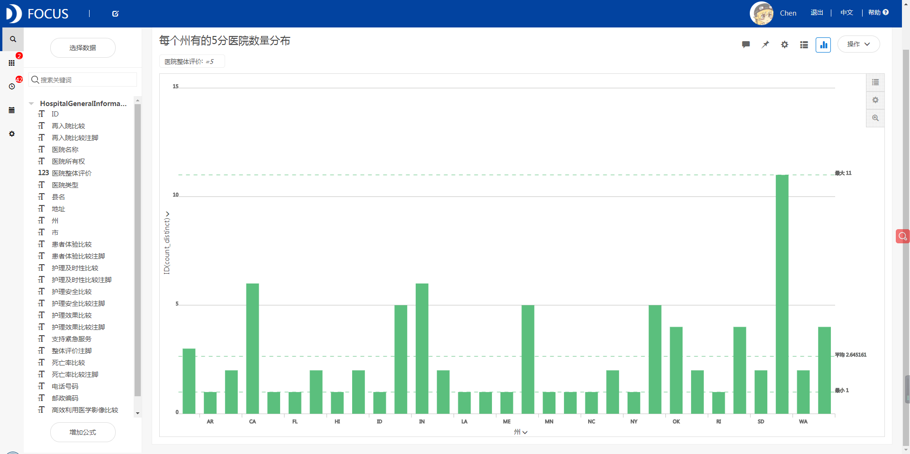
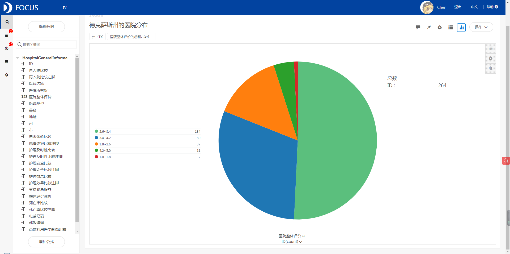

**目的：**比较分析全美的正规医院各项护理服务的质量，帮助民众选择合适的医院就医。

**摘要 ：** 本报告使用DataFocus系统，数据来源于医疗保险和医疗补助服务中心提供的Medicare.gov医院比较网站上使用的官方数据集，记录了全国4000多家Medicare认证医院的护理质量相关信息，案例主要从地区、医院类型、各项评价标准的角度进行分析，比较护理质量级别，细致地分析医院的各项护理服务水平。分析结果可帮助民众选择适合自己的医院进行就医，提升民众就医体验的同时改善医疗效率。最终分析可得，在五分制的评分规则里，美国医院的评分主要分布在3分和4分之间，平均分为3分左右。3分及3分以上医院数量较多，说明美国医院的整体水平在评分准则下是中等偏上的。美国每个州5分优质医院的平均数量为2左右，每个州基本都至少有一个5分优质医院，其中得克萨斯州的5分医院数量最多，为11个，加州和印第安纳州的5分医院数量也较多，为6个。得克萨斯州可能是美国的医疗力量集中地区，对德州的各分段医院进行筛选，可以看到3分的医院数量最多，共134家占总数的50.8%，4分医院80家占30.3%，2分医院37家占14%，5分医院11家占4.2%。总体医疗水平还是较高的，医院分布很密集且高分医院较多，确实是美国医疗力量较强的一个州。得克萨斯州的5分医院在休斯顿市有4家，在德州各市中，休斯顿市的5分优质医院又分布较多。选取患者体验、护理及时性、护理安全和紧急服务几个筛选项，休斯顿的4家5分医院患者体验评分都比较高且支持紧急服务，若需求护理及时的病症，"MEMORIAL HERMANN MEMORIAL CITY MEDICAL CENTER"医院比较合适，护理安全性来说"HOUSTON METHODIST HOSPITAL"医院相对差一些。

针对重症类型的医院，进行全国范围内的4分及4分以上医院筛选，我们从死亡率、再入院、护理效果和患者体验第四个方面选择出了各项水平都在国家平均线上的7家医院。可以作为重症病人择院选择。

**关键词：**DataFocus,医疗,医院服务

一、案例背景

案例主要从地区、医院类型、各项评价标准的角度进行分析，比较护理质量级别，细致地分析医院的各项护理服务水平。

二、案例问题

医疗服务与公民生活休戚相关，医院的服务质量更是关系到国计民生，数据来源于医疗保险和医疗补助服务中心提供的Medicare.gov医院比较网站上使用的官方数据集，记录了全国4000多家Medicare认证医院的护理质量相关信息，案例主要从地区、医院类型、各项评价标准的角度进行分析，比较护理质量级别，细致地分析医院的各项护理服务水平。分析结果可帮助民众选择适合自己的医院进行就医，提升民众就医体验的同时改善医疗效率。

三、案例分析

## 进入DataFocus系统，从数据管理页面中导入数据源“医院评级数据”，并在数据看板页面创建新的数据看板，命名为“全美医院护理水平分析”。

## 1.全美医院整体评分分布

有图可看出，在五分制的评分规则里，美国医院的评分主要分布在3分和4分之间，平均分为3分左右。3分及3分以上医院数量较多，说明美国医院的整体水平在评分准则下是中等偏上的。

2.每个州的5分医院数量分布

美国每个州5分优质医院的平均数量为2左右，每个州基本都至少有一个5分优质医院，其中得克萨斯州的5分医院数量最多，为11个，加州和印第安纳州的5分医院数量也较多，为6个。得克萨斯州可能是美国的医疗力量集中地区，假设我们有一名德州本地的急症患者需要治疗，因此我们要对德州的各大医院服务水平进行进一步分析选择最合适的。

3.德克萨斯州的医院分布

对德州的各分段医院进行筛选，可以看到3分的医院数量最多，共134家占总数的50.8%，4分医院80家占30.3%，2分医院37家占14%，5分医院11家占4.2%。总体医疗水平还是较高的，医院分布很密集且高分医院较多，确实是美国医疗力量较强的一个州。

4.得克萨斯州5分医院的市级分布

得克萨斯州的5分医院在休斯顿市有4家，在德州各市中，休斯顿市的5分优质医院又分布较多。

5.休斯顿5分医院的护理服务水平比较

选取患者体验、护理及时性、护理安全和紧急服务几个筛选项，休斯顿的4家5分医院患者体验评分都比较高且支持紧急服务，若需求护理及时的病症，"MEMORIAL HERMANN MEMORIAL CITY MEDICAL CENTER"医院比较合适，护理安全性来说"HOUSTON METHODIST HOSPITAL"医院相对差一些。

6.高分重症医院全国分布

针对重症类型的医院，进行全国范围内的4分及4分以上医院筛选，我们从死亡率、再入院、护理效果和患者体验第四个方面选择出了各项水平都在国家平均线上的7家医院。可以作为重症病人择院选择。

将6个结果图导入“**全美医院护理水平分析**”的数据看板。排版如下：

四、结论

在五分制的评分规则里，美国医院的评分主要分布在3分和4分之间，平均分为3分左右。3分及3分以上医院数量较多，说明美国医院的整体水平在评分准则下是中等偏上的。美国每个州5分优质医院的平均数量为2左右，每个州基本都至少有一个5分优质医院，其中得克萨斯州的5分医院数量最多，为11个，加州和印第安纳州的5分医院数量也较多，为6个。得克萨斯州可能是美国的医疗力量集中地区，对德州的各分段医院进行筛选，可以看到3分的医院数量最多，共134家占总数的50.8%，4分医院80家占30.3%，2分医院37家占14%，5分医院11家占4.2%。总体医疗水平还是较高的，医院分布很密集且高分医院较多，确实是美国医疗力量较强的一个州。得克萨斯州的5分医院在休斯顿市有4家，在德州各市中，休斯顿市的5分优质医院又分布较多。选取患者体验、护理及时性、护理安全和紧急服务几个筛选项，休斯顿的4家5分医院患者体验评分都比较高且支持紧急服务，若需求护理及时的病症，"MEMORIAL HERMANN MEMORIAL CITY MEDICAL CENTER"医院比较合适，护理安全性来说"HOUSTON METHODIST HOSPITAL"医院相对差一些。

针对重症类型的医院，进行全国范围内的4分及4分以上医院筛选，我们从死亡率、再入院、护理效果和患者体验第四个方面选择出了各项水平都在国家平均线上的7家医院。可以作为重症病人择院选择。

五、对策建议

急症类病症由于对治疗及时性要求较高不宜跨州择院，于是我们针对德州的民众，由于可选选择较多，筛选出了最好的几个选择。而重症非急的疾病对治疗的效果和彻底性需求更高，于是针对全国范围内对各项服务进行筛选选出了文中所示较好的几个选择。
