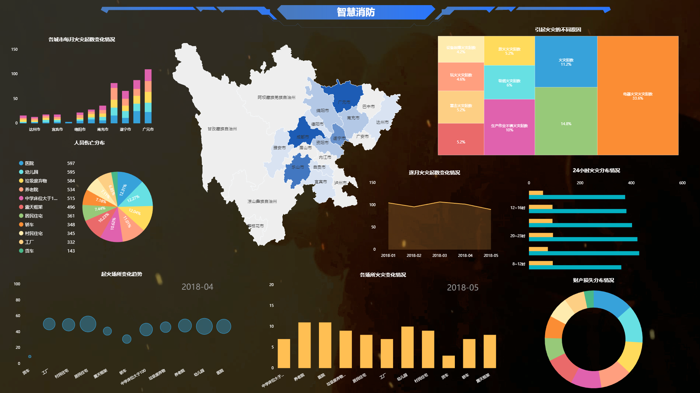
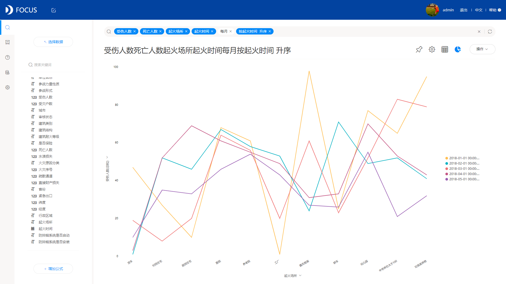

**目的：**分析疾病的发展历史，了解疾病的爆发现象的季节性和地域性特征，给其他同类传染病的传播爆发预测提供一定的参考，帮助控制。

**摘要 ：** 本报告使用DataFocus系统，数据来源于Tycho项目的数据库，包括美国国家级每周国家法定传染病检测系统（NNDSS）报告中针对天花、脊髓灰质炎、荨麻疹的标准计数。案例选取了1928年到1968年的记录，包括了基于历史人口估计的每10万人的病例数量和发病率。案例主要从地区、时间和发病例数与发病率的角度进行分析，比较疾病的爆发和控制过程，针对性地分析疾病的发展历史。分析结果可供用户深入了解疾病的爆发现象的季节性和地域性特征，给其他同类传染病的传播爆发预测提供一定的参考，帮助控制传播和治疗。最终分析可得，**天花**发病例数较多的州为IN（印第安纳州）、OH（俄亥俄州）、IL（伊利诺伊州）等，集中分布在美国中部地区，多为农畜业集中区。每年的前半年是天花的高发病时间，上半年为美国较热的时间，防疫工作难度较大且易于病原体传播和发展。脊髓灰质炎多爆发于NY（纽约州）、CA（加利福尼亚州）每年的30至45周是脊髓灰质炎的高发病时间，冬季是脊髓灰质炎的高发季节。荨麻疹作为常见传染病，病因复杂，虽然对人体危害性不强，但是爆发范围更广，美国多州都大规模爆发过荨麻疹，且随着年份推移没有很明显的控制效果，直到1965年左右才在新型疫苗的作用下有所改善。荨麻疹多发于每年上半年春夏之际。

**关键词：**DataFocus,传染病,医疗

一、案例背景

周数：传染病传播时间较快，数据按周统计每周的发病例数和感染后的发病率。

发病例数：每10W人中感染发病的人数。

发病率：每10W人中感染发病的人数比率。

二、案例问题

传染病是各种病原体引起的能在人与人、动物与动物、人与动物间互相传染的一类疾病，危害极大且控制不易。数据来源于Tycho项目的数据库，包括美国国家级每周国家法定传染病检测系统（NNDSS）报告中针对天花、脊髓灰质炎、荨麻疹的标准计数。案例选取了1928年到1968年的记录，包括了基于历史人口估计的每10万人的病例数量和发病率。案例主要从地区、时间和发病例数与发病率的角度进行分析，比较疾病的爆发和控制过程，针对性地分析疾病的发展历史。分析结果可供用户深入了解疾病的爆发现象的季节性和地域性特征，给其他同类传染病的传播爆发预测提供一定的参考，帮助控制传播和治疗。

三、案例分析

## 进入DataFocus系统，从数据管理页面中导入数据源“脊髓灰质炎”“天花”“荨麻疹”，并在数据看板页面创建新的数据看板，命名为“传染病历史记录事故分析”。

## 1.各州天花发病例数随时间的变化

## 天花发病例数较多的州为IN（印第安纳州）、OH（俄亥俄州）、IL（伊利诺伊州）等，集中分布在美国中部地区，多为农畜业集中区。1928年记录开始，于1930年发病情况达到最严重，次年病情得到显著控制，发病例数快速下降，发病较多的几个州先行得到疫苗控制，然后其他州也依次看到成效，在1940年开始，天花病情基本已经被控制住，各州发病例数均被控制在百例以下。

## 

2.不同城市发生事故数量的对比

天花随着年份推移，发病率逐渐下降。且从周数来看，每年的前半年是天花的高发病时间，上半年为美国较热的时间，防疫工作难度较大且易于病原体传播和发展。

3.各州脊髓灰质炎发病病例随时间的变化

脊髓灰质炎多爆发于NY（纽约州）、CA（加利福尼亚州），数据从1928年起，经历了1931年、1944年、1949年的三次爆发，从1960年开始疫苗开始逐渐普及，脊髓灰质炎才趋向稳定基本被控制住。

4.脊髓灰质炎发病率随时间的变化

发病率的年份变化来看，基本与发病例数的变化契合，尤其在1945到1955年间发病率居高不下。从周数来看，每年的30至45周是脊髓灰质炎的高发病时间，冬季是脊髓灰质炎的高发季节。

5.各州荨麻疹发病例数随时间的变化

荨麻疹作为常见传染病，病因复杂，虽然对人体危害性不强，但是爆发范围更广。图中可见，美国多州都大规模爆发过荨麻疹，且随着年份推移没有很明显的控制效果，直到1965年左右才在新型疫苗的作用下有所改善。

6.荨麻疹发病率随时间的变化

荨麻疹发病率从年份来看和发病例数的变化基本吻合；从周数看，多发于每年上半年春夏之际。

将6个结果图导入“**传染病历史记录分析**”的数据看板。排版如下：

四、结论

**天花**发病例数较多的州为IN（印第安纳州）、OH（俄亥俄州）、IL（伊利诺伊州）等，集中分布在美国中部地区，多为农畜业集中区。1928年记录开始，于1930年发病情况达到最严重，次年病情得到显著控制，发病例数快速下降，发病较多的几个州先行得到疫苗控制，然后其他州也依次看到成效，在1940年开始，天花病情基本已经被控制住，各州发病例数均被控制在百例以下。天花随着年份推移，发病率逐渐下降。且从周数来看，每年的前半年是天花的高发病时间，上半年为美国较热的时间，防疫工作难度较大且易于病原体传播和发展。

脊髓灰质炎多爆发于NY（纽约州）、CA（加利福尼亚州），数据从1928年起，经历了1931年、1944年、1949年的三次爆发，从1960年开始疫苗开始逐渐普及，脊髓灰质炎才趋向稳定基本被控制住。发病率的年份变化来看，基本与发病例数的变化契合，尤其在1945到1955年间发病率居高不下。从周数来看，每年的30至45周是脊髓灰质炎的高发病时间，冬季是脊髓灰质炎的高发季节。

荨麻疹作为常见传染病，病因复杂，虽然对人体危害性不强，但是爆发范围更广。图中可见，美国多州都大规模爆发过荨麻疹，且随着年份推移没有很明显的控制效果，直到1965年左右才在新型疫苗的作用下有所改善。荨麻疹发病率从年份来看和发病例数的变化基本吻合；从周数看，多发于每年上半年春夏之际。

五、对策建议

根据结论内容，可以看到天花、脊髓灰质炎、荨麻疹三种传染病的防疫控制历史发展，找到各自的集中爆发环境因素和季节因素，针对性的进行防疫和治疗。
