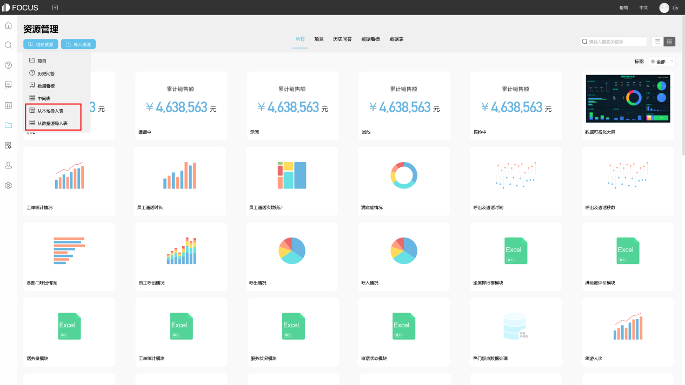
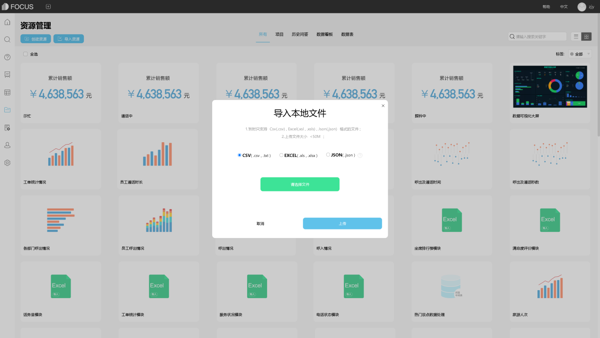
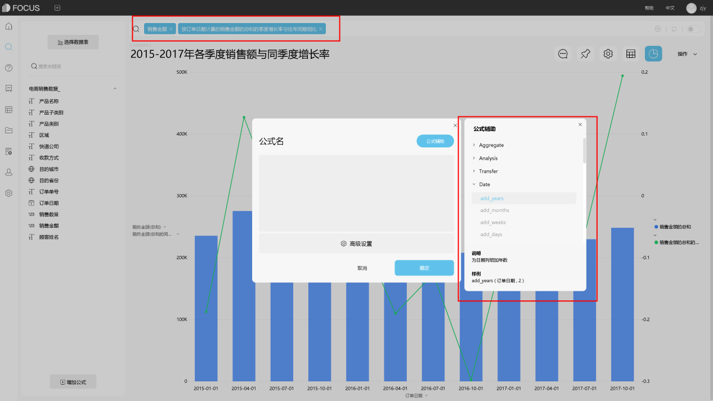
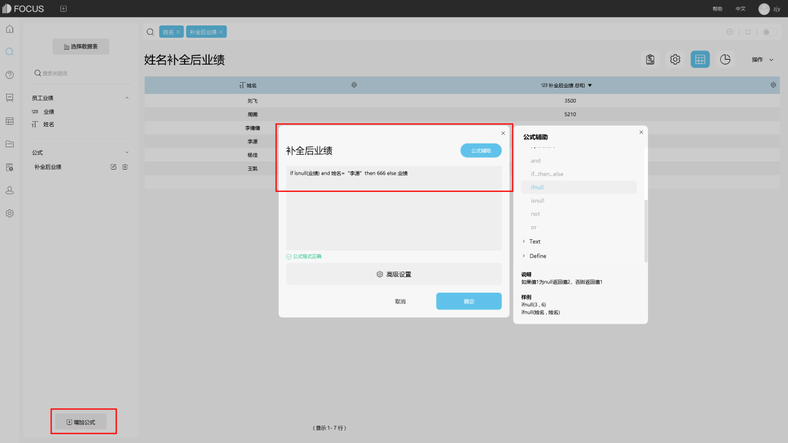
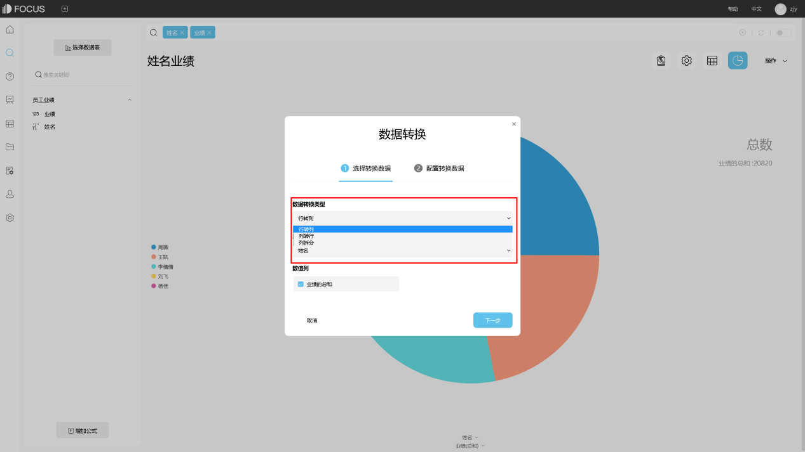

**目的：**辅助制药厂和药物研发组织分析什么药物在美国的申报通过率较高，影响因素是什么。

**摘要 ：** 本报告使用DataFocus系统，数据记录了美国自1990年起申报审批通过的药物的相关信息，案例主要从产品类型、服用方式、出品公司、药物类别及剂量包装等角度进行分析，比较不同药物的通过情况和同类药物的不同规格等各类因素，针对性地分析药物申报结果产生的原因。分析结果可帮助工厂进一步准确的药物申报通过的原因，实质性地帮助决策工厂研发何种类型的药物以及药物的规格和申报方向，从而提高研发药物的申报通过率，保障产值。分析结果显示：人类非处方药和人类处方药是审批通过最多的药物。审批通过的人类用药中服用方式最多的是口服药和外用涂抹用剂，再其次是皮下注射和静脉注射。针对人类药分析它审批通过的口服剂与外用涂抹剂的剂量信息分布。发现口服药中药片（无药衣和有药衣）、液体以及胶囊规格的占比很大，外用涂抹药中乳霜、药液以及洗液规格占比较多。已通过审批最多的药物是布洛芬，市面上生产布洛芬的厂家很多且分布较为均匀，没有占比明显很大的厂家，其中Cardinal Health是占比最大的厂商；片剂（有无药衣）和悬浊液的布洛芬产品数量最多；200mg/l、100mg/5ml以及800mg/l三种规格的布洛芬产品数量最多；自2009年开始布洛芬药物的审批量突然暴涨且此后每年的通过量稳定在历年平均值之上。

**关键词：**DataFocus,医药行业,药物申报

## 一、案例背景

药物信息：产品ID、产品类型、药物代码、服用方式、剂量信息、药物规格、生产商。

包装信息：产品ID、包装药物代码、包装详情。

## 二、案例问题

医药行业每研发发布一个新的药物都需要向国家申请批准后才能正式投入生产营销，数据记录了美国自1990年起申报审批通过的药物的相关信息，案例主要从产品类型、服用方式、出品公司、药物类别及剂量包装等角度进行分析，比较不同药物的通过情况和同类药物的不同规格等各类因素，针对性地分析药物申报结果产生的原因。帮助工厂进一步准确的药物申报通过的原因，实质性地帮助决策工厂研发何种类型的药物以及药物的规格和申报方向，从而提高研发药物的申报通过率，保障产值。

## 三、案例分析

进入DataFocus系统，从数据管理页面中导入数据源“药物信息”和“药物包装”，关联两表并在数据看板页面创建新的数据看板，命名为“美国历年药物申报情况分析”。 1.通过审批的药物类型分布 由图可得，人类非处方药和人类处方药是审批通过最多的药物。

2.人类用药的常用服用方式分布

审批通过的人类用药中服用方式最多的是口服药和外用涂抹用剂，再其次是皮下注射和静脉注射。

3.常用药物的剂量信息分布

针对人类药分析它审批通过的口服剂与外用涂抹剂的剂量信息分布。发现口服药中药片（无药衣和有药衣）、液体以及胶囊规格的占比很大，外用涂抹药中乳霜、药液以及洗液规格占比较多。

4.审批通过药物数量排名

图中可看到审批通过的产品数量最多的前十种药物。

接下来，我们选取其中最多的布洛芬假定为药厂通过上述分析计划进行开发申报的药品，对布洛芬的现有市场情况进行进一步的分析。

5.布洛芬的市场占比情况

由图我们可以看到，在已经申报通过布洛芬这一类药品的制药商，在这一市场中的产品数量占比情况。市面上生产布洛芬的厂家很多且分布较为均匀，没有占比明显很大的厂家，其中Cardinal Health是占比最大的厂商。

6.市面上布洛芬的剂量类型占比

由雷达图可以看出现有各种剂量规格的布洛芬在市场上的占比，可以由此确定各种计量规格的该类药品是最畅销的，在以后的生产中就可以多生产该类计量规格的布洛芬。我们可以看出片剂（有无药衣）和悬浊液的布洛芬产品数量最多。

7.市面上布洛芬的药物规格分布

可以看出200mg/l、100mg/5ml以及800mg/l三种规格的布洛芬产品数量最多，结合上一answer确定市场需求量最多的布洛芬药物规格。

8.每年审批成功的布洛芬类产品数量变化

自2009年开始布洛芬药物的审批量突然暴涨且此后每年的通过量稳定在历年平均值之上。

将8个结果图导入“**美国近年药物申报情况分析**”的数据看板。排版如下：

## 四、结论

人类非处方药和人类处方药是审批通过最多的药物。审批通过的人类用药中服用方式最多的是口服药和外用涂抹用剂，再其次是皮下注射和静脉注射。针对人类药分析它审批通过的口服剂与外用涂抹剂的剂量信息分布。发现口服药中药片（无药衣和有药衣）、液体以及胶囊规格的占比很大，外用涂抹药中乳霜、药液以及洗液规格占比较多。已通过审批最多的药物是布洛芬，市面上生产布洛芬的厂家很多且分布较为均匀，没有占比明显很大的厂家，其中Cardinal Health是占比最大的厂商；片剂（有无药衣）和悬浊液的布洛芬产品数量最多；200mg/l、100mg/5ml以及800mg/l三种规格的布洛芬产品数量最多；自2009年开始布洛芬药物的审批量突然暴涨且此后每年的通过量稳定在历年平均值之上。

## 五、对策建议

药厂可以根据分析得出的结果研发适合药物规格的布洛芬类药剂并进行申报审批。
