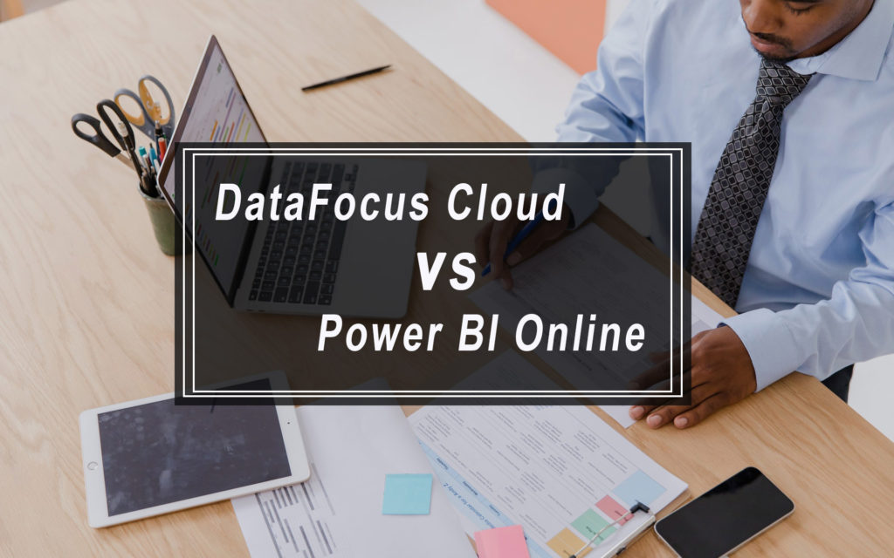
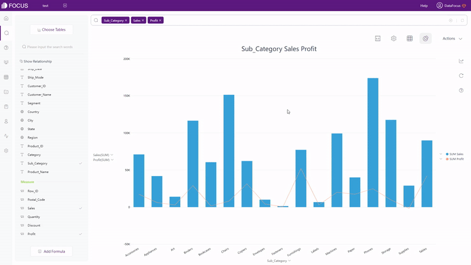
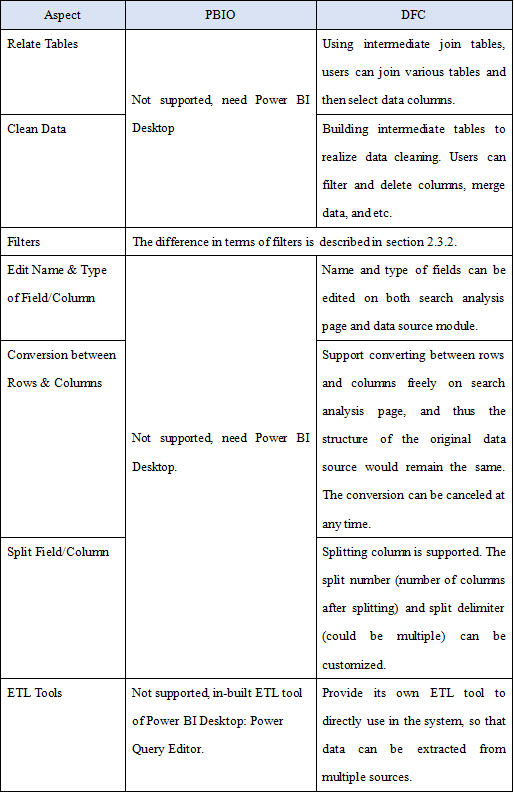
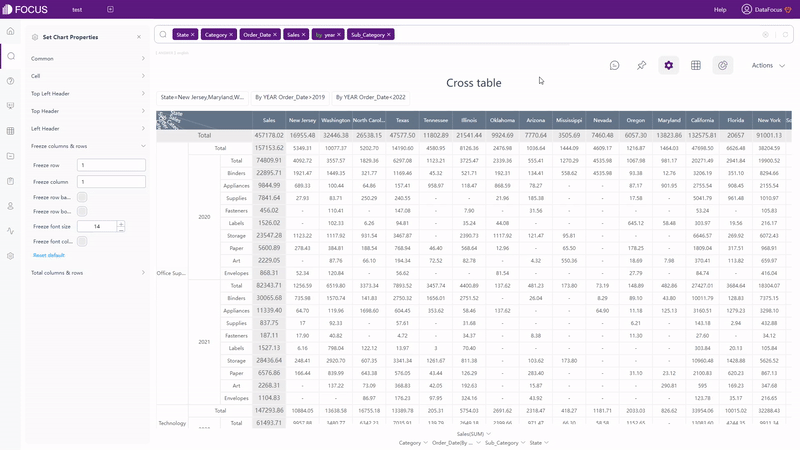
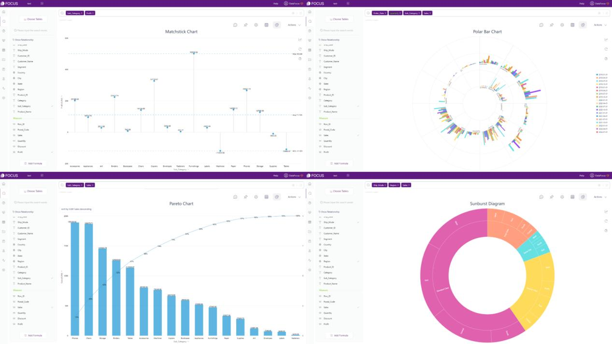
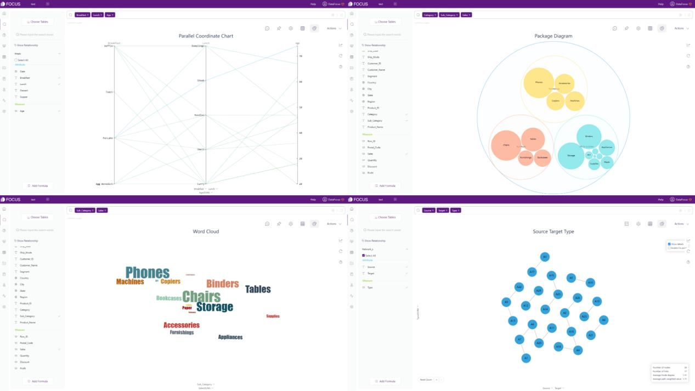
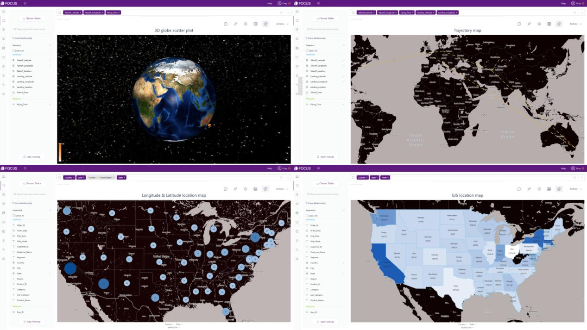

Power BI Online（下称PBIO，别称：Power BI Service）和DataFocus Cloud（下称DFC）作为两大有竞争力的BI（商业智能）和SaaS（软件即服务）工具，帮助用户完成数据处理、数据分析和数据可视化。

DFC 以合理的费用提供了便捷的交互模式——基于搜索的分析、简单的数据处理、酷炫的可视化、全面的资源管理和跨团队协作系统。

在一定的学习成本下，团队、组织或公司如何选择更合适的工具？阅读更多内容以了解这两个工具之间的差异。

# 简介

PBIO是一个主要以选按和拖放为主要交互方式的可视化分析工具。通过Azure、SQL 和 Excel等现有 Microsoft 系统，使用PBIO时可以简便处理数据并创建可视化以提供数据的多视角视图。

DFC 具有全栈功能，是一种基于搜索的分析工具。 DFC旨在让数据理解人类语言，并将业务人员转变为数据专业人士。由人工智能驱动，引领数据分析云时代。

# Power BI vs. DataFocus Cloud

## 2.1 核心用户

PBIO 针对所有群体的用户，包括初学者、中级和高级分析师。它对熟悉 Excel和其他 Microsoft产品的人特别友好。但是，与更适合报表设计者的Power BI Desktop相比，PBIO更适合分析报表的使用者。

DFC也适合有或没有经验的商业精英和数据分析师。尽管它没有 Microsoft 那样的强大社区，但 DFC 具有全栈功能，可以满足从数据可视化到报告创建的各种需求。

## 2.2 数据源

PBIO支持的数据源较为有限，主要有两种获取数据的方式：

**1.发现内容**

连接到各种外部服务，并且只能查看看板和报告。

**2.创建新内容**

(1) 文件

可以导入 Excel 和 CSV 文件，限制为 1 GB（较大的数据集需使用 Power Bi Premium）。其他类型的文件在上传前需要转换为Excel格式或Power Bi Desktop文件加载；

而外部数据源，则需要使用Power BI Desktop来查询和导入数据；

(2) 数据库

Azure SQL数据库、Azure Synapse Analytics (前身是SQL数据仓库)和 Spark on Azure HDInsight可以直接连接。而其他类型的数据库，则需要使用 Power BI Desktop或 Excel。直接从数据库中查询的限制为 100 万行数据，并且所有的表都应来自单个数据库。除此之外，如果调用一个复杂的查询，它可能会弹出一个错误，而且不支持对表中时间相关数据的特殊操作；

在 DFC 中检索数据有 4 种不同的方法：

1. 本地上传CSV、Excel、JSON文件；
2. 上传数据仓库，可以满足数十亿数据的大数据场景；
3. 直接连接数据库。把DFC 用作数据仓库，实时更新数据和可视化。更重要的是，可以同时连接不同的数据库，并实时连接和分析来自不同数据库的表；
4. 外部用户可以利用数据访问API许可外部资源后，通过API接口上传数据。

详细数据来源如下：

Table Figure 2-1 Data sources

## 2.3 易用性

### 2.3.1 交互方式

PBIO 利用选择和拖放的操作来创建图表和仪表板。尽管拖放可以创建特殊的交互，但这样会花费大量时间，尤其是在创建复杂的可视化的情况下。

DFC应用简单易上手的搜索式分析。如图2-2所示，在搜索框中输入需求，系统会自动返回结果，之后可以更改图形类型。

GIF Figure 2-2 Search-Based interaction

这两个交互模式有不同的侧重点。拖放专注于创建图形，因此用户会专注于实现可视化。而基于搜索的交互旨在进行数据分析，因此用户可以搜索和评估他们脑海中出现的任何内容。

### 2.3.2 数据筛选

PBIO主要有3类数据筛选方式：

**1.突出显示**

突出显示不会删除那些不相关的数据，但会使它们变暗。此外，可以使用交叉突出显示页面上所有可视化图标中的相关值。

**2.过滤器**

通过过滤器窗格添加和编辑单个图表、整个页面或整个报告的过滤器，其中可以自定义过滤器窗格的格式。筛选器窗格中有许多不同类型的筛选器，包括自动筛选器、手动筛选器、包含和排除筛选器等。

**3.切片器**

将切片器添加到仪表板以缩小数据集。切片器作为可视化的一部分，可以过滤整个页面/报告中的所有图表。

**DFC 共有 5 种添加过滤器的方法：**

**1.突出显示**

通过将鼠标悬停在数据或图表（问答）的一部分或单击数据点，将出现悬停文本或者该点/区域会被突出显示。

**2.过滤器**

**3.筛选关键词**

在搜索分析页面，输入筛选关键词，如图2-3所示。查看 DataFocus 支持的（筛选） 关键词的完整列表：[关键词](http://192.168.0.22:4001/keywords/).

GIF Figure 2-3 Filter keywords

**4.选择**

选择要高亮的区域，如图2-4所示。点击“重置”按钮，可以显示隐藏数据。

GIF Figure 2-4 Select to include

**5.图表过滤**

对于表格（数值表和数据透视表），点击设置按钮添加过滤器，如图2-5所示。对于图 形（包括交叉表），如图 2-6 所示，在图形界面的坐标轴上添加过滤器。非时间属性 列可以批量添加过滤器。

GIF Figure 2-5 Filter - tables

GIF Figure 2-6 Filter - graphics

1. **看板内筛选互动**

在看板的查看页面，点击数据点/区域，看板上的所有图表都会被同时筛选，如图2-7所示。通过单击“回退”按钮，筛选效果将被移除。

GIF Figure 2-7 Filter - dashboards

PBIO 和 DFC 都提供各种筛选的方法。 DFC使用起来更方便简单，可以一键完成可视化看板的过滤。

### 2.3.3 公式

DAX（数据分析表达式）功能强大，可以分析一些复杂的情况，例如计算同比增长率。但是，目前，PBIO并不支持 DAX。必须在Power BI Desktop的查询编辑器中编写 DAX 公式或 M 查询。

要分析高级指标，例如同比增长率，在 DFC 中有两种方法可以满足这些需求：

**1.关键词**

DFC的关键词足够全面，可以分析复杂的业务需求。以上面的例子为例，通过使用增长关键词，可以立即计算出同比增长率，如图2-8所示。此处列出了所有DFC支持的关键词： [关键词](http://192.168.0.22:4001/keywords/).

GIF Figure 2-8 Growth keywords

**2.公式**

DFC 提供各种公式。在比较复杂的情况下，可以编写自己的公式。这里是所有的[公式列表](http://192.168.0.22:4001/formula-list/).

### 2.3.4 部署

Power BI有多个版本，包括桌面版、在线版、移动版、报表生成器、报表服务器和嵌入式版本。虽然可以在任何系统上使用PBIO，但Power BI桌面版不能直接在 macOS 或 Linux 系统上使用，因此很多功能比如数据处理都无法使用。所以，这两个系统的使用者可能会觉得不方便。

DataFocus Cloud是一个SaaS平台，提供可在任何系统上使用的一站式服务。可以随时随地完成数据处理、数据分析、可视化创建以及与其他合作者的资源共享。DataFocus Cloud提供了一个整洁全面的协作系统，使合作更加便捷、系统化。

## 2.4 数据处理

下表显示了两个工具在数据处理方面的差异。

Table Figure 2-9 Data processing

## 2.5 可视化

在可视化方面，PBIO 和 DFC 的区别在三个方面中列出：表格、图表和可视化看板。

### 2.5.1 表格

在 PBIO 中，只有一种表格形式。用户可以自定义各种格式，包括背景颜色、字体大小、对齐方式和条件格式。

DFC 中有 3 种不同类型的表格。

**1.数值表**

数值表以二维表格式显示数据。如图2-10所示，用户可以添加索引、总行数、热图显示等。

Figure 2-10 Grid table

**2.数据透视表**

数据透视表以树状结构显示数据。和数值表相似，如图2-11所示，用户可以添加合计行、小计行、也可以改变颜色、用红色显示负数等。

Figure 2-11 Pivot table

**3.交叉表**

交叉表以多维表格式展示数据，适合大多数复杂的表结构需求。如图 2-12 所示，用户可以选择固定特定的列和行，还可以添加顶部和左侧标题，添加汇总行等。

GIF Figure 2-12 Cross table

### 2.5.2 图像

PBIO中有20多种可以直接使用的图表类型。除了这些现有的常用图表外，用户可以下载Microsoft及其合作伙伴创建的各种视觉对象。用户还可以构建自己的视觉对象或从同事那里导入。

DFC 支持的图表类型超过 50 种。除了柱状图、饼状图等常用图形外，还支持这些图表的变体，如火柴棒图、帕累托图、极坐标柱状图、旭日图等。因此，您可以在系统内直接构建各种图形，而无需导入外部资源。

Figure 2-13 Common graphics

DFC还提供了很多高级的图像，如平行坐标图、打包图、词云图、网络图等。

Figure 2-14 Advanced graphics

DFC还支持多种地图类型，包括3D地球散点图、轨迹图、经纬度定位图、GIS定位图等。此外，用户还可以将自己的地图或地理数据导入到系统。

Figure 2-15 Maps

除了静态图表，DFC还支持动态图表，如水位图、时间序列散点图、3D地球飞线图等。

GIF Figure 2-16 Water-Level chart

GIF Figure 2-17 Time series scatter plot

GIF Figure 2-18 3D globe fly line

### 2.5.3 看板

对于可视化，Power BI区分看板和报表，其中看板是不包含任何磁贴或小部件的单个画布，报表是可以包含多个页面和视觉对象的交互式视图。

DFC并没有将看板和报表的概念明确分离，而是提供轮播看板来设置多个看板以及菜单看板来排列看板。 DFC中的看板也是单个画布，但可以自定义看板大小以适应各种设备。

此外，看板的设置具有高自由度，包含两种布局。第一种是网格布局，用户可以在其中利用网格来放置问答（图表）。第二种是自由布局，可以自由放置问答。

GIF Figure 2-19 Different layouts

DFC还提供了模板供用户在新建看板时直接使用，包括Youtube KPI、财务KPI等。

Figure 2-20 Dashboard templates

除了上面提到的之外，DFC 还提供了几种素材组件，例如tab空间和 Iframe组件（用于添加网站）。这些素材可以在看板中使用，使可视化更加生动。

GIF Figure 2-21 Material components - tabs

GIF Figure 2-22 Material components - Iframe

## 2.6 **资源管理**

包括看板、报表、工作簿和数据集在内的资源列在导航窗格的“我的工作区”下。在工作区页面上，用户可以使用“筛选器”来选择不同类型的资源。例如，查看所有看板。

DFC 有一套完整的资源管理系统，可以使用标签来整理和快速定位资源。标签可用于问答模块、看板模块、表格模块和整体资源模块。更重要的是，资源可以分配给不同的所有者，通过角色管理，可以对资源进行统一管理。

GIF Figure 2-23 Tags

## 2.7 **团队协作**

在协作方面，PBIO的用户可以选择在工作去中与同事协作，而同事也需要 PBIO 帐户。或者用户可以在使用 Microsoft Teams进行协作，之后将来自 PBIO 的报告嵌入其中。

关于共享，可以在组织内部或外部以多种方式共享数据和资源。但是，被分享的人无权编辑报表或看板，只能查看或与之交互。

DFC 提供全面的管理，包括用户、角色和资源管理。通过为用户添加角色并将资源分配给不同的用户/部门，可以将打包的资源分配给特定的用户/部门。所以，每个不同的用户可以查看和管理不同的资源。

在 DFC 中有 2 种共享资源的方法。第一个是在系统内部共享，被分享者需要有一个 DFC 帐户。第二种是通过外部查看地址分享，外部用户可以通过网页链接或二维码查看资源并与之互动。

## 2.8 **成本**

下表中比较了价格，其中 PBIO 分用户和容量收费，而 DFC 仅按容量收费。

一方面，按用户收费的方式成本高昂且难以扩展，尤其是在海量用户中进行扩展（费用线性增长）。另一方面，用户可能会发现难以评估费用。

按容量计费更公平，不仅团队内部推广更方便，而且这种方式对用户数量不敏感。

Table Figure 2-24 Cost - PBIO

Table Figure 2-25 Cost - DFC

# 3\. 总结

DFC使用简单，具有全面的数据处理功能。它在系统内提供了50多种类型的图形，供用户构建漂亮的可视化效果。DFC以合理的成本为团队提供了一个详尽的系统来安排资源和合作。尽管仍然存在许多限制，但DFC不断升级和优化系统。点击这里[免费试用](https://www.datafocus.ai/console/)：

Power BI Online 和 DataFocus Cloud 都是来自云端的优秀数据分析平台。

PBIO 在很多方面都没有 Power BI Desktop 强大，尤其是在数据处理方面。虽然 Power BI Desktop非常强大，但它与 macOS 或 Linux 系统不兼容。但是，Power BI 拥有完整的社区，可以提供帮助和分享想法以及可视化作品。

DFC使用简单，具有全面的数据处理功能。它在系统内提供了 50 多种类型的图形，供用户构建漂亮的可视化效果。 DFC 以合理的成本为团队提供了一个详尽全面的系统来整合资源以及与团队协作。尽管仍有很多限制，但DFC会不断升级和优化系统。点击[DFC](https://www.datafocus.io/)免费试用.
