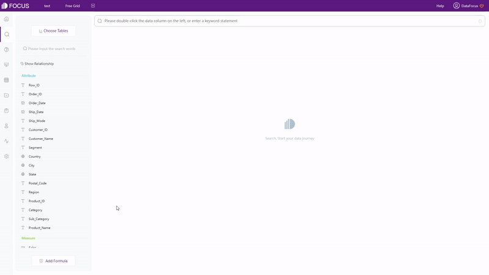
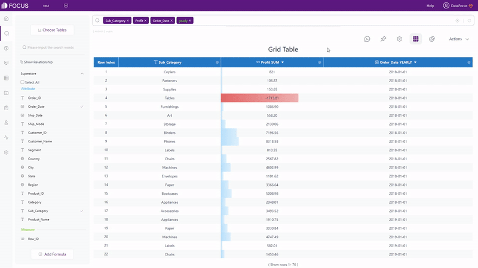
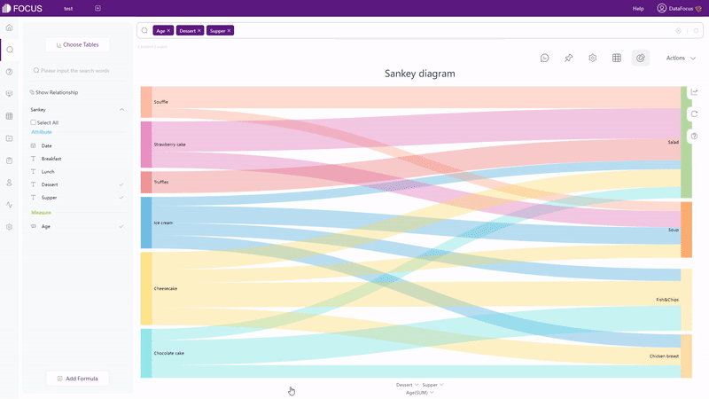
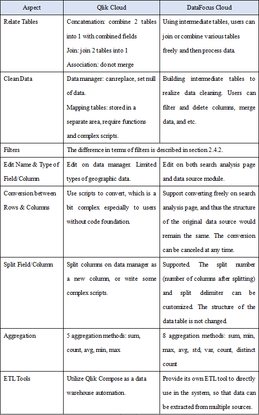
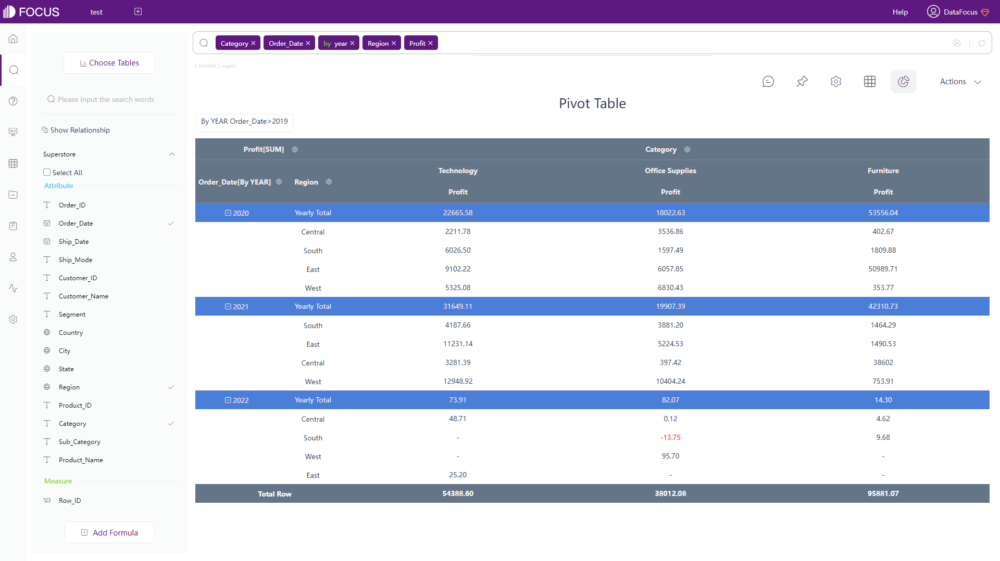
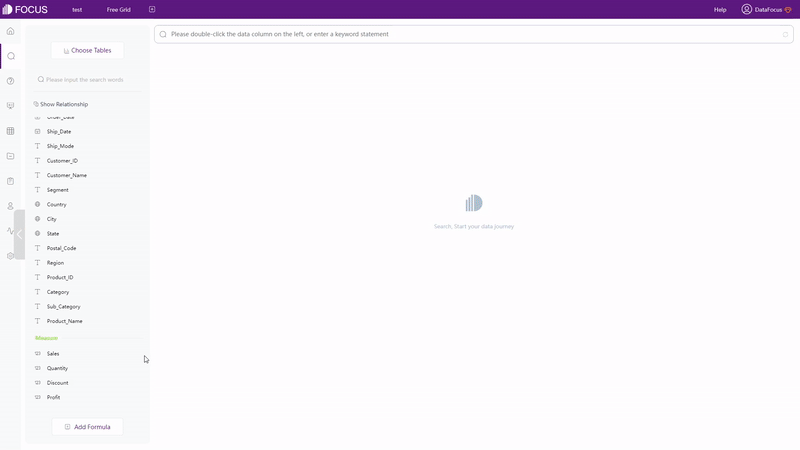
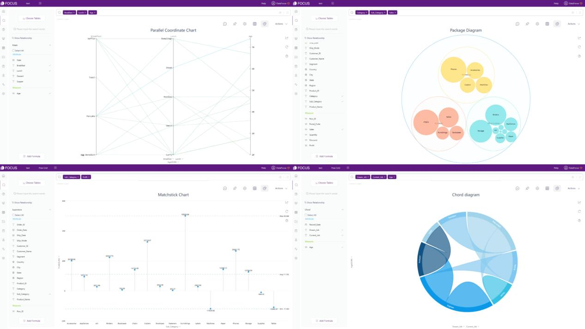
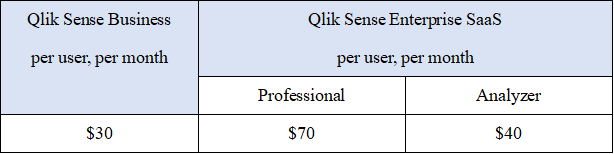

自助式BI（商业智能）工具已成为业务人员首选的数据分析工具，而SaaS（软件即服务）产品是软件的未来。Qlik Cloud和DataFocus Cloud (DFC) 作为两个兼具BI和SaaS特点的产品，在数据分析和数据可视化方面前景光明。

DFC利用基于搜索的分析，提供了便捷的可视化实现流程，系统性的资源管理及协作，让用户享受数据分析的乐趣。

阅读以了解Qlik Cloud和DFC之间的主要区别，以帮助您评估这两种工具并根据您自己的业务需求和期望选择合适的一种。

## 1.0 简介

Qlik Cloud是一个使用拖拽式交互模式的平台，旨在将原始数据在一个平台内转化为深思熟虑的行动。它是一种可以使用不同来源的数据创建动态仪表板和故事的交互工具。

DataFocus Cloud是一个基于搜索的云平台，旨在通过让数据解读人类语言，让商业精英成为数据专家。 DFC 拥有一个整洁而全面的系统，让协作变得更加容易和系统化。

## 2.0 Qlik Cloud vs DataFocus Cloud

### 2.1 应用

这两个系统中的应用是为对不同资源进行分类而构建的。虽然两个系统中的应用都可以拥有多个资源，包括数据表、可视化看板等，但它们之间仍然存在差异。

Qlik Cloud 中有两种应用，Qlik Sense 应用和 QlikView 应用。

<table><tbody><tr><td>方面</td><td>Qlik Sense应用</td><td>QlikView应用</td></tr><tr><td>创建</td><td>在 Qlik Cloud hub 中创建；

或从其他的部署上传</td><td>从 QlikView AccessPoint 分发；

或从其他部署上传</td></tr><tr><td>权限</td><td>可以浏览编辑整个应用，包括工作表和故事</td><td>仅可查看或与可视化交互</td></tr><tr><td>分享</td><td colspan="2">可以与其他成员共享</td></tr></tbody></table>

DataFocus Cloud中的云应用也可以分为创建和邀请两种。

<table><tbody><tr><td>方面</td><td>创建的应用</td><td>被邀请的应用</td></tr><tr><td>创建</td><td>登录后自动创建</td><td>受其他成员邀请</td></tr><tr><td>权限</td><td>用户是管理员，可以自由处理资源，包括创建/编辑/共享资源等。</td><td>根据权限，不同的用户可以查看/编辑不同的资源。</td></tr><tr><td>分享</td><td colspan="2">可以与其他成员共享（有权限要求）</td></tr></tbody></table>

用户可以在Qlik Cloud中创建和拥有多个应用，而DFC的每个用户（作为管理员）只有一个主云应用。应用如何影响资源管理和协作将在第2.7节和第2.8节中介绍.

### 2.2 系统界面

在Qlik Cloud的云应用中心，有 4 个版块：“入门”、“主页”、“目录”和“集合”，所有版块都以不同的方式列出资源。

在数据处理页面和可视化页面，导航栏位于顶部，用户可以在其中快速切换“准备”、“分析”和“叙述”页面。

另外，看板的编辑页面有很多不同的项目，比如字段、属性、过滤器、预览源表等等。太多的信息可能会使新用户觉得不知所措。此外，在这种情况下，虽然可以选择“全屏”显示，但可视化区域会相对较小。总的来说，用户可能会觉得界面有点乱。

在DataFocus Cloud的控制台页面上，有“首页”、“我的云应用”、“费用中心”、“个人信息”4个版块，如图2-1所示。“首页”列出了所有的应用和有关帮助中心的信息。“我的应用程序”显示每个应用的详细信息，而“我的帐户”列出订单信息。用户可以在“个人资料”部分更改头像、显示名称等。

Figure 2-1 User Interface

在应用内部，有10个不同的模块，详细信息可以在这里查看：模块。导航栏位于顶部和左侧，用户可以在不同的模块之间快速切换，例如从表格模块到看板模块。

在搜索分析页面上，除导航栏外，主要有列名、搜索框、可视化区域三个部分。可视化区域占据了页面的大部分，让用户可以专注于制作图表，如如图 2-2 所示。在字段显示方面，Qlik Cloud选择按字母顺序排列，而 DFC 将列分为属性列和度量列两种。

Figure 2-2 Search analysis page

### 2.3 数据源

Qlik Cloud支持 2 种数据源： 2.3.1 数据集 上传数据文件，支持的文件类型包括文本文件、HTML表格、Excel文件等。 2.3.2 数据连接 通过连接到远程存储的数据库或文件等外部数据源，可以创建数据集。

在DataFocus Cloud中有 4 种方式获取数据：

1. 上传本地文件；
2. 导入数据仓库，满足亿万级数据的大数据场景；
3. 连接数据库。 把DFC用作数据仓库，实时更新数据和可视化等资源。并且可以同时连接不同的数据库，从而可以同时连接和分析来自不同数据库的表；
4. API授权外部资源后可用于访问数据；

DFC支持的数据源：

Table Figure 2-3 Data sources

### 2.4 易用性

#### 2.4.1 交互模式

通过拖拽操作，用户需要将字段拖到特定区域（属性窗格或可视化图表中）才能开始分析。当制作一个复杂的可视化图表时，这样的方式可能会很耗时。

在添加列（字段）方面，DataFocus Cloud 有三种方式。

1. 双击列名；
2. 选择列并单击箭头按钮。这适合需要添加很多列的情况；
3. 在搜索框中输入列名。

使用基于搜索的分析，如图 2-4 所示，在搜索框中输入需求后，系统会自动给出分析结果。

GIF Figure 2-4 Search-Based interaction

两种交互方式的关注点不同，效果也不同。拖拽式交互专注于创建图表，引导用户专注于实现可视化。而基于搜索的交互以数据分析为目标，让用户通过搜索随时蹦现的灵感来实现数据分析。

#### 2.4.2 数据筛选

Qlik Cloud中主要有 4 种筛选数据的方式。

1. 选择:通过单击数据点或选择数据区域，可以将页面上的图表一起过滤。
2. 筛选器:筛选器只能在标准编辑模式下应用，并且每个过滤器都应用于单个图形。
3. 套索选择:通过手绘圆圈，可以选择特定数据。应用套索选择时，页面上的所有可视化将被一起筛选。
4. 筛选器窗格:可以在看板上添加筛选器窗格，一次过滤多个维度。

DataFocus Cloud中有 5 种筛选数据的方式： 1.选择

与Qlik Cloud类似，单击数据点或选择数据区域以包含数据。点击“重置”按钮，隐藏的数据会再次显示出来，如图2-5。

GIF Figure 2-5 Select to include 2.筛选器

- - 关键词:搜索分析模块中，在搜索框使用筛选关键词，如图2-6所示。在此处查看DFC支持 的（过滤）关键字的完整列表：关键词.

GIF Figure 2-6 Keywords

- - 在表格里筛选:对于数值表和数据透视表，可以在设置按钮下添加筛选器，如图 2-7 所示。非 时 间属性列可以批量筛选。

GIF Figure 2-7 Filter - tables

- - 在图像中筛选:对于图形（包括交叉表），如图 2-8 所示，可以在坐标轴上添加筛选器。同样，用 户可以批量筛选非时间属性列。

GIF Figure 2-8 Filter - graphics

- - 在看板里筛选:在看板的查看页面，点击数据点或选择图表的某个区域，即可一次性筛选所有的可 视化，如图2-9所示。单击“恢复”按钮将清除筛选效果。

GIF Figure 2-9 Filter - dashboards

#### 2.4.3 公式

Qlik Cloud提供多种公式，包括文本函数、转换函数、日期函数等。用户可以使用公式在“数据管理器”中添加计算字段，该字段将成为表格的一部分。该数据管理界面提供预览以在添加公式时查看结果。但是，表达式的提示相对较弱，因为它不提示语法。

DataFocus Cloud不仅提供了各种公式，还允许自定义公式，让用户可以编写自己的公式。有两种添加公式的方法：

- - 搜索框:直接在搜索框中输入公式，如图2-10所示。

GIF Figure 2-10 Formulas in search box

- - 公式:单击搜索页面底部的“添加公式”按钮。在弹出的窗口中，如图 2-11 所示，可以添加公式。通过公式助手提供的描述和示例，编写公式变得更加容易和快捷。更重要的是，提示符还会显示语法，方便添加公式。查看 DFC 支持的整个公式列表。

GIF Figure 2-11 Add formulas

### 2.5 数据处理

关于数据处理，下表显示了多方面的差异。

<table><tbody><tr><td>方面</td><td>Qlik Cloud</td><td>DataFocus Cloud</td></tr><tr><td>关联表</td><td>串联：将两个表格合并为具有组合字段的单个表格

联接：将 2 个表合并为1 个表

关联：不合并</td><td>使用中间表，用户可以自由地连接或组合各种表，然后处理数据。</td></tr><tr><td>清理数据</td><td>数据管理器：可以替换、设置数据为空。

映射表：存储在单独的区域，需要函数和复杂的脚本。</td><td>构建中间表，实现数据清洗。用户可以筛选、删除列，合并数据等。</td></tr><tr><td>筛选器</td><td colspan="2">筛选器方面的差异在第2.4.2节中描述。</td></tr><tr><td>编辑字段/列的名称和类型</td><td>在数据管理器上编辑。有限类型的地理数据。</td><td>可在搜索分析页面和数据源模块上进行编辑。</td></tr><tr><td>行列转换</td><td>使用脚本进行转换。这对于没有代码基础的用户来说比较复杂。</td><td>在搜索分析页面可自由转换，原数据源结构不变，可随时取消转换。</td></tr><tr><td>拆分字段/列</td><td>在数据管理器上将列拆分为新列，或编写一些复杂的脚本来实现拆分。</td><td>支持。可自定义拆分数（拆分后的列数）和拆分分隔符，并且不改变数据表的结构。</td></tr><tr><td>聚合方式</td><td>5种聚合方法：sum、count、avg、min、max</td><td>8种聚合方法： sum, min, max, avg, std, var, count, distinct count</td></tr><tr><td>ETL工具</td><td>将Qlik Compose用作自动化数据仓库。</td><td>提供自己的ETL工具，直接在系统中使用，可以多源提取数据。</td></tr></tbody></table>

Table Figure 2-12 Data processing

### 2.6 可视化

#### 2.6.1 表格

Qlik Cloud和DataFocus Cloud都提供表格（在DFC中称为数值表）和数据透视表，其中表格以二维形式显示数据，而数据透视表以树形格式显示数据。

Figure 2-13 Grid table

Figure 2-14 Pivot table

DFC还有一种表：交叉表，多维度呈现数据，可以满足复杂业务需求，如图2-15所示。

Figure 2-15 Cross table

#### 2.6.2 图像

Qlik Cloud 有大约 20 种可视化图表，以及高级编辑模式下的几种高级图表。图表的类型可以自由切换。但是，如果原来选择的字段不满足新选择的图表类型的数据要求，那么这些字段将被清除。在DFC中，可选择的图表类型受到限制。只有选择的数据符合要求，才能选择该图表类型，如图 2-16 所示。详细的图表数据要求可以在这里看到：数据要求.

GIF Figure 2-16 Restricted chart type

DataFocus Cloud拥有50 多种图表。它不仅支持条形图、热图这类常规图形类型，还提供了这些图形的变化形式，如极坐标柱状图、帕累托图、日历热力图、相关热力图等。因此，只要数据类型匹配图表的数据需求，那么可视化图表可以轻松创建。 

Figure 2-17 Common graphics

DFC还提供了很多高阶图表，如平行坐标图、火柴图、打包图、弦图等。

Figure 2-18 Advanced graphics

在地图方面，Qlik Cloud 只有 1 种地图，但它支持多种高级设置以变换地图样式。DFC支持多种不同类型的地图，如轨迹图、经纬度位置图、GIS位置图、3D地球散点图等，无需复杂设置，轻松创建地图。此外，用户可以将自己的地图或地理数据导入系统。

Figure 2-19 Maps

除静态图表外，DFC 还支持动态图表，如时间序列气泡图、3D 地球飞行线等。

GIF Figure 2-20 Time series bubble chart

GIF Figure 2-21 3D globe fly line

#### 2.6.3 看板

看板之间的差异在以下这些方面进行了说明：

<table><tbody><tr><td>方面</td><td>Qlik Cloud</td><td>DataFocus Cloud</td></tr><tr><td>图表</td><td>在看板中创建</td><td>分开保存</td></tr><tr><td>看板尺寸</td><td>自定义</td><td>自定义且提供常用设备尺寸</td></tr><tr><td>布局</td><td>固定网格</td><td>2种：自由布局，网格布局</td></tr><tr><td>交互对象</td><td>文字、形状、媒体……</td><td>文字、图片、视频、媒体……</td></tr><tr><td>模板</td><td>不支持</td><td>支持多种</td></tr><tr><td>看板展示</td><td>叙述</td><td>轮播看板</td></tr></tbody></table>

- 图表

在 Qlik Cloud 中，图表直接在看板中创建。虽然图表可以复制和粘贴，但它们会根据数据集发生变化，因此可能会导致一些问题。

DFC 将每个图表保存为单个答案，因此可以将图表添加到任何仪表板而不会出现数据集问题。

- 看板尺寸

可以在 Qlik Cloud 中的工作表属性下自定义大小。用户可以直接输入看板的宽度和高度。

同样，用户也可以在DFC系统中直接输入看板的宽度和高度。此外，DFC还提供了一系列预设的设备尺寸，例如 iPhone、Pad、Google Pixel 等。因此，用户可以快速构建大小合适的看板以在其他设备上查看。

- 布局

在 Qlik Cloud 中，看板被分成各个网格，网格的大小可以任意修改，并且图表可以在网格之间自由移动。

在 DFC 中，有 2 种布局。在网格布局下，用户可以利用网格来帮助将图表放置；在自由布局下，用户可以任意移动图表，如下图 2-22 所示。

GIF Figure 2-22 Different layouts

- 交互对象

Qlik Cloud和 DFC都提供了各种交互对象，包括文本、图片、媒体等。这些对象使可视化更加丰富。

除了上面提到的对象外，DFC 还提供了视频和一些素材组件，例如 iframe，它可以在看板中添加网站。

GIF Figure 2-23 Video objects

GIF Figure 2-24 Material components - Iframe

- 模板

网上有很多Qlik Sense的看板示例，可以给用户看板设计的灵感。但是，用户必须一个一个地创建图表并放置它们，不能直接使用或复制示例。

DFC 提供的 YouTube KPI 等仪表板模板可以直接用于制作新的看板。选择模板后，用户只需将答案（图表）替换到看板中，即可完成看板的制作。

Figure 2-25 Dashboard templates

- 看板展示

Qlik Cloud 利用故事来叙述数据分析，而 DFC 通过轮播看板展示分析结果。可以展示多个看板，如图2-26所示。

GIF Figure 2-26 Dashboard carousel

### 2.7 资源管理

#### 2.7.1 应用

在Qlik Cloud的管理控制台下，应用程序按以下选项卡划分：源、已发布和阶段式。

DataFocus Cloud 有两种类型的应用程序，一种是用户自己创建的，另一种是由其他用户邀请的。通常应用的数量是有限的，如果应用较多，用户可以通过邀请者的名字快速定位到应用。

#### **2.7.2 图表**

在Qlik Cloud中，图表不是单独保存的，因此在Qlik Cloud中没有图表管理。

图表可以在DFC中的问答模块或资源模块上进行统一整理。此外，还可以添加标签来对不同类型的问答（图表）进行分类，如图 2-27 所示。

GIF Figure 2-27 Tags

#### **2.7.3 看板与结果展示**

在Qlik Cloud应用中，所有看板都可以在“工作表”选项卡下查看，叙述显示在“故事”选项卡下。当有大量工作表/叙述时，用户可能会发现很难找到想要的结果。

与图表类似，DFC 中的看板和轮播看板可以在看板模块或资源模块上整理。此外，也可应用标签快速检索资源。

总体而言，Qlik Cloud中的资源主要由不同的应用整理，而DFC中的每个应用程序内的资源被分隔在不同的模块中，并且可以应用标签来快速搜索资源。此外，DFC的看板可以固定在顶部导航栏，以便一键访问最重要的看板，如图2-28所示。

GIF Figure 2-28 Pin dashboards

### 2.8 团队协作

#### **2.8.1 角色**

Qlik Cloud和DataFocus Cloud都利用角色为不同的用户提供不同的权限。

Qlik Cloud还使用状态来区分可以创建内容的用户和只使用其他人创建的某些内容的用户。Qlik Cloud中的角色主要用于空间管理，每个角色可以管理部分内容和管理权限（TenantAdmin角色可以管理全部）。

DFC 提供系统角色和自定义角色。自定义角色可以由管理员用户或具有系统管理员角色的用户创建以赋予自定义权限。例如，“销售”角色只能访问与销售相关的资源。有关用户角色的详细信息可以在这里查看：角色.

更重要的是，DFC还提供了部门结构，可以将用户划分到不同的部门。然后，通过分配的角色，不同的用户可以访问不同的资源。例如，“销售”部门的“销售经理”可以创建或修改与销售相关的内容，而人力资源部门的“HR 小李”只能查看与员工KPI相关的内容。

#### **2.8.2 分享**

用户可以通过三种方式分享Qlik Cloud看板中的图表：图像、链接和嵌入。图像通过电子邮件发送，嵌入是将图表作为iframe嵌入网页中。而使用链接分享时，分享者需要先有一个Qlik账号。

除了问答（图表），看板和轮播看板也可以共享。DFC中主要有两种分享方式。一种是在应用内共享，通过授予其他用户访问权限进行分享。另一个是外部查看地址，外部用户可以直接通过链接或二维码访问可视化并与之交互，而无需拥有 DFC 帐户。

### 2.9 成本

价格比较如下表所示，其中Qlik Cloud按用户收费，DataFocus Cloud按容量收费。

按用户收费是昂贵的，并且难以在大量用户中扩展（成本线性上升）。此外，用户可能会觉得难以评估费用。

按容量计费对用户更公平，不仅更容易在团队内部传播，而且对用户数量的敏感度要低得多。

Table Figure 2-29 Cost - Qlik Cloud

 

Table Figure 2-30 Cost - DFC

## 总结

Qlik Cloud和DataFocus Cloud是两个出色的云端自助式 BI 产品，它们在许多特性和功能上有所不同，如界面、数据处理、可视化等。

Qlik Cloud 基于拖拽式的交互操作，在看板内构建可视化图表。因为界面包含太多信息，新用户可能会觉得界面太过复杂。但是Qlik Cloud仍旧提供了精美的可视化和高级的交互体验。

DFC基于搜索分析并单独保存图表和看板。通过简单而全面的系统和界面，用户可以轻松快速地创建炫酷的可视化，团队也可以更加方便地相互协作。DataFocus Cloud将不断优化系统，给用户提供更好的数据分析体验。欢迎试用：[DFC](https://www.datafocus.ai/).
