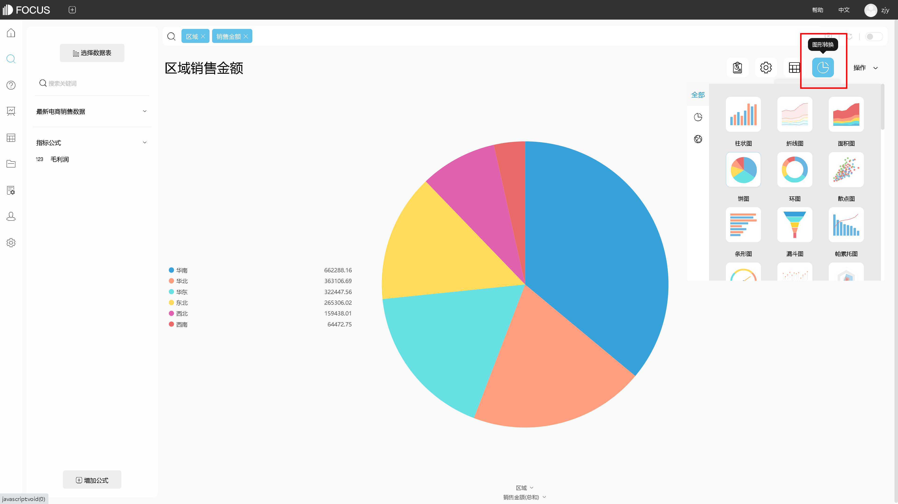
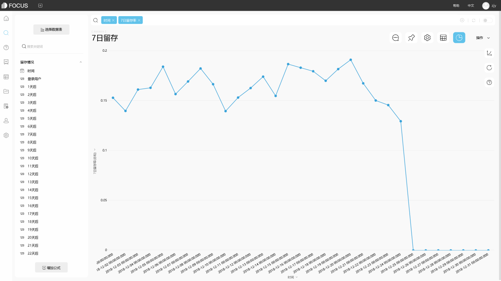

**目的：**辅助房地产商找到用户对公寓要求的主要因素和与之相关的价格接受折点，便于通过对房价的调整达到更大收益和未来开发地和建筑房型的选择。

**摘要 ：** 本报告使用DataFocus系统，数据记录了2007年8月至2017年8月在韩国大邱市大仔镇的公寓交易记录，案例主要从年份、公寓交通地理位置、公寓及所属小区特征以及公寓周围设施的角度进行分析，比较公寓每平方英尺房价和售出量，针对性地分析房价和售出量的变化特征。分析结果可帮助房地产商进一步准确的定位用户对公寓房的需求点，从而增大收益并为未来的房地产计划提供参考。最终分析可得，房价大幅上涨和持高不下后会对销售量产生负作用；反之，房价略有下降对成交量上升有明显作用。从房价指标来看0至10min路程的公寓价格明显高于10至20min的，并随着路程时间增加有下降趋势，而附近没有地铁站的公寓价格不遵循这一规律，分析应属于用户需求即是远离地铁站环境安静。。出售的公寓数量指标来看，有更为鲜明的随路程时间变化，公寓数量减少的趋势，附近没有地铁站的公寓数量为最少。公交站也遵循这一规律。结合两项指标变化特征，附近没有公交站和地铁站的公寓需求应为需求为环境安静的高级公寓。多数用户对附近学校和生活设施配备的数量比较重视，更喜欢托管式的物业管理，偏向于选择20层以下的公寓楼层。

**关键词：**DataFocus,房地产,交通,公寓管理,地理位置

## 一、案例背景

每平方英尺房价，每平方英尺的的公寓出售价格。

公寓销售量，某一维度下出售成功的公寓的个数。

## 二、案例问题

公寓的价格受到很多因素的影响，如：年份、公寓交通地理位置、公寓及所属小区特征以及公寓周围设施等，找寻这些因素与房价和售出量的变化规律，从而帮助房地产商进一步准确的定位用户对公寓房的需求点，从而增大收益并为未来的房地产计划提供参考。

## 三、案例分析

进入DataFocus系统，从数据管理页面中导入数据源“韩国大邱市大仔镇的交易数据”，并在数据看板页面创建新的数据看板，命名为“韩国大邱市大仔镇公寓交易分析”。 1.近十年每平方英尺房价的变化和公寓售出量变化 添加公式计算“每平方英尺房价”，添加“销售年份”和“公寓数量”数据列。

由图可得，房价大幅上涨和持高不下后会对销售量产生负作用；反之，房价略有下降对成交量上升有明显作用。2009年和2015年的房价徒增达到峰值，近五年平均房价较前五年有明显提升，整体房价呈波动式上升。

 

2.距离地铁站远近对房价的影响

添加“每平方英尺房价”“去最近地铁站时间”“公寓数量”数据列。

从房价指标来看0至10min路程的公寓价格明显高于10至20min的，并随着路程时间增加有下降趋势，而附近没有地铁站的公寓价格不遵循这一规律，分析应属于用户需求即是远离地铁站环境安静。

出售的公寓数量指标来看，有更为鲜明的随路程时间变化，公寓数量减少的趋势，附近没有地铁站的公寓数量为最少。

结合两项指标变化特征，附近没有地铁站的公寓需求应为需求为环境安静的高级公寓。

3.去最近的公交站时间对房价的影响

添加“每平方英尺房价”“去最近公交站站时间”“公寓数量”数据列。

我们可以看出两个指标中，都呈现了随着路程时间的的负相关变化趋势。

4.附近房价较高的地铁站

添加“每平方英尺房价”“最近地铁站”“公寓数量”数据列。

可以看出Myung-duk和Kyungbuk\_uni\_hospital站附近公寓数量和房价都相对较高，应属于较集中且各方条件较好的优质公寓，而Banwoldang和附近没有地铁站的公寓价格更高且数量稀少，属于高级公寓类。

5.各年份不同楼层公寓销售热度

将“楼层”和“销售年份”“公寓数量”加入搜索框。

近十年数据显示，用户普遍偏向于选择20层以下的公寓楼层，尤其是近五年的数据特征更为明显，其中对于6至12层尤为鲜明，在定价时，可对这一部分楼层进行特殊定价，获取更大利益。

6.事故记录数的周日期分布

将“楼层”和“销售年份”“每平方英尺售价”加入搜索框。

结合上一图表，价格关于楼层的分布符合分析。

7.公寓附近设施对房价的影响

将“销售价格”和“附近健身设施数量”“附近公寓数量”“附近公园数量”“附近医院数量”“附近学校总数”“附近设施总数”“附近酒店数量”加入搜索框。

柱状图可以看出大多数用户对附近学校和生活设施配备的数量比较重视。

8.公寓附近设施对房价的影响

将“销售价格”和“管理公寓设施人数”“公寓物业管理类型”加入搜索框。

柱状图可以看出用户普遍喜欢托管式的物业管理，管理公寓的服务人员数量大于5人时有价格上的明显增加。

将8个结果图导入“韩国大邱市大仔镇的交易数据”的数据看板。排版如下：

## 四、结论

房价大幅上涨和持高不下后会对销售量产生负作用；反之，房价略有下降对成交量上升有明显作用。2009年和2015年的房价徒增达到峰值，近五年平均房价较前五年有明显提升，整体房价呈波动式上升。

从房价指标来看0至10min路程的公寓价格明显高于10至20min的，并随着路程时间增加有下降趋势，而附近没有地铁站的公寓价格不遵循这一规律，分析应属于用户需求即是远离地铁站环境安静。出售的公寓数量指标来看，有更为鲜明的随路程时间变化，公寓数量减少的趋势，附近没有地铁站的公寓数量为最少。公交站也遵循这一规律。结合两项指标变化特征，附近没有公交站和地铁站的公寓需求应为需求为环境安静的高级公寓。

Myung-duk和Kyungbuk\_uni\_hospital站附近公寓数量和房价都相对较高，应属于较集中且各方条件较好的优质公寓，而Banwoldang和附近没有地铁站的公寓价格更高且数量稀少，属于高级公寓类。

用户普遍偏向于选择20层以下的公寓楼层，尤其是近五年的数据特征更为明显，其中对于6至12层尤为鲜明，在定价时，可对这一部分楼层进行特殊定价，获取更大利益。

多数用户对附近学校和生活设施配备的数量比较重视。

物业服务方面，用户普遍喜欢托管式的物业管理，管理公寓的服务人员数量大于5人时有价格上的明显增加。

## 五、对策建议

根据分析所得的用户选择倾向，适当调整当前定价策略可以获取更大的利润，同时针对不同用户选择公寓的需求倾向，在下一步的房产计划上对公寓各项需求定位上做出相应调整。
