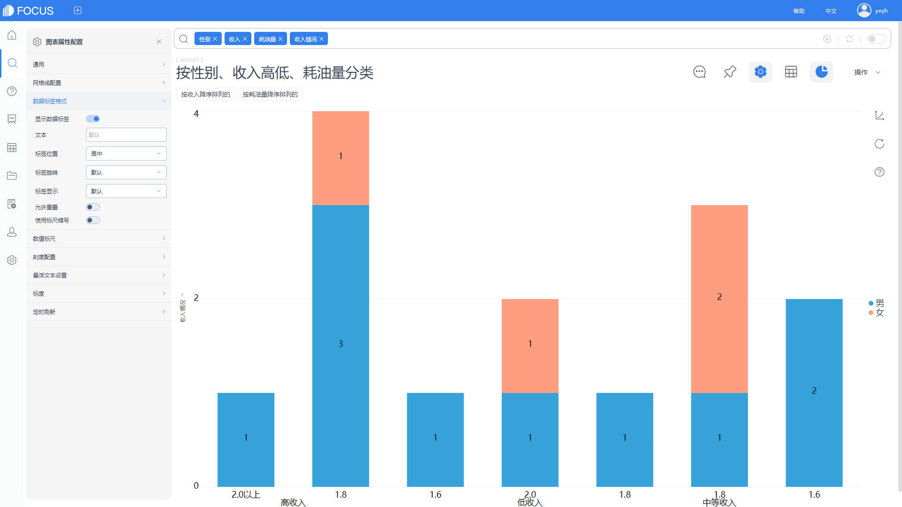
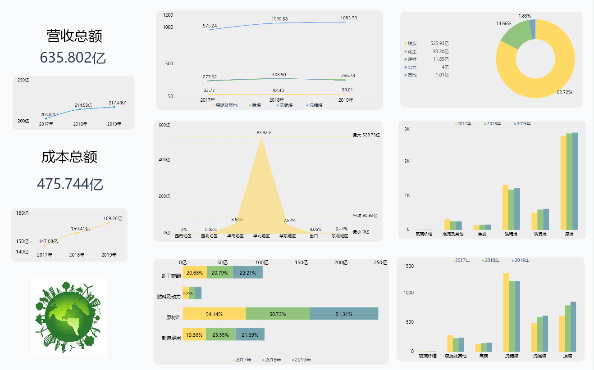

**目的 ：**为某超市的供应商的进货调整、淘汰（或淘汰其部分品种）及供应商库存商品的处理提供依据。

**摘要 ：**改革开放以来，我国零售行业取得了长足进步，保持了高速发展的势头。本报告使用datafocus系统，对某超市一月的供应商和产品数据进行分析。通过对库存量、订购量等指标的分析，得到调味品的销售量最高，饮料、肉家禽、日用品中的日正的德国奶酪、德级的浪花奶酪、佳佳的鸭肉和成记的运动饮料为滞销产品等相关结论。因此认为增加调味品类、点心类商品的订购量，减少特制品的订购量；淘汰日正的德国奶酪、德级的浪花奶酪、佳佳的鸭肉和成记的运动饮料四种产品等措施能优化超市产品结构及增加超市的利润。

**关键词：**datafocus,零售,供应商分析,存销

一、案例背景

零售业是指通过买卖形式将工农业生产者生产的产品直接售给居民作为生活消费品或售给社会集团供公共消费用的商品销售行业，其中超市是最典型的零售行业。为某超市的供应商的进货调整、淘汰（或淘汰其部分品种）及供应商库存商品的处理提供依据需要进行供应商分析。

本案例主要分析指标为“存销比”：存销比（库销比）是指在一个周期内，商品平均库存或本周期期末库存与周期内总销售的比值，是用来反映商品即时库存状况的相对数。库销比一般按照月份来计算，计算公式是：月末库存/月总销售。计算单位可以是数量，也可以是金额.

二、案例问题

零售业产品生产量大，产品的多样化导致其信息量剧增，用EXCEL来进行销售分析及决策定位已经无法满足无时无刻不再变化的新数据，使用datafocus产品就可以快速处理大量数据，因此可以极大的减少人力和时间。

三、案例分析

进入datafocus 产品系统，从数据管理页面中导入数据源“供应商产品表”、“供应商信息表”、“产品”，并在数据看板页面创建新的数据看板，命名为“供应商分析”。

在分析之前需要将这三个表进行关联，并构建模型。

A．销售总概

1.产品库存订购总概表

选择供应商产品表中“产品名称”、“库存量”、“订购量”三个数据列。并把库存量从小到大排列。从表中可以看到每个产品的库存量和订购量，让商品AD可以即时根据表中内容再订购紧缺产品。

图 1产品库存订购总概表

2.货主地区分布

选择饼图进行供应商的地区分布统计。

图 2货主地区分布

如上图2所示，该超市在华北的供应商来源占比最大为69%，其次为来自华东的供应商数量。

3.各类产品的销售量总计

通过添加公式对“销售量”进行计算，然后使用降序排序的折线图对比各类商品的销售量。

图 3各类产品的销售量总计

由图3可以看到，调味品的销售量最高，点心次之，特制品的销售量最低。

B．滞销产品分析

1.各类商品存销比

添加公式计算存销比，选择条形图展现各类商品的存销比。

图 4各类商品存销比

如图4所示，海鲜、特制品和谷类/麦片的的存销比值较低，说明商品的周转率越高；饮料、肉家禽、日用品的存销比值较高，说明该类商品存在滞销产品。

2.类别下各产品存销比

在上述基础上筛选出存销比值较高的饮料、肉家禽、日用品类商品，对类别下各产品的存销比进行探索，此次统计图选择柱状图。

图 5类别下各产品存销比

由图5可以看到，浪花奶酪、德国奶酪、运动饮料、鸭肉的存销比值较大，说明这些产品相对其他产品不畅销。

3.供应商的各类产品存销比

浪花奶酪、德国奶酪、运动饮料、鸭肉存在滞销危险，现在对这些产品的供应商进行探索。

图 6供应商的各类产品存销比

从图6中可以看到，日正的德国奶酪、德级的浪花奶酪、佳佳的鸭肉和成记的运动饮料存销比较高；义美供应商的鸭肉存销比很低，还是很受欢迎的。

4.滞销产品所在的供应商总体分析

依旧通过散点图探索从滞销产品所在的供应商订购的所有商品的存销比。

图 7滞销产品所在的供应商总体分析

由图7所示，从日正供应商订购的产品中只有德国奶酪的周转率低；从德级供应商订购的产品中只有浪花奶酪的周转率低；从成记供应商订购的产品中只有运动饮料的周转率低；从佳佳供应商订购的产品中只有鸭肉的周转率低。

将这8个结果图表导入“供应商分析”数据看板中，排版结果如下：

图 8 数据看板

四、结论

越是畅销的商品，库销比值越小，说明商品的周转率越高；越是滞销的商品，库销比值就越大，说明商品的周转率越低。存销比就是反映你用多少个单位的库存来实现了1个单位的销售，反映周转率的一个指标数据。

1.该超市在华北的供应商来源占比最大为69%。

2.调味品的销售量最高，点心次之，特制品的销售量最低。

3.海鲜、特制品和谷类/麦片的周转率较高；饮料、肉家禽、日用品中的日正的德国奶酪、德级的浪花奶酪、佳佳的鸭肉和成记的运动饮料为滞销产品。

五、对策与建议

1.增加调味品类、点心类商品的订购量，减少特制品的订购量。

2.从日正、德级、佳佳、成记四个供应商所订购商品中分别只有德国奶酪、浪花奶酪、鸭肉和运动饮料为滞销产品，其余商品周转率较高，故只需淘汰日正的德国奶酪、德级的浪花奶酪、佳佳的鸭肉和成记的运动饮料四种产品。
