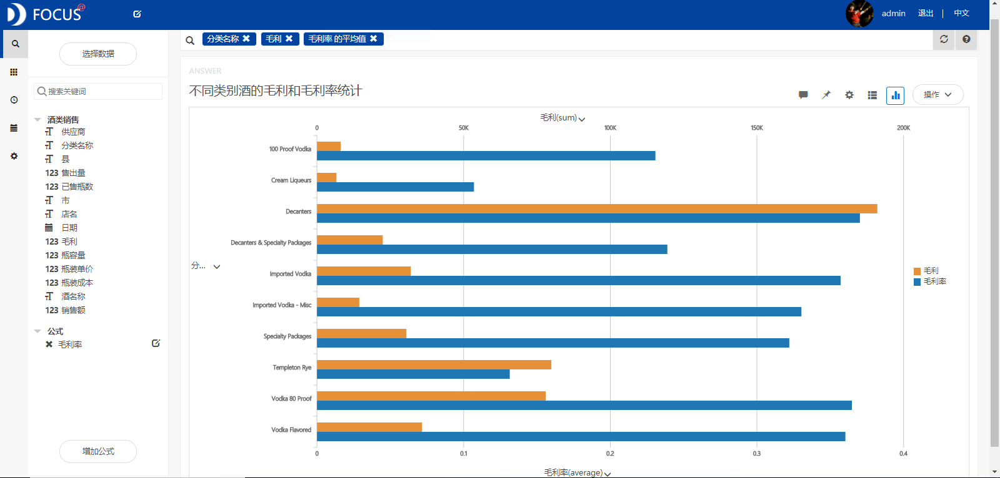

**目的：**基于美国爱荷华州2015年的酒类销售数据，利用毛利、毛利率、毛利月增长率等指标来研究不同市的酒类收益情况，以及在不同销售日期、供应商、瓶容量等情况下的收益差异。

**摘要：**美国的消费者对酒的容器还是比较看重的，偏爱于购买玻璃瓶装的酒。最喜欢的酒类型是Templeton Rye。除了6、8和9月份的毛利是负增长之外，其他月份的毛利都是正向增长的，其中7月份的增长率是最大的，这是因为7月份是爱荷华州最热的一月，人们对饮品的需求量较大。瓶容量为1750ml酒的毛利最大。Des Moines市的销售毛利最好，这主要得益于众多的人口分布。Jim beam Brands的销售毛利最好，说明该供应商提供的酒类产品最受消费者欢迎。

**关键词：**Datafocus,酒类销售,毛利

# 一、案例背景

一位经销商讲了自己的经历：用了很多资金和精力，在超市、商场、专营店上了很多货，最后却没有多少效益。后来却发现，关键是包装太差。于是，他与厂家协商后在包装上大做文章，把包装改成了礼品装，结果一炮而红。因此，包装的视觉冲击力与美感自然成为低成本营销的有力武器之一。

# **二、案例问题**

毛利是指商品的销售额减去实际成本的余额。因其尚未减去商品流通费和税金，还不是净利，故称毛利。毛利率等于毛利除以销售额，它反映的是一个商品经过生产转换内部系统以后增值的那一部分。也就是说，增值的越多毛利自然就越多。本文利用毛利、毛利率、毛利月增长率等指标来研究不同市的酒类收益情况，以及在不同销售日期、供应商、瓶容量等情况下的收益差异。这样我们就可以知道如何在激烈的酒业市场中采取正确的经营策略。

# 三、案例分析

将分析的“酒类销售”CSV文件导入到Focus系统中。

## （一）不同类别酒的销售情况

**1.销售额统计**

首先统计不同类别的酒的销售额，发现Decanters(玻璃酒瓶)的销售额是最高的，为518038.1美元，这表明美国的消费者对酒的容器还是比较看重的，偏爱于购买玻璃瓶装的酒。其次是Templeton Rye（坦普顿黑麦），销售额为469562.2美元，表明这类酒比较受消费者欢迎。****

图1 不同类别酒的销售额统计

**2.毛利和毛利率统计**

为了分析不同类别酒的毛利和毛利率情况，利用工作表中的销售额和毛利两项数据计算出毛利率，绘制成条形图如图2所示。从条形图中可以看出毛利率越大的类别，其毛利不一定越大，这主要是由产品的成本差异所导致的。分类名称为Decanters的毛利和毛利率都是最大的。由销售额的分析可知，玻璃瓶装的销售额是最大的。这说明销售玻璃瓶装的酒所获得的收益最大，最划算。 

图2 不同类别酒的毛利和毛利率统计

## （二）1-12月份毛利的月增长率情况

通过计算1-12月毛利的月增长率，分析美国爱荷华州在2015年每月的毛利变化情况，绘制折线图（见图3）。从该图中可以看出，除了6、8和9月份的毛利是负增长之外，其他月份的毛利都是正向增长的，其中7月份的增长率是最大的，说明这个月的收益相比于前一个月增加了很多，这是因为7月份是爱荷华州最热的一月，人们对饮品的需求量比较大。 

图3 1-12月毛利的月增长率

## （三）7月份酒类销售情况

**1.不同瓶容量的毛利统计**

筛选出7月份的酒类销售数据，利用面积图来分析不同瓶容量条件下的酒类销售毛利情况。从图4中可以发现瓶容量为1750ml酒的毛利最大，其次是瓶容量为750ml的。

图4 7月份不同瓶容量酒的毛利情况

**2.不同市的毛利统计**

根据前面的分析结果筛选出瓶容量为1750ml的销售数据，分析每个市的酒类销售毛利情况，绘制出柱状图（见图5）。从柱状图中我们可以看到，各市酒类销售的毛利差异很大，其中Des Moines市的销售毛利最好，这主要得益于众多的人口分布，并且它是爱荷华州的首府，是该州最繁荣发达的城市。 

图5 7月份不同市的毛利情况

**3.不同供应商的毛利统计**

基于2015年7月份瓶容量为1750ml酒的销售数据，针对不同的供应商进行分析。从图6中我们可以发现Jim beam Brands（美国金宾酿酒集团）的酒类销售毛利最好，说明该供应商提供的酒类产品最受消费者欢迎。****

图6 7月份不同供应商的毛利情况

## （四）数据看板

最后将这6个结果图导入“酒类销售数据分析”数据看板中，操作结果如下： 

图7 数据看板

# 四、结论

美国的消费者对酒的容器还是比较看重的，偏爱于购买玻璃瓶装的酒。最喜欢的酒的类型是Templeton Rye（坦普顿黑麦）。除了6、8和9月份的毛利是负增长之外，其他月份的毛利都是正向增长的，其中7月份的增长率是最大的，说明这个月的收益相比于前一个月增加了很多，这是因为7月份是爱荷华州最热的一月，人们对饮品的需求量较大。瓶容量为1750ml酒的毛利最大，其次是瓶容量为750ml的。Des Moines市的销售毛利最好，这主要得益于众多的人口分布，并且它是爱荷华州的首府，是该州最繁荣发达的城市。Jim beam Brands的酒类销售毛利最好，说明该供应商提供的酒类产品最受消费者欢迎。

# 五、对策建议

为了增加零售收益，我们首先可以考虑在Des Moines市多开几家零售连锁店，拓展在该市的销售市场。其次由于Jim beam Brands供应商的销售收益比较好，所以我们可以从该供应商处购进更多量的酒类产品。此外，酒的容器应主要为玻璃瓶装的，瓶容量应主要选择1750ml的。最后，由于7月份的需求量比较大，所以应该在该月份购进比其他月份更多量的产品以备销售。
