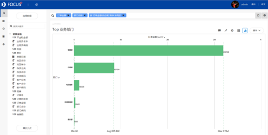
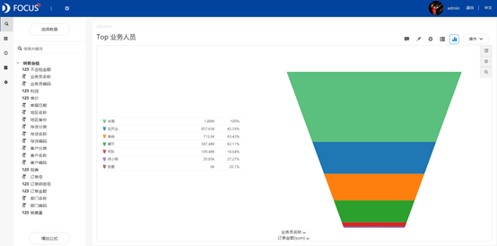
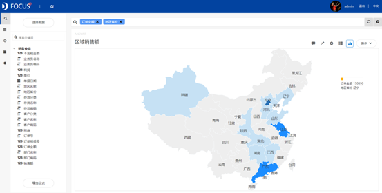
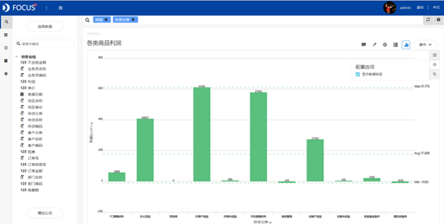
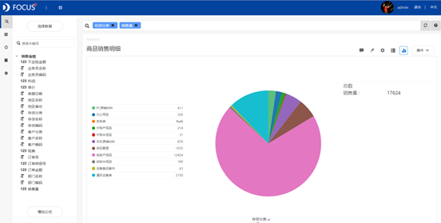
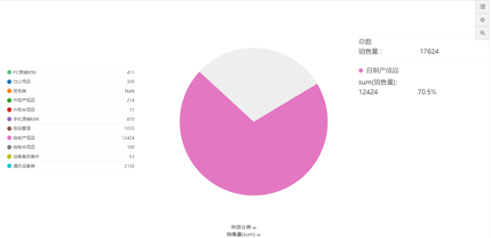

摘要 ：销售业绩报表是一个企业管理的重要内容之一。本报告使用datafocus系统，对2014年12月至2015年1月的销售数据进行分析。通过对销售业绩、销售形势、销售额构成三大板块的汇总分析，得出业务人员的销售能力差异大；经济发达地区销售情况更佳等分析结果。因此认为通过强化团队精神，考核指标表转化；增加宣传、扩充门店和渠道等措施能充分调动公司的各种资源，支持决策调整并开拓深入市场。

关键词：datafocus；销售业绩；销售趋势；销售额构成比例

一、案例背景

某办公零售公司面临着电商销售订单日趋下滑的问题。为了发现市场存在的潜在问题和机会，充分调动公司的各种资源，节省人力成本，增加市场竞争力，对企业销售业务报表的图表智能化显得越来越有必要。通过提高报表编制的科学性，充分发挥报表的作用，将直接影响到企业的经营状况。

二、案例问题

如今大部分企业的销售业绩周报表、月报表、年报表是通过EXCEL来实现的。但是如果数据量太大，用EXCEL来进行操作会略显麻烦。本案例使用datafocus产品来快速实现并完善某办公零售企业销售业绩报表，datafocus 产品可以一键处理大量的数据，做出来的图表可以根据业务人员的新销售数据及时进行自动更改，因此可以极大的减少人力和做报表的时间。

三、案例分析

进入datafocus 产品系统，从数据管理页面中导入数据源"销售业绩"，并在数据看板页面创建新的数据看板，命名为"销售业绩报表"。

（一）销售业绩统计

1.销售情况分业务部门统计

通过以"订单金额"降序得出的业务部门销售情况条形图方便对比不同业务部门间的销售情况。

图 1 Top 业务部门

由图1所示可知，销售部门是公司的销售主力，其次为市场部和电子商务部。

2.销售情况分业务人员统计

通过漏斗图可以清楚的看到销售情况分业务员的差异。

图 2 Top 业务人员

从图2中可以明确的看到，徐海业务员的销售业绩遥遥领先，何彤、师小容、张爱的销售业绩欠佳。

1. 销售形势统计
    
    1.订单销售趋势统计
    
    随时间变化的订单销售金额由折线图来表现最为恰当。
    
    
    
    图 3 销售订单趋势
    
    由图3可以看到，12月初销量较好，后来销量趋势向下，销量情况愈来愈不佳。
2. 销售情况分客户统计
    
    通过以"订单金额"降序得出的客户订单情况柱形图方便管理层人员一目了然的看到大客户和潜在需要挖掘的客户。
    
    
    
    图 4 客户订单情况
    
    如图4所示，dvide voff LTD 公司购买力较强，线上客户购买力最弱。
    
    3.销售额分区域统计
    
    根据位置图可以清晰的看到销售区域的分布和颜色对销售额的程度变化。
    
    
    
    图 5 区域销售额
    
    由图5所示，北京地区的颜色最深，说明产品在北京地区最畅销，其次为江苏省和广东省。
3. 销售额构成统计
    
    1.商品销售利润统计
    
    商品销售利润统计图是按照存货分类的销售利润汇总图。
    
    
    
    图 6 各类商品利润
    
    由图6可知，外购产成品和手机原辅材料的利润较高，而条码管理和通讯设备类出现了负利润额的状况。
    
    2.商品销售明细统计
    
    商品销售利润统计图选择使用饼图，可以看到每类商品的占比情况。
    
    
    
    图 7 商品销售明细
    
    由图7可知自制产成品占了总销量的大部分，其次为通讯设备类、条码管理和手机原辅材料。将鼠标移至饼图中自制产品板块，可以看到每类产品的具体数值情况，如下图所示：
    
    
    
    图 8 自制产成品具体数值情况
    
    如图8所示，自制产品板块占总销量的70.5%。
    
    如果想知道各类商品下面具体的商品名称，可以向下钻取数据，如下所示为条码管理类下的具体商品销售量分布情况：
    
    
    
    图 9 向下钻取——条码管理
    
    如图9所示，条码管理中手机电池销量占比最大。
    
    最后将这7个结果图导入"销售业绩报表"数据看板中，为了使看板具有美观性，对看板进行了布局操作，操作结果如下：
    
    
    
    图 10 数据看板
    
    四、结论
    
    1.在销售业绩方面：销售部门是公司的销售主力，其次为市场部、电子商务部和区域销售部，委外部销售业绩最差；徐海业务员的销售业绩遥遥领先，何彤、师小容、张爱的销售业绩欠佳，说明业务人员销售能力差异化大。
    
    2.在销售形势方面：销售订单金额总体日趋下降；dvide voff LTD 公司、北京蓝天科技公司相对购买力较强，线上客户购买力最弱；产品经济发达的地区销售量较好。
    
    3.外购产成品和手机原辅材料的利润较高，而条码管理和通讯设备类出现了负利润额的状况；自制产成品占了总销量的大部分，其次为通讯设备类、条码管理和手机原辅材料。
    
    五、对策与建议
    
    1.实施销售目标管理；士气提升和能力提升双管齐下；注意开发业务员的潜能，公正、客观地进行业绩评估，尽量将考核指标量化、标准化。
    
    2.增加宣传，寻找目标市场，通过促销等方式来进行全面扫街，了解目标客户背景；完善区域市场营销机制，扩大经济发达地区的销售市场，对经济欠发达地区因地制宜。
    
    3.调整产品销售比例，寻找负利润根源。扩大外购产成品、手机原辅材料和自制产成品的销售比例；创新条码管理和通讯设备类产品技术，降低成本，提升质量。
    
    4.跟进大客户。保持企业产品、解决方案和竞争者有差异性，并能满足客户需求；制定个性化解决方案，建立市场区隔，以赢得客户，增加企业综合竞争力。
    
    5.开发线上客户。到各大论坛，行业网站及博客等发布信息，推广产品，增加曝光率。
