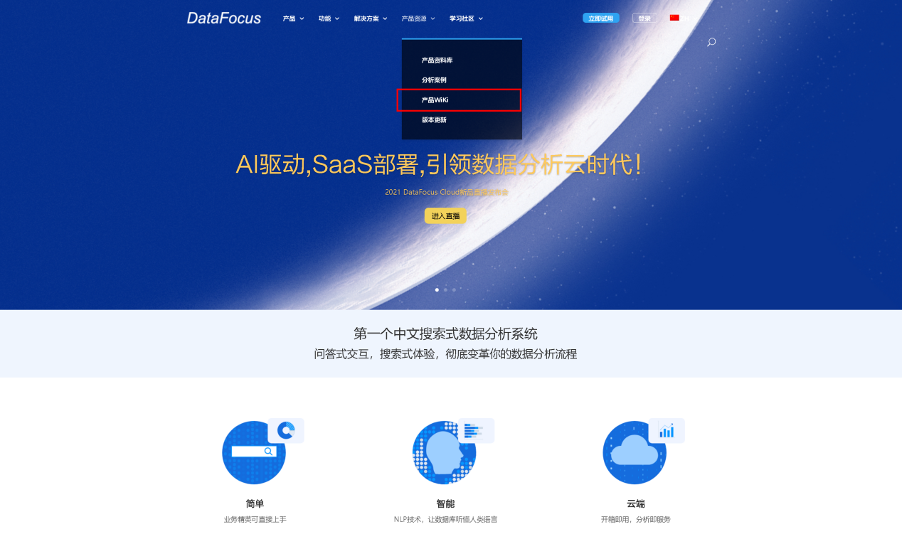
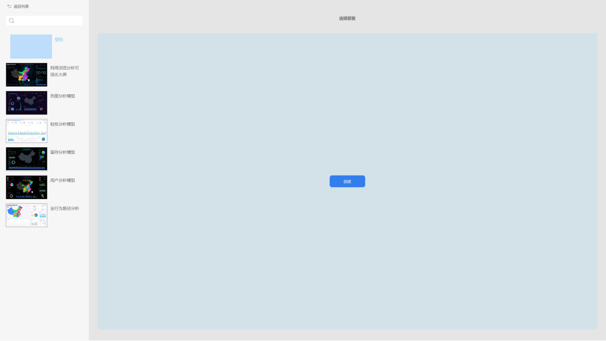
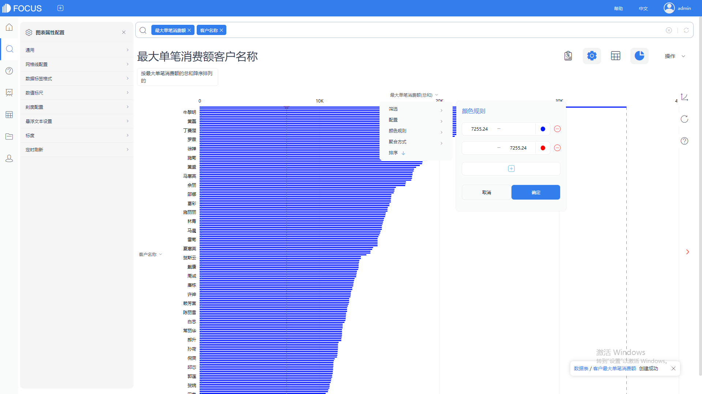
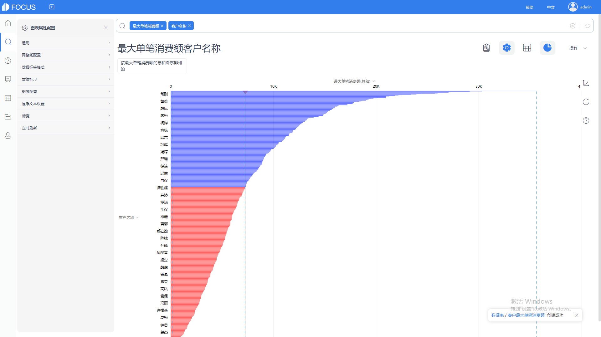
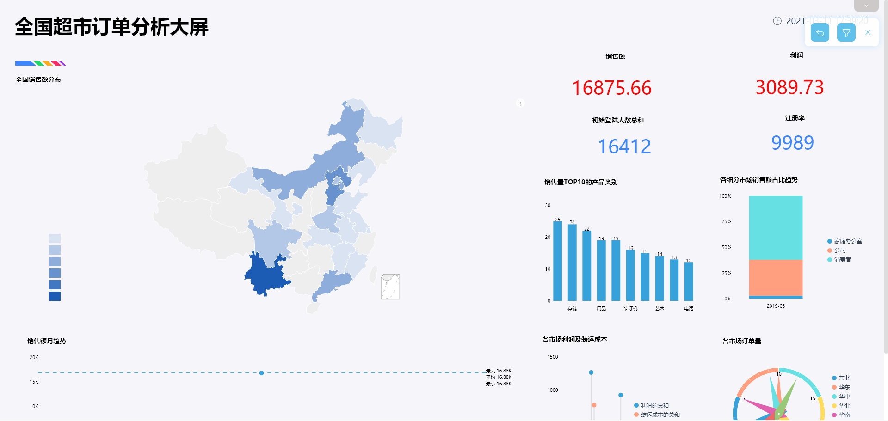

**目的：**为广大女性朋友提供有数据支持的潮流方向和物美价廉的品牌选择。

**摘要 ：**2005年至2010年间，我国女包产业保持高速增长态势，其产值年均复合增长率达到18.5%，未来女包市场发展空间巨大。本报告使用datafocus系统，对某商场女包的月销售数据进行分析，得到平价包的月销量最好、户外运动包平均价格最贵、休闲的中型欧美时尚风格的软质小方包最受近期市场欢迎、最物美价廉的小方包来自米歇尔品牌等结论。因此建议喜欢时尚潮流的广大女性朋友可以买欧美时尚类或日韩类时尚风格的简约图案或纯色软质小方包，小方包可以选择米歇尔品牌和MY&FSNH品牌，资金充足的话，可以买小奢的Viney品牌。

**关键词：**datafocus,女包,销售量,品牌

一、案例背景

今日的中国，已逐步迈入小康进程。WTO更让中国飞速发展，人们的消费观念正在不断变化。美丽、个性、时尚、品位正成为现代酷一族追求的新理念。中国女性用品销售总量超过目前已突破千亿元人民币，并以19%的年增长率节节攀升。常言道，男士看表，女士看包。一个合适的包包也是女性上班、逛街或party的必备清单。目前市场上的女包品牌繁多，国内的品牌也越来越多的被广大的女性朋友所熟知。本文数据取自某商场的女包销售数据，对女包特征进行分析，意为广大女性朋友提供有数据支持的潮流方向和物美价廉的品牌选择。

二、案例问题

零售业产品生产量大，产品的多样化导致其信息量剧增，用EXCEL来进行销售分析及决策定位已经无法满足无时无刻不再变化的新数据，使用datafocus产品就可以快速处理大量数据，因此可以极大的减少人力和时间。

三、案例分析

进入datafocus 产品系统，从数据管理页面中导入数据源“女包”，并在数据看板页面创建新的数据看板，命名为“商场女包销售情况”。

A.商场女包的销售总情况。

1.按价格分组统计的月销量

分价格段月销量统计图选择使用饼图，可以看到每个价格段的销售的占比情况。

图 1按价格分组统计的月销量

从图1中可以清晰的看到，系统自动以1274为分隔区间将价格分成5个段。其中18~1292元的价格段的月销量占比最大，其次为1292~2566元的价格段。

2.不同适用场景的包包价格比较

升序排列的柱状图可以简单明了的呈现比较不同适用场景的包包价格。

图 2不同适用场景的包包价格比较

如上图所示，户外运动包平均价格最贵，一款好的户外背包，种种因素都能组成它昂贵的理由：品牌、面料、设计、背负系统等等。商务包、宴会包的平均价格仅次于户外运动包，旅行包的平均价格最低。

3.各使用场景的价格段销售分布

表格所示列分别为月销量、价格分段和使用场景，方便查看各适用场景在各价格分段的月销量总计。

表 1各使用场景的价格段销售分布

B．商场女包受欢迎产品

1.大小不同的包的销量分布

筛选出月销量最高的价格范围及月销量总计大于1000件的包包，进行包的大小的探索，此次统计图选择适用柱状图。

图 3大小不同的包的销量分布

如图3所示，休闲类包包的月销量明显大于其他适用场景类包包的月销量。其中中型大小的包包的月销量较大，小包次之，迷你包的月销量最低。

2.休闲场景中各类风格的月销量

筛选出高月销量的休闲类包包和中型包包，使用折线图进行风格探索。

图 4休闲场景中各类风格的月销量

由图4可以看到欧美时尚类和日韩类包包的月销量大幅度高于其他风格类型的包包，商务/OL类包包的月销量较低，也和使用人群的特定性有关。

3.高销量的箱包不同硬度之间的销量差异

筛选出月销量较高的欧美时尚类和日韩类包包，使用条形图进行不同箱包硬度的月销量差异探索。

图 5高销量的箱包不同硬度之间的销量差异

由图5可知，软的包包比硬的包包的月销量要高。

4.图案对月销量的影响

筛选出月销量较高的软包，通过条形图可以看到各个图案的月销量分布。

图 6图案对月销量的影响

由图6所示，排名前2销售量的包均为纯色，且大幅度高于其他图案的包包。

5.月热门流行款式

筛选出纯色的包，使用散点图进行流行款式的受欢迎程度探索。

图 7 月热门流行款式

如图7所示，休闲的中型欧美时尚风格的软质小方包最受近期市场欢迎。

6.各品牌方包的价格和月销量比较

在上述所有的基础上，筛选出最受欢迎的小方包，选择气泡图对各品牌的小方包的价格和月销量进行展示。

图 8各品牌方包的价格和月销量比较

如图8所示，最物美价廉的小方包来自米歇尔品牌，其次为MY&FSNH品牌，Viney品牌的小方包虽然价格最贵，但销售量仍较为可观。

将这9个结果图表导入“商场女包销售分析”数据看板中，排版结果如下：

图 9 数据看板

四、结论

1.18~1292元价格段的包包最畅销，其次为1292~2566元价格段的包包。

2.户外运动包平均价格最贵，一款好的户外背包，种种因素都能组成它昂贵的理由：品牌、面料、设计、背负系统等等。商务包、宴会包的平均价格仅次于户外运动包，旅行包的平均价格最低。

3.欧美时尚类和日韩类的纯色软包比较符合近期潮流

4.休闲的中型欧美时尚风格的软质小方包最受近期市场欢迎。

5.最物美价廉的小方包来自米歇尔品牌，其次为MY&FSNH品牌，Viney品牌的小方包虽然价格最贵，但销售量仍较为可观。

五、对策与建议

建议喜欢时尚潮流的广大女性朋友可以买欧美时尚类或日韩类时尚风格的简约图案或纯色软质小方包，带下可以选择中型，既可以装的下出门的必要品，视觉上也不会太突兀。小方包可以选择米歇尔品牌和MY&FSNH品牌，资金充足的话，可以买小奢的Viney品牌。
