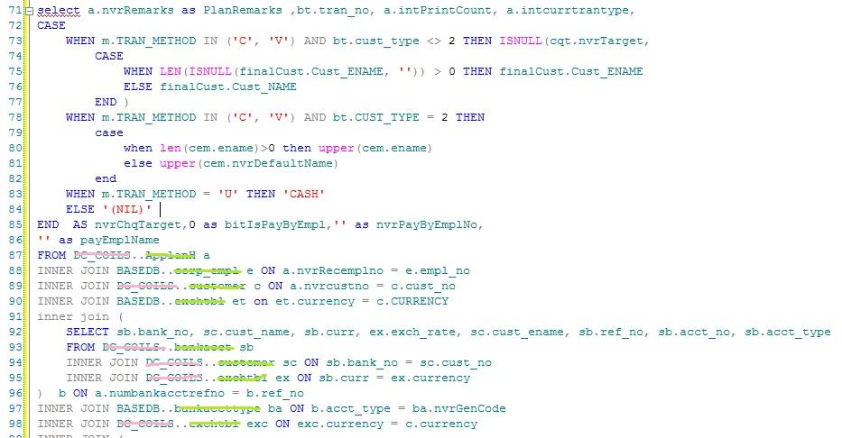

相信很多数据库工程师，尤其是从事数据可视化或者数据分析的SQL工程师早就对日复一日，年复一年重复写着的SQL语句相当的厌烦了。有统计表明，从事企业数据报表开发的工程师，每天要重复60-70%的SQL代码编写，尽管他们可以用Ctrl+C和Ctrl+V稍微减轻一点痛苦。但是这种暗无天日，并且毫无成就感的SQL代码，每多写几行，你的痛苦就会多上几行。 

如果你接触过DataFocus，也许一切都会变得不一样，只要搜索就能开发图表，为什么还要码那么多代码呢？有些写sql语句成精了的小伙伴也许会表示不同意，可是，无论如何，还是说人话更方便啊。

聪明如你，一定会质疑，搜索能干啥啊，我可以用SQL语句写文章，经常整出数百行的SQL语句来，只为开发一个图表，搜索能实现吗？当然，我们知道大量的SQL语句，是包含了数据清洗、预处理、建模和分析的。DataFocus当然不是眉毛胡子一把抓，它的数据预处理、建模和分析是分开的，我们来看看仅仅分析这一点儿，它能做到什么？毕竟建模和预处理这种工作还是简单配置以下来得快。

我们能忍受一天度娘数百次，但是真的不能忍受一样的SQL写上一百遍，对不对？
