基于搜索的分析能够真正地帮助商业精英实现自助服务。搜索式分析从用户的角度思考，把诸如“业务的哪些部分没有盈利？”之类的业务问题转化为可操作的见解。ThoughtSpot和 DataFocus Cloud (DFC) 正在引领搜索式分析的新时代。

DFC收费更公平，协作系统更完善，可视化更丰富，定制程度也更高。

这两种工具在搜索方式和公式的使用等方面有很多相似之处，但也还是有很多不同之处。阅读全文以帮助选择更适合您的一种。

# 简介

ThoughtSpot Cloud旨在通过其易于使用的分析平台创建一个更加以人为导向的世界。它是一种现代分析云工具，可帮助建立基于数据的业务。

同样，作为 SaaS（软件即服务）平台，DataFocus Cloud在云端提供了简单的数据分析以及的数据可视化。DFC以将商业精英转变为数据专家为目标，把人类语言解读为精美的可视化。

# 对比内容

## 2.1 界面

### 主页

ThoughtSpot 为新用户提供导览，帮助他们更好地理解和使用系统。用户可以通过右上角的信息中心重新访问导览。如图2-1所示，DFC通过一个引导窗口让初学者学习如何使用平台，包括如何搜索关键词、创建图表等。

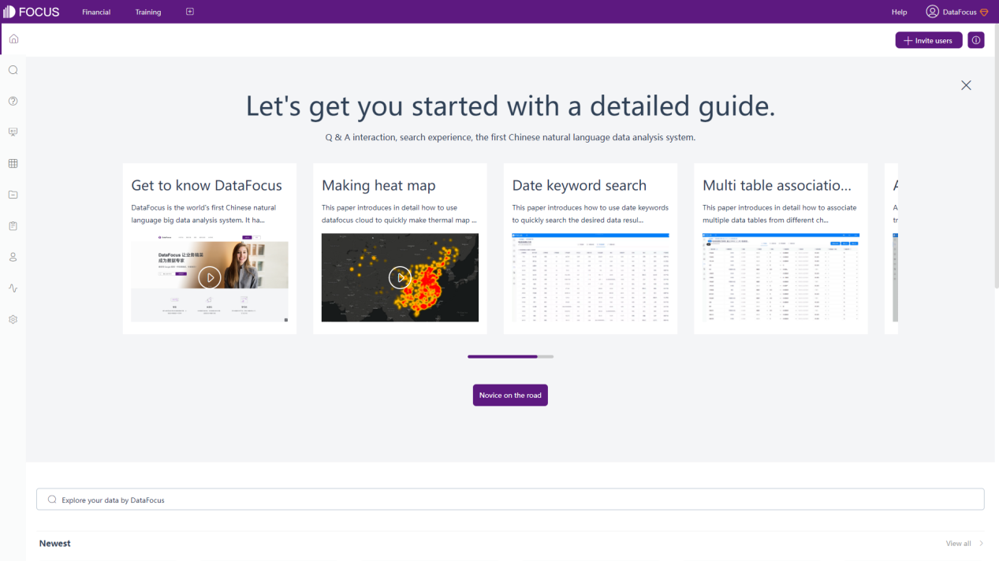

Figure 2-1 Home page guide - DFC

ThoughtSpot主页主要展示资源、指标、热门看板及问答，如图2-2所示。用户可以在主页上跟踪重要指标、以及搜索资源等。

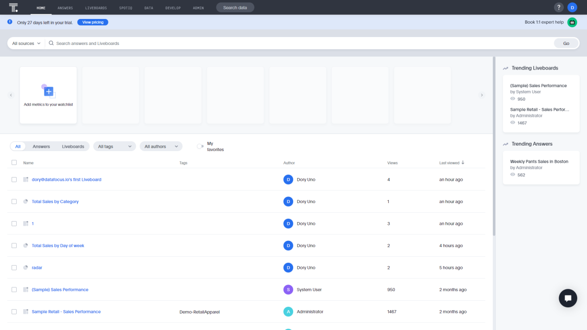

Figure 2-2 Home page - ThoughtSpot

DFC首页主要列出所有资源，如图2-3所示。可以通过右上角的“新手上路”按钮随时打开引导窗口。此外，用户还可以在这里邀请其他成员。

Figure 2-3 Home page - DFC

### 数据页面

数据表的详细页面显示与表相关的信息。如图2-4 所示，ThoughtSpot 列出了列信息、链接信息、数据实例、汇总统计信息和依赖项。

GIF Figure 2-4 Data Page - ThoughtSpot

如图2-5 所示，DFC显示了列信息、关联关系、预览数据和依赖关系。DFC还提供了更多的地理类型以及嵌套父列来形成树的索引。此外，用户还可以在此处快速附加或覆盖数据。

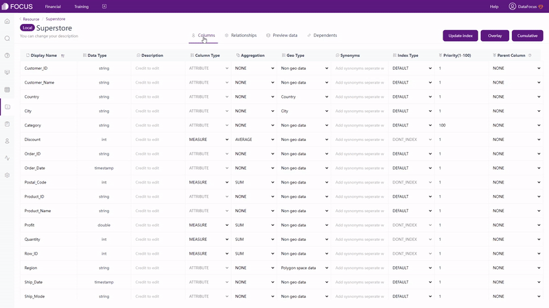

GIF Figure 2-5 Data Page - DFC

### 搜索页面

ThoughtSpot和DFC都将搜索页面分为 3 个部分：列信息、搜索栏和可视化区域。区别在于：

**撤消，恢复，重置**

ThoughtSpot提供了以上这些选项，因此用户想返回以前的搜索时不必重新搜索。

**列类型**

DFC在列名前面显示小图标以显示列的类型。类型包括文本、时间、地理和数字，如图 2-6 所示。

Figure 2-6 Column types

**列的展示顺序**

列名在ThoughtSpot中按字母顺序排列，而在 DFC 中它们被分为属性和度量。后一种显示更容易区分属性和度量。

### 资源界面

**标签**

ThoughtSpot Cloud和DataFocus Cloud都应用了标签来快速分类资源。不同的是 ThoughtSpot使用纯文本作为标签，而DFC使用文本和彩点，如图 2-7和图 2-8。

Figure 2-7 Tags - ThoughtSpot

GIF Figure 2-8 Tags - DFC

**资源**

ThoughtSpot的所有资源（问答和看板）都列在主页上，而 DFC 使用单独的资源模块来显示包括项目、问答、看板和表格在内的所有资源。此外，DFC还提供了两种不同的显示方式：列表和缩略图，以满足不同的查看需求，如图 2-9 所示。

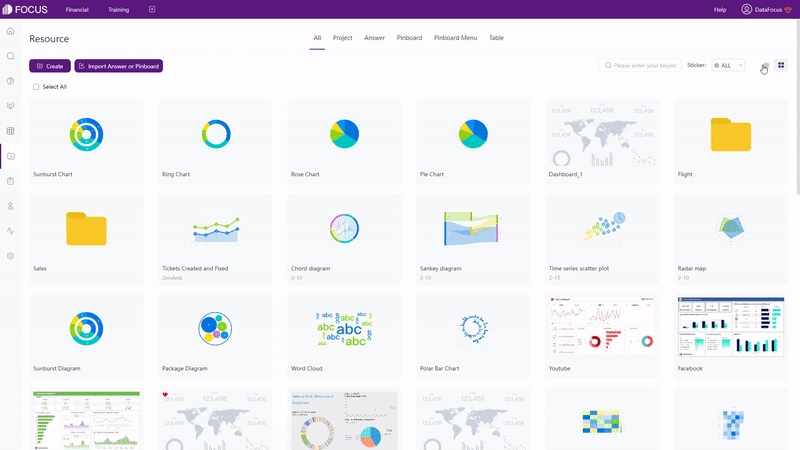

GIF Figure 2-9 Display modes

**操作**

在ThoughtSpot的主页上，用户可以分享、删除资源和标记资源为收藏。在问答/看板页面上，用户还可以应用标签、导出和编辑TML，如图 2-10 所示。

Figure 2-10 Operations - ThoughtSpot

用户可以在DFC的资源模块上对资源进行移动、删除、导出、应用标签、共享、收藏、公开、更改所有者等操作，如图2-11所示。

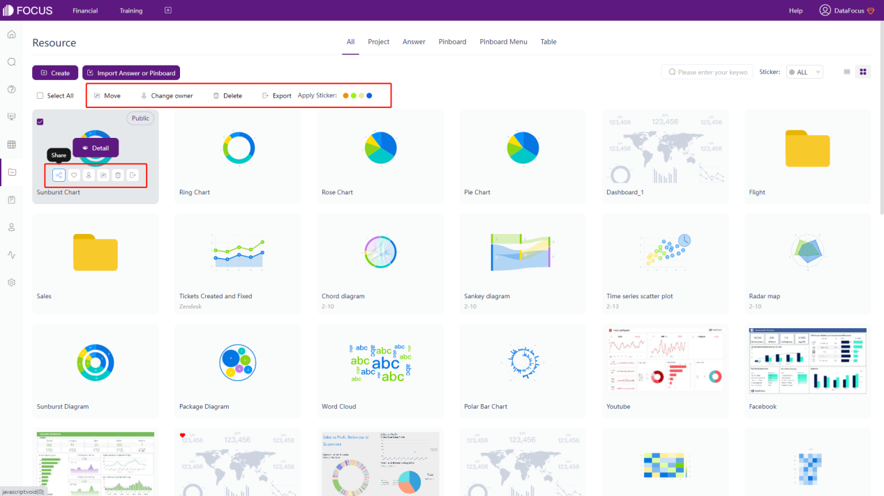

Figure 2-11 Operations - DFC

### 导航栏

ThoughtSpot Cloud的导航栏位于页面顶部，而DFC的导航栏位于页面顶部及左侧。

ThoughtSpot有 8 个不同的模块，DFC有10个。除了主页、搜索、资源和管理/用户中心页面，ThoughtSpot还有一个“SPOTIQ”页面来帮助自动分析数据，以及一个“DEVELOP”页面来构建交互式数据应用程序。而DFC提供日志模块查看操作日志，数据模块查看资源使用情况和API访问模块，以及一个管理页面来配置和管理不同资源。

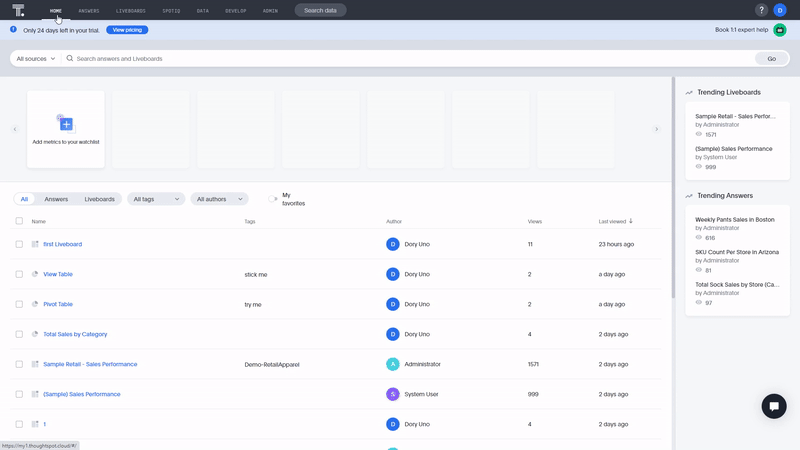

GIF Figure 2-12 Navigation bar

看板可以固定在DFC的顶部导航栏上。因此，用户可以随时快速访问这些重要的看板，如图 2-12 所示。

GIF Figure 2-13 Pin dashboards

## 2.2 数据源

在ThoughtSpot免费试用下，用户可以上传 1 个平面数据文件（CSV），大小限制为 10M，或者连接到云数据仓库，如Snowflake、Amazon Redshift等。

DataFocus Cloud提供4种获取数据的方式，免费试用只限制容量，而不是限制获取数据的方式：

**导入本地文件（多种文件类型），限制为500M；**

- **上传数据仓库，适合亿万级数据的大数据场景；**
- **连接数据库。DFC在这里是一个数据仓库，可以实时更新资源。此外，还可以同时连接不同的数据库，用户可以同时加入分析来自不同数据库的数据表；**
- **授权外部资源后使用API访问数据；**

 

以下是 DFC 支持的资源类型。

Table Figure 2-14 Data sources

## 2.3 易用性

### 2.3.1 搜索

界面的区别在[第2.1.3节](#post-44640-_搜索页面)中描述。

ThoughtSpot和 DFC都可以同时使用多个数据表。另外，添加列的方法也类似：在搜索框中输入，双击列名，然后点击添加按钮。

主要区别在于 ThoughtSpot突出显示搜索栏和数据窗格。用户需要点击“前往”或未突出显示的区域来确认搜索。DFC没有设置高亮，选择列后系统会自动返回结果。

GIF Figure 2-15 Search

另一个区别是，用户可以直接移动DFC搜索框上的列名来改变顺序，部分可视化图表也会随之改变，比如表格。而列的顺序在ThoughtSpot系统中不能被直接移动，用户需要重新输入列名搜索或者在表格模式下拖动列。

GIF Figure 2-16 Column order

### 2.3.2 关键词

ThoughtSpot 和 DFC 都提供了一系列的关键词，包括时间、字符串、排名等。

DFC支持更丰富的关键词，例如排名第2到第5、增长量、每月前5天的等。

### 2.3.3 筛选器

这两个工具都支持通过关键字筛选，以及在表格、坐标轴和看板上添加筛选器。此外，用户还可以批量添加筛选器。区别在于：

**选择**

DFC 还支持直接在图表中进行筛选，单击并选择区域以包含数据。然后点击“恢复被隐藏的项”按钮，让隐藏的数据重新显示出来，如图2-17所示。

GIF Figure 2-17 Select to include

**筛选形式**

筛选形式基本相同。 DFC还显示时间和度量的最小值和最大值，以帮助用户确定边界。在属性方面，DFC 提供了“排除空值”的选项。

Figure 2-18 Filter form

**看板上的筛选器**

在编辑模式下，用户可以在 ThoughtSpot 的看板上添加筛选器。尽管用户可能无法在免费试用下添加筛选器。

在 DFC看板的查看页面，通过点击数据点或选择图形的某个区域，将同时筛选所有图表，如图 2-19 所示。可以通过单击“恢复”按钮来删除筛选的效果。

 

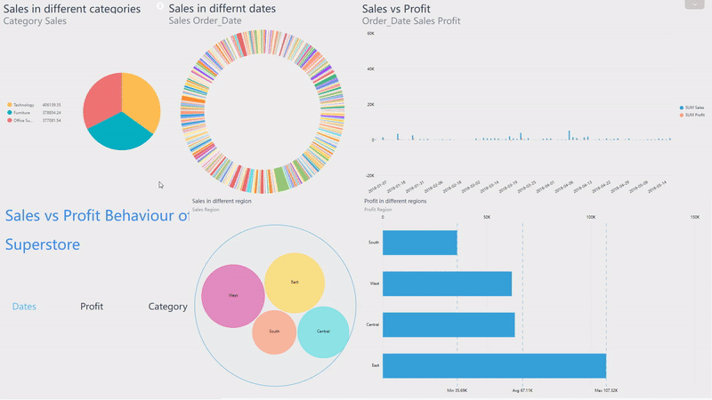

GIF Figure 2-19 Filter - dashboards

### 2.3.4 公式

通过搜索框或公式编辑器可以添加公式，并且公式可以嵌套，即该公式可以在另一个公式中使用。ThoughtSpot和DFC提供了各种类型的公式，包括转换、聚合、时间等。此外，通过公式助手，用户可以更轻松、更快捷地编写公式。

为了方便用户，DFC使用提示来帮助更快地编写公式（语法也会提示）。DFC的全部公式显示在这里：[公式列表](https://wiki.datafocus.ai/index.php/V5.0.1@%E5%85%AC%E5%BC%8F%E5%88%97%E8%A1%A8)。

## 2.4 数据处理

为了处理数据，ThoughtSpot和DataFocus Cloud都使用视图/中间表创建嵌套查询。此外，连接也可以应用于视图/中间表。

DFC 有两种不同的中间表：问答中间表和关联中间表。前者是通过搜索分析页面创建的，以聚合的方式展示度量，而后者是在数据表模块或资源模块上创建，以原始数据表相同的数据形式显示。

更重要的是，DFC还提供了一些高级的数据转换：

**行列之间的转换**

行和列可以自由转换，无需复杂的公式或操作，转换效果可以随时删除。

GIF Figure 2-20 Conversion between rows&columns

**拆分列**

拆分后的列数（拆分数）和拆分分隔符是自定义的。因此，用户可以根据需要拆分列。此外，数据表的结构不会改变。

**ETL工具**

DFC有自己的 ETL 工具，可以从不同来源提取数据。

## 2.5 可视化

### 2.5.1 表格

● 两种工具都支持的表类型：

**查看表 / 数值表**

普通表格以二维形式显示数据。

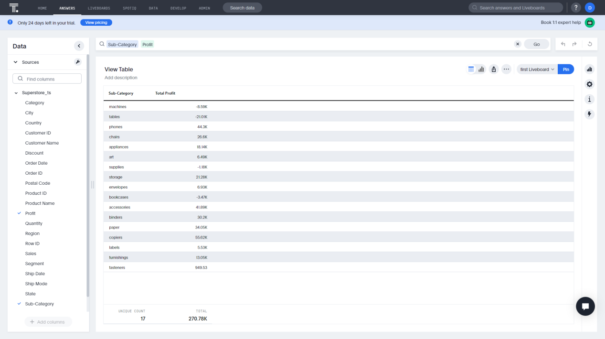

Figure 2-21 View table - ThoughtSpot

Figure 2-22 Grid table - DFC

**数据透视表**

数据透视表使用树结构来显示数据。

Figure 2-23 Pivot table - ThoughtSpot

Figure 2-24 Pivot table - DFC

DFC支持的另一种表类型是交叉表，它以多维度显示数据。交叉表可以满足各种复杂的业务需求，如图2-25所示。

Figure 2-25 Cross table

● 配置：

**查看表 / 数值表**

ThoughtSpot和DFC都支持数字格式、汇总统计信息和一些表格格式的配置。但DFC提供了更多种类的配置，包括颜色、对齐方式、索引、热图模式等。详细的数值表配置可以在这里查看：[表格属性](https://wiki.datafocus.ai/index.php/%E4%BA%A7%E5%93%81%E6%89%8B%E5%86%8C_v5.0.2" \l ".E8.A1.A8.E6.A0.BC.E5.B1.9E.E6.80.A7).

**数据透视表**

除了上面提到的功能，ThoughtSpot还支持热图模式、透视摘要和压缩数据透视表的行标题。

与数值表类似，可以为DFC中的数据透视表配置热图模式、颜色和字体。另外，这里可以添加一个小计行来展示更多细节，如图2-24所示，蓝色行是小计行。数据透视表的整个配置可以在这里查看：[数据透视表](https://wiki.datafocus.ai/index.php/%E4%BA%A7%E5%93%81%E6%89%8B%E5%86%8C_v5.0.2" \l ".E5.9B.BE.E5.BD.A2.E5.B1.9E.E6.80.A7).

**交叉表**

同样，用户可以设置表格的字体、颜色、对齐方式，还可以冻结行列、添加总列和总行，如图2-26所示。

GIF Figure 2-26 Cross table

### 2.5.2 图像

ThoughtSpot 支持 25 种类型的图表，但是自定义程度比较有限。用户只能选择显示标签或一些辅助线。

DFC 支持的图表类型超过 50 种，并且拥有高度的定制化。用户可以根据不同的图表类型，改变颜色、格式、悬浮文字等图表配置。

以下四种分类来描述具体的图表：

**常用图形**

对于最常见的图表之一——饼图，ThoughtSpot 只支持一种形式，如图 2-27 所示。

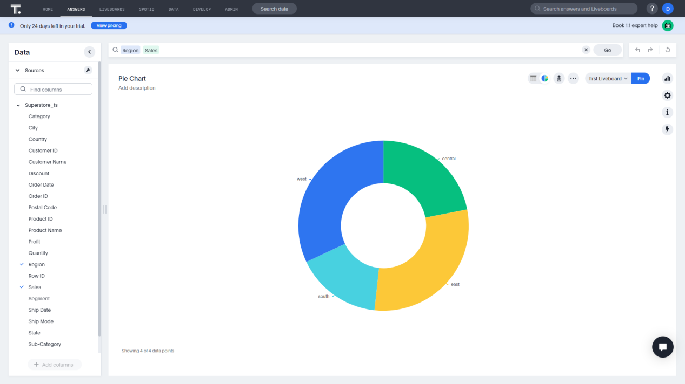

Figure 2-27 Pie chart - ThoughtSpot

DFC提供了饼图、玫瑰图、环形图、旭日形图等多种形式。

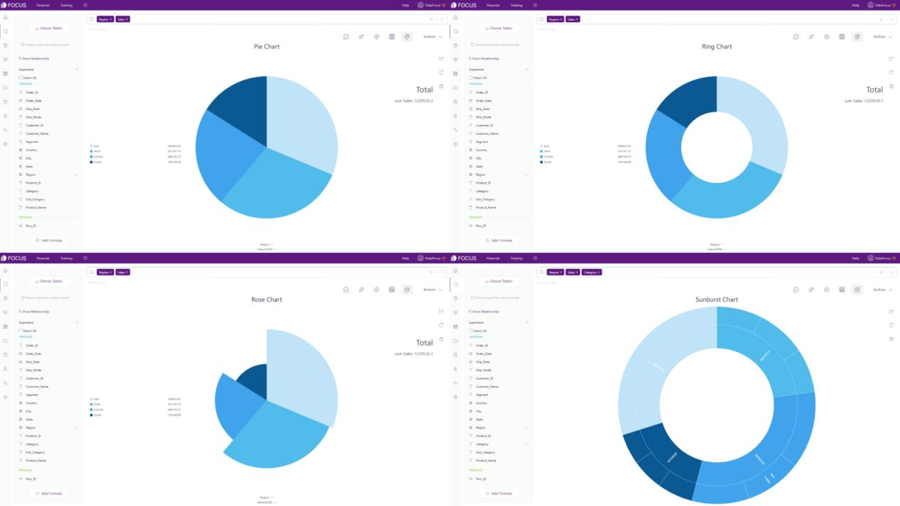

Figure 2-28 Pie charts - DFC

**地图**

ThoughtSpot 提供地理气泡图、地理热图和地理面积图。

Figure 2-29 Maps - ThoughtSpot

DFC支持多种不同类型的地图，如轨迹图、GIS位置图、经纬度位置图、3D地球散点图等。此外，用户还可以上传自己的地图或地理数据。

Figure 2-30 Maps - DFC

**高阶图形**

ThoughtSpot 提供K线图来显示价格随时间的变化，如图 2-31 所示。

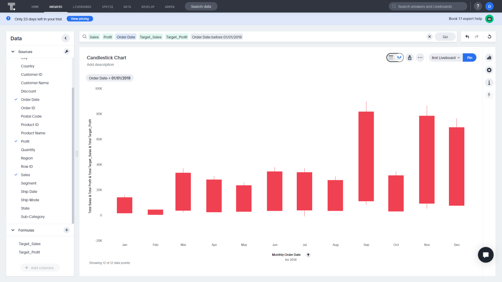

Figure 2-31 Candlestick chart - ThoughtSpot

DFC支持一些更高阶的图形来显示不同类型的数据，如弦图、网络图、子弹图、箱线图等。

Figure 2-32 Advanced graphics - DFC

**动态图形**

DFC还有动态的图形来显示数据随时间的变化或者用户可以添加动画效果使可视化更加生动，如时间序列气泡图、3D地球飞行线等。

GIF Figure 2-33 Time series bubble chart

GIF Figure 2-34 3D globe fly line

### 2.5.3 看板

ThoughtSpot提出了“看板已死”的概念。ThoughtSpot相信现代云分析，认为它可以为所有人提供个性化的见解，而其看板的定制程度也相对较低。

DFC 持有不同的观点：只要创建看板的体验更好，比如更容易配置或者组件更丰富，看板仍然是用户跟踪数据或做出决策的有见地的工具，尤其是在实时分析和交互方面。因此，DFC的仪表盘可以高度定制化。具体分三部分介绍区别：

<table><tbody><tr><td>方面</td><td>ThoughtSpot Cloud</td><td>DataFocus Cloud</td></tr><tr><td>添加问答</td><td>问答界面</td><td>看板编辑界面</td></tr><tr><td>图表尺寸</td><td>5种预设尺寸</td><td>可定制</td></tr><tr><td>布局</td><td>固定网格</td><td>2种：自由布局，网格布局</td></tr></tbody></table>

**添加问答**

在ThoughtSpot中，用户需要在问答查看页面上将答案添加到看板上。

在DFC中，用户可以在看板编辑页面上添加或替换问答。

**图表尺寸**

ThoughtSpot的图表大小可以更改为 5 种不同的预设尺寸，DFC的图表大小可以通过输入高度和宽度来自定义。此外，用户还可以直接拖动图表以自由更改大小。

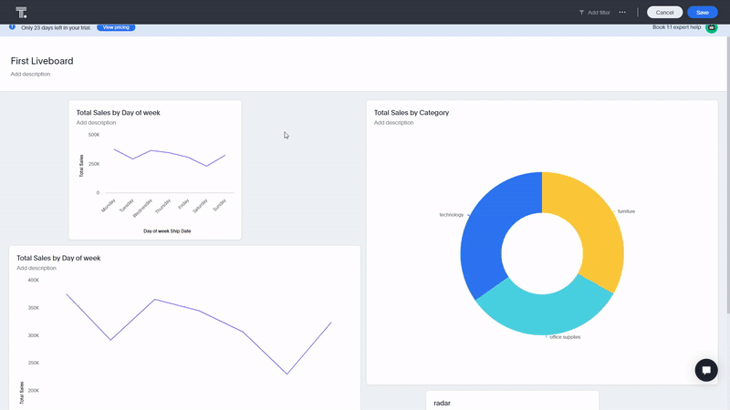

GIF Figure 2-35 Change chart size

**布局**

ThoughtSpot中的图表可以在网格之间自由移动，移动后其他图表也会相应调整位置。

DFC 中的网格布局类似于 ThoughtSpot 中的布局。而在自由布局下，图表可以任意移动，如图 2-36 所示。

GIF Figure 2-36 Different layouts

除了上述方面，DFC 还支持许多其他不同的自定义设置。例如，用户可以添加文本、图像、视频和媒体对象，可在此处查看整个自定义对象：[自定义组件](https://wiki.datafocus.ai/index.php/%E4%BA%A7%E5%93%81%E6%89%8B%E5%86%8C_v5.0.2" \l ".E8.87.AA.E5.AE.9A.E4.B9.89.E7.BB.84.E4.BB.B6)。此外，DFC还提供了一系列模板，帮助用户更快地创建看板，如图2-37所示。

Figure 2-37 Dashboard templates

### 2.5.4 速度

在响应搜索、更改图表类型等方面，DataFocus Cloud比ThoughtSpot 更快。

GIF Figure 2-38 Change chart type - ThoughtSpot

GIF Figure 2-39 Change chart type - DFC

## 2.6 资源管理

如上文[第2.1.4节](#post-44640-_资源界面)所述，ThoughtSpot 和 DFC 使用标签来管理资源。此外，DFC上有两种显示模式，以满足不同的查看需求。若要在问答或其他资源之间切换，可以利用小导航栏，在不同类型的资源之间快速切换。

此外，DFC的项目与计算机中的文件夹相同。用户可以将各种资源放入项目中，以便更好地进行分类。

## 2.7 协作

在免费试用下，用户可能无法使用 ThoughtSpot 中的权限或组功能。但是，DFC的角色和部门模块对所有用户开放，包含处于免费试用情况下的用户。

### 2.7.1 权限与角色

为了让不同的用户拥有不同的能力，ThoughtSpot Cloud使用权限，DataFocus Cloud 使用角色。

ThoughtSpot的权限包括“可以管理ThoughtSpot”、“可以下载数据”等，且由管理员设置和授予。此外，权限是用户可以进行的详细操作，例如下载、编辑、共享等。

而DFC的角色则是按照资源、部门、日志等不同的模块进行分类，需要注意的是这些角色是系统预设的角色，用户也可以添加自定义角色来满足更多的需求。比如可以为不同的自定义角色设置成员是否可以编辑看板等详细权限，如图2-42所示。在这里查看角色的完整信息：[角色](https://wiki.datafocus.ai/index.php/%E4%BA%A7%E5%93%81%E6%89%8B%E5%86%8C_v5.0.2" \l ".E8.A7.92.E8.89.B2)。

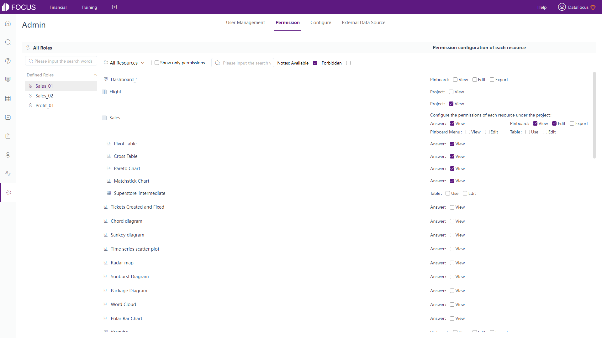

Figure 2-40 Roles

### 2.7.2 组与部门

权限可以被分配到组里，然后用户可以被添加到组。因此，组可以确定允许成员做什么。而且，组可以属于其他组。

DFC中的部门更像是现实中的部门，每个用户可以属于一个或多个职位以及部门。然后，通过分配不同的角色，用户可以访问不同的资源。例如，“技术”部门下“前端”部门的“开发人员小王”可以添加和管理新资源。在这里查看整个部门结构：[组织架构](https://wiki.datafocus.ai/index.php/%E4%BA%A7%E5%93%81%E6%89%8B%E5%86%8C_v5.0.2" \l ".E7.BB.84.E7.BB.87.E6.9E.B6.E6.9E.84).

Figure 2-41 Departments

### 2.7.3 分享

单击ThoughtSpot中的共享按钮，资源可以通过电子邮件与用户或组共享。

在 DFC 内有两种不同的分享方式。一种是为系统内的成员分配访问权限，另一种是通过外部查看地址，外部用户可以通过链接或二维码查看资源并与之交互。

## 2.8 成本

ThoughtSpot Cloud和DataFocus Cloud 按使用/容量计费。下表显示了完整的定价计划。

<table><tbody><tr><td>ThoughtSpot - Team</td><td>ThoughtSpot - Pro</td><td>ThoughtSpot - Enterprise/Everywhere</td></tr><tr><td>按月付费 | 网上购买</td><td>按年付费 |

按用量收费</td><td>按用量收费</td></tr><tr><td>95 美元/ 月</td><td>2500 美元/ 月</td><td>联系销售</td></tr></tbody></table>

Table Figure 2-42 Cost - ThoughtSpot

Table Figure 2-43 Cost - DFC

# 结论

ThoughtSpot Cloud和DataFocus Cloud 是两个时代领先的基于搜索的数据分析工具。搜索可能有很多相似之处，比如关键词，但界面、可视化、用户管理等却大不相同。

如果在团队版下，ThoughtSpot Cloud提供广泛的关键字搜索和协作。然而，可视化的丰富程度相对较低，特别是在看板及其自由度方面。

DFC丰富的图表类型、图表配置、看板配置，让可视化更加美观、生动。此外，整体系统使协作更容易、更协调。DataFocus Cloud将继续创造更好的数据分析体验。欢迎尝试： [DFC](https://www.datafocus.ai/).
