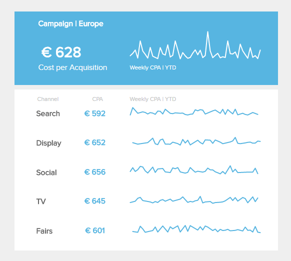
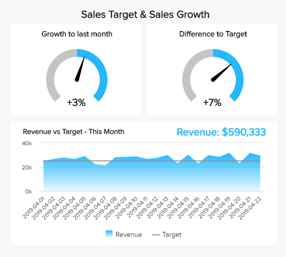
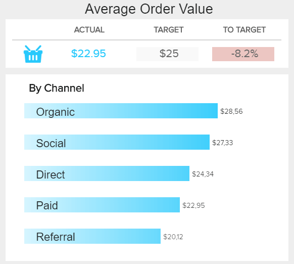
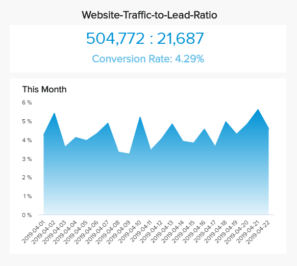
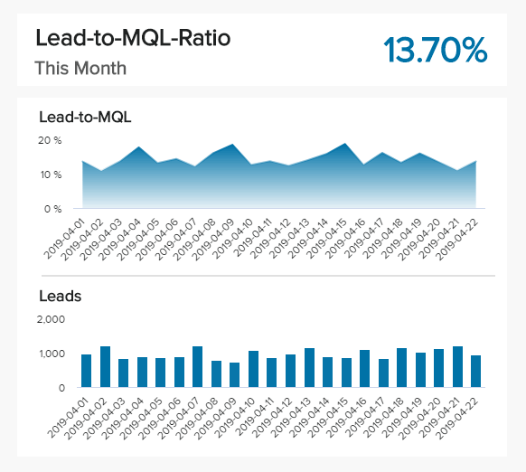
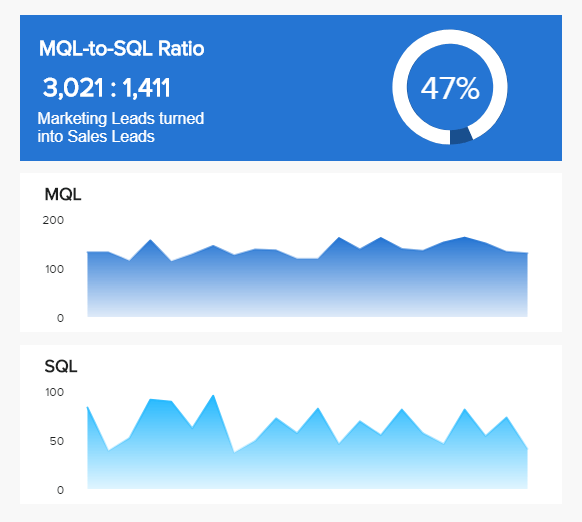
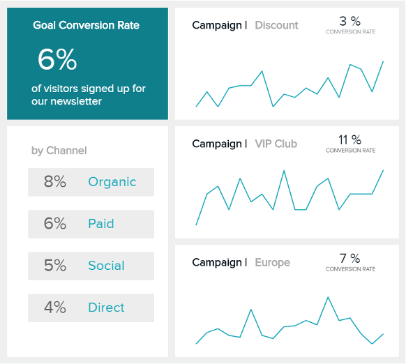
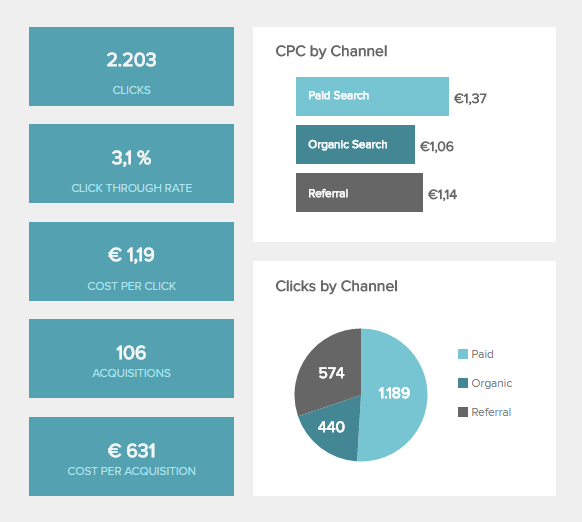
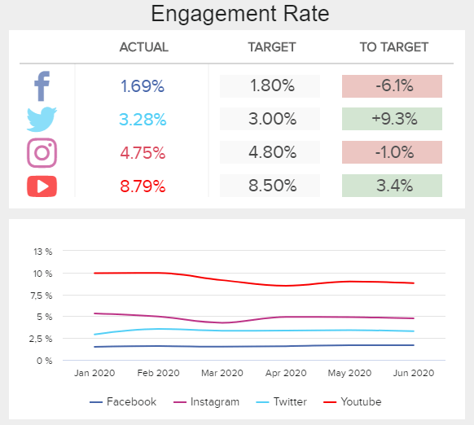

**营销 KPI**（关键绩效指标）是组织用来评估营销活动影响的可衡量值，同时帮助专业人员监控不同营销渠道的成功，以确定有效的预算支出策略。

在本文中，我们将详细介绍顶级营销 KPI，无论您是初级经理还是 CMO。如今，选择正确的指标来衡量营销策略控制着现代绩效营销的基础，其中分析、优化和监控能力是每个盈利和可持续发展的核心。为了取得成功，专业人士需要能够使他们的流程更轻松、更快、更有效的工具。这就是行业转向优化流程和改进营销数据管理机制的[营销 BI解决方案的原因。](https://www.datafocus.ai/infos/business-intelligence-marketing)也就是说，下面的可视化是使用 datafocus  的现代[KPI 软件](https://www.datafocus.ai/infos/kpi-dashboard-software)创建的，这将使您能够回答特定的营销问题并创建引人注目的[营销仪表板](https://www.datafocus.ai/infos/dashboard-examples-and-templates-marketing)，以全面提高您的绩效。

**_以下是每个营销人员都应该知道的前 16 个营销 KPI 和指标的完整列表：_**

[每次获取成本](https://www.datafocus.ai/infos/kpi-examples-and-templates-marketing#cost-per-acquisition)：您的客户获取成本是否可行？

[每个潜在客户的成本](https://www.datafocus.ai/infos/kpi-examples-and-templates-marketing#cost-per-lead)：您应该为每个潜在客户花费多少？

[销售目标和增长](https://www.datafocus.ai/infos/kpi-examples-and-templates-marketing#sales-target-growth)：您的销售额是否在增长并达到目标？

[平均订单价值](https://www.datafocus.ai/infos/kpi-examples-and-templates-marketing#average-order-value)：平均购物车价值是多少？

[投资回报率](https://www.datafocus.ai/infos/kpi-examples-and-templates-marketing#return-on-investment)：您花费营销资金的效率如何？

[客户终身价值](https://www.datafocus.ai/infos/kpi-examples-and-templates-marketing#customer-life-time-value)：从长远来看，新客户是否有利可图？

[网站流量与潜在客户比率](https://www.datafocus.ai/infos/kpi-examples-and-templates-marketing#website-traffic-to-lead-ratio)：您的网站如何转换？

[Lead-to-MQL 比率](https://www.datafocus.ai/infos/kpi-examples-and-templates-marketing#lead-to-mql-ratio)：营销如何使您生成的潜在客户合格？

[MQL-to-SQL 比率](https://www.datafocus.ai/infos/kpi-examples-and-templates-marketing#mql-to-sql-ratio)：销售团队对您的潜在客户有哪些要求？

[目标转化率](https://www.datafocus.ai/infos/kpi-examples-and-templates-marketing#goal-conversion-rates)：您实现业务目标的程度如何？

[平均转化时间](https://www.datafocus.ai/infos/kpi-examples-and-templates-marketing#time-to-conversion)：访问者转化的速度有多快？

[登陆页面转化率](https://www.datafocus.ai/infos/kpi-examples-and-templates-marketing#landing-page-conversion-rates)：哪些页面和内容表现最好？

[每次点击成本](https://www.datafocus.ai/infos/kpi-examples-and-templates-marketing#cost-per-click)：您是否物有所值？

[跳出率](https://www.datafocus.ai/infos/kpi-examples-and-templates-marketing#bounce-rate)：您的访问者是否找到了他们正在寻找的东西？

[参与率](https://www.datafocus.ai/infos/kpi-examples-and-templates-marketing#engagement-rate)：用户对您的内容的反应如何？

[点击率](https://www.datafocus.ai/infos/kpi-examples-and-templates-marketing#click-through-rate)：您的广告和内容是否引起关注？

## 每次获取成本 (CPA)

**您的客户获取成本是否可行？**

每次获取成本是一种在线广告定价模式，广告商为获取新客户支付规定价格。它也经常用于联属网络营销，并且具有比 CPC 定价模型更加基于性能的优势。这是因为您只为新客户而不是网站访问者付费。CPA通常用于比较不同在线营销渠道的客户获取成本（CAC）。要计算 CAC，您需要将所有收购的总成本除以特定时间段内的新客户数量。通过此营销 KPI，您可以比较每个渠道在获取新客户方面的可行性，并创建全面的[营销报告](https://www.datafocus.ai/infos/daily-weekly-monthly-marketing-report-examples)。

**性能指标**

通过不同的营销渠道比较您的每次收购成本，并计算您愿意为一位新客户花多少钱。

**相关展示仪表板**

- [营销 KPI 仪表板](https://www.datafocus.ai/infos/dashboard-examples-and-templates-marketing#marketing-kpi-dashboard)

## 潜在客户成本 (CPL)

**每个潜在客户应该花多少钱？**

潜在客户是通过您的营销活动与您的公司互动的潜在客户。潜在客户成本 (CPL) 是我们的营销 KPI 示例之一，这对于高效的绩效营销来说是不可避免的。它的计算方法是特定活动的总成本除以产生的潜在客户数量。您获得的数据可以帮助您确定应该将营销工作重点放在哪里，因为您可以比较不同渠道或活动的 CPL。这可以通过使用专业的营销分析软件来自动化。随着时间的推移跟踪 CPL 也很有意义，以查看何时是最低的收入或净收入最高 - 这意味着您在这些时间的策略是有效的。

**性能指标**

确保将每个潜在客户的总成本与每个潜在客户的净收入进行比较，以便能够确定您最有利可图的营销活动。

**相关展示仪表板**

- [首席营销官仪表板](https://www.datafocus.ai/infos/dashboard-examples-and-templates-marketing#cmo-dashboard)

## 销售目标和增长

**你是否超过了你的销售目标？**

销售目标和增长是一个真正的高级营销KPI，受整个业务战略的影响。但是，您的营销活动对您的销售有重大影响，因此，您应该设定雄心勃勃的销售目标并对其进行详细监控，因为归根结底，您的营销活动的目标是销售更多并使业务更多成功且有利可图，而不仅仅是获得更多的社交媒体追随者。借助现代营销仪表板，您可以将营销和销售数据统一在一个中央访问位置，并提高整体营销效率。在右侧的可视化营销 KPI 模板中，我们显示了每天收入的发展情况，仪表图表将绩效与上个月以及设定的目标进行比较。

**性能指标**

设定切合实际的销售目标并按月跟踪，以确保稳定增长和可行的收入。将您的结果与之前的时期进行比较。

**相关展示仪表板**

- [首席营销官仪表板](https://www.datafocus.ai/infos/dashboard-examples-and-templates-marketing#cmo-dashboard)

## 平均订单价值

**购物车的平均价值是多少？**

这是对电子商务公司很重要的营销分析 KPI 之一。要计算平均订单价值 (AOV) 或平均购物车价值，您需要将总收入除以所下订单的数量。相应地，电子商务公司总是对提高平均订单价值感兴趣，因为这仍然会在订单数量不变的情况下带来销售增长。增加购物车价值的措施有很多，例如，提供相关的向上和交叉销售优惠、优化运输成本限制、根据商品价值提供优惠券或折扣等等。不同营销渠道的平均订单价值也可能有所不同，我们在视觉示例中对此进行了说明。

**性能指标**

测试和分析增加平均订单价值的不同方法，例如上述方法或动态定价。

**相关展示仪表板**

- [社交媒体 KPI 记分卡](https://www.datafocus.ai/infos/dashboard-examples-and-templates-marketing#social-media-dashboard)

## 投资回报率 (ROI)

**您花费预算的效率如何？**

投资回报率 (ROI) 是我们列出的所有营销 KPI 模板的圣杯。最常见的是比较一项投资的效率或比较多项投资。为了计算投资回报率，您将投资的利润/收益除以特定投资的总成本，并以百分比显示该比率。例如，如果您进行了一个电子邮件营销活动，花费了 8000 美元，而您从该活动中获得了 10000 美元的收入，那么您的投资回报率为 25%。对于在线营销人员而言，此 KPI 对于比较不同营销渠道或活动的 ROI 以将其营销预算用于具有最高 ROI 的渠道/活动特别有用。

**性能指标**

投资回报率越高越好。高投资回报率表明您有效地使用了营销预算。使用此营销指标确定最差和效果最好的在线营销活动。

**相关展示仪表板**

- [营销 KPI 仪表板](https://www.datafocus.ai/infos/dashboard-examples-and-templates-marketing#marketing-kpi-dashboard)

## 客户终身价值 (CLTV)

**从长远来看，您的新客户是否有利可图？**

CLTV 是最重要的营销 KPI 之一，因为通过此 KPI，您可以控制愿意为新客户 (CPA) 花费的金额。您可以通过从每次获取的平均收入中减去每次获取的成本 (CPA) 来计算它，这是指您从一位新客户那里实际赚取的总金额。例如，如果您为新客户平均花费 80 美元，而他们在整个生命周期内平均产生 130 美元的收入，那么您的 CLTV 或每次收购的利润将为 50 美元。当您比较不同的营销活动和渠道以确定您最有利可图的在线营销活动并确定您的营销资金未来应该去哪里时，这些营销指标非常有用。

**性能指标**

CLTV 越高越好。它最终可以帮助您识别无效的营销活动，在这些活动中，您在客户身上花费的钱超过了他的价值。

**相关展示仪表板**

- [营销 KPI 仪表板](https://www.datafocus.ai/infos/dashboard-examples-and-templates-marketing#marketing-kpi-dashboard)

## 网站流量与潜在客户比率

**您的网站访问者有多少转化？**

此营销 KPI 示例侧重于已转化为实际潜在客户的网站访问者总数之间的关系。当您必须确定流量的质量时，它非常有用，并且对于使用其网站作为主要业务工具（例如 SaaS 或电子商务）的企业尤其重要。要计算您的网站流量与潜在客户比率，请将访问者总数除以特定时间段内产生的潜在客户数量。例如，如果您有 100000 个访问者并获得了 5000 个潜在客户，那么您的转化率为 5%。目标是尽可能提高转化率，但保持最低的每条潜在客户成本。

**性能指标**

如果您的转化率随着时间的推移而下降，请将此指标与其他营销 KPI（例如网站性能指标）结合起来，以确定潜在的瓶颈。

**相关展示仪表板**

- [首席营销官仪表板](https://www.datafocus.ai/infos/dashboard-examples-and-templates-marketing#cmo-dashboard)

## 线索与 MQL 比率

**您的营销如何确定潜在客户的资格？**

潜在客户总数只是您的销售漏斗中的第一个相关营销 KPI。下一步是查看您的潜在客户与 MQL 的比率。营销合格潜在客户 (MQL) 是有前途的联系人，与所有传入（不合格）潜在客户相比，他们更有可能成为客户。但是，是什么让领导有资格进入营销部门呢？对于 B2B 公司，这可能是下载白皮书并插入有效联系信息（例如企业电子邮件地址、现有公司和有效电话号码）的潜在客户。所有这些都符合潜在客户的要求，因为销售人员实际上能够联系。最好的潜在客户资格实际上取决于您的商业模式，您应该测试和分析各种资格认证 MQL 的方法。

**性能指标**

仅允许某些潜在客户资格触发 MQL 状态。随着时间的推移监控和分析您的 MQL，并确定哪种潜在客户转化率最高。

**相关展示仪表板**

- [首席营销官仪表板](https://www.datafocus.ai/infos/dashboard-examples-and-templates-marketing#cmo-dashboard)

## MQL 与 SQL 比率

**您的销售团队有哪些潜在客户要求？**

最重要的营销 KPI 之一，MQL-to-SQL，连接营销和销售部门，并要求他们一起工作。此比率表示转化为销售合格潜在客户 (SQL) 的营销合格潜在客户 (MQL) 的百分比，这些潜在客户已准备好进行销售跟进。SQL 是一个联系人，通过自己的活动并在营销的潜在客户培养的支持下发展成为真正的潜在买家。将此指标与平均销售周期长度一起查看也很重要，以便能够了解将 MQL 转换为 SQL 所需的时间范围。不要指望它总是在几天内发生，因为不同的联系人处于他们购买过程的不同阶段。

**性能指标**

详细监控和分析您的整个潜在客户漏斗，以找到将您的潜在客户限定为 MQL 和 SQL 的最佳方法，从而将您的资源用于最有希望的潜在客户并增加您的销售额。

**相关展示仪表板**

- [首席营销官仪表板](https://www.datafocus.ai/infos/dashboard-examples-and-templates-marketing#cmo-dashboard)

## 目标转化率

**您在实现业务目标方面做得如何？**

转换是访问者所期望的操作，这因企业而异。您网站的不同部分应该有不同的转换目标，这在您跟踪目标的实现情况时很重要。您博客的一个目标可能是让读者注册您的时事通讯，另一个目标可能是衡量最新的白皮书下载量，以及这如何导致免费试用注册。首先定义您的个人目标，然后开始跟踪每个渠道的转化率。将转化率与跳出率与会话持续时间进行比较，以了解最有效的方法。高转化率通常与较低的跳出率和每个会话的更多页面以及较高的平均会话持续时间相关。

**性能指标**

为不同的转化定义具体目标，并将这些目标与营销渠道/活动进行比较，以确定目标转化率最高的渠道。

**相关展示仪表板**

- [网络分析仪表板](https://www.datafocus.ai/infos/dashboard-examples-and-templates-marketing#web-analytics-dashboard)

## 平均转化时间

**您的访问者转换的速度有多快？**

平均转化时间表示从访问者第一次接触到执行目标操作（转化）之间的时间跨度。如果目标操作是购买，则转化时间对应于销售周期的长度。该营销指标在 B2B 领域特别有价值，而且对于 B2C 领域的广泛购买决策也很有价值，因为与有限的、习惯性的或冲动的购买决策相比 - 买方的参与度非常高。如我们的视觉示例所示，例如，考虑各种产品或营销渠道可以提供有价值的新见解。

**性能指标**

首先确定您的平均转化时间，然后针对不同的转化类型、产品、营销渠道和活动进行查看。下一步是测试不同的操作来减少它。

**相关展示仪表板**

- [社交媒体 KPI 记分卡](https://www.datafocus.ai/infos/dashboard-examples-and-templates-marketing#social-media-dashboard)

## 着陆页转化率

**哪些页面和内容表现最好？**

了解您网站的每个单独页面的成功程度并在其他地方复制成功至关重要。例如，您是否从您的白皮书或博客中获得了更多的注册？页面的外观和感觉如何，更重要的是，内容如何变化？拥有前十名表现最佳和最差的页面报告是有意义的。通过跟踪此营销 KPI 以及哪些有效，哪些无效，您将能够优化您的内容策略。值得一提的是，当您的网页目标相同时，这种比较效果最好。在这种情况下，您还可以对不同的设计、语言和号召性用语进行 A/B 测试，以确保获得最高的转化率。

**性能指标**

比较您网站上的类似页面并进行试验，以了解如何达到最佳转化率。了解具有相同目标的页面的转化率，并注意您所在行业的基准。

**相关展示仪表板**

- [网络分析仪表板](https://www.datafocus.ai/infos/dashboard-examples-and-templates-marketing#web-analytics-dashboard)

## 每次点击费用 (CPC)

**您是否获得了最大的收益？**

每次点击费用 (CPC) 是在线广告最常见的定价模式，是 Google AdWords、Yahoo Search Marketing 或 Yandex Direct 的标准。在此模型中，每次有人点击您的广告时，您都会支付固定的点击价格。每次点击费用在联属网络营销方面也很常见，这是一种基于绩效的营销方式，企业为联属会员自己的营销工作带来的每位访客或客户奖励联属会员。CPC 比其他模型更受欢迎，例如每千次展示费用 (CPM)，您为 1000 次展示支付固定价格，因为您不知道这些展示会产生多少点击，因此 CPC 更难预测。

**性能指标**

每次点击费用的跟踪很重要，目标应该是随着时间的推移稳步降低每次点击费用，这主要是为了降低获取成本。

**相关展示仪表板**

- [营销绩效仪表板](https://www.datafocus.ai/infos/dashboard-examples-and-templates-marketing#marketing-performance-dashboard)

## 跳出率

**您的访问者是否找到了他们正在寻找的东西？**

跳出率、平均会话持续时间和每个会话的平均页面数是衡量访问者是否找到所需内容的重要营销 KPI。您不希望他们在到达您的页面后回溯并单击后退按钮。这取决于您的访问者是否留在您的网站上，或者他们是否“反弹”。您的跳出率是从入口页面离开网站而没有查看其他页面的访问者的百分比。使用跳出率和访问者在您的网站上平均停留的时间（平均会话持续时间），您可以了解您的受众正在搜索什么以及您是否提供了正确的内容。要问的一个重要问题是，您的号召性用语是否与您的内容相匹配？

**性能指标**

如果您了解是什么促使访问者留在您的网站上，您可以提高网站流量的“质量”。目标是随着时间的推移稳步降低跳出率，同时增加平均会话持续时间和每个会话的页面。

**相关展示仪表板**

- [网络分析仪表板](https://www.datafocus.ai/infos/dashboard-examples-and-templates-marketing#web-analytics-dashboard)

## 参与率

**用户对您的内容的反应如何？**

用户参与率是社交媒体活动的关键成功因素。在实际分析中，社交媒体平台和管理者通常对参与度有不同的定义。从本质上讲，参与包括对共享内容的所有可能的反应（如分享、评论、点击等）。然而，由于评论比点赞更有价值，营销人员通常会在计算中权衡参与度。要计算参与率，您可以将（加权）反应的数量除以展示次数或观看次数。目标是实现尽可能高的参与率，因为这对各个职位的有机覆盖面产生了积极影响。此外，参与率也是影响影响者定价的关键因素。

**性能指标**

这是营销活动 KPI 之一，可增加未付费广告和付费广告的自然覆盖面。相互测试不同的内容类型。

**相关展示仪表板**

- [社交媒体 KPI 记分卡](https://www.datafocus.ai/infos/dashboard-examples-and-templates-marketing#social-media-dashboard)

## 点击率 (CTR)

**您的广告和内容是否会引起关注？**

点击率 (CTR) 是衡量许多不同在线营销活动成功与否的营销 KPI，例如 Google AdWords、Facebook 广告或您在 Google 中的自然排名。点击率是指点击次数与总展示次数的比率（您的广告或内容出现的频率）。对于付费广告，例如在 Google AdWords 或 Facebook 上，优化点击率非常重要，因为它会影响您的质量和相关性得分，进而影响您的每次点击成本 (CPC)。此外，您在搜索引擎结果页面 (SERP) 中的自然排名的点击率也是一个重要的排名因素。CTR 也是跟踪电子邮件营销活动成功与否的标志。

**性能指标**

找到您所在行业的平均点击率并将其用作基准。对于付费广告，比较相同关键字词组的不同广告的点击率，对于自然点击率，比较不同的标题和元描述以稳步提高您的点击率。

**相关展示仪表板**

- [网络分析仪表板](https://www.datafocus.ai/infos/dashboard-examples-and-templates-marketing#web-analytics-dashboard)
