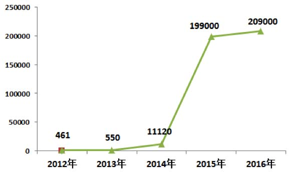
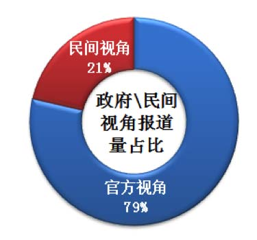
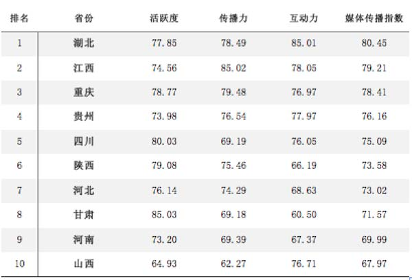
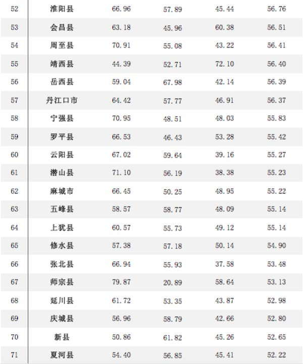
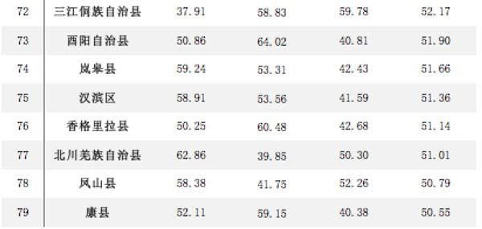

全域旅游发展大背景下旅游业呈现出蓬勃发展之势，“旅游+精准扶贫”战略也如火如荼开展，旅游业成为扶贫工作的急先锋和排头兵。 7月20日，人民网舆情监测室旅游大数据中心发布《旅游扶贫传播指数》，对旅游扶贫的传播和舆论生态进行深度分析，旨在全面解读旅游扶贫政策的传播影响力。

**社会化媒体助力旅游扶贫传播 政府扶贫行动传播力度强劲**

“旅游扶贫”自提出以来，有关旅游扶贫的媒体报道量呈逐年上升的趋势，社会化媒体在传播旅游扶贫过程中发挥了重要的推动作用。

图1 2012年-2016年旅游扶贫传播量趋势

旅游扶贫作为政府主导的行为，政府出台的经济措施、政府动态等新闻旅游扶贫中传播量最广的内容。从新闻报道视角来看，以政府为主导的官方视角的报道占据压倒性优势，官方视角下的扶贫新闻报道始终以政府宣传为主，但是传达老百姓声音的新闻报道量比例较少，因此扶贫新闻报道需要进行再平衡——多深入贫困地区基层反映贫困人民心声，善于发现扶贫工作中存在的问题，发挥舆论监督作用。

图2 旅游扶贫政府及民间视角报道量对比图

**旅游扶贫媒体传播影响力排行榜：新媒体开辟旅游形象传播新途径**

人民网舆情监测室旅游大数据中心从“活跃度”、“传播力”、“互动力”三个维度对省际和县域扶贫旅游目的地的媒体传播力进行评估，发布了旅游扶贫媒体传播影响力排行榜省际TOP10、旅游扶贫媒体传播影响力排行榜县域TOP100排行榜。

表1：旅游扶贫媒体传播影响力排行榜省际TOP10

表3：旅游扶贫媒体传播影响力排行榜县域TOP100

对排行榜中表现优秀的省份及贫困县旅游传播特点整理分析发现，各旅游目的地在旅游扶贫宣传中着重抓宣传的力度和宣传的广度，综合利用新媒体传播渠道，对辖区内旅游扶贫相关信息进行了及时且广泛的宣传推广。在活跃度方面，各旅游区域通过加强宣传不断驱动本地区旅游形象影响力提升。在微博账号管理方面，各景区均开设独立的旅游推介类官方账号，且粉丝量均在百万级以上，日更率平均达到6篇。在传播力方面，权威媒体以及微博官方账号是各旅游目的地推广旅游形象特别是旅游扶贫的主要宣传渠道。大多数省市在旅游扶贫宣传中以地方媒体为第一发声通道，再借力权威媒体转发进一步扩大信息传播的受众面和影响力。

**贫困县旅游形象塑造仍不尽如人意 需进行旅游形象增值**

旅游扶贫工作开展以来，各地旅游扶贫工作成效显著，但是从传播角度看旅游扶贫宣传中依旧存在诸多不科学、不合理的地方，严重阻碍旅游扶贫传播转化为实际市场吸引力。

政府在形象塑造过程中，主体地位过重而导致旅游者地位下降，政府过多从政策制定者角度看待问题，由此塑造出的旅游形象往往不被游客认可，从而造成“官方形象”形同虚设，并未对拉动游客增长发挥实际作用。不仅如此，旅游扶贫县在形象塑造方面还存在宣传内容“同质化”的问题，宣传语如出一辙，没有凸显本地区旅游特色，难以形成给游客留下深刻印象。

旅游产业市场化程度不断加深，各旅游目的地竞争愈发激烈，贫困县若想在与发达地区及以旅游业为传统强项的地区的竞争中不被淘汰，还需为自身旅游形象增值，要重视旅游人才培养，充分了解各类媒体的优缺点发挥媒体优势对自身形象宣传推广，凝练宣传主题树立总体形象科学利用媒体资源进行深度推广。
