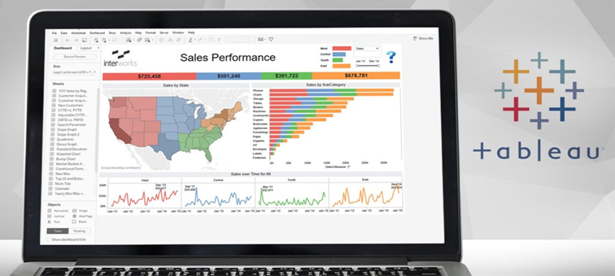
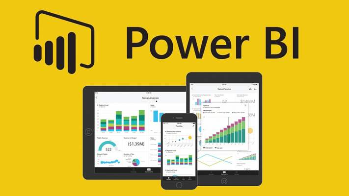
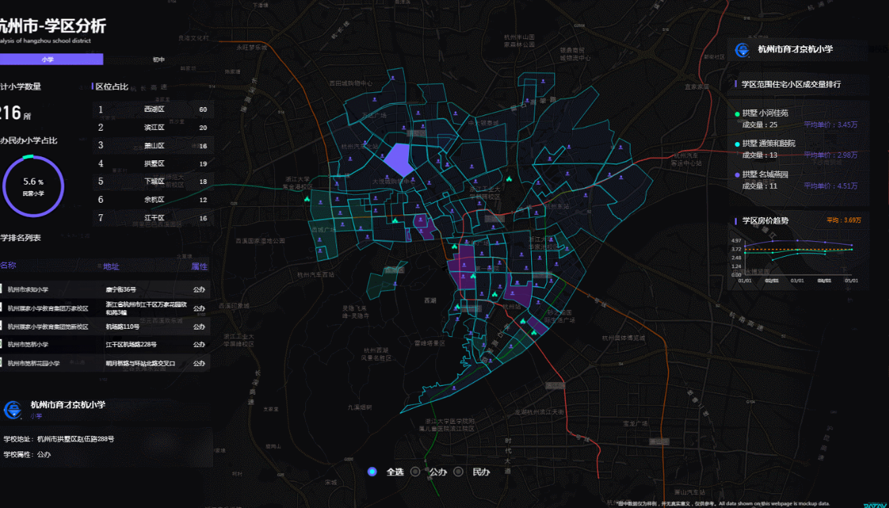
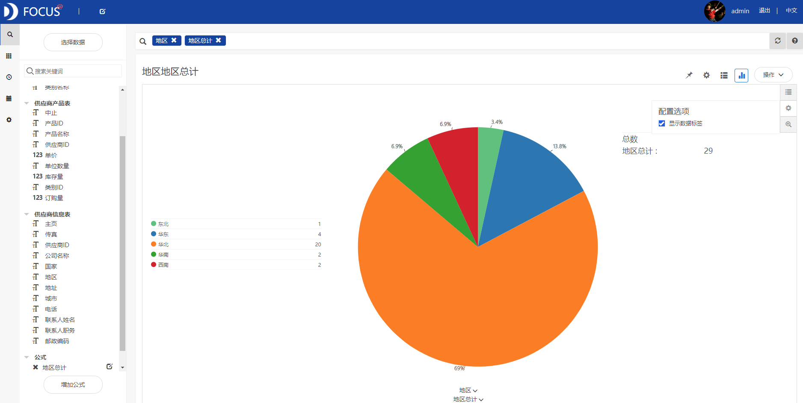
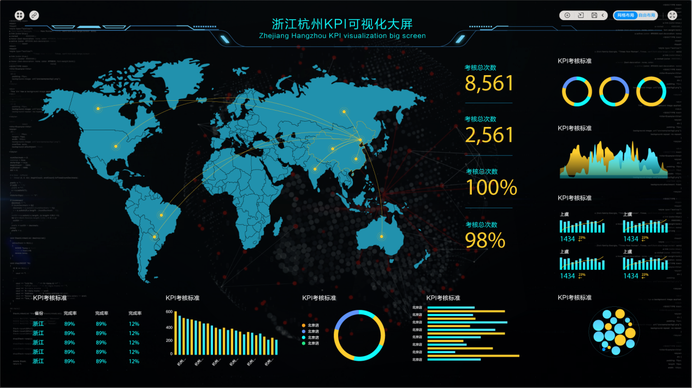

做数据分析我们一般从两个方面来看，一个是侧重分析预测，另外一个则是大数据的可视化方面，那么其实综合来看，主要分为一些特殊的使用场景。对于可视化分析和大数据平台，自己做过一些关于这方面 的产品调研和分析，固与各位分享下。

**ECharts**

ECharts 提供了常规的折线图、柱状图等；用于地理数据可视化的图；用于关系数据可视化的图表；还有用于 BI 的漏斗图，仪表盘，并且支持图与图之间的混搭。

除了已经内置的包含了丰富功能的图表，ECharts 还提供了自定义系列，只需要传入一个renderItem函数，就可以从数据映射到任何你想要的图形。

****Tableau****

Tableau将数据运算与美观的图表完美地嫁接在一起。它的程序很容易上手，各公司可以用它将大量数据拖放到数字“画布”上，转眼间就能创建好各种图表。这一软件的理念是，界面上的数据越容易操控，公司对自己在所在业务领域里的所作所为到底是正确还是错误，就能了解得越透彻。

****Power BI****

Power BI 类似于excel的桌面bi工具，功能比excel更加强大，是一套商业分析工具，用于在组织中提供见解。可连接数百个数据源、简化数据准备并提供即席分析。生成美观的报表并进行发布，供组织在 Web 和移动设备上使用。

**阿里DataV**

天猫双十一大屏就用DataV做的，是阿里云的拖拽式可视化工具，主要用于业务数据与地理信息融合的大数据可视化，像一些展览中心，企业管控中心用。不需要编程，通过简单的拖拽配置就能生成可视化大屏或者仪表盘。

**DataFocus**

DataFocus是第一个中文搜索式数据分析系统。DataFocus通过引入自然语言技术，将传统的必须依靠专业程序员和工程师的数据分析工作，转化成通过自然语言提问的方式，将使用门槛进一步降低，使得普通业务人员也能熟练的进行分析工作。

搜索框内输入关键语句，系统即时返回结果，并智能适配图表，什么样的数据，最合适什么样的图表，系统会告诉你。因为DataFocus智通搜索，并且适配图表，无需你再做其他复杂的配置，也不要任何的代码、SQL语句等等，系统全部会在后台自动处理好，而你只需要等待结果就行。

