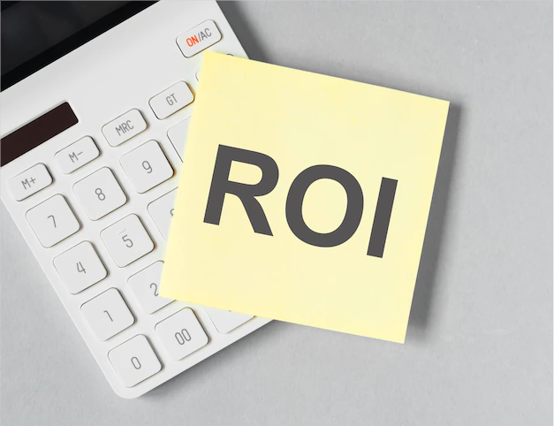

营销就是指企业发现或发掘准消费者需求，让消费者了解该产品进而购买该产品的过程。营销方式因其营销的国家、行业或营销内容而各有不同，甚至在同样的行业里，不同的企业也有着各自不同的营销方式。

企业发现、创造并交付价值以满足一定目标市场的需求，同时获得利润的过程就可以成为营销活动。但在这个活动初期和运行过程中，**我们选择的方向是否有误？是否需要进行修改？以及从哪方面入手进行修改？**

### **什么是营销投资回报率？**

为了监测营销活动，我们需要引入一个核心指标，**营销投资回报率**(Marketing return on investment，MROI)。

营销ROI可以展示营销活动的盈利能力，和ROI一样，通常是以百分比形式出现。若营销ROI大于0，代表您在营销活动上花费的每一分钱都可以获得利润；50%的MROI则意味着在营销上花费的每一元将产生1.5元的收入和0.50元的利润。

简而言之，营销ROI显示了营销活动的可行性以及营销活动为公司做出的贡献。

### **如何计算营销投资回报率**

可以使用多个公式计算营销投资回报率，具体取决于什么对您的业务最有意义。

基本公式是：

**【营销工作产生的收入($)-营销工作成本($)】/营销工作产生的收入($)\*100=MROI(%)**

由于有时很难跟踪收入，因此使用以下公式进行估算：

**【【潜在客户数量\*潜在客户转化率\*平均销售价格($)】-活动成本($)】/活动成本($)\*100=MROI(%)**

其中，每个指标的含义分别是：

- **潜在客户数量**\-成为潜在客户的人数。
- **潜在客户率**\-有多少潜在客户转化为客户。
- **平均销售价格**\-销售产品的平均价格。
- **营销工作的成本**\-构建和推广营销活动的总支出，一定套包含项目工作的人员的小时工资、广告支出或任何其他与活动相关的成本。

需要注意的是，营销投ROI在不断发展，因此在计算每个广告系列的回报时设置时间限制至关重要，可以按月、按季度或按年衡量特定活动的回报。审查短期和长期的投资回报率将有助于更好地了解您的营销投资回报率。

### **营销ROI的重要性**

计算营销投资回报可以方便更轻松地管理当前的活动、评估其成功并规划未来的营销策略。

1.展示营销活动的价值，证明营销预算的合理性；

2.正确跟踪营销支出和其他资源将帮助评估营销活动的整体效率；

3.查看不同广告系列的准确支出将帮助评估哪些广告系列具有更高的投资回报并值得进一步投资，合理有效地花费每一元。

### 区分**MROI和LTV：CAC**

营销投资回报率很容易与LTV:CAC比率以及每次获取成本(CPA)混淆。

我们来浅看一下它们的区别：

- MROI侧重于营销工作，可以在大范围或特定渠道或活动上进行计算。
- LTV:CAC比率专注于公司范围内的增长，包括销售贡献。
- 每次获取成本(CPA)特定于在线媒体支出。它计算通过付费营销（社交、搜索等）获得客户的成本。CPA是直接营销/响应指标。

### **总结**

营销投资回报率是营销人员计算的最重要指标之一，因为它证明了营销支出的有效性。

营销ROI主要用于计算营销工作、单个渠道或活动的整体盈利能力，也可以用于媒体支出（付费广告）的ROI。

与很多指标一样，如果只查看整体的营销ROI，MROI可能会被人为夸大，因此务必需要将多个指标按照一定的时间规则制作出可以长期监测的可视化大屏。例如，用DataFocus这一类的BI工具制作出可用于监测长期数据变化的数据看板，在长期监测MROI波动的基础上，寻找突破和改进的机会。

最后请记住，公司总体目标是最大化利润，而不一定是营销投资回报率。最大化利润和长期价值往往超出了获得最高MROI的范围。因此在监控和改进MROI时牢记公司的整体目标，以确保您的所有努力与公司业务目标始终保持一致。
