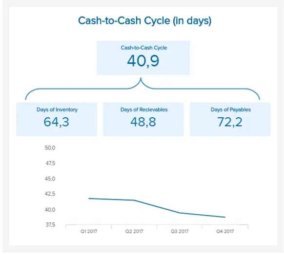
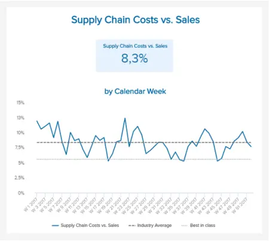
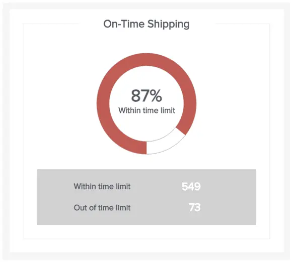
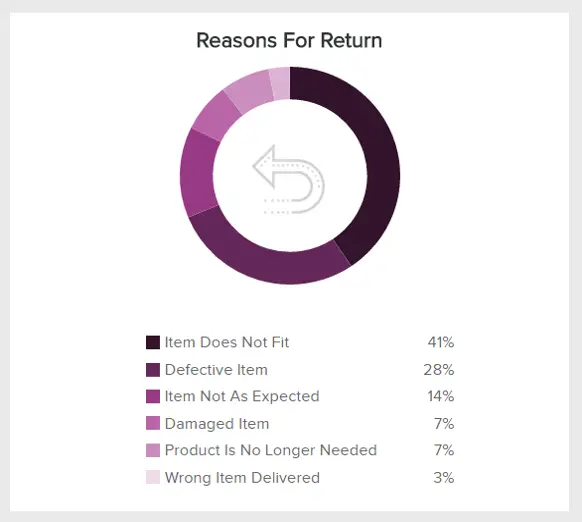
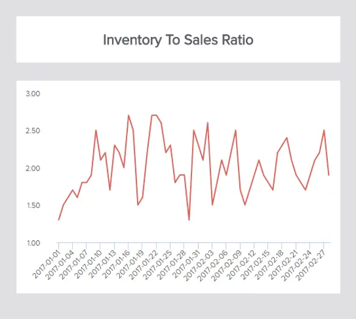
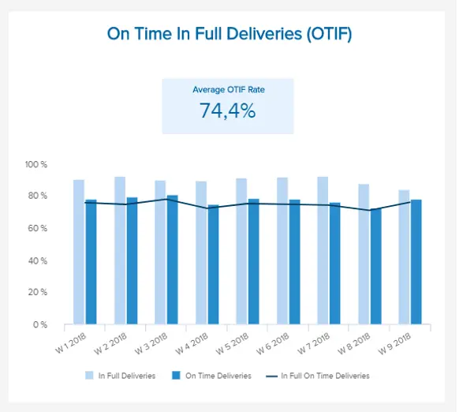
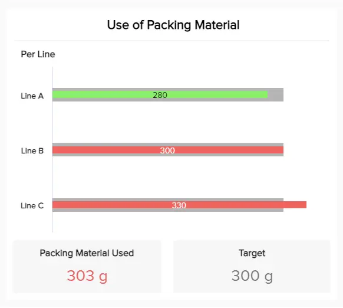
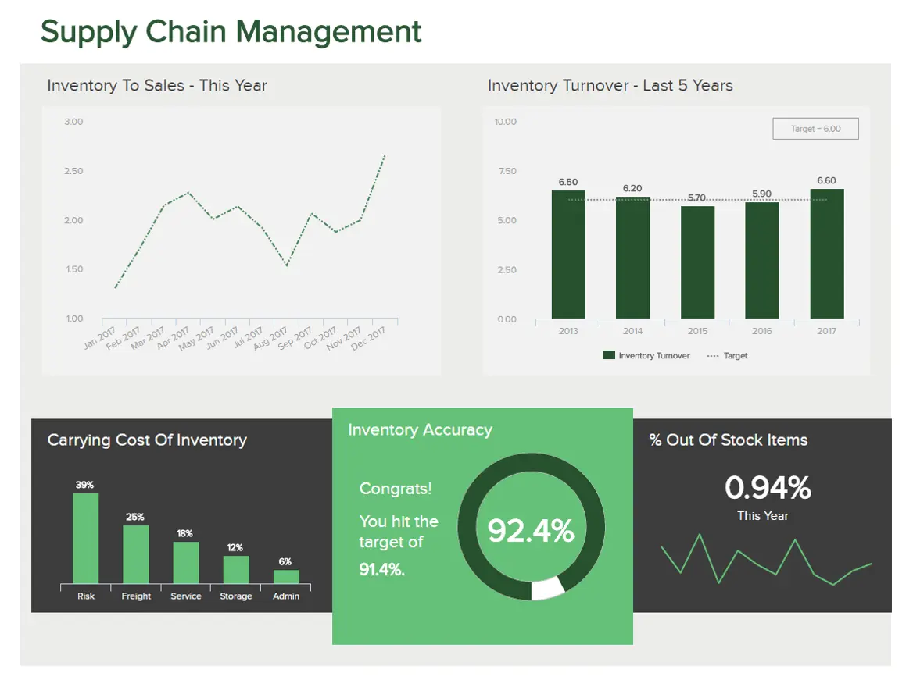

供应链是任何现代企业的支柱：一个不断变化的生态系统，确保从供应商到客户或客户顺利、高效和一致地交付产品或服务。

如果您的供应链缺乏结构、愿景和效率，或者支离破碎，您的商业增长将受到影响。这就是为什么精确监控和优化相关供应链指标和 KPI 至关重要的原因。

供应链指标将帮助您为许多基本流程和活动设定可靠的基准。通过使用正确的 KPI，您可以提高业务的生产力、智能度，并最终提高盈利能力。

在这篇文章中，我们将介绍基本的供应链 KPI，并提供有关您应该跟踪以改进物流流程的 20 个基本见解。我们还将向您展示如何在现代[KPI 软件](https://www.datafocus.ai/infos/kpi-dashboard-software)的帮助下最大化这些供应链绩效指标的价值，以创建专业的供应链仪表板。

但首先，让我们从基本定义开始。

您的机会：[想要轻松可视化和跟踪供应链指标？](https://www.datafocus.ai/console/)试用我们的现代物流分析软件 14 天，完全免费！

## 什么是供应链指标？

供应链指标是通过建立用于量化和定义供应链绩效的特定参数来定义的。这些指标可用于库存准确性和周转指标，以达到库存与销售比率。

关于贵公司供应、履行和交付工作的持续增长、演变、发展和成功，供应链绩效指标是您触手可及的最宝贵工具。通过收集、策划和分析关键供应链指标 （SCM），您将能够发现生态系统中的低效率，同时利用您当前的优势并建立目标，帮助您的供应链随着公司的成功而扩展。虽然您可以选择许多[KPI 示例](https://www.datafocus.ai/infos/kpi-examples-and-templates)进行评估和优化，但我们专注于一个列表，使您能够识别潜在的瓶颈并确保可持续发展。

## 我们的 20 大供应链指标示例

请记住：今天，24/7/365 全天候访问您的指标至关重要。尖端的[在线数据分析工具](https://www.datafocus.ai/infos/data-analysis-tools)将为您提供这种未开发的数据驱动访问级别，从而在此过程中增加您的商业前景。

现在您已经熟悉了官方的供应链指标定义，我们将探索前 20 个供应链指标，这些指标将帮助您和您的业务迈向光明繁荣的未来。

### 1\. 现金到现金的时间周期

这个无价的供应链指标将帮助您计算将资源转化为真实现金流所需的时间长度。使用三个核心比率 - 库存天数 （DOI）、应付账款天数 （DOP） 和应收账款天数 （DOR） - 现金与现金时间周期 KPI 可视化了企业向供应商支付现金和从客户收到现金之间所需的时间。转换周期越短越好，这个宝贵的供应链指标将帮助您采取正确的措施，以确保您可以以更少的运营资金来运营您的业务。

### 2\. 货运单准确性

将您的物品从供应商运送和运送到仓库或仓库到消费者对于整个运营的成功至关重要，任何问题或错误都可能因浪费时间和投资而有害。

计费准确性对于盈利能力和客户满意度至关重要，因此跟踪此特定指标将帮助您发现有害趋势，提高整体运输准确性，并最终帮助您的业务增长。以下是运费单准确性的计算方法：

（无差错运费单/总运费单）\* 100

### 3\. 完美的订单率

这种特殊的洞察力是众多行业企业最关键的供应链KPI之一。完美的订单率衡量您无事故交付订单的能力是否成功，最终将帮助您解决不准确、损坏、延迟和库存损失等问题。完美订单率越高越好，因为此 KPI 直接影响您的客户保留率和忠诚度水平。

### 4\. 应收账款周转天数 （DSO）

应收账款周转天数 （DSO） KPI 衡量您从客户那里收取或产生收入的速度。

从本质上讲，低或健康的DSO数字意味着企业收取应收账款所需的天数更少。较高的DSO水平表明，一家公司正在赊销其产品，并且需要更长的时间才能在有形的意义上获得收入，这可能会阻碍现金流并最小化宏伟计划中的利益。通过经常计算，您将能够更快、更有效地收集收入，从长远来看，这将有助于提高您的底线。

### 5\. 库存周转率

当今最有用的供应链 KPI 之一侧重于[物流 KPI，](https://www.datafocus.ai/infos/kpi-examples-and-templates-logistics)并帮助企业了解其整个库存在特定时间范围内的销售次数：高效生产计划、流程策略、履行能力以及营销和销售管理的令人难以置信的指标。通过计算您的准时发货率并将其与您所在行业内的其他竞争对手进行比较，您将能够创建一个清晰的[管理报告](https://www.datafocus.ai/infos/management-reporting-best-practices-and-examples/)实践，了解您的现状，并采取适当的行动随着时间的推移对其进行改进 - 这将导致品牌权威的提升以及底线的增加 - 所以这很重要。

### 6\. 毛利率投资回报率

每个企业，无论服务、产品或部门如何，都努力为其开展的每项商业活动实现最佳投资回报 （ROI）。保持始终如一的稳定投资回报率是持续电子商务成功的面包和黄油。

在供应链指标中，GMROI 清楚地表示了库存中平均投资的每 AED（或 $、£、€、€）所获得的毛利润：通过将毛利润除以平均库存投资来实现的计算。通过每月跟踪此 KPI，您将快速了解库存中的哪些项目表现不佳，哪些项目值得更多投资 - 就基于业务的信息而言，金粉。

### 7\. 仓储成本

我们继续列出供应链指标（SCM指标）和仓储成本。成本分配以及库存时间和空间的管理对于建立健康的供应链至关重要。虽然这些成本因仓库而异，但重要的是要衡量该指标并定期审查，以便识别机会并减少不必要的成本。仓库设施的管理包括各种成本，例如人工成本、仓库租金、水电费、设备成本、材料和信息处理系统以及与供应、订购和存储货物相关的成本。

要将成本保持在较低的范围内，首先要充分了解仓库设施中发生的所有流程及其确切的运作方式。这样，您将有更好的机会减少不必要的成本，并引入更有效地管理运营以及在需要时进行调整的步骤。此外，如果您在专业的在线报告工具的帮助下定期收集您的信息，您将有机会依靠您的[报告](https://www.datafocus.ai/infos/online-reporting)并做出更快、更准确的业务决策。

您的机会：[想要轻松可视化和跟踪供应链指标？](https://www.datafocus.ai/console/)试用我们的现代物流分析软件 14 天，完全免费！

### 8\. 供应链成本

成本是供应链关键绩效指标之一，显示与供应链管理相关的相关成本。这些成本可能包括规划、管理团队、采购、交付等，它将显示公司各部门的效率。对于任何企业来说，增加利润至关重要，降低成本是经常应用的策略之一。这样，公司就可以确定是否有任何改进的空间，而无需在此过程中增加销售额。

但是，必须评估成本降低将对整个供应链产生什么样的影响。例如，如果您的运输成本很高，并且您决定提高卡车的速度和重量，您可能会冒着事故风险，并对您的业务造成潜在的有害后果。您还可以记住，削减供应链一个领域的成本可能会在另一个领域增加，因此对这部分进行仔细分析至关重要。您可以执行基准测试或将自己与竞争对手进行比较，以了解供应链中的此 KPI 是否稳定健康，或者您需要其他调整才能具有竞争力。如果您想了解有关成本和业务财务方面的更多信息，我们建议您阅读我们的[财务图表](https://www.datafocus.ai/infos/financial-graphs-and-charts-examples/)指南。

### 第 9 章供应链成本与销售额

我们的供应链 KPI 和指标列表继续进行与销售相关的其他成本分析。该指标基本上计算您的供应链成本作为销售额的一部分，从本质上讲，它会让您了解相对于整体的支出。通过计算此类供应链管理指标，您将能够执行健康的支出分析并建立潜在节省的流程。优化供应链意味着尽可能降低成本，但正如我们提到的，重要的是在有意义的地方削减成本，而不是简单地降低成本。原因很简单：如果您削减的成本，从而在供应链的另一部分增加成本，整个过程就不是很有用。

要了解您是否成功地将成本与销售额进行比较，您可以简单地研究行业基准或将您的业务与竞争对手进行比较。这样，您就会知道您的百分比是太低还是太高。无论如何，将数据与相关行业的平均值进行比较至关重要。

### 10\. 准时发货

使用专业的 KPI 工具创建，准时发货是您可能需要将特定类型的订单运送给客户、客户或合作伙伴多长时间的绝佳指标，此[KPI](https://www.datafocus.ai/infos/kpi-reporting) 将允许您设置相对于每种产品的基准运输时间，这反过来又可以让您优化您的运输和交付流程， 减少周转时间，提高客户满意度。

### 11\. 交货时间

交货时间是供应链的一个 KPI，专注于改善服务：它衡量从订单发货到客户家门付所需的时间。订单需要正确准备，并在合理的时间范围内到达目的地。否则，一般服务可能会受到影响，并给客户留下印象：没有人喜欢等待 9 个月才能收到他们交付的货物。

减少此供应链管理 KPI 并在通知客户货物或产品何时交付方面提高准确性是有意义的。最好说明交货将在 4-5 个工作日内到达，而不是 1-5 个工作日。此外，如果您设法指定时间，对您的服务甚至更好。您还可以提供特殊的送货服务，以减少送货时间，并了解从长远来看，客户满意度如何提高。您甚至可以在专注于供应链的[绩效仪表板](https://www.datafocus.ai/infos/performance-dashboard-examples/)中包含供应交付指标，并对其进行更密切的监控。请参阅本文底部以仔细查看供应链 KPI 仪表板。

### 12\. 退货原因

退货原因供应链指标提供了对导致您的客户和客户退货的各种动机的敏锐见解 - 这是电子商务业务持续成功的无价信息。以易于理解的饼图样式格式呈现，并带有展示退货的主要原因的关键，您将能够评估您的弱点，分析供应链流程中关键领域的质量，并进行改进，不仅可以提高您的声誉，还可以显着提高您的整体服务水平。通过获得这种水平的洞察力，您很有可能减少回报、提高利润并改善现金流。

### 13\. 库存与销售比率

我们列表中的关键供应链指标之一，即库存与销售比率，对于跟踪至关重要，因为库存是您供应链中最重要的工具之一。该指标衡量待售库存量与实际销售数量（以比率表示）的比较。它将帮助您调整库存以确保高利润，并告诉您公司处理意外情况的情况。

这里的重点是，要保持健康的比例，您需要知道如何正确平衡它。保持比率不要太高是有意义的，因为它可能会影响您的库存周转率，因此平衡行为至关重要。现代[仪表板制作者](https://www.datafocus.ai/infos/dashboard-creator)可以帮助您创建交互式库存 KPI，该 KPI 将自动更新数据，您可以实时监控性能。此外，您将能够调整您的未来战略，并确保有一个特定于您的业务的最佳比率。

### 14\. 库存速度（四）

关键的供应链 KPI（库存速度或 IV）提供了预计在下一个期间或下一个季度内消耗的库存百分比的可视化快照。

通过将期初库存除以下一期间的销售预测来计算，IV 是一个 KPI，可帮助您优化库存水平，为您提供更大的机会来满足消费者需求，并防止您在过剩的库存水平上浪费金钱。

### 15\. 库存供应天数

虽然这可能不是最全面或最全面的供应链指标，但库存供应天数特别有用，因为它将为您提供相当准确的计算，即如果不补充库存，您将需要多少天。

通过定期跟踪、分析和理解这些流数据，您将能够在紧急情况下准备和避免任何基于股票的灾难，从而在此过程中挽救您的声誉和现金流。

您的机会：[想要轻松可视化和跟踪供应链指标？](https://www.datafocus.ai/console/)试用我们的现代物流分析软件 14 天，完全免费！

### 16\. 拣货和包装周期时间

这种供应链绩效衡量将使您能够准确衡量整个供应链周期的效率（或低效），并将其分解为特定的行。KPI 中的每个指标都旨在量化从员工从货架上取出物品到包装过程完成的时间。

一旦您设定了目标并开始跟踪供应链周期进度，供应链中的延迟或弱点就会变得清晰。因此，您可以采取有针对性的行动将这些问题扼杀在萌芽状态，从而缩短整个周期时间。

### 17\. 填充率

供应链管理指标列表中的下一个是填充率。作为任何有价值的供应链 KPI 仪表板的重要补充，这一重要指标将为您提供首次（或首次发货期间）成功履行的客户订单的比例或百分比的明确指示。

作为衡量供应链绩效的最流行指标之一，填充率与整体品牌声誉和客户满意度水平（商业增长和演变的重要驱动力）直接相关。您可以根据首次尝试时交付的订单、交付的行或交付的单个商品来衡量您的填充率。如果您发现填充率存在任何差异，您将能够轻松发现确切的履行因素并迅速提高填充率。

### 18\. 按时全额交付 （OTIF）

就重要的供应链指标而言，OTIF 就在那里，因为这个最强大的供应链 KPI 示例将为您提供在设定时间范围内交付绩效的全景见解。满足客户或客户的期望对于业务的持续成功至关重要。作为最具洞察力的供应链效率指标之一，OTIF 将确保您的订单按时足额完成。

根据诸如正确的产品是否按照商定的质量标准交付、以正确的数量交付以及交付到约定的目的地等因素，此 KPI 将帮助您始终如一地优化绩效。如果您的平均 OTIF 费率滞后，您可以使用此指标来确定起作用的因素并做出战略决策以调整您的内部战略或与更可靠的供应商合作。

### 19\. 每单位运费

供应链管理中的指标对于实现可持续改进至关重要，每单位的运费就是这一概念的证明。作为任何扩展业务最重要的供应链指标之一，每单位的运费成本将为您提供有关产品运输经济性的深刻见解。

这个特定的供应链指标仪表板添加将衡量您的总运费除以您运送的单位数量。您可以使用与您的业务相关的任何单位来计算此指标。任何冗长或计划不周的流程都会花费您的时间、金钱和客户忠诚度。此 KPI 将帮助您避免此类困难。

### 20\. 包装材料的使用

我们概述供应链 KPI 的下一个是包装材料的使用。低效的包装流程不仅会导致不必要的浪费，而且还会消耗您企业的预算。这个可扫描的供应链KPI将帮助您自信地跟踪拣选和包装过程中每条生产线使用的包装材料数量。

通过为您的包装使用量设定目标或基准（在本例中为 300 克），您可以掌握包装使用情况，并将任何潜在问题扼杀在萌芽状态。通过在包装策略失控之前重新评估您的包装策略，您将节省资金，同时由于您新发现的可持续性而提高您的品牌声誉。

您的机会：[想要轻松可视化和跟踪供应链指标？](https://www.datafocus.ai/console/)试用我们的现代物流分析软件 14 天，完全免费！

## 供应链管理仪表板示例

借助现代[在线数据可视化工具](https://www.datafocus.ai/infos/data-visualization-tools)，您只需单击几下即可创建具有所有所需 KPI 的令人惊叹的供应链管理仪表板。供应链管理中的每个 KPI 都紧密结合，描绘出一幅生动的画面，推动您的组织向前发展。这些仪表板示例将演示如何：

### 1\. 供应链管理仪表板

在下面的示例中，我们收集了专注于库存指标的数据：库存与销售比率，您可以将其与[库存](https://www.datafocus.ai/infos/inventory-metrics-and-kpi-best-practices/)周转率相结合，并清楚地看到您业务的财务稳定性。此特定仪表板的下一个 KPI 是库存的持有成本，其次是库存准确性和缺货项目。此示例中的目标是避免浪费资金、留住客户并定义业务的稳定性。

\*\*点击放大\*\*

不可否认：以持续一致、战略性和数据驱动的方式进行的最佳供应链管理将产生令人难以置信的丰硕长期成果——这种结果将帮助您的企业随着时间的推移而发展和扩展。

作为我们最强大的业务仪表板之一，供应链[仪表板](https://www.datafocus.ai/infos/dashboard-examples-and-templates)拥有供应链绩效所有关键领域的可消化、功能和可视化表示，从库存准确性和营业额到库存与销售比率。通过深入到库存管理物流，这个特定的KPI仪表板（也可以用作[交互式仪表板](https://www.datafocus.ai/infos/interactive-dashboard-features/)）将帮助您处理意外的供应链情况，增强您的库存购买实践，减少运营和财务效率低下，显着提高准确性您的等等。您的库存对您的商业运营至关重要，这就是为什么通过中枢神经中枢跟踪您的库存将确保每一个供应链的努力和举措都能改善您经营业务的方式，而不是阻碍它。

通过在一个计划空间中跟踪这些关键的供应链绩效指标，您将能够实施不仅具有最大价值，而且还将确保供应链流程的平稳运行和永久改进的计划，确保车轮上的每一个齿轮都在转向最大效率 - 当然， 是无价的。

如果您想了解如何创建这样的仪表板，请查看我们富有洞察力的指南，其中包含来自不同行业和职能的示例。

### 2\. 供应链成本仪表板

消费品是另一个依赖有效供应链管理的重要行业。特别是在成本优化方面，不应该有太多忽视财务分析的空间，因为它会对底线造成严重损害。全面的[BI 仪表板](https://www.datafocus.ai/infos/bi-dashboard-best-practices)可以帮助您自动化 KPI，并确保您专注于真正重要的事情：您面前的信息、视觉对象和数据。

\*\*点击放大\*\*

在此供应链指标仪表板的顶部，您可以查看总净销售额、总供应链成本和平均现金到现金周期的快速概览，这是开始数据演示的所有重要供应链管理指标。左侧按类别表示供应链成本，包括仓储、运输、库存持有成本、客户服务和库存管理。在这些指标下方，可以清楚地了解供应链成本与销售额的关系。此 KPI 还按日历周细分，并与上一期间进行比较。我们已经分析了这个指标，所以我们不会详细介绍，但要记住的重要一点是跟踪这个指标并执行更详细的支出分析，最后，如果需要进行调整。

此供应链绩效仪表板的右侧是与成本相关的其他基本指标：现金到现金周期和库存的持有成本。如果您想知道您需要多少现金来为持续运营提供资金以及根据您的库存可以获得多少利润，这些指标是必不可少的。您可以使用供应链仪表板软件轻松创建这样的[在线仪表板](https://www.datafocus.ai/infos/online-dashboard)。

## 为什么供应链指标很重要？

现在我们已经介绍了供应链关键绩效指标示例和使它们栩栩如生的仪表板，我们将通过回答以下问题来反思：为什么供应链指标很重要？

出于多种原因，基于供应链的指标对于贵公司的核心履行和物流战略至关重要。事实上，研究表明，到 2027 年，供应链分析市场的价值预计将达到 168.2 亿美元。这是因为使用分析进行供应链决策有助于企业提高其运营、战略和战术效率。

以下是KPI跟踪在供应链管理中如此重要的主要好处和原因：

### 沟通与凝聚力

成功供应链的关键是沟通。一旦参与该过程的每个人都对自己的角色有了更深入的了解，同时获得了最大化其潜力所需的指标，供应链机器中的每个齿轮都将变得更加顺畅、更经济、更可靠。

像这样的 KPI 和指标提供了对宝贵数据的统一访问 - 这种数据将改善沟通、帮助协作并确保在每件产品从仓库顺利运送到最终收件人时经济地管理您的库存。

### 专注的数据和供应链洞察

在信息时代，由于需要分析的来源、平台和接触点数量不断增加，履行流程可能会变得过于复杂。当您管理繁忙的供应链时，快速浏览不断扩大的数据堆会成为一场艰苦的斗争。但是 KPI 将使您能够专注于重要的数据。

基于供应链的指标以易于理解的可视化格式将真正重要的内容从一个集中位置可视化。使用供应链风格的指标不仅可以帮助您更好地运营物流运营，还可以在问题滚雪球之前识别任何正在出现的问题（库存缺口、库存不足、交付流程瓶颈等），或者发现隐藏的趋势，这将显着改善您的整体战略。

### 责任感和适应性

供应链 KPI 绩效指标至关重要，因为它们将为您提供始终保持响应和适应性所需的所有洞察力。成功的供应链管理在任何情况下都具有100%的适应性。如果出现问题（当您谈论供应链时需要考虑几个阶段时，几乎总是会在某个时候发生），您必须能够立即修复它。

随着客户需求的不断发展，业务环境不断变化，确保您的供应链稳健将使您与众不同。以供应链为中心的指标将为您提供信心和智慧，根据周围的环境对您的流程进行有价值的战略更改，同时借助您可以一目了然地分析的目标数据可视化，自信地做出即时决策。您越能始终如一地满足或超过客户或消费者的履行期望，您的业务就会增长得越多 - 基于供应链的指标将帮助您做到这一点。

通过能够做出提供真正价值的预测并在压力下做出明智的选择，您将优化您的供应链，以便在竞争激烈的商业世界中取得持续的成功。反过来，这将最大限度地提高您的增长和盈利能力。

您的机会：[想要轻松可视化和跟踪供应链指标？](https://www.datafocus.ai/console/)试用我们的现代物流分析软件 14 天，完全免费！

## 总结和后续步骤

最近的研究表明，79%拥有高绩效供应链的公司的收入增长高于其行业平均水平。此外，该软件的使用量同比增长9%，这表明开发高效供应链的这种明确价值在于提高公司绩效的现代解决方案。

这就是仪表板的强大功能发挥作用的地方。如果您想创建一家数据驱动的公司，在分析过程中节省无数时间，并使用实时数据，仪表板是一个很好的方法。有关更多数据驱动的智慧，请查看这些出色的[仪表板设计](https://www.datafocus.ai/infos/great-dashboard-design-examples-for-inspiration/)，您可以从中获得灵感。

那么，供应链中的指标是什么？好吧，以下是我们详细讨论的 20 大供应链 KPI 的摘要：

- 现金到现金的时间周期
- 货运单准确性
- 完美的订单率
- 应收账款周转天数 （DSO）
- 库存周转率
- 毛利率投资回报率
- 仓储成本
- 供应链成本
- 供应链成本与销售额
- 准时发货
- 交货时间
- 退货原因
- 库存与销售比率
- 库存速度（四）
- 库存供应天数
- 拣选和包装周期时间
- 填充率
- 准时和全额交货
- 每单位运费
- 包装材料的使用

这些以供应链为中心的基本 KPI 中的每一个都将使您的组织从头开始更强大、更智能、更经济高效。通过使您的供应链从头到尾完全有凝聚力，您将以您从未想过的方式加速您的业务增长 - 而这一切都始于正确的见解。

如果您想精确无误地跟踪和可视化您的供应链指标和 KPI，您可以试用我们的现代物流分析软件，免费试用[14 天](https://www.datafocus.ai/console/)！
