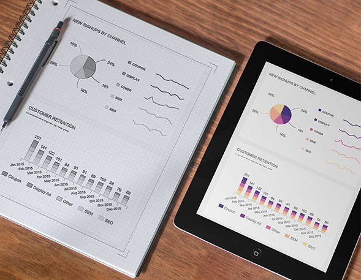
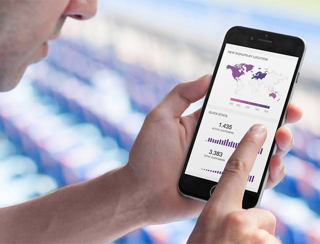

您的数据很有价值。借助我们一流的业务报告软件，我们为您提供了一种在整个组织中可视化和交流洞察力的简便方法。为您最重要的 KPI 提供一个集中且可访问的平台将创建一种数据驱动的文化，让所有关键人员了解情况，并帮助您和您的团队更快地发展业务。

## 可视化并报告您的见解

创建有意义的视觉效果并与您的团队、客户或其他股东分享，无需数据科学家参与业务报告软件有一个目标，即使数据分析和报告成为一项简单且耗时较少的任务。业务报告是一项重要的业务活动，可以减轻业务用户，尤其是决策者的工作量。

它的视觉特性有助于快速理解复杂的问题并消除猜测，同时让您从数据中收集有价值的发现。借助对当前情况的多合一概述，业务报告工具可以轻松地将原始数据转化为可操作的见解。如此大的图景是一个优势，它为更快、更明智的决策创造了空间。

浏览电子表格以查找您需要的数字是一种痛苦。对于较小的团队，这可能会阻塞过多的资源。我们希望您跳过从迷宫般的数据源中提取数据的艰巨任务，让您独立处理数据。您不再需要依赖 IT 团队，并且可以自己访问数百万行数据，并以有意义的图表和表格精美地可视化。

连接数据源是一个快速过程。同步到您的中央存储库需要几分钟而不是几周。从这里，您可以使用我们直观的拖放导航构建图表，并根据您的发现创建实时报告，让您或您的团队在需要时随时使用它们。[业务仪表板](https://www.datafocus.ai/infos/dashboard-examples-and-templates)是一种非常有用的报告工具，当任何人需要根据数据备份的可靠信息做出决策时，它会派上用场。现代仪表板是必不可少的信息工具，可帮助您管理业务的数百个重要部分。就像汽车中的仪表板一样，它们通过一目了然的概览实时报告您的运营状态，全面描绘您的业务绩效。

通过使用正确的业务报告软件，您可以避免手动创建每日或每周报告的令人麻木的任务。相反，让您的团队访问令人兴奋的交互式仪表板。它们是实时的，不再需要手动、耗时的更新。

## 4 高企业安全级别的不同角色

业务报告软件正在收集的大量信息需要适当保护系统和管理数据。DataFocus 的高企业安全级别可帮助您控制和分配与您协作的每个用户的特定角色，确保您拥有最大程度的保护和有效管理敏感信息的选项。也就是说，我们提供了 4 种不同的角色来适应任何业务场景：

数据的安全性和完整性对​​您和 DataFocus 都非常重要。权限决定了特定用户以何种方式查看您的信息并与之交互。由于存在不同的业务场景，您可能需要不同的权限功能，因此 DataFocus 创建了 4 种类型的用户，可以管理、交互、编辑和探索您的分析、仪表板、数据源和报告，以及软件中的其他选项。这 4 个角色使公司能够建立不同的安全级别和角色，可以创建仪表板、添加其他用户，或者只是根据分配的过滤器浏览仪表板。根据具体的角色，您的业务信息将始终是安全的，您将能够完全控制共享的内容、与谁共享以及具有何种权限。

您分配给每个角色的允许操作旨在增加对分析的保护，并为您提供有关可能要共享的数据和信息的多种选择。管理员级别是用户可以拥有的最高角色，其次是编辑者、高级查看者和查看者。这些角色中的每一个都有与我们的工具交互的细节和可能性，您可以在上面的概述中看到。DataFocus 旨在牢记我们的用户，并且我们提供的每个角色都将以最有效的方式保护您的信息。

## 使用 DataFocus 计算您的节省

通常，像 DataFocus 这样的解决方案的巨大价值很难量化和交流。出于这个原因，我们希望为您提供一个简单的计算器，以帮助您更好地了解通过每月对我们的业务报告软件进行少量投资可以节省多少钱。

商业智能的好处通常很难以有形的方式识别。我们通常知道投资的成本是多少，但投资回报率 (ROI) 几乎无法完全衡量——尤其是因为它不仅带来了原始的财务收益，而且在运营效率、客户服务、团队内部和团队之间的沟通、法规遵从性、利润等。但是，如果无法轻松衡量这些改进，则很容易评估没有 BI 解决方案所产生的成本：数据差异、没有中央数据访问、IT小型、低附加值的重复性任务、同步噩梦和浪费在沟通问题上的时间、静态 Excel 表格和陈词滥调、100 张幻灯片 PowerPoint 演示文稿……等等。

由于很难估计 BI 带来的优势，我们试图找到一种方法，以一种简单的、以仪表板为中心的方式为 BI 的优势分配货币价值。借助此计算器，您可以模拟使用 DataFocus 的业务报告工具对数据进行分析和可视化所带来的节省。只需输入将从中受益的客户或部门的数量、为每个人创建的仪表板数量、每月在仪表板上花费的平均时间以及从事这些工作的员工的小时工资......然后你将了解您每年可以节省的巨额成本。

## 您的进度快照

**随时随地访问您的数据的最新报告**

我们的仪表板可让您处理实时数据，让您随时了解业务中发生的任何事情。我们的业务报告解决方案的基于 Web 的特性使您和您团队中的任何人都可以轻松地访问和处理仪表板，无论您身在何处。这对于跨学科项目和遍布全球但仍需要协作的团队特别方便。这是让您的主要参与者保持一致的最佳方式。

使用 DataFocus 的[仪表板报告软件](https://www.datafocus.ai/infos/dashboard-reporting)，您可以选择要授予读者或合作者的交互程度：共享简单的只读仪表板，或允许您的整个团队使用全局过滤器，以便自主深入研究不同的数据集。共享丰富的交互式报告就像发送 URL 一样简单。您的团队可以从仪表板上看到您的观察结果，但很高兴知道他们也会在收件箱中收到它。随时访问重要的指标使您能够在正确的时间做出正确的决定——这是当今全球化企业迫切需要的。

无论是每天、每周还是每月，都可以选择刷新报告并自动发送给收件人的频率。所有数据松报告都可以跨设备访问，您可以通过 Excel、PDF 和 PNG 格式提供所有需要的信息。始终如一地在所有相关设备类别上为您的合作伙伴、客户和同事提供富有表现力的视觉效果。
