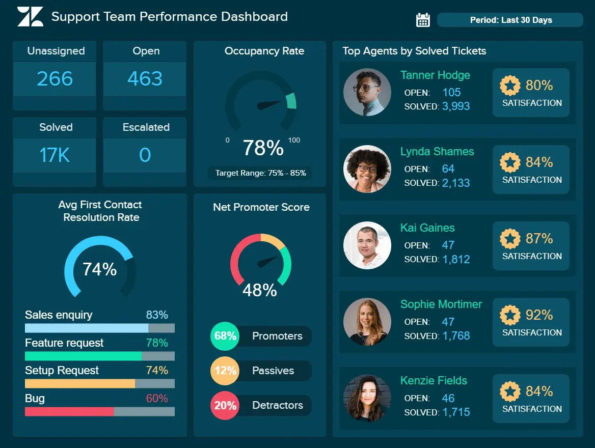
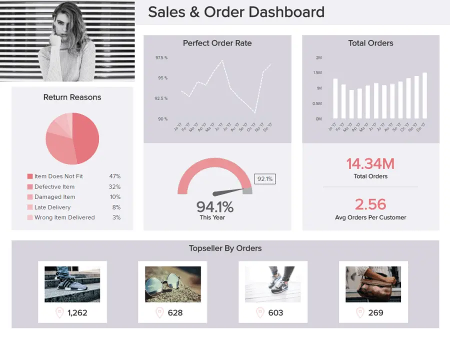
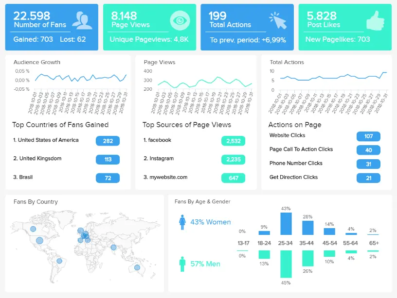
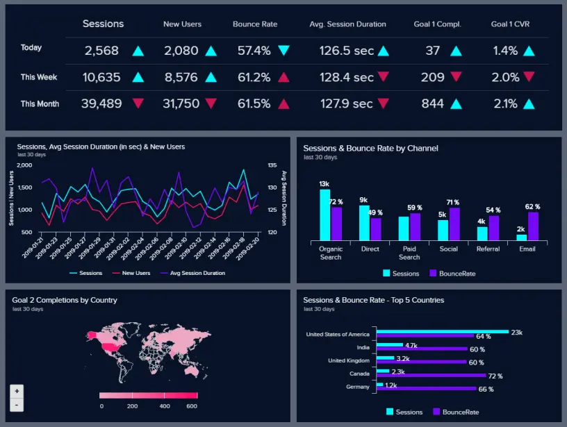
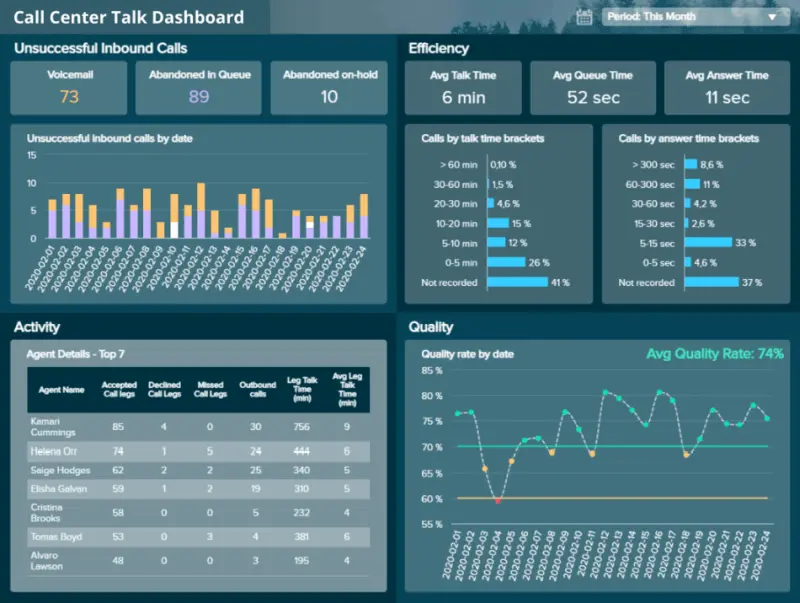
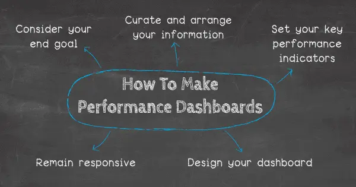

目录

[1） 什么是性能仪表板？](https://www.datafocus.ai/infos/get-started-with-business-performance-dashboards-examples-templates#definition)

[2） 业务绩效仪表板示例](https://www.datafocus.ai/infos/get-started-with-business-performance-dashboards-examples-templates#examples)

[3） 如何制作性能仪表板？](https://www.datafocus.ai/infos/get-started-with-business-performance-dashboards-examples-templates#how-to)

[4） 性能仪表板的主要优势](https://www.datafocus.ai/infos/get-started-with-business-performance-dashboards-examples-templates#benefits)

[5） 数据与业务绩效之间的联系](https://www.datafocus.ai/infos/get-started-with-business-performance-dashboards-examples-templates#data-business-performance)

为了在当今竞争激烈的商业世界中取得成功，基于无懈可击的洞察力在正确的时间做出正确决策的能力至关重要。如果您没有远见或不知道如何处理它，您会发现自己在黑暗中射击——这对任何企业的增长和发展都是有害的，无论规模或行业如何。

也就是说，如果您希望发展您的帝国、提高品牌知名度并提高您的底线，那么拥抱业务绩效仪表板和大数据应该是您的首要任务。我们不只是在谈论一个单一的功能，而且您所有业务的点点滴滴都应该采用现代数据分析的力量，并利用专业的[仪表板创建者](https://www.datafocus.ai/infos/dashboard-creator)来增强您的数据管理流程。

 

感兴趣？太好了 - 在这里，我们将探索大数据与业务绩效之间的联系，同时查看现实生活中的性能仪表板示例的动态组合，并解释为什么您需要一个（或几个）。但首先，让我们看一个实用的性能仪表板定义。

您的机会：[想免费构建自己的性能仪表板吗？](https://www.datafocus.ai/console/)试用我们的专业仪表板软件 14 天，完全免费！

## 什么是企业中的绩效仪表板？

性能仪表板是一种数据可视化工具，可根据宝贵的业务见解提供强大的知识。这使用户能够更深入地了解他们在多个领域的绩效，同时制定有针对性的策略以促进持续增长。

产品性能仪表板在一个中心位置提供广泛的信息，使组织能够深入了解重要的产品指标和关键绩效指标 （KPI），而无需登录单独的工具或平台，而只需登录一个[仪表板软件](https://www.datafocus.ai/infos/best-dashboard-software-features)。它有助于轻松发现产品线的整体性能，并调整质量，开发新产品和评估现有产品。

业务绩效仪表板有助于对关键数据集进行有凝聚力而非分散的分析，最终在竞争激烈的数字环境中取得可持续的商业成功。

绝大多数[业务仪表板](https://www.datafocus.ai/infos/dashboard-examples-and-templates)都提供可定制的界面、许多交互式功能，并使用户能够从广泛的来源中提取实时数据。与静态仪表板相比，此级别的功能具有显著优势，使这些仪表板成为改进[商业智能](https://www.datafocus.ai/infos/bi-skills-for-business-intelligence-career/) （BI） 的关键组件。

## 业务绩效仪表板示例

业务绩效仪表板的另一个显着好处是其自助服务性质。可访问、直观且易于导航，可以充分利用这些宝贵的[在线 BI 工具](https://www.datafocus.ai/infos/online-bi-tools)，而无需依赖开发人员或技术人员。

除此之外，业务绩效仪表板还可以建立信心。现代业务绩效管理仪表板提供的详细、准确和易于理解的信息使高级员工或人员在做出决策时充满信心，这反过来又将推动员工敬业度，同时促进许多关键组织领域的成功。

为了将这个概念置于一个活生生的角度，这里有一些有影响力的性能仪表板示例，供您享受浏览乐趣。

### 1\. 营销绩效仪表板

作为我们的关键营销示例之一，此绩效仪表板模板已被证明是许多成功组织的心脏。

\*\*点击放大\*\*

仪表板提供对众多营销渠道和活动中关键营销绩效数据的全面洞察，将帮助您创建详细的[营销报告](https://www.datafocus.ai/infos/daily-weekly-monthly-marketing-report-examples/)，并为您的每项业务促销工作享受最大的投资回报率。您可以清楚地看到一般概述，然后是已启动的每个广告系列的具体效果。通过以清晰可行的方式获得这些丰富的知识，您可以轻松发现哪个广告系列效果最佳，哪些渠道的每次获取成本最低，并使您能够考虑在未来的促销活动中可以采取哪些步骤。

通过深入研究重要的 KPI，包括点击率、每次点击成本和每次获取成本，这个无价[的数据仪表板](https://www.datafocus.ai/infos/data-dashboards-definition-examples-templates)将让您更好地了解与实际成本相比的营销工作成本。此外，点击率等指标还将帮助您衡量特定营销活动的吸引力或有效性，使您能够进行必要的调整以实现最佳的促销成功。

主要关键绩效指标：

- 点击率 （点击率）
- 每次点击费用
- 每次转化费用

有关这些业务绩效模板示例的更多信息，请浏览我们的全系列[营销仪表板](https://www.datafocus.ai/infos/dashboard-examples-and-templates-marketing)。

### 2\. 财务业绩仪表板

任何组织的财务部门，无论行业或部门如何，对于可持续成功和经济流动性都至关重要。此[财务报告示例](https://www.datafocus.ai/infos/daily-weekly-monthly-financial-report-examples/)提供了贵公司资本结构的可靠快照，以及现有资产的管理方式。

\*\*点击放大\*\*

这个基本模板密切监控两个比率（资产回报率和股本回报率），这将确保您持续控制组织的财务状况，这反过来不仅有助于业务蓬勃发展，而且还使其能够处理专业人士的意外障碍或问题， 富有成效的方式。

上面描述的[财务图表](https://www.datafocus.ai/infos/financial-graphs-and-charts-examples/)证明了您可以多么简单地可视化公司的所有业绩，这些业绩集中在资本和资产负债表的一般概述上。通过仔细检查这些关键的财务指标，您可以立即了解您[公司的资产管理方式](https://kissflow.com/finance/asset-management/what-is-asset-management/)，并在需要时相应地调整您的策略。

主要关键绩效指标：

- 资产回报率
- 股本回报率

有关我们的财务仪表板示例的更多信息，请浏览我们的全系列[财务仪表板](https://www.datafocus.ai/infos/dashboard-examples-and-templates-finance)。

### 3\. 员工绩效仪表板

不言而喻（几乎）：您的员工正是使您的组织运转起来的人，这意味着监控该领域的绩效对于您持续的商业成功至关重要。这个最有价值的业务绩效仪表板模板将帮助您以正确的方式管理员工。

\*\*点击放大\*\*

我们的人力资源仪表板示例侧重于员工绩效，提供了有关关键领域的大量信息，包括出勤、生产力、加班、培训成本和[人力资源分析](https://www.datafocus.ai/infos/workforce-people-hr-analytics)中的其他关键领域。通过更深入地了解员工绩效的这些方面，您将能够发现趋势、识别效率低下的问题，并在可能陷入困境的地方提高敬业度。例如，您可以根据缺勤率指示员工的积极性和敬业度，并将数字跟踪到 5 年，如上所述。此外，您可以衡量员工的生产力水平，并根据您的特定业务需求定制此指标，例如让人们设置自己的工作时间，以帮助他们尽可能提高工作效率。

借助此[在线仪表板](https://www.datafocus.ai/infos/online-dashboard)，您将有能力激励和激励您的员工，在正确的业务领域提供培训支持，提高士气，降低运营成本，并做出有利于您和组织内工作人员的战略选择。

主要关键绩效指标：

- 缺勤率
- 加班时间
- 培训费用
- 员工生产力

有关我们员工绩效的更多信息，请浏览我们的全系列[人力资源仪表板示例](https://www.datafocus.ai/infos/dashboard-examples-and-templates-human-resources)。

### 4\. 销售业绩仪表板

此销售仪表板侧重于销售增长和盈利能力，通过深入研究销售 KPI（如销售目标、ARPU（单位平均收入）、CAC（客户获取成本）和 CLV（客户生命周期价值））等销售 KPI，全面概述了[销售](https://www.datafocus.ai/infos/kpi-examples-and-templates-sales)部门的进度。

\*\*点击放大\*\*

这是我们最有价值的绩效仪表板模板之一，它本质上是销售见解的一站式商店，可帮助您消除效率低下的问题，提高销售团队的绩效，并在可持续的基础上[提高盈利能力](https://blog.blackcurve.com/6-ways-to-increase-profitability)。

这里的目标是提高客户生命周期价值和每单位或用户/帐户的平均收入，同时降低获取成本 - 此处提供的指标将帮助您实现这些目标并随着时间的推移保持这些目标。此示例演示如何通过使用简单销售图表创建并组合在仪表板中的强大管道来查看[销售](https://www.datafocus.ai/infos/sales-graphs-and-charts-for-managers/)部门的绩效。如前所述，无论您是需要每周还是战略层面监控绩效，这种数据表示都将确保您专注于最重要的 KPI。此外，当您开始与[在线数据可视化](https://www.datafocus.ai/infos/data-visualization-tools)创建进行交互时，您将直观地看到会发生什么以及可能发生什么，最终将确保最高的部门绩效。

主要关键绩效指标：

- 销售增长
- 销售目标
- 阿普
- 购置成本
- 中新社

有关这些仪表板示例的更多信息，请浏览我们的全系列[销售仪表板](https://www.datafocus.ai/infos/dashboard-examples-and-templates-sales)。

您的机会：[想免费构建自己的性能仪表板吗？](https://www.datafocus.ai/console/)试用我们的专业仪表板软件 14 天，完全免费！

### 5\. 支持团队绩效仪表板

成功企业的另一个关键部分是支持团队。这就是为什么一个完整的[Zendesk 仪表板](https://www.datafocus.ai/infos/dashboard-examples-and-templates-zendesk)将为您提供有关团队绩效的宝贵数据，并为您提供有关如何改进的即时见解和想法。

\*\*点击放大\*\*

净推荐值、首次联系解决率、入住率和顶级座席等指标将确保您监控、可视化和分析您在支持运营所有相关方面的绩效，从而提高您的底线。

客户服务是公司的门面，这已经不是什么秘密了，该公司需要拥有一流的绩效才能交付结果，确保利用[呼叫中心 KPI](https://www.datafocus.ai/infos/call-center-metrics-and-kpis/)的效率，最终增加利润。在我们的示例中，我们可以看到需要密切监控的首次联系解决率以及平均分辨率和入住率，以了解它们如何关联和影响客户满意度。在右侧，我们可以看到表现最佳的座席，这是了解您的员工在工单状态方面表现的重要指标。当您确定这些代理时，您还可以要求对部门的每个成员进行额外的教育，以了解如何改进和实施他们的知识。

主要关键绩效指标

- 顶级代理商
- 首次联系解决率
- 利用率
- 净推荐值

### 6\. 医疗保健绩效仪表板

改善医院的临床和财务绩效是这一重要行业的首要任务之一。医疗保健仪表板描述了关键指标，例如平均住院时间、每位患者的平均护士比例和治疗成本，将使您能够完全控制您的医院绩效，并确保您可以为当前和潜在的患者提供最好的护理。

\*\*点击放大\*\*

通过利用[医疗保健分析软件](https://www.datafocus.ai/infos/healthcare-analytics)，您可以在其中设置 KPI 并创建功能强大的仪表板，您可以优化运营并提高医院的生产力。您的患者和员工是在医疗保健行业取得成功的最重要部分。您需要保持最佳数量的可用员工来照顾患者，并确保不会使员工负担过重。这样，您的医院就不会在提供最佳护理方面遇到问题。此仪表板提供的智能警报和自动报告将确保顺畅的运营流程和有效的医院管理。此外，您可以利用[临时分析](https://www.datafocus.ai/infos/ad-hoc-reporting-analysis-meaning-benefits-examples/)并根据独立问题创建报告，并相应地调整仪表板。

通过结合所有这些绩效仪表板指标，您将能够监控医院的每个重要方面并立即生成见解，同时密切关注财务状况、员工的整体工作量和患者的满意度。

主要关键绩效指标

- 平均住院时间
- 再入院率
- 按付款人划分的成本

### 7\. 运输仪表板

在消费者比以往任何时候都要求更高的时代，优化您的运输流程和计划至关重要。

\*\*点击放大\*\*

确保运输链的各个方面都具有凝聚力对于保持最佳服务水平，同时消除不必要的成本和物流障碍至关重要。虽然这似乎是一项不可能完成的壮举，但在数字时代却是完全可能的。

此仪表板旨在缩短交货时间，同时降低运输成本。我们先进的[物流仪表板](https://www.datafocus.ai/infos/dashboard-examples-and-templates-logistics)提供了目的地、交付状态和装载时间的清晰快照。

这种完美的视觉信息风暴是衡量业务绩效的仪表板的一个典型例子，将帮助忙碌的物流经理一目了然地做出明智的决策，同时制定最终提高核心服务绩效水平的策略。

对于任何基于商品的组织（无论大小），这是一个基本的绩效指标仪表板。

主要关键绩效指标：

- 交货时间
- 运输费用

### 8\. 销售和订单概览仪表板

我们的销售和订单仪表板是一个强大的基于零售的绩效监控仪表板，是一个逻辑且视觉平衡的信息神经中枢，旨在持续提高绩效。

\*\*点击放大\*\*

在销售和订单方面，一致性和战略是关键——这正是这个绩效管理仪表板所提供的。在这里，您将受益于有关订单退货原因、完美订单率、总体订单数量、畅销书、区域销售以及一个中心位置的大量附加信息的基本零售见解。

这种基于零售的仪表板绩效 KPI 的流畅组合为决策者提供了发现潜在弱点、确定优势和采取战略举措以提高效率所需的工具，同时降低订单回报并增加销售额。例如，如果您在[零售 KPI](https://www.datafocus.ai/infos/kpi-examples-and-templates-retail)中注意到一遍又一遍的重大偏差或相同的退货原因，那么相应地调整您的策略并倾听客户的意见是有意义的。

这是一个产品性能仪表板模板，具有洞察力、可操作性，并且 - 如果您是零售或基于电子商务的企业 - 加速您在竞争激烈的商业环境中取得成功。

主要关键绩效指标：

- 订单总数
- 按地区划分的总销售额
- 订单状态
- 完美的订单率
- 退货原因

### 9\. 脸书页面仪表板

在我们的动态性能仪表板示例概述中，接下来是我们的[Facebook 仪表板](https://www.datafocus.ai/infos/dashboard-examples-and-templates-facebook)。

Facebook在全球拥有超过[27亿月度用户](https://zephoria.com/top-15-valuable-facebook-statistics/)，仍然是全球最受欢迎的社交媒体平台之一。无论您的利基市场或行业如何，作为数字时代的企业，知道如何利用该平台来发挥您的优势将显着加速您的业务增长。

\*\*点击放大\*\*

作为我们最具视觉冲击力的绩效仪表板之一，这项特殊的创新提供了对 Facebook 最有价值的指标（基于参与度、人口统计数据和区域兴趣的信息）的丰富见解。

通过访问这个公司绩效指标的宝库，您可以根据人口统计、发布时间和地区对最能引起受众共鸣的内容类型有一个有效的了解。

有了这些可视化[的 Facebook 指标](https://www.datafocus.ai/infos/kpi-examples-and-templates-facebook)，高级决策者和社交媒体营销人员可以利用此仪表板绩效模板来提高参与度，同时从基于 Facebook 的活动中获得最大的投资回报 （ROI）。

这是一个绩效评估仪表板，对于每个希望留下自己的印记并将其用作宝贵的[社交媒体报告模板](https://www.datafocus.ai/infos/social-media-reports-examples-and-templates)的现代企业来说，这将是无价的。

主要关键绩效指标：

- 风扇数量
- 关注者人口统计
- 按来源划分的页面浏览量
- 页面上的操作

### 10\. 损益仪表板

我们的下一个示例磨练了两个基本的基于财务的业务功能：利润和损失。

通过了解和洞察驱动损益的趋势或因素，您可以显着改善公司的财务状况和增长。这正是这个最重要的性能仪表板报告的作用。

\*\*点击放大\*\*

这个动态 BI 财务仪表板使用性能仪表板指标的平衡组合，提供了每月进度和[财务](https://www.datafocus.ai/infos/business-intelligence-finance)方面的清晰清单，包括毛利率、运营支出率、营业利润率百分比和净利润率百分比。这场损益信息的完美风暴将使关键决策者能够做出准确的财务预测，将任何可能的低效率扼杀在萌芽状态，并创造持续的财政平衡感。

此绩效管理仪表板中精心制作的图表使用户能够与前几个月或前几年进行直接的财务比较，同时查明有助于整个业务持续增长的精确因素，使预算更进一步，同时在重要的地方增加收入。

通过定期使用这些可视化，您将确保您不仅达到而且超越了您的核心财务目标，同时年复一年地提高您的底线 - 这是商业增长、发展和成功的关键因素。

主要关键绩效指标：

- 毛利率百分比
- 营业利润率百分比
- 营业费用率
- 净利润率百分比

您的机会：[想免费构建自己的性能仪表板吗？](https://www.datafocus.ai/console/)试用我们的专业仪表板软件 14 天，完全免费！

### 11\. 谷歌分析性能仪表板

谷歌分析（GA）是世界上最强大，最受欢迎和最易于访问的数据驱动平台之一。如果您没有使用 GA，则应使用。使用正确的仪表板来跟踪性能将帮助您从这个最强大的平台中榨取额外的价值。

\*\*点击放大\*\*

此仪表板是最强大的[Google Analytics模板](https://www.datafocus.ai/infos/dashboard-examples-and-templates-google-analytics)之一，因为它提供了额外的洞察力层，不仅使您能够更好地调整GA策略，而且还可以提供在日益残酷的数字时代取得成功所需的内容。

流畅且旨在提供丰富的快速见解，这是我们最有效的性能仪表板示例之一。这是因为当您一目了然地获得正确的深度见解时，您将能够更快地做出正确的决策，从而在竞争中领先。

在这里，您可以参与宝贵的[Google Analytics（分析）KPI](https://www.datafocus.ai/infos/kpi-examples-and-templates-google-analytics)，包括按国家/地区划分的目标转化见解和完成情况（以及其他许多），这将使您能够正面满足国际客户群的需求，同时从所有促销通信和活动中享受最大的投资回报率（ROI）。

主要关键绩效指标：

- 会话和用户
- 新访客和回访者
- 跳出率
- 目标转化率

### 12\. 内容质量控制仪表板

我们仍然生活在一个内容至高无上的时代。研究表明，拥有持续博客存在的 B2B 公司每月获得的潜在客户比没有博客的品牌多[67%。](https://backlinko.com/content-marketing-stats)

通过提供一致的内容流，为您的受众提供真正的指导、价值和灵感，您将获得更多的销售额、扩大您的客户群、提高客户保留率并提高您的搜索引擎权威性。

\*\*点击放大\*\*

我们强大的内容质量控制仪表板将确保您制作和发布的每一项内容都能产生尽可能多的影响，从而在此过程中显着改善您的营销活动。

这个以内容为中心的信息中心是您可以使用的最有用的仪表板模板之一，具有 Flesch 阅读测试大纲，以确保人们发现您的通信引人入胜且易于理解。

除了对内容的可读性进行基准测试外，您还可以根据参与度（每篇文章的评论）、获得的订阅者和表现最佳的文章深入了解特定内容的影响。优化内容营销策略所需的一切，以实现一致的成功，所有这些都在一个地方。

主要关键绩效指标：

- 肉体阅读轻松
- 每篇文章的平均评论数
- 故事周转时间

### 13\. Zendesk谈话仪表板

作为地球上最广泛的基于客户服务的CRM创新之一，Zendesk将帮助您优化面向消费者的活动，无论您的业务利基或行业如何。

如果您想提取大量额外的全景消费者洞察并在竞争中领先，使用我们的[Zendesk 仪表板](https://www.datafocus.ai/infos/dashboard-examples-and-templates-zendesk)是关键。

\*\*点击放大\*\*

我们的 Zendesk 谈话可视化工具与销售绩效仪表板和员工绩效仪表板紧密相连，专注于消费者沟通的前线，监控通话时间的每个关键方面。

通过使用表格、图表和图形的紧密组合，可以监控座席的持续呼叫绩效，在必要时提供培训、支持或奖励，同时通过显微镜查看呼叫效率、质量率和不成功的通信。

通过访问这些丰富的深入视觉数据，您可以做出更好的实时决策，同时制定计划以显着改善您的整体口头通信策略，以完全一致的方式关注您的客户，当然，还可以增加您的受众。

客户服务是任何可靠业务战略的关键支柱之一。即使在消费者可以通过不断增长的渠道与企业建立联系的时代，正确的谈话沟通仍然至关重要。这个增强 Zendesk 的仪表板将帮助您到达您需要的地方。

主要关键绩效指标：

- 回答时间
- 腿部通话时间
- 呼入呼叫失败
- 质量率

### 14\. YouTube频道性能仪表板

视觉信息比任何其他形式的内容更容易被人眼消化。这就解释了为什么视频在当今时代如此流行。

YouTube在全球拥有 20 亿活跃用户，是几乎所有可以想象的业务的主要营销和沟通工具——您的业务也不例外。

\*\*点击放大\*\*

我们的 YouTube 频道仪表板是一个视觉平衡的仪表板，旨在加速 YouTube 频道的增长，同时提高参与度并吸引更广泛的观众观看您的视频内容，我们的 YouTube 频道仪表板配备了可帮助您跟踪订阅数量、量化每日活跃用户以及了解您的主要推荐或流量来源的工具。

通过了解哪些视频内容能引起观众的共鸣，哪些不能，您将获得开发提供最大投资回报率的想法所需的方向。随着时间的推移，通过深入了解频道的订阅者率，您将获得解决用户参与效率低下问题所需的知识，从而从以 YouTube 为中心的活动中获得最佳效果。

您的 YouTube 效果通常会直接影响内容营销策略的成功，因此使用这些效果指标非常重要。利用它们来发挥您的优势，您将获得长期的商业回报。

主要关键绩效指标：

- 订阅人数
- 每日活跃用户数 （DAU）
- 流量来源

### 15\. 仓库绩效仪表板

如果您的企业处理无形商品，则仓库的效率将对组织的持续效率和生产力产生重大影响。

\*\*点击放大\*\*

在黑暗中拍摄并希望最好的曾经是仓库物流的标准做法，如果没有分析方法，您将永远无法充分发挥您的潜力（潜在的破坏业务的灾难将永远潜伏在拐角处）。

这个富有洞察力的[物流](https://www.datafocus.ai/infos/dashboard-examples-and-templates-logistics)仪表板可以说是我们最实用的绩效管理仪表板示例之一，因为它提供了仓库支出、装运数量、订单准确性和准时发货的全景快照。

在一个地方拥有所有这些可视化数据，仓库经理可以实时处理潜在的供应链障碍，同时减少不必要的支出，改善内部物流，并通过流动性扩展您的履行能力。

在仓库情况下，任何给定时间都可能出现任何问题，但通过使用这个完全交互式的仪表板，您可以自信而准确地缓解任何问题。而且，作为仓库决策者，在敏锐的物流数据的支持下，独立思考的能力将帮助您定期超越目标。

主要关键绩效指标：

- 准时发货
- 订单准确性
- 仓储成本
- 出货数量

## 如何制作性能仪表板？

我们已经回答了“什么是性能仪表板”这个问题，并探索了各种实际示例。现在，是时候看看如何创建一个简单的仪表板来衡量性能，无论您是需要用于办公室显示器的[电视仪表板](https://www.datafocus.ai/infos/tv-dashboard-software-for-office-display-design/)，还是想在台式计算机上显示它们。

- 考虑最终目标：在开始构建或设计业务绩效仪表板之前，了解您的核心或最终目标至关重要。业务开发仪表板通常有助于决策过程，同时发现潜在的趋势或问题，因此首先确定需要分析哪种数据非常重要。与受信任的同事坐在协作环境中，决定您希望仪表板帮助您实现的目标。这是这一进程的一个重要部分，不应忽视。
- 整理和排列信息：现在，您已经了解了业务绩效管理仪表板的主要用途，您可以开始整理跟踪、监控和可视化基本趋势和见解所需的数据。例如，如果您是零售商，并且想知道人们为什么退回您的产品或商品，则需要确保退货或退款数据和指标作为仪表板的核心部分包含在内。在此阶段，您[开始绘制](https://blog.prototypr.io/10-basic-principles-of-visual-design-55b86b9f7241)要使用的视觉图片。
- 设置关键绩效指标：一旦您知道自己的主要目标是什么，并且您已经策划了使仪表板取得成功所需的数据类型，您就可以通过设置正确的 KPI 将您的见解变为现实。现代绩效仪表板模板配备了大量动态和交互式可视化 KPI，可以轻松一目了然地从各种来源提取重要信息。探索我们的交互式 KPI 系列，获取灵感。
- 设计仪表板：无论您是创建产品性能仪表板、员工或团队绩效仪表板，还是介于两者之间的任何内容，让您的设计元素到位都是必不可少的。如果没有符合您的特定需求和偏好的有凝聚力的设计，您的仪表板将令人困惑且效率低下。好消息是，现代数据仪表板是完全可定制的（无需成为 IT 专业人员）和 100% 交互式的。我们整理了一个[仪表板设计](https://www.datafocus.ai/infos/dashboard-design-principles-and-best-practices/)最佳实践教程来指导你的工作。
- 保持响应能力：虽然现代数据仪表板是动态和交互式的，但在创建仪表板时保持响应能力至关重要。在信息时代，[目标总是在变化](https://www.tutor2u.net/business/reference/aims-and-objectives-of-a-business)。因此，如果您想确保仪表板继续提供保持响应所需的信息，那么致力于不断改进至关重要。通过定期测试您的仪表板以确保它仍然相关并针对卓越性能进行优化，您将随着周围不断变化的环境而继续成长。当您生成性能报告时，您需要了解，在某种程度上，您需要不断调整或重写它。记住这一点，您将推动自己在竞争中领先。

这些要点将帮助您将业务绩效管理仪表板解决方案从一个想法转变为一个有形的、推动成功的现实。

您的机会：[想免费构建自己的性能仪表板吗？](https://www.datafocus.ai/console/)试用我们的专业仪表板软件 14 天，完全免费！

## 性能仪表板的主要优势

我们已经考虑了什么是性能跟踪仪表板的问题，研究了如何构建仪表板，并探索了一系列实际示例。现在，是时候深入了解使用这些直观、交互式分析工具和平台的不可否认的好处了。

### 1\. 即时洞察

现代仪表板无需等待数天、数周或数月即可获得数据报告，而是几乎可以立即访问关键[数据](https://www.datafocus.ai/infos/data-report-examples/)驱动的见解。此外，这种仪表板还提供实时信息的全景视图，使企业内的关键利益相关者能够做出快速决策，最终节省时间和金钱。您的仪表板不需要及时冻结。您可以立即查看数据，设置刷新间隔，并让软件完成艰巨的工作。

### 2\. 提高效率

通过从一个中心位置访问详细的视觉可消化信息集，您将能够定期做出更明智的决策。随着时间的推移，这将导致您的业务在最重要的领域的效率得到整体提高。团队中的每个人或重要的利益相关者都可以自行探索数据，而无需复制或发送大量文件。您只能访问一个位置，您可以在其中查找见解、报告、分析和监控您的绩效。这样，整个公司都可以从生产力的提高中受益

### 3\. 进度监控

通过设置与企业目标、目标和愿望相一致的 KPI，您将能够准确评估您的进度并了解您是否达到了重要的里程碑。如果您不是，您的仪表板将提供有关改进方法的丰富见解，以帮助您做到这一点。选择正确的[KPI](https://www.datafocus.ai/infos/kpi-examples-and-templates)是一个不同的主题，但您需要记住，专注于一些将推动提高绩效的行动。

### 4\. 互动性

您滚动了多少电子表格并浪费了数小时的工作时间来搜索正确的信息？在[商业智能仪表板](https://www.datafocus.ai/infos/bi-dashboard-best-practices)的帮助下，除了利用屏幕中的众多交互功能外，您无需任何手动工作;从向下钻取到动态文本框和图像 - 任何业务问题都不会得到解答。您只需单击几下即可轻松过滤仪表板，并立即找到您要查找的信息，而无需滚动或手动计算数据。

### 5\. 访问 24/7/365

公司绩效仪表板的在线性质使您能够随时随地访问您的数据，您只需要互联网连接，就可以从移动设备、台式机或笔记本电脑登录您的帐户。云技术的发展为您提供了一个安全的数据存储区域，您不需要特殊的IT知识，供应商负责更新和管理软件。您的 IT 部门可以[专注于其他重要任务](https://www.inc.com/jayson-demers/7-guidelines-for-delegating-tasks-to-employees.html)，而您的数据管理和性能监控可以由公司中的每个人完成，无论他们身在何处。

### 6\. 智能报表

您需要报告您的绩效，无论您属于哪个行业或部门。业务开发仪表板可确保您的报告每周、每月或您设置的任何时间间隔按计划进行，同时数据会自行更新，并且您无需考虑编写大量 Word 文件、Excel 工作表或创建 PowerPoint 演示文稿。您可以在内部或外部共享报表、设置收件人组或向特定用户授予查看权限。自动化将完成剩下的工作。您可以浏览大量业务报表示例，这些示例可以向您展示如何开发和设置适当的[报表](https://www.datafocus.ai/infos/business-report-examples-and-templates)结构。

### 7\. 预测未来

当您需要为您的业务确保有益和积极的绩效时，业务绩效管理仪表板将获得预测分析等高级功能。通常，统计分析是手动完成的，需要花费大量工作时间才能完成并为未来提供建议。但是，如果您有可能让软件根据您插入的数据点进行计算，并利用预测引擎来可视化您在下一个时间段的表现，该怎么办？这似乎是来自未来的问题，但今天这是很有可能的。

### 8\. 智能闹钟

您可以充分利用的另一个好处是此类仪表板将包含的智能[数据警报](https://www.datafocus.ai/infos/business-intelligence-data-alerts)功能。通过神经网络警报和模式识别，您将在发生业务异常时自动收到通知，从而将您的性能保持在一流水平，并使您能够尽快采取行动。这样，您可以轻松地专注于其他任务，而公司绩效仪表板会在软件发生时提醒您 14 天，完全免费！

### 9\. 业务演变

早些时候，我们谈到了在不断变化的商业环境中保持响应的概念。现在，基于跟踪绩效的仪表板的定义，很明显，为了推动持续的业务成功，您需要一种可以随您一起变化和扩展的工具。也许这类数据仪表板的最大好处之一是，它们将为您提供见解、可视化效果和强大的、可自定义[的数据分析工具](https://www.datafocus.ai/infos/data-analyst-tools-software)，让您与周围的环境一起移动，确保长期成功。如果你想在商业上茁壮成长，你必须能够确保长期增长。利用正确的数据和正确的工具，您将能够做到这一点。

“信息是21世纪的石油，分析是内燃机”——Gartner Research高级副总裁Peter Sondergaard。

## 数据与业务绩效之间的联系

在信息时代，[在线数据分析](https://www.datafocus.ai/infos/data-analysis-tools)与组织绩效之间存在不可否认的联系。通过利用对您的业务（内部和外部）最有价值的见解、信息和指标，同时了解如何从您面前的数据中采取有意义的行动，可以确保您的业务保持稳健、弹性和竞争力。

现代业务的所有领域 - 从供应链成功到改进的报告流程和沟通、部门间协作和一般组织创新 - 都可以从分析的使用中受益匪浅，分析结构化为[实时仪表板](https://www.datafocus.ai/infos/live-dashboards)，可以改善您的数据管理工作。根据埃森哲的数据，89%的商业创新者认为大数据分析将以与万维网相同的方式彻底改变业务运营。此外，57%的企业组织目前雇用首席数据官，这是MicroStrategy进行的另一项研究。如果您需要有关该主题的更多信息，可以从我们专注于[企业软件](https://www.datafocus.ai/infos/enterprise-software-applications-tools)的文章中了解更多信息。

您需要监控业务绩效并获得可操作的见解。如果不这样做，您的生产力和成本可能会受到损害。随着贵公司面临的竞争激烈的市场，这只会带来关闭运营的危险。这种赌博不是通往成功的道路。您需要数据驱动的决策，而业务绩效仪表板将确保您获得最佳回报。

很明显，大数据如果充分发挥其潜力，就有能力成倍地改善组织的运营和计划，而绩效跟踪仪表板对于从您面前的数据中榨取最后一滴价值至关重要。

基于性能的仪表板提供无与伦比的数字智慧。当您以在现实世界中（而不仅仅是理论上）有意义的方式使用数据时，您将能够推动变革并对您的业务进行真正的改进。这就是基于业务的绩效仪表板的关键概念。

您的机会：[想免费构建自己的性能仪表板吗？](https://www.datafocus.ai/console/)试用我们的专业仪表板软件 14 天，完全免费！

## 关键要点性能仪表板

我们提出了一个问题，“什么是性能仪表板？”并探索了现实世界的示例组合。有一件事是肯定的：无论是SQL服务器的仪表板还是客户服务的性能报告，在性能分析方面，可能性几乎是无穷无尽的。您可以在医疗保健，零售，电子商务，研究，SaaS，能源和公用事业，电信中使用绩效指标 - 名单还在继续。最重要的是，性能风格的仪表板和指标将使您的业务变得更好。

数据提供了使您的业务更加强大、敏捷和高效所需的愿景水平。为了传达这一关键信息：业务绩效仪表板提供了大脑和眼睛，最终使您能够处理、分析和提取数据的价值，以便在快节奏的世界中实现持续创新和增长。

我们已经在使用[自助服务分析工具](https://www.datafocus.ai/infos/self-service-analytics)创建的现代仪表板示例中看到了对数据进行效率基准测试的强大功能。这些仪表板将使您能够以真正可访问、易于理解的格式呈现数据，同时发现将您的业务转变为有凝聚力、沟通、创新、适应性强且强大的商业机器的见解。

今天就拥抱 BI 仪表板的强大功能，明天您将获得无尽的回报。有关使用动态性能模板和正确使用商业智能的更多详细信息，您应该试用我们的现代软件，免费试用 [14 天](https://www.datafocus.ai/console/)。只需单击一下即可获得数据驱动的启蒙之路。
