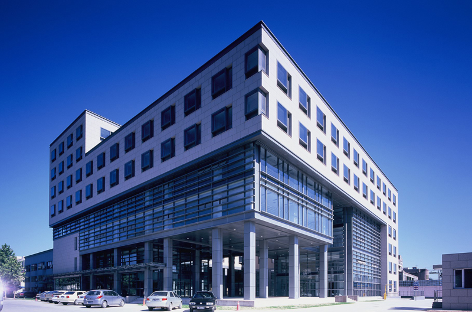
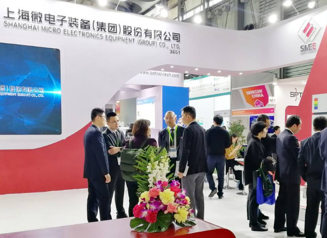
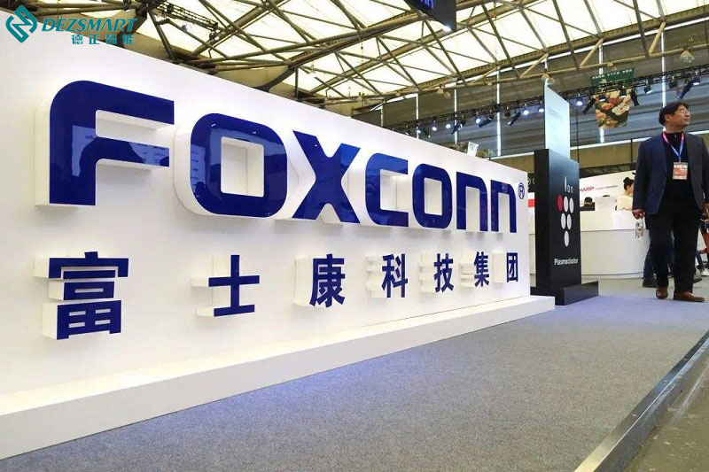

在芯片领域，有一种叫光刻机的设备，不是印钞机，但却比印钞机还金贵。因为做芯片就必须用到光刻机，但目前光刻机依然是中国半导体产业多年的一大难题。

全球仅有四家企业能够独立研发制造光刻机，其中ASML的技术最先进。它制造的EUV光刻机是别的公司造不出来的，如果企业需要生产7nm芯片就必须用到EUV光刻机了。

由于还没有别的技术能替代EUV光刻机，各大科技公司就只能购买ASML的EUV光刻机制造芯片。然而在老美的“断供”制约下，ASML目前还无法对我国自由出货。

如果中国要一直等ASML取得出货授权，那么中国科技就永远只能落后一步。

近期中科院就曾表示要将更多精力放在独立研发上，而关于我国半导体产业被“卡脖子”的部分问题将会得到解决，其中就包括光刻设备。

从中科院官方发布的信息中看到，中科院在EUV光刻机方面进行了多层次的招聘工作，例如EUV光源自控系统设计、EUV光机结构设计等等。可以看到，中科院接下来的研究重心放在了EUV光源上的开发，而这也是EUV光刻机非常关键的部分。

其实国内也有自主研发并生产光刻机的公司，但只有一家，那就是上海微电子。

去年它官宣了国产首台28nm的光刻机，但也依旧是DUV水平，与ASML的EUV光刻机相比仍存在一定的差距。

不过现阶段也不用太着急，**国产科技当然需要自主研发，但也更需要其它国内厂家的支持**。

纵观国内整个半导体市场，28nm等成熟工艺芯片是需求量最高的。除了当前最先进的7nm和5nm芯片外，DUV光刻机是完全够用的。

同样是去年，富士康宣布进入芯片行业，并与上海微电子达成合作，从上海微电子那买了多台测封光刻机。CEO郭台铭不仅在青岛建立了一座晶圆厂，还放出豪言：要全包华为芯片的代工订单。

这一行为算是为国产芯片企业开了个好头，既缓解了部分国内的芯片制造压力，也带动了国产光刻机的研发积极性。

而5G国际领导者华为可以说是自研芯片种类最多的厂商，自研芯片有麒麟芯片、巴龙芯片等等。由于曾经交付制作生产的台积电无法自由出货，而需要在材料和终端制造方面突破技术瓶颈。

此外，华为还需要在数字化转型上攻破瓶颈，实现数字型企业改革，引爆数字化时代。

去年，无代码搜索式BI平台**DataFocus**和华为展开了合作，助力华为数字化转型。D**ataFocus**掌握**数据仓库、内存计算引擎、机器学习引擎、智能分析引擎、分布式集群、语义解析引擎**等等核心技术，为华为5G技术提供支持。

正如华为作为全球5G的领导者一样，它是**目前搜索式BI平台的领导者**。

在它的支持下，企业业务精英不需要学习代码知识，通过像谷歌搜索一样就可以自主数据分析。目前DataFocus也已成为知名5G供应商，同时也为万向集团等众多国内知名企业服务。

归根结底，科技有力支持的背后，依然是基础扎实的科技实力。

尽管国产光刻机在国外光刻机面前还是稍显逊色，但只有脚踏实地，将目标付诸行动，方能实现突破，看到未来闪耀的科技之光。

对于国产光刻机的研发制造，大家有什么看法？欢迎评论、转发。
